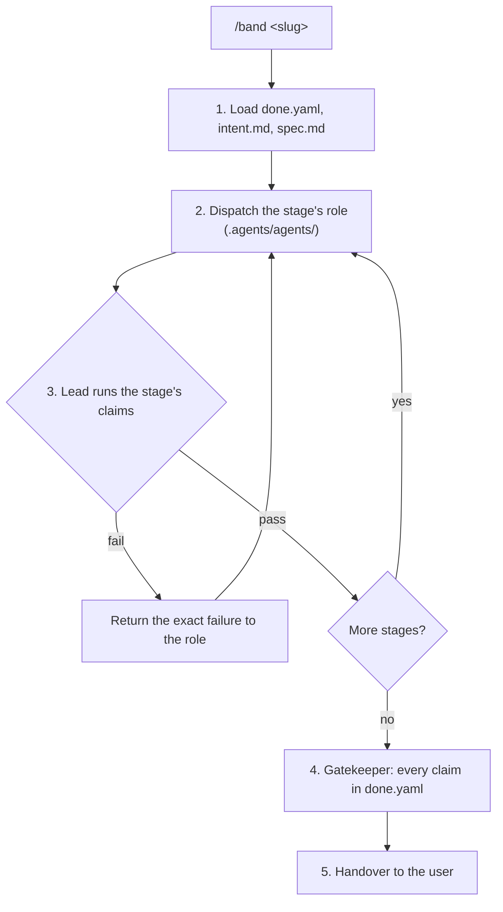

# Band Pipeline Orchestrator (`/band`)

`/band` is the third band step, after [`/intent`](../intent/SKILL.md) and
[`/spec`](../spec/SKILL.md). It takes a task whose `done.yaml` is valid and
drives it through the stages of the pipeline that `done.yaml` names, one role
per stage, until every claim is verified.

The methodology is [band](https://github.com/jiva-studio/band). Its engine (the
stop-hook that verifies claims automatically) is not installed here yet. Once
jiva-studio/band#6 is merged it is installed with band's `install.sh` and
`sh .agents/bin/band --init`, which merges its hooks into `.agents/settings.json`
(seen by Claude Code as `.claude/settings.json`); every call is then
`sh .agents/bin/band <args>` (`--start-pipeline`, `--status`, `--validate`), and
it runs the stages in [`../../pipelines/`](../../pipelines/). Until then the
lead agent plays the engine — it runs each claim itself, exactly as the adapters
below describe, and never advances a stage on an agent's word.



## Pipelines

| Pipeline | Use for | Stages → role |
| :--- | :--- | :--- |
| `hardened` | sync, auth, billing, migrations, anything whose failure corrupts data on installed clients | red-phase → [test-author](../../agents/test-author.md), green-phase → [implementer](../../agents/implementer.md), mutation-gate → lead, adversarial-review → [adversarial-reviewer](../../agents/adversarial-reviewer.md), gatekeeper → [gatekeeper](../../agents/gatekeeper.md) |
| `standard` | regular features | red-phase → test-author, green-phase → implementer, gatekeeper → gatekeeper |
| `fast` | hotfixes, copy, styling, config | implementation → implementer, gatekeeper → gatekeeper |
| `docs` | documentation, rules, runbooks | authoring → lead, critic → [doc-critic](../../agents/doc-critic.md), gatekeeper → gatekeeper |

[`../../rules/process.md`](../../rules/process.md) says which work needs
`hardened`. Mutation testing is mandatory only for the mobile app — the only
package with a Stryker configuration. `make mutate-diff PKG=@task` reports any
other target as not applicable and exits 0; the hand check in process.md §6
covers it.

The pipelines' claims pass `PKG=@task`, which
[`scripts/band-task-target.sh`](../../../scripts/band-task-target.sh) resolves to
the `target` of the task's `done.yaml`. Run by hand, pass that target instead.

## Stage boundaries

- **red-phase** may only touch test files (`tests/**`, `**/tests/**`,
  `**/__tests__/**`, `*_test.go`, `test_*.py`, `conftest.py`, `*.test.ts`,
  `*.spec.ts`). It proves the new tests fail: `make test-package-red PKG=<target>`
  exits 0 only when the package resolves and its tests run and fail.
- **green-phase** may not touch those files. `make check-package PKG=<target>`
  must exit 0.
- Check the boundary with `git diff --name-only` after each stage. A stage that
  crossed it is rejected and its out-of-bounds edits reverted.

## Claims and how the lead verifies them

| Claim `tool` | What the lead runs | Passes when |
| :--- | :--- | :--- |
| `make` | `make <target> <KEY=value …>` from the repository root | exit code equals `expect_exit` (default 0); with `expect: red`, exit is non-zero |
| `mutation` | `make mutate-diff PKG=<target>` | exit 0: Stryker's score over the changed files is at least the `break` threshold in `stryker.config.json` (50); under band's engine, also no `Survived` line in the output |
| `critic` | reads `.agents/tasks/<slug>/artifacts/critic_review.json` written by the adversarial reviewer | `"passed": true` |
| `hygiene` | the hygiene grep in [review Stage 0](../review/stages/0-completeness.md#2-hygiene): `BASE` the merge base with the task's base branch, `TIP` empty | no hit |

`critic_review.json` has band's schema:

```json
{
  "passed": false,
  "findings": [
    { "file": "modules/services/auth/internal/jwt/jwt.go", "line": 199, "issue": "…", "fix": "…" }
  ]
}
```

## The gatekeeper stage

The last stage re-runs **every** claim in `done.yaml` on the final tree, plus
`make check-architecture`. Nothing cached from an earlier stage counts. The
pipeline is complete only when all of them pass in one run.

## Pausing

When the user needs to answer a question or give feedback, stop between stages
and say which stage is next. Resume from that stage; do not re-run passed stages
unless the tree changed under them.

## Handover

Report, for every claim: the command, its exit code, and the tail of its output
on failure. Then the diff summary. Merging is the user's decision.
