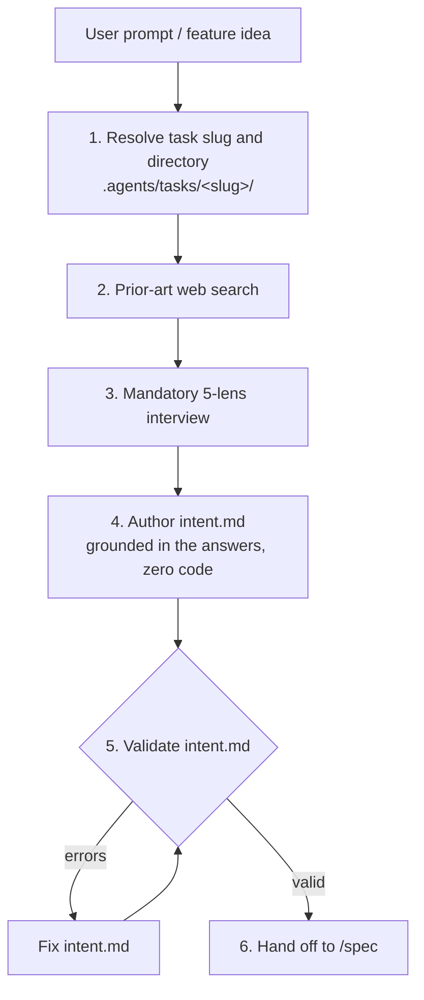

# Intent Skill (`/intent`)

`/intent` is the **human and business layer** of a task: **why** it is needed,
**what** user or business problem it solves, **what** the user observes, and
**what is out of scope**. It is the first of the three band steps —
`/intent` → [`/spec`](../spec/SKILL.md) → [`/band`](../band/SKILL.md) — and it
writes nothing technical.



## No technical content

`intent.md` never names an implementation:

- no file names or extensions (`.vue`, `.ts`, `.go`, `.py`, `.sql`);
- no schema or storage vocabulary (table, column, migration);
- no code symbols or architecture terms (interface, class, DTO, endpoint, props);
- no HTTP methods or routes.

Only user journeys, business goals, observable behaviour, constraints and
non-goals. Everything technical belongs to `/spec`.

## Step 1: Task slug and directory

1. Derive a hyphenated slug from the request (`feat-cover-picker`,
   `fix-sync-outbox`).
2. Create the task directory:
   ```bash
   mkdir -p ".agents/tasks/<slug>/artifacts" ".agents/tasks/<slug>/scratch"
   ```

## Step 2: Prior art

Before asking the user anything, search the web for how the problem is already
solved: established UX patterns, products that do it well, and the failure modes
others have paid for. Three to five recent sources, each with a link and one line
on what it says. Keep it at product level — no code.

## Step 3: The 5-lens interview

The interview is interactive and is never skipped or compressed. Every lens gets
at least one question:

| Lens | What the question settles |
| :--- | :--- |
| **1. JTBD & 80/20** | The user's trigger, the interaction flow, the leanest default that removes most of the friction. |
| **2. Adversarial & limits** | Size and format limits, offline and flaky network, retries, empty and huge input. |
| **3. Non-goals** | Adjacent screens and features that are explicitly out of scope. |
| **4. Pre-mortem** | Deleted or missing resources, fallbacks, what happens to data already on installed devices. |
| **5. Invariants** | Account isolation, permission boundaries, what an installed client must keep receiving. |

In shruti, lens 4 and lens 5 always ask about installed mobile clients: their
local database, sync cursors, outbox and issued tokens must keep working.

## Step 4: Author `.agents/tasks/<slug>/intent.md`

```markdown
# Intent: <Title>

**Task Slug:** `<slug>`
**Date:** `<YYYY-MM-DD>`

## 1. Prior Art & Established Solutions
- [Source](URL) — takeaway

## 2. Problem & JTBD (The "Why")
- **Root Pain & Trigger:** <user problem in plain language>
- **Target User & Scenario:** <who and when>
- **Desired Outcome:** <what the user observes on success>

## 3. Scope Boundaries & Strict Non-Goals
### In Scope (Goals):
- <user-facing capability>
### Strictly Out of Scope (Non-Goals):
- <excluded feature or screen>

## 4. Adversarial Failure Modes & Mitigations
| Failure Scenario | Impact | Required Mitigation |
| :--- | :--- | :--- |
| Offline / network drop | ... | ... |
| Limit exceeded / invalid input | ... | ... |
| Missing / deleted resource | ... | ... |

## 5. Invariants & Business Constraints
- <tenancy, permission or installed-client rule>
```

## Step 5: Validate

The band validator checks the four required sections (problem/JTBD, scope and
non-goals, failure modes, invariants) and rejects technical vocabulary: code
symbols, raw HTTP routes, source file names.

The band engine is not vendored into this repository. With a band checkout at
`$BAND_HOME`:

```bash
PYTHONPATH="$BAND_HOME" uv run --no-project python -m band --validate-intent .agents/tasks/<slug>/intent.md
```

Without one, apply the same checks by hand. Either way the intent is not locked
until it passes.

## Step 6: Hand off

> Intent validated in `.agents/tasks/<slug>/intent.md`. Run `/spec <slug>` to
> author the technical specification and the `done.yaml` contract.

One intent can spawn several specs (for example a service change and the mobile
change that consumes it).
