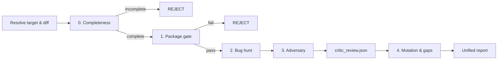

# Five-Stage Review (`/review`)

`/review` is for diffs that did not come through [`/band`](../band/SKILL.md) — a
pull request, a branch, an arbitrary range — and for a second opinion on one
that did. Each stage produces the evidence a band claim would, so a reviewed
change and a band-verified change are judged by the same measures.

| Stage | Band claim | Guide |
| :--- | :--- | :--- |
| 0. Completeness | `gatekeeper` + `hygiene` | [`stages/0-completeness.md`](./stages/0-completeness.md) |
| 1. Package gate | `make check-package` (+ `make check-architecture`) | [`stages/1-package-gate.md`](./stages/1-package-gate.md) |
| 2. Bug hunt | `critic` (static half) | [`stages/2-bughunter.md`](./stages/2-bughunter.md) |
| 3. Adversary | `critic` (dynamic half) | [`stages/3-adversary.md`](./stages/3-adversary.md) |
| 4. Mutation & gaps | `mutation` (`make mutate-diff`) + coverage | [`stages/4-mutation-and-gaps.md`](./stages/4-mutation-and-gaps.md) |



---

## Resolving the target

```bash
REPO_ROOT=$(git rev-parse --show-toplevel)
```

Every stage reads the same diff, `git diff "$BASE" $TIP`: `BASE` is a commit,
`TIP` a commit or empty (empty means the working tree, uncommitted changes
included). The base branch defaults to the pull request's base, never to a
hard-coded `main`:

```bash
# Base branch of the current branch's PR; the remote default branch if it has none.
BASE_BRANCH=$(gh pr view --json baseRefName -q .baseRefName 2>/dev/null \
  || git rev-parse --abbrev-ref origin/HEAD | sed 's|^origin/||')
```

| Target | `BASE` | `TIP` |
| :--- | :--- | :--- |
| PR number `<n>` (`gh pr checkout <n>` first) | `git merge-base HEAD "origin/$(gh pr view <n> --json baseRefName -q .baseRefName)"` | `HEAD` |
| Range `A...B` | `git merge-base A B` | `B` |
| Range `A..B` | `A` | `B` |
| One commit `<sha>` | `<sha>^` | `<sha>` |
| Branch `<b>` | `git merge-base "origin/$BASE_BRANCH" <b>` | `<b>` |
| Path, or nothing given | `git merge-base "origin/$BASE_BRANCH" HEAD` | empty |

A path narrows the diff to itself (`git diff "$BASE" $TIP -- <path>`).

Map the changed files to their packages: the nearest directory with a `go.mod`,
`pyproject.toml` or `package.json` (`modules/libs/*` TypeScript maps to
`modules/apps/mobile`). Those are the `PKG` values for Stages 1 and 4; files in
no package get the doc and architecture gates instead (Stage 1).

The task slug is the branch's task folder if one exists
(`.agents/tasks/<slug>/`); otherwise `review-<branch-with-slashes-as-dashes>`,
and the review creates `.agents/tasks/<that>/artifacts/` for its outputs.

## Prior art

Before Stage 0, search the web for how the problem the diff solves is solved
elsewhere: three to six recent sources, one line each. The report opens with
them, and later findings cite them where the diff departs from settled practice.

## Stages

Run them in order. Stages 0 and 1 are fail-fast: a failure there ends the review
with a rejection and the exact evidence. Stages 2 and 3 together produce the
critic verdict:

```json
{
  "passed": false,
  "findings": [
    { "file": "modules/apps/web/src/composables/useChatStream.ts", "line": 318, "issue": "…", "fix": "…" }
  ]
}
```

written to `.agents/tasks/<slug>/artifacts/critic_review.json` — band's schema,
read by a `critic` claim with `runner: file`. `passed` is `false` when any
finding is CRITICAL or HIGH.

Size is not a finding at any stage: line counts, import counts and block sizes
are never reported (see [`architecture.md`](../../rules/architecture.md) §8).

---

## Report format

Output only the report, with these sections in this order, each present even
when empty (use the placeholder line).

```markdown
# Unified Review Report

**Target**: `<branch / range / PR / path>`
**Packages**: `<PKG list>`
**Verdict**: `APPROVED | CHANGES REQUESTED | REJECTED`

## Prior Art
- [Source](URL) — takeaway

## Stage 0: Completeness (gatekeeper + hygiene)
| Check | Status | Details |
| :--- | :---: | :--- |
| Acceptance criteria delivered | PASS / FAIL | <missing items or "all N delivered"> |
| Hygiene (stubs, skipped tests) | PASS / FAIL | <locations or "clean"> |
| Wiring & reachability | PASS / FAIL | <orphans or "all reachable"> |

## Stage 1: Package Gate
| Command | Exit | Details |
| :--- | :---: | :--- |
| `make check-package PKG=<pkg>` | 0 / n | <first failing lines or "clean"> |
| `make check-architecture` | 0 / n | ... |
| `make check-doc-make-targets`, `make check-doc-links` (files in no package) | 0 / n | ... |

Rule review: <findings against .agents/rules/, or "No rule violations.">

## Stage 2: Bug Hunt
### [CRITICAL | HIGH | MEDIUM] <title>
- **Location**: `path:line`
- **Category**: Race | Boundary | Error handling | Wire contract | Security | Reactivity
- **Given / When / Then**: ...
- **Fix**: ...

*No semantic defects found.*

## Stage 3: Adversary
| Attack vector | Target | Test file | Outcome |
| :--- | :--- | :--- | :---: |
| ... | `path` | `test path` | BUG CONFIRMED / RESILIENT (kept) |

Critic verdict: `.agents/tasks/<slug>/artifacts/critic_review.json` — passed: true / false

## Stage 4: Mutation & Test Gaps
| Command | Result |
| :--- | :--- |
| `make mutate-diff` (mobile only) | score, survivors, or "not applicable: no mobile change" |
| `make coverage PKG=<pkg>` | statement coverage of touched packages |

| Priority | Category | Target | Given / When / Then |
| :---: | :--- | :--- | :--- |

*No material gaps.*

## Action Items
1. ...
```
