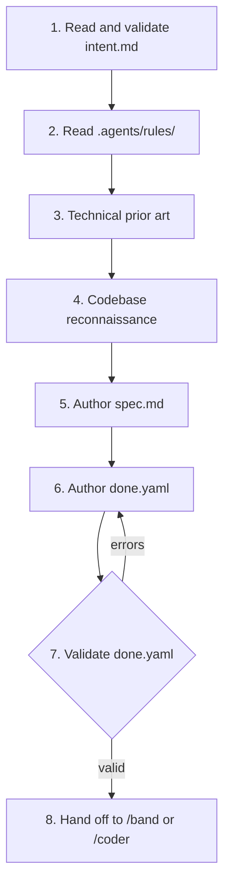

# Technical Specification Skill (`/spec`)

`/spec` turns a validated [`intent.md`](../intent/SKILL.md) into a technical
blueprint (`spec.md`) and a machine-checkable contract (`done.yaml`). It is the
second band step; [`/band`](../band/SKILL.md) or [`/coder`](../coder/SKILL.md)
executes what it locks.



## Step 1: Read and validate the intent

1. Resolve the slug (`/spec <slug>`); the task directory is `.agents/tasks/<slug>/`.
2. `intent.md` must exist and pass the intent checks in
   [`../intent/SKILL.md`](../intent/SKILL.md) (Step 5). If it does not, stop and
   ask for `/intent` first. One intent may spawn several specs; each spec gets
   its own slug and names the intent it serves.
3. Work on a branch of its own. A separate git worktree is the default for
   anything that runs beside other work.

## Step 2: Read the rules

Read [`../../rules/architecture.md`](../../rules/architecture.md), the coding
style for each stack touched, [`../../rules/comments.md`](../../rules/comments.md)
and [`../../rules/process.md`](../../rules/process.md). The spec may not propose
what they forbid; where the change needs a rule to move, the spec says so as a
decision for the human.

## Step 3: Technical prior art

Search the web for how the technical problem is solved elsewhere: the
established approach, current direction, known failure modes. Three to six
recent sources, each with a link and one line. Name the approach adopted and the
one rejected, with the reason.

## Step 4: Codebase reconnaissance

Before inventing a type, helper or table, search for it:

1. Existing entities, ports, wire types and use cases in the packages involved.
2. A similar helper, enum or event already present.
3. Every consumer of what will change — in shruti that includes installed mobile
   clients (local schema, sync cursors, outbox, preference keys) and the other
   services that read the same stream or database.

## Step 5: Author `.agents/tasks/<slug>/spec.md`

```markdown
# Spec: <Title>

**Task Slug:** `<slug>` · **Intent:** `<intent-slug>` · **Pipeline:** `<hardened|standard|fast|docs>`
**Target packages:** `modules/…`, `modules/…`

## 1. Prior Art
- [Source](URL) — takeaway. **Adopted:** … **Rejected:** … because …

## 2. Target Architecture & Interfaces
Exact signatures, wire types, schema changes. Which layer each piece stands on.

## 3. Compatibility
What installed clients and deployed services send and expect today, and why this
change keeps them working (see architecture.md §2).

## 4. Blast Radius
| Package / Dir | File | Action | Downstream consumers |
| :--- | :--- | :--- | :--- |
| `modules/services/auth` | `internal/jwt/jwt.go` | Modify | `handler/middleware.go`, mobile, web |

## 5. Acceptance Criteria
- [ ] Observable, testable facts: status codes, rows, events, rendered states.

## 6. Failure Modes
| Failure vector | Impact | Mitigation in code | Test |
| :--- | :---: | :--- | :--- |

## 7. Negative Invariants
What this change must not do: imports it must not add, contracts it must not
alter, data it must not touch.

## 8. Non-Goals
Carried from intent.md, plus any technical scope cut here.
```

## Step 6: Author `.agents/tasks/<slug>/done.yaml`

Claims use band's tools: `make`, `mutation`, `critic`, `hygiene` (and `http`
for a running service). Targets are paths under `modules/`.

```yaml
slug: fix-refresh-token-audience
pipeline: hardened
target: "modules/services/auth"

claims:
  - id: l1-auth
    tool: make
    target: check-package
    params:
      PKG: "modules/services/auth"

  - id: l1-architecture
    tool: make
    target: check-architecture

  - id: l3-critic
    tool: critic
    runner: file            # the adversarial reviewer writes artifacts/critic_review.json
    checks:
      - "Respects every non-goal and invariant in intent.md"
      - "A refresh token is refused on every access-only route"

  - id: l4-hygiene
    tool: hygiene
    no_stubs: true
    no_skipped_tests: true
```

- Add a `check-package` claim for **every** package in the blast radius, not only
  the one named in `target`. A consumer's tests are the ones that catch a broken
  contract.
- When the mobile app is in the blast radius, add the mandatory mutation claim:

  ```yaml
  - id: l2-mutation
    tool: mutation
    target: "modules/apps/mobile"
    mode: diff
  ```

- The red phase of `standard` and `hardened` runs `make test-package-red
  PKG=@task` (`@task` is this `target`); that claim belongs to the pipeline in
  `.agents/pipelines/`, not to `done.yaml`.

## Step 7: Validate `done.yaml`

The band engine is not installed here yet; once jiva-studio/band#6 is merged it
is installed with band's `install.sh` and `sh .agents/bin/band --init`. With it
installed:

```bash
sh .agents/bin/band --validate .agents/tasks/<slug>/done.yaml
```

Until then, check by hand: `slug` is set; `pipeline` is one of the four;
`claims` is non-empty; every claim has a unique `id` and a `tool` from the list
above; a `make` claim has a `target` that `make -n <target>` resolves; a `critic`
claim has `checks` and a `runner` of `auto`, `claude`, `gemini` or `file`; a
`mutation` claim has `mode: diff` or `full`.

The spec is not locked until this passes.

## Step 8: Hand off

> Spec and contract locked in `.agents/tasks/<slug>/`. Ready for `/band` (or
> `/coder` for single-agent work).
