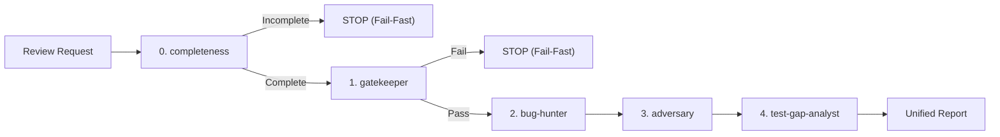

# Lectorium Agent System & Development Guide

Welcome to Lectorium. All AI coding agents operating on this repository must adhere to the rules and skills defined here.

Lectorium is a lecture library: Go services behind a Caddy origin, a Python
agent graph for chat, a Vue 3 + Ionic + Capacitor mobile app and an Astro
landing site, in one monorepo with per-module `go.mod`, npm workspaces and a
`uv` lock.

## Quick Navigation

- **Architecture Guidelines**: [`.agents/rules/architecture.md`](./.agents/rules/architecture.md)
- **Backend Coding Style (Go)**: [`.agents/rules/coding-style-backend.md`](./.agents/rules/coding-style-backend.md)
- **Frontend Coding Style (Vue)**: [`.agents/rules/coding-style-frontend.md`](./.agents/rules/coding-style-frontend.md)
- **Comments & Docblocks**: [`.agents/rules/comments.md`](./.agents/rules/comments.md)
- **Working in Bands (multi-agent process)**: [`.agents/rules/process.md`](./.agents/rules/process.md)
- **Specification Skill (`/spec`)**: [`.agents/skills/spec/SKILL.md`](./.agents/skills/spec/SKILL.md)
- **Unified Review Skill (`/review`)**: [`.agents/skills/review/SKILL.md`](./.agents/skills/review/SKILL.md)
- **Coder Agent Skill**: [`.agents/skills/coder/SKILL.md`](./.agents/skills/coder/SKILL.md)

The long-form architecture — the mobile app's layers, the services, the data
model — is in [`docs/repos/lectorium/`](./docs/repos/lectorium/README.md). The
rules link into it rather than restating it.

---

## Skills describe method, rules describe this project

`.agents/skills/` holds workflows that carry across repositories — how to spec a
task, how to implement one, how to review a diff. They name no framework and no
tool, and they read the project's constraints instead of restating them.

`.agents/rules/` holds everything specific to Lectorium — the layout, the
layering, the coding styles. When a convention changes, it changes here, in one
place, and every skill picks it up.

A skill that mentions a library belongs in the rules. A rule that explains a
workflow belongs in a skill.

---

## Repository Layout

```text
modules/
├── kit/        git submodule: @kit/* primitives shared between apps
├── libs/       domain, contracts, catalog, chat, persistence, ui   # TypeScript
│               pipeline                                            # Go
├── apps/       mobile (Vue 3 + Ionic + Capacitor), web (Astro)
├── services/   Go: auth, ingest, orchestrator, profile, publish-service,
│               discovery, share-*, storage-sync, billing, analytics, …
│               Python: chat
├── plugins/    in-house Capacitor plugins: audio-player, media-downloader
└── tools/      MCP servers, screenshots, transcriber, denoiser, adv
```

Libs never depend on apps or services. Cross-package imports use the declared
specifier (`@lib/*`, `@kit/*`, `@ports/*`), never a relative path that climbs
out of the package.

Each Go module is built, tested and linted **from its own directory** — there is
no `go.work`.

---

## Core Principles for Agents

1. **Decomposition is by responsibility, not by size**:
   - A file is split when it holds a second responsibility, not when it passes a
     line count. Line counts, import counts and block sizes are never a review
     finding.
2. **Complexity Limits**:
   - Past the point where a function needs a diagram to follow, use dispatch
     tables, lookup maps or guard clauses — not a deeper nest.
3. **Layer Discipline**:
   - Dependencies point inward. `domain/`, `ports/` and `usecases/` import
     nothing from `infra/`, no driver, no framework, no transport.
   - The chat service's layering is machine-checked: `modules/services/chat/app/tests/test_layering.py`
     carries the directional rules and an allowlist that may only shrink.
   - A handler never returns a storage row; map it to the contract type.
4. **Determinism in Pure Layers**:
   - No `time.Now()`, `Date.now()`, `new Date()`, `setTimeout`, `setInterval`,
     `math/rand` or `Math.random()` in a pure layer. Inject a port.
   - Security-sensitive values come from `crypto`, never `Math.random()`.
5. **No Swallowed Errors**:
   - An empty `catch {}` and a discarded `_ = fn()` are both forbidden. Handle,
     return, wrap, or state in a comment why ignoring it is safe. `errcheck` and
     `nilerr` refuse the Go half of this.
6. **Template Purity (Vue)**:
   - No nested ternaries in templates, no logic in event handlers, no
     `querySelector` for state, no monolithic class strings.
7. **Prettier Integrity**:
   - `semi: false`, `singleQuote: false`, `printWidth: 100`, `trailingComma: 'es5'`.
     Never hand-format around Prettier.
8. **Nothing host-specific is committed**:
   - No personal wrappers, dotfiles paths, nix store paths, host names or home
     directories. A host-specific helper is preferred-if-present, never
     required, and every default is overridable by an environment variable.
9. **Mandatory Gatekeeper**:
   - Run the gate for the layer you touched before marking a coding task
     complete — [`.agents/skills/coder/SKILL.md`](./.agents/skills/coder/SKILL.md)
     Phase 4 lists the commands per stack.
   - A partial gate is not a gate. A module's own tests say nothing about the
     modules that import it.

---

## Specification-Driven Development

Before implementing a non-trivial task, author a spec with
[`/spec`](./.agents/skills/spec/SKILL.md). It interviews you on business intent
and failure modes, then writes `.agents/specs/<branch-slug>.md` from
[`.agents/specs/TEMPLATE.md`](./.agents/specs/TEMPLATE.md) with observable
acceptance criteria, a blast radius, a phased plan and a verification gate.

The spec is the contract downstream: `coder` executes it and ticks the boxes,
and Stage 0 of `/review` rejects the diff if any criterion is undelivered.

---

## Code Review Protocol: The 5-Stage Review Pipeline (`/review`)

When requested to review code or pull requests (e.g. via `/review`), the lead agent executes the unified pipeline defined in [`.agents/skills/review/SKILL.md`](./.agents/skills/review/SKILL.md):



0. **Stage 0: Spec Compliance & Completeness**:
   - Guide: [`.agents/skills/review/stages/0-completeness.md`](./.agents/skills/review/stages/0-completeness.md)
   - Reconcile the diff against the spec's acceptance criteria, hunt stubs and
     placeholders, verify new code is actually wired and reachable.
   - **Fail-Fast**: reject before spending cycles on the later stages.
1. **Stage 1: Gatekeeper & Architecture**:
   - Guide: [`.agents/skills/review/stages/1-gatekeeper.md`](./.agents/skills/review/stages/1-gatekeeper.md)
   - Run the gate for the layer touched: `go build`/`go vet`/`go test` plus
     `golangci-lint run` for Go, `vitest`/`vue-tsc`/`eslint` for the app,
     `pytest` plus the coverage floors and `ruff` for chat.
   - Audit layer boundaries, dependency direction, and structural limits.
   - **Fail-Fast**: stop and reject immediately if compilation, lint, or tests fail.
2. **Stage 2: Semantic Logic Audit**:
   - Guide: [`.agents/skills/review/stages/2-bughunter.md`](./.agents/skills/review/stages/2-bughunter.md)
   - Inspect `git diff` and blast radius.
   - Check async races, permission algebra, boundary errors, and wire contracts.
   - Formulate concrete failure scenarios (*Given -> When -> Then*).
3. **Stage 3: Dynamic Stress Verification & Promoted Tests**:
   - Guide: [`.agents/skills/review/stages/3-adversary.md`](./.agents/skills/review/stages/3-adversary.md)
   - Write targeted cases for suspected edge cases and run them.
   - All passing and bug-reproducing tests are permanently promoted into the repository test suite.
4. **Stage 4: Test Gap Analysis & Coverage Strategy**:
   - Guide: [`.agents/skills/review/stages/4-test-gap-analyst.md`](./.agents/skills/review/stages/4-test-gap-analyst.md)
   - Measure coverage. For chat the floors are per package and live in
     `pyproject.toml` under `[tool.coverage_floors]`; they ratchet upward and are
     never lowered to go green.
   - Identify blind spots (uncovered error paths, boundary conditions, races, wire drift).
   - Formulate prioritized test expansion recommendations (P1/P2/P3 with *Given -> When -> Then*).
5. **Synthesis**: Output the standardized Unified Review Report strictly adhering to the template in [`.agents/skills/review/SKILL.md`](./.agents/skills/review/SKILL.md) with zero format deviations.

---

## Subagents

[`.agents/agents/`](./.agents/agents/) holds the role definitions the pipeline
and the coder skill dispatch to: `go-engineer`, `go-reviewer`,
`frontend-engineer`, `frontend-reviewer`, `architecture-reviewer` and
`naming-reviewer`. They are symlinked into `.claude/agents/` so the harness
finds them.
