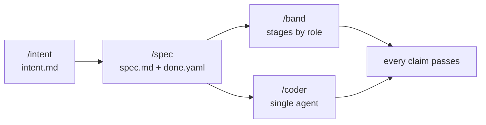
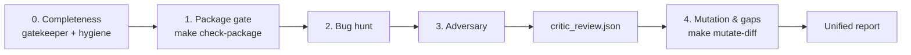

# Shruti Agent System & Development Guide

Every AI coding agent working in this repository follows the rules and skills
referenced here. `CLAUDE.md` imports this file, and `.claude` is a link to
`.agents`, so Claude Code reads the same rules and skills as every other
harness.

Shruti is a lecture library: Go services behind a Caddy origin, a Python agent
graph for chat, a Vue 3 + Ionic + Capacitor mobile app and an Astro site, in one
monorepo with per-module `go.mod`, npm packages and a `uv` lock.

## Quick navigation

- **Architecture**: [`.agents/rules/architecture.md`](./.agents/rules/architecture.md)
- **Backend style (Go, Python)**: [`.agents/rules/coding-style-backend.md`](./.agents/rules/coding-style-backend.md)
- **Frontend style (TypeScript, Vue)**: [`.agents/rules/coding-style-frontend.md`](./.agents/rules/coding-style-frontend.md)
- **Comments**: [`.agents/rules/comments.md`](./.agents/rules/comments.md)
- **Process (band)**: [`.agents/rules/process.md`](./.agents/rules/process.md)
- **Skills**: [`/coder`](./.agents/skills/coder/SKILL.md), [`/review`](./.agents/skills/review/SKILL.md), [`makefile`](./.agents/skills/makefile/SKILL.md); `/intent`, `/spec` and `/band` are installed by band (`sh .agents/bin/band --init`)

The long-form architecture — the mobile app's layers, the services, the data
model — is in [`docs/repos/shruti/`](./docs/repos/shruti/README.md). The rules
link into it rather than restating it.

---

## Layout of `.agents/`

```text
.agents/
├── rules/     # what is specific to shruti: layout, layering, styles, process
├── skills/    # workflows: coder, review, makefile (band installs intent, spec, band)
├── pipelines/ # band pipelines: hardened, standard, fast, docs; each stage is a role
└── tasks/     # one folder per task: intent.md, spec.md, done.yaml, artifacts/
```

Skills describe method; rules describe this project. A skill that needs a
project fact reads it from a rule. When a convention changes, it changes in the
rule, once.

---

## Repository layout

```text
modules/
├── kit/        @kit/*: layered TypeScript toolkit shared by the apps
├── libs/       domain, contracts, catalog, chat, persistence, sync, ui   # TypeScript
│               pipeline, authjwt, logging, catalogdb               # Go
├── apps/       mobile (Vue 3 + Ionic + Capacitor), web (Astro)
├── services/   Go: analytics, auth, billing, cleanup-worker, discovery, ingest,
│               orchestrator, profile, publish-service, share-audio, share-video,
│               shruti-corpus-mcp, social-poster, storage-sync
│               Python: chat, share-transcript
├── plugins/    in-house Capacitor plugins: audio-player, media-downloader
└── tools/      shruti-mcp, transcriber-*, denoiser-*, audio-denoiser, screenshots, adv,
                gate-fixtures, share-video-backgrounds, sr-transliterate, subscription-badges
```

Libs never depend on apps or services. Cross-package imports use the declared
alias (`@lib/*`, `@kit/*`, `@usecases`, `@infra/*`, `@ui/*`), never a relative
path that climbs out of the package. Each Go module is built, tested and linted
from its own directory — there is no `go.work`.

---

## Core principles

1. **Production is the mobile app and the services.** Installed clients and
   issued tokens keep working: wire contracts, SSE events, endpoints, schemas
   and preference keys never disappear or change meaning. MCP servers and
   `modules/tools/*` are local and may change.
2. **Decomposition is by responsibility, not size.** Line counts, import counts
   and block sizes are never a finding.
3. **Layers point inward**, and each layer rule is enforced by a tool:
   dependency-cruiser and ESLint (TypeScript), depguard (Go), `test_layering.py`
   (chat). Each of those tools is proven by a known-violation fixture in
   `modules/tools/gate-fixtures/`.
4. **Pure layers are deterministic.** No ambient clock, timer or randomness;
   inject a port. Secrets come from `crypto`.
5. **No swallowed errors.** No empty `catch {}`, no `except Exception: pass`, no
   `_ = fn()` on an error.
6. **Prettier formats TypeScript and Vue** (`semi: false`, double quotes,
   `printWidth: 100`, `trailingComma: "es5"`), through ESLint. `gofmt` formats
   Go, `ruff` checks Python.
7. **Nothing host-specific is committed.** No home directories, nix store paths
   or host names; every default is overridable by an environment variable.
8. **Every fixed class of bug gets a gate.** A fix without a gate does not count.
9. **A partial gate is not a gate.** Before a task is complete, every claim in
   its `done.yaml` passes, `make check-architecture` passes, and
   `make check-package PKG=<path>` passes for every package touched. Mutation
   testing (`make mutate-diff`) is mandatory for the mobile app.

---

## Gates

```bash
make check                        # everything
make check-package PKG=<path>     # one package, toolchain chosen from its go.mod / pyproject.toml / package.json
make test-package PKG=<path>      # its tests only
make coverage                     # coverage, with chat's per-package floors
make check-architecture           # layer rules and the gate self-test
make check-doc-make-targets       # every target these docs name exists
make mutate-diff                  # Stryker on the mobile files this branch changed
```

`make help` lists the rest.

---

## Workflow: band

Shruti follows [band](https://github.com/jiva-studio/band):


```mermaid
flowchart LR
    Intent["/intent<br/>intent.md"] --> Spec["/spec<br/>spec.md + done.yaml"]
    Spec --> Band["/band<br/>stages by role"]
    Spec --> Coder["/coder<br/>single agent"]
    Band --> Done["every claim passes"]
    Coder --> Done
```

1. **`/intent`** interviews for the why, the non-goals, the failure modes and
   the invariants, and writes `.agents/tasks/<slug>/intent.md` — no code.
2. **`/spec`** researches prior art, reads the rules, maps the blast radius and
   writes `spec.md` and `done.yaml`, whose claims (`make`, `mutation`, `critic`,
   `hygiene`) define done.
3. **`/band`** runs the pipeline `done.yaml` names (`hardened`, `standard`,
   `fast`, `docs`), one role per stage; **`/coder`** carries a task alone.

The `/intent`, `/spec` and `/band` skills and band's engine — the stop-hook
that verifies claims automatically — are installed by band's `install.sh` and
`sh .agents/bin/band --init`, which merges its hooks into
`.agents/settings.json` (Claude Code reads it through `.claude -> .agents`); the
engine is then invoked as `sh .agents/bin/band <args>`, and runs the pipelines
in `.agents/pipelines/`. Without it the lead agent runs each claim itself,
exactly as [process.md](./.agents/rules/process.md) describes.

Roles are the stages of the band pipelines in `.agents/pipelines/`; stack
guidance comes from the rules.

---

## Review: `/review`

For pull requests and arbitrary diffs, [`/review`](./.agents/skills/review/SKILL.md)
runs five stages, each producing the evidence of a band claim:


```mermaid
flowchart LR
    S0["0. Completeness<br/>gatekeeper + hygiene"] --> S1["1. Package gate<br/>make check-package"]
    S1 --> S2["2. Bug hunt"]
    S2 --> S3["3. Adversary"]
    S3 --> Critic["critic_review.json"]
    Critic --> S4["4. Mutation & gaps<br/>make mutate-diff"]
    S4 --> Report["Unified report"]
```

Stages 0 and 1 fail fast. Stages 2 and 3 write
`.agents/tasks/<slug>/artifacts/critic_review.json` in band's schema
(`{passed, findings[{file, line, issue, fix}]}`).
