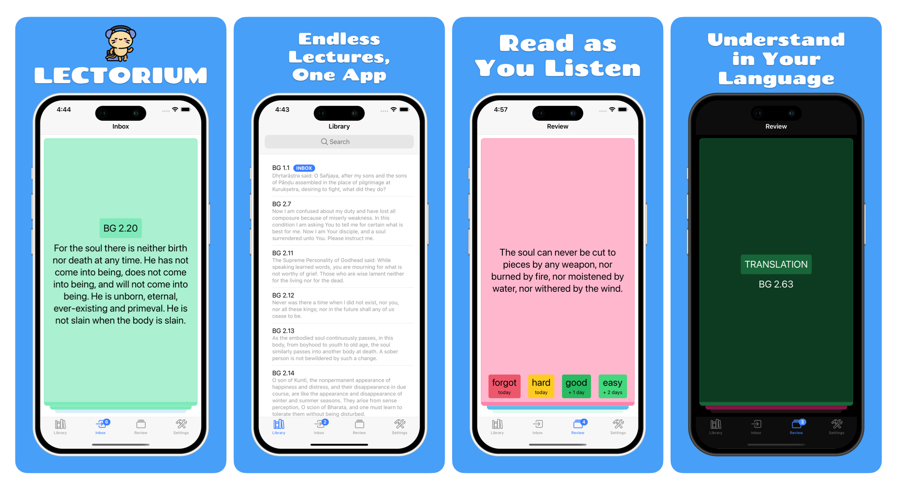
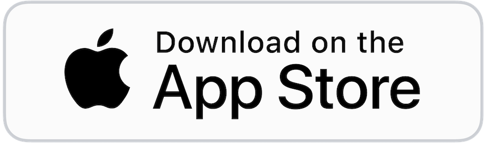

<p align="center">
    
</p>

<p align="center"><i>
Shruti is your personal lecture companion — listen to your lectures, read accurate transcripts, and ask questions anytime, anywhere. Whether you're commuting, walking, or relaxing at home, Shruti makes learning accessible and interactive on the go.
</i></p>

<p align="center">
  <a href="#">
    
  </a>
  <a href="#">
    
  </a>
  <a href="#">
    
  </a>
</p>

# Features

🎓 Dive into a World of Knowledge
Unlock access to thousands of inspiring lectures from top thinkers, creators, and educators — all in one place.

🎧 Take Your Learning Offline
No Wi-Fi? No problem. Download your favorite lectures and take them with you wherever life happens.

📖 Read While You Listen
Follow along with perfectly synced transcripts — read, rewind, and revisit key moments effortlessly.

🌐 Learn in Your Language
Instantly translate any lecture into your preferred language. Learning has no borders.

🤖 Ask Anything, Anytime
Got questions? Shruti lets you ask and get answers straight from the lecture content — like having a professor in your pocket.


# Architecture

Shruti is a **mobile-only app** that reads all its content directly from a public S3 bucket — there is no backend service. The app ships a prebuilt SQLite database inside the APK/IPA and pulls fresher versions from the CDN in the background; transcripts and audio are public JSON/mp3 files served over HTTPS.

The codebase follows **hexagonal / clean / DDD** architecture. Start with:

- [`docs/architecture/README.md`](docs/architecture/README.md) — layering index.
- [`docs/architecture/layers.md`](docs/architecture/layers.md) — authoritative layer rules and dependency graph.
- [`docs/architecture/startup-flow.md`](docs/architecture/startup-flow.md) — app bootstrap sequence.
- [`docs/storage.md`](docs/storage.md) — S3 bucket layout and CDN mirrors.
- [`docs/db/`](docs/db) — versioned content DB schemes.

# Repository layout

```
modules/
├── apps/
│   └── mobile/                 # Ionic + Capacitor 8 + Vue 3 mobile app
├── libs/
│   ├── domain/                 # Entities, value objects, domain ports (zero deps)
│   ├── application/            # Use cases (depends on @lib/domain only)
│   ├── persistence/            # DB row type schemas (main + user)
│   └── audioPlayer/            # Native Capacitor plugin
└── tools/
    └── content-db-builder/     # Node.js CLI that builds the SQLite + exports transcripts to S3
```

# Get involved

1. Read the architecture docs above before adding features.
2. Build the mobile app: `cd modules/apps/mobile && npm install && npm run build`.
3. Run tests: `npm test` (in the mobile package).
