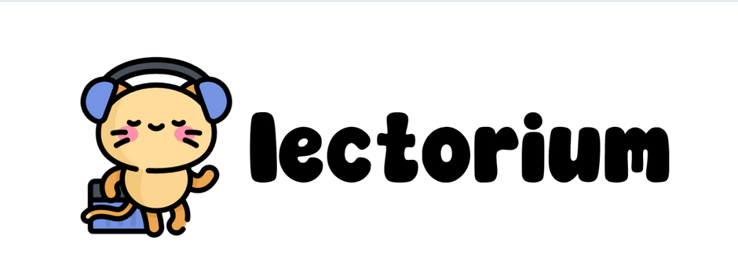
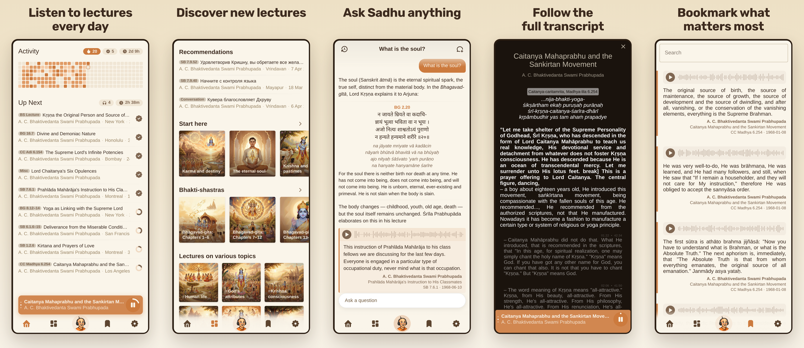

<p align="center">
    
</p>

<p align="center"><i>
Shruti is your personal lecture companion — listen to lectures, follow along with synced transcripts, save what matters, and ask an AI assistant about anything you hear. Whether you're commuting, walking, or relaxing at home, Shruti makes learning accessible on the go.
</i></p>

<p align="center">
  
</p>

<p align="center">
  <a href="https://apps.apple.com/us/app/listen-to-sadhu/id6745510353">
    
  </a>
  <a href="https://play.google.com/store/apps/details?id=studio.jiva.shruti">
    
  </a>
</p>

# Features

🎓 **A library of lectures in one place**
Browse a curated catalog by author, location, source, tag, or language — all searchable full-text from your phone.

🎧 **Take your learning offline**
Download lectures for offline playback. No Wi-Fi, no problem.

📖 **Read while you listen**
Auto-synced transcripts highlight the current sentence as the lecture plays. Tap to jump, select to copy or share.

🔖 **Save what matters**
Bookmark any moment with a highlight on the transcript. Your notes are searchable and shareable, and tapping one jumps you back to the exact second.

💬 **Ask the assistant**
A built-in AI chat answers questions grounded in the lecture corpus and cites the exact passages — verses, purports, and timestamps — it drew from.

🔗 **Share a moment**
Turn any selection into a shareable audio clip, video, or transcript snippet to send to a friend.

🔥 **Build a listening habit**
A queue keeps your "up next" ready, and an activity heatmap and streak counter show your consistency at a glance.

# Architecture

The **mobile app** (Ionic + Capacitor + Vue 3) ships a prebuilt SQLite catalog inside the APK/IPA and pulls fresher versions from the CDN in the background. Lecture audio and transcripts are public files served over HTTPS from S3, so core browsing, playback, and reading work fully offline with no server round-trips.

A small **backend** powers the online features: a Go `auth` service (JWT over Google/Apple/device identities), a Python `chat` service (semantic, cited AI answers over the transcript corpus), and `share-audio` / `share-transcript` / `share-video` for generating shareable clips. These run behind a shared `infra/` stack (Postgres + Caddy). Content is produced and published by the `shruti-mcp` toolchain, which owns the catalog SQLite and the transcription/denoising pipelines.

The codebase follows **hexagonal / clean / DDD** architecture. Internal documentation (architecture layers, startup flow, storage layout, DB schemas) lives in [`docs/`](./docs) and is served as a docsify site.

# Repository layout

```
modules/
├── apps/
│   └── mobile/                 # Ionic + Capacitor + Vue 3 mobile app
│       ├── usecases/           # Application layer — use cases (depend on @lib/domain only)
│       ├── ui/                 # Views, features, components, primitives
│       └── ports/              # Technical (server-facing) port shapes
├── libs/
│   ├── domain/                 # Entities, value objects, domain ports (zero deps)
│   ├── contracts/              # Shared API/data contracts
│   └── persistence/            # DB row type schemas (main + user)
├── plugins/
│   ├── audio-player/           # In-house Capacitor plugin (native Android/iOS/web)
│   └── media-downloader/       # Background download Capacitor plugin
├── kit/                        # Shared mobile build/test tooling
├── services/
│   ├── auth/                   # Go — JWT auth over Google/Apple/device identities
│   ├── chat/                   # Python — cited AI chat over the transcript corpus
│   ├── share-audio/            # Go — shareable audio clips
│   ├── share-transcript/       # shareable transcript snippets
│   ├── share-video/            # Go — shareable video clips
│   ├── search-mcp/             # Go — read-only semantic search MCP
│   └── cleanup-worker/         # Go — background maintenance
└── tools/
    └── shruti-mcp/          # Go MCP service that owns the catalog SQLite and publishes it to S3
                                # (+ transcriber / denoiser services and MCPs)
```

# Get involved

1. First-time setup: `make mobile-install` (installs npm deps for the mobile app).
2. `make help` from the repo root lists every entry point — dev server, Android/iOS builds, Fastlane screenshots, transcriber/MCP daemons, worktrees.
3. Common starting points: `make mobile` (dev server on :11001), `make mobile-build` (debug APK — runs `npm ci` itself, no setup needed), `make mobile-deploy` (install on connected device).

# License

Shruti is **source-available, not open source**. The code is published
under the [PolyForm Noncommercial License 1.0.0](./LICENSE): read it, study
it, fork it, change it and share it for any noncommercial purpose. Personal
study, research, hobby projects and use by charities, schools, public
research bodies and government institutions all qualify.

Commercial use is not granted. If you want it, ask.
