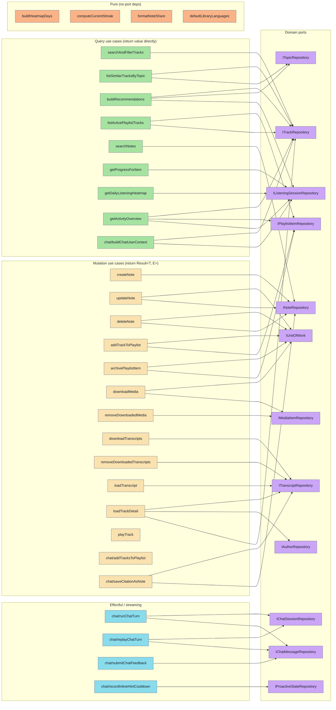

# Application use cases

The `@usecases` layer holds the use cases that orchestrate domain services and repository ports. Each is a top-level function that takes an `input` and a `deps` object — no classes, no DI container, no global state. The layer depends only on `@lib/domain` (entities + ports under `@lib/domain/ports/`); `@ports` is off-limits to it (see `layers.md`), so the few server-facing port shapes a use case needs are redeclared locally (e.g. `submitChatFeedback`). Use cases that **mutate** state return `Result<T, E>` with a string-literal error union; **query** use cases return the value directly and let infrastructure errors propagate to the composition root. A handful of pure derivations (`buildHeatmapDays`, `computeCurrentStreak`, `formatNoteShare`, `inlineHintToRuleKind`, `reduceLocaleToContentLanguage` / `defaultLibraryLanguages`) live alongside the use cases — same shape, no I/O. Use cases are grouped into feature subfolders (`playback/`, `playlist/`, `notes/`, `downloads/`, `activity/`, `discovery/`, `library/`, `chat/`); the `chat/` subfolder holds the conversational-agent use cases (context assembly, the streaming + replay turns, citation/feedback side-effects).

Source: [`modules/apps/mobile/usecases/`](https://github.com/jiva-studio/lectorium/tree/main/modules/apps/mobile/usecases). The barrel [`index.ts`](https://github.com/jiva-studio/lectorium/blob/main/modules/apps/mobile/usecases/index.ts) re-exports every use case.

## Dependency map



`playTrack` is special — it has **no port deps**, just `Track` + optional `Author`. It's a pure function that builds a `PlayTrackCommand`; the player store consumes the command and dispatches it through the audio port. `buildHeatmapDays`, `computeCurrentStreak`, `formatNoteShare`, `inlineHintToRuleKind`, and the `reduceLocaleToContentLanguage` / `defaultLibraryLanguages` policy pair are similarly pure transforms — no I/O. `getActivityOverview` composes `getDailyListeningHeatmap` + `buildHeatmapDays` + `computeCurrentStreak` over three repos in one orchestrated call. `replayChatTurn` delegates to `runChatTurn`'s replay path rather than touching ports directly.

---

<!-- BEGIN AUTOGEN -->

## Track discovery

### `searchAndFilterTracks`

```ts
function searchAndFilterTracks(
  input: { query?, authorIds?, languageCodes?, locationIds?, sourceIds?,
           tagIds?, topicIds?, durationFilter?, dateFrom?, dateTo?,
           sortBy?, limit?, offset? },
  deps:  { tracks: ITrackRepository }
): Promise<readonly Track[]>
```

Unified entry for the Search view — the primary track-discovery use case (FTS and filter-list calls go straight to `ITrackRepository.search()` / `.list()` from inside this function). With non-empty `query`, routes through FTS (`tracks.search`); without, through `tracks.list`. **Both paths apply the same filter set in SQL** — pagination counts narrowed rows so `limit` / `offset` are stable. Filters are built from the input by `buildFilters`, which converts `durationFilter` to `durationMinMs` / `durationMaxMs` bounds and `dateFrom` / `dateTo` (`"YYYY"` / `"YYYY-MM"`) to a `dateGte` / `dateLt` range. Source: [`searchAndFilterTracks.ts`](https://github.com/jiva-studio/lectorium/blob/main/modules/apps/mobile/usecases/discovery/searchAndFilterTracks.ts).

### `listSimilarTracksByTopic`

```ts
function listSimilarTracksByTopic(
  input: { track: Pick<Track, "id" | "topicIds">, seedTopics: number,
           languages: readonly LanguageCode[], limit: number },
  deps:  { topics: ITopicRepository, tracks: ITrackRepository }
): Promise<readonly Track[]>
```

"Similar by topic" row — neighbours of a track scored by topic overlap (`topics.similarTrackIds` over the track's first `seedTopics` topics), excluding the seed, resolved to full tracks in similarity order. Returns empty when the track has no topics or no neighbours. Extracted from `SimilarTracksRow.vue` so the seed/limit/order rule is testable. Source: [`listSimilarTracksByTopic.ts`](https://github.com/jiva-studio/lectorium/blob/main/modules/apps/mobile/usecases/discovery/listSimilarTracksByTopic.ts).

### `buildRecommendations`

```ts
function buildRecommendations(
  input: { now: number, languages: readonly LanguageCode[], historyWindowMs: number,
           shelfTopics: number, shelfSize: number, recommendedSize: number,
           isExcluded: (id: TrackId) => boolean, shuffle: <T>(xs: readonly T[]) => T[] },
  deps:  { listeningSessions: IListeningSessionRepository,
           topics: ITopicRepository, tracks: ITrackRepository }
): Promise<{ recommended: readonly Track[], shelves: readonly RecommendationShelf[], hasHistory: boolean }>
```

On-device recommender core. From listening history (`listeningSessions.getTracksListenedInRange`) it derives a taste profile (topic affinity = Σ `weight × listenedSeconds` via `topics.weightsForTracks`), surfaces the most-listened topics as shelves (`topics.topTrackIds`) plus a "Recommended for you" pick, and never resurfaces a track the user already heard, completed, or queued (`isExcluded` + the internally-derived heard set). With no history it cold-starts on the first topics (`topics.topicIdsWithTracksIn`) so nothing is empty. `now` and `shuffle` are injected so it stays deterministic in tests. Extracted from `useRecommendationsStore`. Source: [`buildRecommendations.ts`](https://github.com/jiva-studio/lectorium/blob/main/modules/apps/mobile/usecases/discovery/buildRecommendations.ts).

### `loadTrackDetail`

```ts
function loadTrackDetail(
  input: { trackId: TrackId },
  deps:  { tracks: ITrackRepository, authors: IAuthorRepository,
           transcripts: ITranscriptRepository }
): Promise<Result<{ track, author, availableLanguages }, "not-found">>
```

Loads everything the Track view renders: the track, its referring author (or `null` when `authorId` is unset), and the languages it has a transcript in. Author and transcript-language lookups run **in parallel** (`Promise.all`) and never fail this use case — only an unresolved track id yields `"not-found"`. Source: [`loadTrackDetail.ts`](https://github.com/jiva-studio/lectorium/blob/main/modules/apps/mobile/usecases/playback/loadTrackDetail.ts).

---

## Playlist

### `addTrackToPlaylist`

```ts
function addTrackToPlaylist(
  input: { trackId: TrackId },
  deps:  { playlistItems: IPlaylistItemRepository, unitOfWork: IUnitOfWork }
): Promise<Result<PlaylistItem, "already-in-playlist" | "write-failed">>
```

Idempotent add. The check (`listActive`) and the insert run **inside one unit-of-work** so a fast double-tap can't create two active rows. Source: [`addTrackToPlaylist.ts`](https://github.com/jiva-studio/lectorium/blob/main/modules/apps/mobile/usecases/playlist/addTrackToPlaylist.ts).

### `archivePlaylistItem`

```ts
function archivePlaylistItem(
  input: { itemId: PlaylistItemId },
  deps:  { playlistItems, unitOfWork }
): Promise<Result<void, "not-found" | "already-archived">>
```

Distinct error tags so the UI can decide between toast and silent refresh. Source: [`archivePlaylistItem.ts`](https://github.com/jiva-studio/lectorium/blob/main/modules/apps/mobile/usecases/playlist/archivePlaylistItem.ts).

### `listActivePlaylistTracks`

```ts
function listActivePlaylistTracks(
  deps:  { playlistItems, tracks: ITrackRepository },
  input: { limit?, offset? } = {}
): Promise<{ entries: readonly PlaylistEntry[], total: number }>
```

Joins active playlist items with their domain tracks **in parallel** (`Promise.all`) — sequential hydration was Home's biggest TTFP regressor. The page is sliced (`offset` / `limit`) before hydration; items whose track has disappeared from the content DB are dropped, so `entries.length < total` reflects the discrepancy. Source: [`listPlaylistTracks.ts`](https://github.com/jiva-studio/lectorium/blob/main/modules/apps/mobile/usecases/playlist/listPlaylistTracks.ts).

> **Progress and completion** are not mutation use cases. The player composable writes directly to `IListeningSessionRepository`; the playlist UI reads progress through `getProgressForItem` and the Activity tab through `getActivityOverview`.

---

## Notes

### `createNote`

```ts
function createNote(
  input: { trackId, text, timeStart, timeEnd, id? },
  deps:  { notes: INoteRepository }
): Promise<Result<Note, "empty-text" | "text-too-long" | "invalid-timestamps" | "write-failed">>
```

Delegates validation to the domain's `validateNoteFields` (trims text, enforces the length cap, requires a sane non-NaN/non-Infinity timestamp range) and folds the domain's finer-grained `invalid-time` / `invalid-range` tags into the single `"invalid-timestamps"` umbrella so UI callers don't have to branch. The optional `id` makes the repo insert **idempotent** — chat's "save as note" derives the id from `action.id` so a flaky-network re-tap returns the existing note instead of duplicating it. Source: [`createNote.ts`](https://github.com/jiva-studio/lectorium/blob/main/modules/apps/mobile/usecases/notes/createNote.ts).

### `updateNote`

```ts
function updateNote(
  input: { id: NoteId, text?, timeStart?, timeEnd?, meta? },
  deps:  { notes, unitOfWork }
): Promise<Result<Note,
  "not-found" | "empty-text" | "text-too-long" | "invalid-range" | "invalid-time">>
```

Partial update inside a unit-of-work. Validates the **merged** (existing + patch) field set against the same `validateNoteFields` invariants as `createNote`, so a partial `{ timeStart: 150 }` against existing `{ 0, 100 }` errors with `"invalid-range"`. Per-field "undefined means don't touch" semantics; `meta` is tri-state (`undefined` = leave, `null` = clear, object = replace). When `text` is supplied it writes the trimmed value so the column never drifts from the domain's always-trimmed invariant. Source: [`updateNote.ts`](https://github.com/jiva-studio/lectorium/blob/main/modules/apps/mobile/usecases/notes/updateNote.ts).

### `deleteNote`

```ts
function deleteNote(
  input: { id: NoteId },
  deps:  { notes, unitOfWork }
): Promise<Result<void, "not-found">>
```

Source: [`deleteNote.ts`](https://github.com/jiva-studio/lectorium/blob/main/modules/apps/mobile/usecases/notes/deleteNote.ts).

### `searchNotes`

```ts
function searchNotes(
  input: { query: string, limit?: number },
  deps:  { notes: INoteRepository }
): Promise<readonly Note[]>
```

In-memory case-insensitive substring match over `Note.text` — the note corpus is small (user-generated, device-local) so SQL `LIKE` isn't worth the coupling. An empty query short-circuits to `listRecent(limit ?? 200)`; a non-empty query pulls the **whole corpus** (`listRecent(SEARCH_CORPUS_CAP = 100_000)`) so a match older than the recent window is still found, then `limit` caps the filtered matches (not the scanned set). Source: [`searchNotes.ts`](https://github.com/jiva-studio/lectorium/blob/main/modules/apps/mobile/usecases/notes/searchNotes.ts).

### `formatNoteShare`

```ts
function formatNoteShare(ctx: NoteShareContext): string
```

**Pure, no I/O.** Renders a note for the platform share sheet / clipboard as one string: the quoted text, then an optional `author — title` line, then a `date · location · reference` meta line, then the `mm:ss`–`mm:ss` (or `h:mm:ss`) time range. Every optional field is skipped when blank, so a note from an under-described track still produces a sensible block. Timestamps are in **milliseconds** end-to-end (matching `Note.timeStart`); the single ms→s conversion happens at the formatting boundary. Source: [`formatNoteShare.ts`](https://github.com/jiva-studio/lectorium/blob/main/modules/apps/mobile/usecases/notes/formatNoteShare.ts).

---

## Media (offline cache)

### `downloadMedia`

```ts
function downloadMedia(
  input:      { trackId: TrackId, path: string,
                candidates: readonly CdnServer[], kind?: MediaAudioKind },
  deps:       { mediaItems: IMediaItemRepository, transfer: MediaTransferFn,
                unitOfWork: IUnitOfWork },
  onProgress?: (pct: number) => void
): Promise<Result<{ mediaItem: MediaItem, server: CdnServer },
  "already-in-progress" | "no-candidates" | "transfer-failed" | "persist-failed">>
```

Drives the `pending → downloading → ready / failed` state machine through `IMediaItemRepository.upsert`. The "downloading" slot is **claimed atomically** inside a `unitOfWork.run` so a double-tap loses with `already-in-progress` (the long transfer runs outside the transaction). It iterates `input.candidates` in priority order, re-resolving a fresh URL per attempt via `buildServerUrl(server, path)`, and returns the working `server` so the caller can promote a different CDN — making this the **runtime CDN fallback**. Distinguishes transfer-failed from persist-failed so retry semantics differ — a persist retry doesn't redownload megabytes. `transfer` is the platform-specific byte-mover (today the in-house [`@lectorium/plugin-media-downloader`](../modules/media-downloader.md) wrapped by `useMediaDownloaderAdapter`), passed in as a closure to keep the use case layer-pure. Source: [`downloadMedia.ts`](https://github.com/jiva-studio/lectorium/blob/main/modules/apps/mobile/usecases/downloads/downloadMedia.ts).

### `removeDownloadedMedia`

```ts
function removeDownloadedMedia(
  input: { trackId: TrackId, remoteUrl: string },
  deps:  { mediaItems, deleteLocal: (url: string) => Promise<void> }
): Promise<Result<void, "not-downloaded" | "delete-local-failed">>
```

DB and FS can't share a transaction, so the steps are **ordered for crash recovery**: demote row to `failed` (localPath=null), delete bytes (tolerates "already gone"), drop row. If the delete throws, the row is left at `(failed, null)` and `delete-local-failed` is returned so a future call retries from the delete step instead of orphaning the file. Re-running on a step-1 row is idempotent. Source: [`removeDownloadedMedia.ts`](https://github.com/jiva-studio/lectorium/blob/main/modules/apps/mobile/usecases/downloads/removeDownloadedMedia.ts).

### `downloadTranscripts`

```ts
function downloadTranscripts(
  input: { trackId: TrackId, languages?: readonly LanguageCode[] },
  deps:  { transcripts: ITranscriptRepository, transfer: TranscriptTransferFn },
): Promise<Result<{ cached: readonly LanguageCode[], failed: readonly LanguageCode[] },
  "list-failed">>
```

Pre-warms the on-device transcript cache for one track. With no `languages` it downloads **every advertised** language (the conservative default since the Track view switches language on the fly); otherwise the named subset. Used both by the explicit "make available offline" flow and as a side-effect when audio is downloaded. Per-language fetches run **sequentially** (1–3 languages, server cold-cache latency dominates) and failures are **collected, not thrown** — the result reports `cached` / `failed` so one 404 doesn't sabotage the rest. The only hard error is `list-failed`, returned when *listing* the advertised languages itself blew up. Source: [`downloadTranscripts.ts`](https://github.com/jiva-studio/lectorium/blob/main/modules/apps/mobile/usecases/downloads/downloadTranscripts.ts).

### `removeDownloadedTranscripts`

```ts
function removeDownloadedTranscripts(
  input: { trackId: TrackId },
  deps:  { transcripts: ITranscriptRepository, deleteLocal: TranscriptDeleteFn },
): Promise<Result<{ removed: readonly LanguageCode[] }, never>>
```

Best-effort cache eviction — drops every advertised language's cached transcript via the injected `deleteLocal`. Per-language deletes can't fail meaningfully (a missing entry is the desired post-state); failures are swallowed and the use case always succeeds, returning the list of languages it `removed` for telemetry. If even *listing* the languages throws it returns an empty `removed` so the audio-removal path keeps going. Source: [`removeDownloadedTranscripts.ts`](https://github.com/jiva-studio/lectorium/blob/main/modules/apps/mobile/usecases/downloads/removeDownloadedTranscripts.ts).

---

## Playback & progress

### `playTrack`

```ts
function playTrack(
  input: { track: Track, preferredLanguage?: LanguageCode, author?: Author | null, itemId?: string }
): Promise<Result<PlayTrackCommand, "no-audio-available">>
```

**No port deps.** Pure variant-selection: pick the variant whose `language === preferredLanguage` and has `audio`; else the first variant with `audio`; else error. Returns a `PlayTrackCommand` with the resolved title, audio, author name (with locale fallback chain), language, item id (`track:<id>` by default), and a `matchesPreferred` flag (`false` when it fell back off the requested language, so the UI can warn). The player store dispatches the command through the audio port. Source: [`playTrack.ts`](https://github.com/jiva-studio/lectorium/blob/main/modules/apps/mobile/usecases/playback/playTrack.ts).

### `loadTranscript`

```ts
function loadTranscript(
  input: { trackId: TrackId, preferredLanguage: LanguageCode },
  deps:  { transcripts: ITranscriptRepository }
): Promise<Result<{ transcript, availableLanguages, matchesPreferred }, "language-not-available" | "fetch-failed" | "no-transcript-available">>
```

Picks `preferredLanguage` if available, else the first language. Returns the parsed transcript plus the full language list for the UI's language switcher. Catches both the language-list query and the `get` call — anything that throws becomes `"fetch-failed"` so callers never see a rejected promise. Source: [`loadTranscript.ts`](https://github.com/jiva-studio/lectorium/blob/main/modules/apps/mobile/usecases/playback/loadTranscript.ts).

### `getProgressForItem`

```ts
function getProgressForItem(
  itemId: PlaylistItemId,
  deps:   { listeningSessions: IListeningSessionRepository },
): Promise<TrackPositionSec | null>
```

Resume position for one playlist row in seconds — the **high-water mark** (furthest `to_position` ever reached via `getResumePositionForItem`, not the latest session's end, so a rewind-then-stop doesn't drop the user back to the rewound spot), or `null` when the item was never listened to. The caller decides what `null` means (usually start from 0) and clamps the value against duration. Returns raw — infra failures throw and bubble to the composition root, per the query-use-case policy. Source: [`getProgressForItem.ts`](https://github.com/jiva-studio/lectorium/blob/main/modules/apps/mobile/usecases/playback/getProgressForItem.ts).

---

## Activity & heatmap

### `getDailyListeningHeatmap`

```ts
function getDailyListeningHeatmap(
  input: { fromMs: number, toMs: number },
  deps:  { listeningSessions: IListeningSessionRepository },
): Promise<readonly DailyListeningTotal[]>
```

Thin wrapper over `IListeningSessionRepository.getDailyTotals` — sums listened seconds per local-timezone day across the half-open window `[fromMs, toMs)`. The aggregation lives in the repo SQL to keep transfer small. Source: [`getDailyListeningHeatmap.ts`](https://github.com/jiva-studio/lectorium/blob/main/modules/apps/mobile/usecases/activity/getDailyListeningHeatmap.ts).

### `getActivityOverview`

```ts
function getActivityOverview(
  input: { fromMs: number, toMs: number, nowMs: number, totalDays: number },
  deps:  { listeningSessions: IListeningSessionRepository,
           playlistItems: IPlaylistItemRepository, tracks: ITrackRepository }
): Promise<{ days: readonly HeatmapDay[], currentStreak: number,
             completedCount: number, totalListenedSeconds: number }>
```

The Activity tab's one orchestrated call. Fan-out (`Promise.all`) gathers daily totals, total listened seconds, and both the active + archived playlist items; track durations are batched through `tracks.getByIds`; `listeningSessions.getCompletedAtForItems` decides completion. `nowMs` is kept distinct from `toMs` (the query upper bound sits in the future to include the look-ahead buffer) so the heatmap's today-cell anchors correctly. Archived items still contribute to `completedCount` (archive only flips `archived_at`, the sessions table is untouched). Source: [`getActivityOverview.ts`](https://github.com/jiva-studio/lectorium/blob/main/modules/apps/mobile/usecases/activity/getActivityOverview.ts).

### `buildHeatmapDays`

```ts
function buildHeatmapDays(
  totalDays: number, now: number, totals: readonly DailyListeningTotal[]
): { days: readonly HeatmapDay[], columns: number }
```

**Pure, no I/O.** Builds a fixed-size grid of `HeatmapDay` cells for the SVG heatmap. The window anchors on today's cell and snaps to whole Monday–Sunday weeks; `daysBack` derives from the earliest entry in `totals` (chronological min by lexicographic compare), clamped at `totalDays - 7` so at least one future week stays visible. Gaps fill with zero so the rendered grid has no holes. Returns the cell array plus the column count. Source: [`buildHeatmapDays.ts`](https://github.com/jiva-studio/lectorium/blob/main/modules/apps/mobile/usecases/activity/buildHeatmapDays.ts).

### `computeCurrentStreak`

```ts
function computeCurrentStreak(days: readonly HeatmapDay[]): number
```

**Pure derivation** over a pre-built heatmap grid. Finds the `isToday` cell and walks backward counting consecutive days with `listenedSeconds > 0`. If today has no activity yet the count still starts from yesterday, so the badge doesn't flicker to 0 at midnight. Source: [`computeCurrentStreak.ts`](https://github.com/jiva-studio/lectorium/blob/main/modules/apps/mobile/usecases/activity/computeCurrentStreak.ts).

---

## Library

### `defaultLibraryLanguages` / `reduceLocaleToContentLanguage`

```ts
function reduceLocaleToContentLanguage(uiLocale: string): LanguageCode
function defaultLibraryLanguages(
  uiLocale: string, available: readonly LanguageCode[]
): LanguageCode[]
```

**Pure, no I/O.** The single place the locale → library-content-language policy lives. The app UI ships in many languages but lectures exist in only a few content languages (today `ru`, `en`); a fresh install whose UI locale has no lectures of its own (uk, sr, hi, …) still needs a sensible default library. `reduceLocaleToContentLanguage` maps a UI locale to a base content language (East-Slavic — `ru`, `uk` — → `ru`; everyone else → `en`). `defaultLibraryLanguages` then constrains that to what the catalog actually offers: the reduced language if available, else `en`, else the first available, returning `[]` only when no content exists at all. Source: [`reduceLocaleToLibraryLanguages.ts`](https://github.com/jiva-studio/lectorium/blob/main/modules/apps/mobile/usecases/library/reduceLocaleToLibraryLanguages.ts).

---

## Chat (`chat/`)

The conversational agent's use cases live in `modules/apps/mobile/usecases/chat/`. They stay `@lib/domain`-only — server-facing port shapes (e.g. `IChatFeedbackService`) are redeclared locally as plain types (see `submitChatFeedback`) so the use-case layer never imports `@ports`.

### `buildChatUserContext`

```ts
function buildChatUserContext(
  input: { currentTrackId: string | null, focus?: FocusFragmentPayload },
  deps:  { listeningSessions: IListeningSessionRepository, tracks: ITrackRepository }
): Promise<UserContextPayload>
```

Read-only. Assembles the on-device `UserContext` snapshot sent with each `POST /chat`: the current track id, the device's local-wall-clock `now` in ISO-8601 **with UTC offset**, and up to `RECENT_LIMIT = 20` recent tracks (`listeningSessions.listRecentTracksWithProgress`) with `position_ms` / `percent` derived from durations (`tracks.getDurationsMs`). Each failing fetch degrades to an empty result so a partial DB issue still yields a usable payload. Notes are deliberately not sent. Source: [`buildChatUserContext.ts`](https://github.com/jiva-studio/lectorium/blob/main/modules/apps/mobile/usecases/chat/buildChatUserContext.ts).

### `runChatTurn`

```ts
async function* runChatTurn(
  input: { sessionId, sessionTitle?, text, lang: string, translateCitations?,
           history, focus?, isFirstAssistantTurn, newMessageId, signal,
           assistantMessageId?, replayEvents? },
  deps:  { sessions: IChatSessionRepository, messages: IChatMessageRepository,
           extractFollowups,
           stream?: IChatStreamClient, title?: IChatTitleService,
           buildUserContext?, ensureFresh? }
): AsyncIterable<RunChatTurnEvent>
```

The streaming turn — an **async generator**, not a Result-returning function. It persists the user prompt, emits an optimistic assistant placeholder, builds the `UserContext` (delegated to `buildUserContext` so the composable injects live player state), optionally refreshes the auth claim (`ensureFresh`) just before opening the SSE stream, folds events, persists the finalised assistant reply, and fires a background title refresh on the first turn. `lang` is an opaque locale code (`ru`, `en`, `uk`, `sr-Latn`, …) threaded to the server verbatim; `translateCitations` asks the server to machine-translate verbatim citations into `lang`. It yields `RunChatTurnEvent`s — `user-message`, `assistant-placeholder`, `delta`, `tool-start`, `status`, `action`, `outline`, `verse-payload`, `chapter-payload`, `cite-transcript-payload`, `commentary`, `commentary-payload`, `media-payload`, `research-question`, `research-source`, `usage`, `title-updated`, `finalised`, `error` — that the store translates into reactive mutations. When `signal.aborted` wins it persists any streamed text with a `stopped` error marker (and emits `stopped_empty` when nothing had landed yet); a real connection drop with partial text uses `truncated` (`reason: turns | stream`) instead. The **replay path** — driven by `replayEvents` + a pinned `assistantMessageId` — re-folds server-buffered events through the exact same logic with no second parser and skips the user-message persist / context build / live SSE open; the live-only deps (`stream` / `title` / `buildUserContext`) are therefore optional. Source: [`runChatTurn.ts`](https://github.com/jiva-studio/lectorium/blob/main/modules/apps/mobile/usecases/chat/runChatTurn.ts).

### `replayChatTurn`

```ts
async function* replayChatTurn(
  input: { assistantMessageId: ChatMessageId, sessionId: ChatSessionId,
           lang: string, events: AsyncIterable<ChatStreamEvent> },
  deps:  { messages: IChatMessageRepository, sessions: IChatSessionRepository,
           extractFollowups }
): AsyncIterable<RunChatTurnEvent>
```

Rebuilds a chat turn from its server-buffered events when the live stream was dropped (app backgrounded / killed). Delegates to `runChatTurn`'s replay path — same folding logic, no second parser — and needs none of the live-only deps (`stream` / `title` / `buildUserContext`): the user message is already persisted, there is no real stream to open, and no first-turn title to fetch. The pinned `assistantMessageId` makes the rebuilt reply overwrite the original placeholder. Yields the same `RunChatTurnEvent`s the store reflects. Source: [`replayChatTurn.ts`](https://github.com/jiva-studio/lectorium/blob/main/modules/apps/mobile/usecases/chat/replayChatTurn.ts).

### `addTracksToPlaylist`

```ts
function addTracksToPlaylist(
  input: { trackIds: readonly TrackId[] },
  deps:  { playlist: PlaylistAdder }
): Promise<Result<void, "empty-tracks" | "playlist-add-failed">>
```

Adds a batch of tracks to the active playlist **sequentially** (the SQLite writer is single-writer), surfacing the first hard failure. The injected `PlaylistAdder.add` treats "already in playlist" as success — only a true persistence failure is an error. Invoked from HomeView starter packs and equivalent batch-add UIs. Source: [`chat/addTracksToPlaylist.ts`](https://github.com/jiva-studio/lectorium/blob/main/modules/apps/mobile/usecases/chat/addTracksToPlaylist.ts).

### `saveCitationAsNote`

```ts
function saveCitationAsNote(
  input: { trackId, startMs, endMs, caption, text?, preferredLanguage },
  deps:  { notes: INoteRepository, transcripts: ITranscriptRepository }
): Promise<Result<Note, "empty-text" | "create-note-failed" | LoadTranscriptError>>
```

Saves a citation chip's audio span as a user note. The body is chosen by precedence: a **preloaded `text`** (the chat `cite_transcript` SSE snippet the server already resolved) wins verbatim when present; otherwise the **transcript words** the speaker said in that span (every `sentence` block overlapping `[startMs, endMs]`), and only if the transcript fetch fails or the overlap is empty does it fall back to the chip's short topic `caption`. Builds the note through `createNote` (so the same validation/idempotency applies). Source: [`chat/saveCitationAsNote.ts`](https://github.com/jiva-studio/lectorium/blob/main/modules/apps/mobile/usecases/chat/saveCitationAsNote.ts).

### `submitChatFeedback`

```ts
function submitChatFeedback(
  input: { messageId: ChatMessageId, state: "up"|"down", category?, comment? },
  deps:  { messages: IChatMessageRepository, post: SubmitChatFeedbackPostFn }
): Promise<void>
```

Persists a thumbs-up / thumbs-down on an assistant message. **Order matters**: the server POST is awaited first; only on success does the local row update, so a transient network failure leaves the bubble unchanged and de-sync against the Langfuse trace can't happen. `messageId` is the Langfuse trace id directly. `category` / `comment` are sent only for `"down"`. Source: [`chat/submitChatFeedback.ts`](https://github.com/jiva-studio/lectorium/blob/main/modules/apps/mobile/usecases/chat/submitChatFeedback.ts).

### `recordInlineHintCooldown`

```ts
function recordInlineHintCooldown(
  input: { chatMessageId: ChatMessageId, payload: ChatActionPayload, now: Date },
  deps:  { proactiveState: IProactiveStateRepository }
): Promise<void>

function inlineHintToRuleKind(kind: ChatActionPayload["kind"]): InlineHintRuleKind | null
```

When the user sees an inline action card (`enable_daily_reminder` → `enable_notifications_hint`, `configure_smart_library` → `smart_library_hint`), this stamps a `proactive_state` row in the `ready` state keyed by `(ruleKind, ruleDate)` — the scheduler's dedup key — so the autonomous version of the same hint is suppressed for the rest of the day. The clock is injected (`now`) so the use case stays deterministic. The pure `inlineHintToRuleKind` helper maps an action kind to its autonomous-rule counterpart (or `null` for kinds with no equivalent, e.g. `upgrade_to_pro`). Source: [`chat/recordInlineHintCooldown.ts`](https://github.com/jiva-studio/lectorium/blob/main/modules/apps/mobile/usecases/chat/recordInlineHintCooldown.ts).

<!-- END AUTOGEN -->

---

## Calling pattern (composition root)

Use cases are pure, parameterised functions. The composition root in [`lectorium.ts`](https://github.com/jiva-studio/lectorium/blob/main/modules/apps/mobile/lectorium/lectorium.ts) builds a `repositories()` bundle once the content DB is open, and view controllers pass slices of it as `deps`:

```ts
const { tracks, notes, playlistItems, mediaItems, transcripts, unitOfWork } =
  app.repositories()

const result = await createNote(
  { trackId, text, timeStart, timeEnd },
  { notes }
)
if (!result.ok) showError(result.error)
else displayNote(result.value)
```

The shape — `(input, deps) → Promise<Result | T>` (or an async generator, for `runChatTurn` / `replayChatTurn`) — keeps every use case independently testable with fake repositories. Each feature subfolder carries its own `__tests__/` (e.g. `modules/apps/mobile/usecases/chat/__tests__/`) with one fixture per non-trivial use case.
