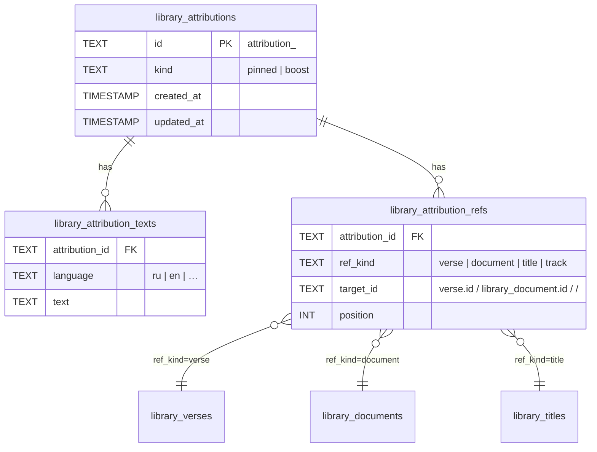
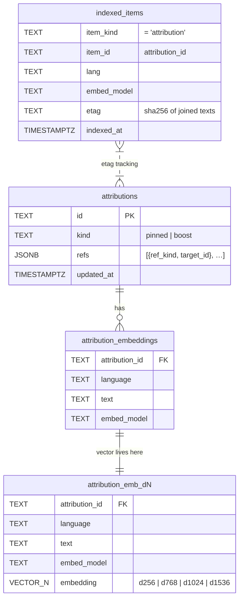

# Attributions

Curated mapping between **canonical phrasings** (questions a user might ask, or short topical labels extracted from their query) and **library refs** (verses, documents, or chapter titles). The chat-service uses them to short-circuit semantic search: if the user query matches a curated *pinned* phrasing, the attached refs become an authoritative answer; if it matches a *boost* label, the score of chunks referencing those refs is lifted in the fanout.

Two kinds, same shape. The kinds are named after the search-industry pin/boost distinction (cf. Elasticsearch pinned queries vs boosting):

| Kind | Source phrasing | Consumer policy in chat-service |
|---|---|---|
| `pinned` | User-style query: *"что такое реинкарнация"*, *"как достичь Бога"* | **SHORT path** — refs become authoritative for the synthesizer turn |
| `boost` | Short label (1–4 words): *"природа души"*, *"бхакти-йога"* | **BOOST** — chunks referencing these refs get a score lift (`KIND_BOOST_DELTA` = +0.15 in `research/corpus_fanout.py`) in the fanout |

Each attribution carries N text variants per language. The same attribution can ref multiple verses (e.g. *"что такое душа"* → BG 2.13, 2.20, 2.22), and the same verse can be referenced by multiple attributions.

> The kinds were renamed from `question`/`topic` to `pinned`/`boost`. Both the MCP `library.db` ([`migrate.go`](https://github.com/akdasa-studios/lectorium/blob/main/modules/tools/lectorium-mcp/internal/infra/library/sqlite/migrate.go) `migrateAttributionKindToPinnedBoost`) and the chat-service Postgres mirror (migration [`0033`](https://github.com/akdasa-studios/lectorium/blob/main/infra/app/db/migrations/0033_attribution_kind_pinned_boost.up.sql)) carry the new vocabulary.

## End-to-end flow

```mermaid
graph LR
    curator["Curator<br/>(human)"]
    yaml[("YAML plan<br/>(inline or file)")]
    searchmcp["lectorium-search<br/>(read-side MCP,<br/>finds refs)"]
    mcp["lectorium-mcp daemon<br/>(JSON-RPC HTTP)"]
    libdb[("library.db<br/>SQLite, on disk")]
    publish["library.publish<br/>(MCP tool)"]
    s3[("S3 public/library/<br/>library.{ver}.db")]
    chat["chat-service<br/>(POST /reindex)"]
    pg[("Postgres<br/>attributions +<br/>attribution_emb_d{N}")]
    user["User query<br/>(SSE /chat)"]
    lookup["research/<br/>attribution_lookup.py"]

    curator -- authors --> yaml
    curator -- "search/search_get" --> searchmcp
    searchmcp -- "chunk + ref ids" --> curator
    yaml -- "library.attribution.import" --> mcp
    mcp -- "Create + RefAdd<br/>(aggregated, idempotent)" --> libdb
    libdb --> publish
    publish -- uploads --> s3
    s3 -- "indexer pulls" --> chat
    chat -- "embed + upsert" --> pg
    user --> lookup
    lookup -- pgvector search --> pg
    lookup -- "refs ➜ refs" --> user

    classDef rw fill:#f9e2af,stroke:#6c7086,color:#1e1e2e;
    classDef ro fill:#a6e3a1,stroke:#6c7086,color:#1e1e2e;
    classDef ext fill:#89dceb,stroke:#6c7086,color:#1e1e2e;
    class yaml,libdb,pg rw;
    class s3 ext;
```



Stages:

1. **Authoring** — curator writes a verse-centric YAML plan listing the topics (→ `boost`) and questions (→ `pinned`) for each verse. The read-only [`lectorium-search`](https://github.com/akdasa-studios/lectorium/blob/main/modules/services/search-mcp/) MCP (over the prod pgvector corpus) is the curation aid: `search` / `search_get` find and verify the chunks that back a topic/question and return the ref ids to attribute.
2. **Import** — `library.attribution.import` (an MCP tool, **not** a separate Python CLI) parses the YAML, aggregates it (identical text across verses collapses to one attribution with multiple refs), then runs `Create` + `RefAdd` through the same use cases as the per-row tools. Idempotent: `Create` reuses an existing attribution by text, `RefAdd` is `INSERT OR IGNORE`, so re-running never duplicates — no external checkpoint needed.
3. **Storage** — MCP writes to a local `library.db` (SQLite) alongside the catalog (`current.db`). Library is its own DB because its publish cadence is independent.
4. **Publish** — `library.publish` MCP tool versions and uploads `library.db` to S3 (`public/library/library.{ver}.db`), then updates `public/config.json` so consumers can discover the latest version.
5. **Indexing** — chat-service runs an indexer (periodic or via `POST /reindex`) that pulls the latest `library.db`, mirrors the attribution tables into Postgres, and computes embeddings for each text variant.
6. **Lookup** — at chat time `research/attribution_lookup.py` does a pgvector cosine search against the per-dim `attribution_emb_d{N}` table, returning attributions above the accept threshold along with their refs.

## Storage schema — `library.db` (SQLite, server-authoritative)

This is the curator-facing source of truth. Three tables, additive migrations applied on every MCP daemon `Open()`.



Constraints:

- `library_attributions.kind` ∈ `('pinned', 'boost')` (CHECK constraint).
- `library_attribution_texts` PK is `(attribution_id, language, text)` — multiple phrasings of one attribution in one language are allowed; exact duplicates collapse to one row.
- `library_attribution_refs` PK is `(attribution_id, ref_kind, target_id)`; `position` is a non-key ordering hint (default 0). There is **no CHECK on `ref_kind`** — the original `('verse','document')` CHECK was dropped (`relaxAttributionRefKindCheck`) so newer kinds (`title`, `track`) need no schema bump; validation lives in the repo layer.
- `library_attribution_refs.target_id` is opaque. For `verse`/`document` it is the entity id (`library_verses.id` / `library_documents.id`); for `title` it is a composite `"<source_id>/<tokens>"` addressing a `library_titles` chapter/canto heading. SQLite cannot enforce cross-table FK, so the MCP write tool validates existence on insert.
- `ON DELETE CASCADE` from `library_attributions` removes the texts and refs together.

Files referenced:

- Schema DDL: [`modules/tools/lectorium-mcp/internal/infra/library/sqlite/migrate.go`](https://github.com/akdasa-studios/lectorium/blob/main/modules/tools/lectorium-mcp/internal/infra/library/sqlite/migrate.go)
- Domain types: [`modules/tools/lectorium-mcp/internal/domain/library/types.go`](https://github.com/akdasa-studios/lectorium/blob/main/modules/tools/lectorium-mcp/internal/domain/library/types.go) (`Attribution`, `AttributionKind` = `AttrPinned`/`AttrBoost`, `AttributionRef`)
- Import use case: [`modules/tools/lectorium-mcp/internal/application/library/attribution/import_usecase.go`](https://github.com/akdasa-studios/lectorium/blob/main/modules/tools/lectorium-mcp/internal/application/library/attribution/import_usecase.go) (`ImportPlan`, `Aggregate`, `Import`)

## Storage schema — Postgres mirror (chat-service)

The chat-service mirrors the curated tables into Postgres so it can run vector search. Text variants are stored once per attribution; the actual vectors live in per-dimension physical tables so multiple embed providers (256/768/1024/1536-dim) can coexist.



Key differences from `library.db`:

- Refs are **denormalised to JSONB** on `attributions.refs` (so a vector search hit returns refs inline, no JOIN).
- `attribution_embeddings` is **metadata-only** since migration 0030: its PK `(attribution_id, language, text, embed_model)` carries the text variants but no longer holds the `embedding` column. Same text under a different model coexists peacefully.
- The **vector** lives in a per-dimension child table `attribution_emb_d{N}` (`d256`, `d768`, `d1024`, `d1536`), mirroring the parent PK plus the `embedding vector(N)` column, with `ON DELETE CASCADE` from `attribution_embeddings`. Because that child table carries `text` + `language` + `embed_model` alongside `embedding`, lookup queries hit it directly (no JOIN back to the metadata parent for the search). `EmbeddingTableRouter(dim=embed_dim)` resolves the right table for the active deployment (`Settings.embed_dim` / `EMBED_DIM`), so different embed providers never share a vector space.
- Each per-dim table carries a **plain HNSW index** (`attribution_emb_d{N}_hnsw`, `vector_cosine_ops`) and a `(language, embed_model)` btree (`attribution_emb_d{N}_by_lang`). The index is no longer partial-by-model — the table is already partitioned by dim and the model filter happens in the query `WHERE`.
- **Diff tracking** lives in the shared `indexed_items` table (discriminator `item_kind='attribution'`); the etag is `sha256(sorted_joined_texts_for_one_(id,lang))`. Adding / removing / editing ANY variant for a `(id, lang)` triggers re-embed of all variants for that pair. Ref changes alone bump `updated_at` but do not re-embed.

Files referenced:

- DDL (central golang-migrate `migrator` service owns chat's schema; chat itself no longer ships `schema.sql`): [`infra/app/db/migrations/0016_chat_attribution_embeddings.up.sql`](https://github.com/akdasa-studios/lectorium/blob/main/infra/app/db/migrations/0016_chat_attribution_embeddings.up.sql) and [`infra/app/db/migrations/0030_split_embedding_tables.up.sql`](https://github.com/akdasa-studios/lectorium/blob/main/infra/app/db/migrations/0030_split_embedding_tables.up.sql)
- Boot-time schema probe: [`db/assert_schema.py`](https://github.com/akdasa-studios/lectorium/blob/main/modules/services/chat/app/src/lectorium_chat/db/assert_schema.py)
- Per-dim table router: [`infra/repositories/embedding_router.py`](https://github.com/akdasa-studios/lectorium/blob/main/modules/services/chat/app/src/lectorium_chat/infra/repositories/embedding_router.py)
- Indexer: [`indexer/library/attribution_indexer.py`](https://github.com/akdasa-studios/lectorium/blob/main/modules/services/chat/app/src/lectorium_chat/indexer/library/attribution_indexer.py)
- Lookup: [`research/attribution_lookup.py`](https://github.com/akdasa-studios/lectorium/blob/main/modules/services/chat/app/src/lectorium_chat/research/attribution_lookup.py)

## Authoring a YAML plan

The plan is **verse-centric**: one entry per verse, listing the topics (→ `boost`) and questions (→ `pinned`) that verse authoritatively answers. The importer aggregates them — identical text across verses collapses to one attribution with multiple refs. The YAML schema is `ImportPlan` / `ImportPlanVerse` in [`import_usecase.go`](https://github.com/akdasa-studios/lectorium/blob/main/modules/tools/lectorium-mcp/internal/application/library/attribution/import_usecase.go).

```yaml
source_id: source_NoY8sAlXF1IT   # catalog source id — picks the book (here: SB)
language: ru                       # required — source language of all text below (MCP auto-translates to other langs)

verses:
  - tokens: "1.1.1"                # canonical address inside source (SB canto.chapter.verse)
    verse_id: verse_4wkKrOUuv7YB  # opaque library_verses.id — must already exist
    topics:                        # short labels (1–4 words), kind=boost
      - "Абсолютная Истина"
      - "источник всего"
    questions:                     # user-style phrasings, kind=pinned
      - "что такое Абсолютная Истина"
      - "кто причина всех причин"
      - "с чего начинается Шримад-Бхагаватам"

  - tokens: "1.2.11"
    verse_id: verse_a4fFRz7loMiz
    documents:                     # optional → ref_kind=document (opaque library_document ids)
      - document_xxxxxxxx
    topics:
      - "Абсолютная Истина"        # SHARED with 1.1.1 → one attribution, two refs
      - "Брахман Параматма Бхагаван"
    questions:
      - "три аспекта Бога"
```

Each verse entry needs `verse_id` **or** `documents` (or both). `verse_id` becomes a `ref_kind=verse` ref, each `documents` entry a `ref_kind=document` ref; both attach to every topic/question on the entry.

Conventions:

- Keep **topics short** — they boost; long labels rarely match an extracted topic.
- Make **questions user-shaped** — *"что такое X"*, *"как Y"*, *"почему Z"*. They go through native-lang semantic search; the more conversational, the better the hit rate.
- **Reuse shared topics liberally** across verses (`природа души`, `бхакти-йога`, `майя`, `качества Кришны`). The importer aggregates them so reuse adds refs, not duplicate attributions.
- Text dedup is **exact-match after trimming whitespace** (still case-sensitive). *"Что такое душа"* and *"что такое душа"* become two attributions.

### Finding the `verse_id`

A verse's opaque id must already exist in `library.db`. Look it up via the MCP tool:

```
mcp call library.verse.get '{"source_id":"source_NoY8sAlXF1IT","tokens":"1.1.1"}'
# → {"ok":true,"result":{"ID":"verse_4wkKrOUuv7YB",…}}
```

Source ids by book:

| Book | Short | `source_id` |
|---|---|---|
| Bhagavad-gītā | BG | `source_dsicuBsFvinZ` |
| Śrīmad-Bhāgavatam | SB | `source_NoY8sAlXF1IT` |
| Caitanya-caritamrita, Ādi | CC Adi | `source_0OX6Db6QpdJ4` |
| Caitanya-caritamrita, Madhya | CC Madhya | `source_TjXzVgg41Z4s` |
| Caitanya-caritamrita, Antya | CC Antya | `source_CMkOCwD0GDQF` |
| Brahma-saṁhitā | BS | `source_SJCHFywxayrT` |
| Śrī Īśopaniṣad | ISO | `source_mA0FlWmbt5K0` |
| Nectar of Instruction | NoI | `source_wAXvlcOVaars` |

(Full list via `mcp call source.list '{"language":"en"}'`.)

## Running the import

Import is a **single MCP tool**, `library.attribution.import` — there is no standalone Python CLI any more. The tool ([`library_attribution_import.go`](https://github.com/akdasa-studios/lectorium/blob/main/modules/tools/lectorium-mcp/internal/mcp/tools/library_attribution_import.go)) parses, aggregates, and drives `Create` + `RefAdd` through the same use cases as the per-row tools, all inside the daemon. Pass the plan as inline `yaml` **or** `yaml_path` (exactly one):

```
# Inline content.
mcp call library.attribution.import '{"yaml":"source_id: …\nlanguage: ru\nverses:\n  - tokens: …"}'

# Or a file on the server.
mcp call library.attribution.import '{"yaml_path":"/abs/path/to/sb_essential.yaml"}'
```

It returns an `ImportResult` rollup: `{verses, pinned_texts, boost_texts, created, existed, refs_added, errors, error_sample}`.

How it works (`UseCase.Import`):

1. **Parse + validate** — `ParseImportPlan`: top-level `language` required; every verse needs `verse_id` or `documents`.
2. **Aggregate** — `Aggregate` builds `text → set(refs)` maps for topics (`boost`) and questions (`pinned`). Identical text across verses collapses to one attribution with multiple refs; text is whitespace-trimmed, blanks dropped.
3. **Create** — one `Create` per unique `(kind, language, text)`. `Create` is **idempotent by text**: it reuses an existing attribution rather than minting a new id (telemetry counts these as `existed`).
4. **Ref-add** — one `RefAdd` per `(attribution_id, ref)` in deterministic order; `RefAdd` is `INSERT OR IGNORE`, so re-adding an existing ref is a no-op.
5. **Fail-soft** — per-item errors are counted and sampled (up to 10), not fatal.

Because both `Create` (dedupe-by-text) and `RefAdd` (`INSERT OR IGNORE`) are idempotent, **re-running the same plan never duplicates** — there is no checkpoint file and no `--reset-state`. Editing existing rows still goes through the per-operation tools (`library.attribution.text_add` / `text_remove` / `ref_remove`); import only ever `Create`s and `RefAdd`s.

Publishing stays a separate, deliberate step (`library.publish`).

## Publishing `library.db` to S3

Once attributions are in the local `library.db`, they are invisible to the chat-service until published.

```
mcp call library.publish '{}'
# → returns run_id; monitor with runs.status / runs.wait
```

The publish run:

1. Bumps version (timestamp-based, e.g. `20260521161743`).
2. Uploads `artifacts/library/library.db` → `s3://akds-lectorium/public/library/library.{ver}.db`.
3. Merges a new entry into `public/config.json` under the `library` field (independent of catalog version ladder).

This is on a **different version ladder than the catalog** (`catalog.publish` updates `public/db/lectorium.{ver}.db`) because the library corpus changes rarely and the cadence is independent.

## Triggering the chat-service indexer

The chat-service polls S3 on a schedule (`INDEXER_INTERVAL_HOURS`, default several hours). To pick up new attributions immediately, hit `POST /reindex`:

```bash
curl -X POST -H "X-App-Token: $APP_SHARED_TOKEN" \
     -H "Content-Type: application/json" -d '{}' \
     https://<chat-host>/reindex
# → {"accepted":true,"started_at":"…"}
```

One run does:

1. **Catalog refresh** — `catalog.ensure_catalog()` pulls the latest `lectorium.{ver}.db` if newer.
2. **Transcript diff** — list S3 transcripts, embed any with changed etag, GC stale.
3. **Library refresh** — `library_db.ensure_library()` pulls latest `library.{ver}.db`.
4. **Attribution mirror** — `run_once_attribution()` reads the new `library.db`, diffs against `indexed_items`, embeds changed `(id, lang)` pairs, GCs stale.

`/status` (also token-gated) shows the last 10 indexer runs with state and `tracks_done`. The attribution mirror logs `attribution_index_complete` with counts of embeddings written and stale rows removed.

## Lookup at chat time

`research/attribution_lookup.py` exposes `find_attributions(kind=…, …)` and runs **two-stage** with asymmetric thresholds. Each pgvector query JOINs `attributions` against the per-dim table resolved by `EmbeddingTableRouter(dim=embed_dim)` (`attribution_emb_d{N}`), grouping by attribution id with `MAX(1 - cosine_distance)` so a multi-variant attribution reports only its best variant. Thresholds come from `research/constants.py`:

| Constant | `pinned` | `boost` |
|---|---:|---:|
| `*_ACCEPT_SCORE_NATIVE` | `PINNED_…` 0.85 | `BOOST_…` 0.70 |
| `*_ACCEPT_SCORE_CROSS` | `PINNED_…` 0.80 | `BOOST_…` 0.65 |
| border score | `PINNED_BORDER_SCORE` 0.70 | — |
| max matches | `PINNED_MAX_MATCHES` 3 | `BOOST_MAX_MATCHES_PER_TOPIC` 3 |
| border-gate accept | `PINNED_RERANK_ACCEPT` 0.50 | — |

1. **NATIVE** — cosine search filtered by the user's `language`. If the top result ≥ `accept_native`, return all hits ≥ that threshold (capped at `max_matches`).
2. **CROSS** — if native didn't clear `accept_native`: for `boost` only, when the top NATIVE score is already ≥ `accept_cross`, accept the native hits at the lower bar without a second query. (For `pinned` this band is NOT admitted unjudged — it falls through to the border gate below.) Otherwise issue a language-agnostic query and accept its hits ≥ `accept_cross`.

For `kind=pinned`, a **border-zone** (between `PINNED_BORDER_SCORE` = 0.70 and `accept_native`) is too uncertain for cosine alone, so the top candidate goes through a **cross-encoder gate** (`_gate_border` → `_rerank_gate`). The same Voyage cross-encoder the fanout ranks with re-scores `(user query × the curated phrasings)` of the top-N border candidates (`PINNED_RERANK_CANDIDATE_POOL` = 5, so Voyage sees ≥2 docs); accept iff the top attribution's best phrasing scores ≥ `PINNED_RERANK_ACCEPT` (0.50). A fixed-prompt LLM yes/no (`_confirm_llm`) is the **fallback only** when no reranker is available (or it can't run / errors). When no judge can decide, the match is **REJECTED** — asserting a curated "this is THE source" answer on a sub-threshold cosine is the worst failure mode. A native border-zone rejection short-circuits and returns `[]` (it does not fall through to the cross stage); the cross stage has its own border gate. `kind=boost` skips the gate entirely — the boost isn't worth a second round-trip.

Returned `AttributionMatch` (frozen dataclass) carries the refs, score, kind, and which stage matched (`native` / `cross`). Downstream the synthesizer turn either pins the refs as authoritative (`pinned` kind) or boosts chunks pointing at them (`boost` kind) in the fanout.

## Authoring new plans

Verse-centric YAML plans are authored ad hoc (inline or as a file on the server) and fed straight to `library.attribution.import` — there is no longer a checked-in `resources/attributions/*.yaml` inventory in the repo. Adding a new book / theme: pick the `source_id`, look up each `verse_id` (or `document` id), list topics + questions, and import. Use the read-only [`lectorium-search`](https://github.com/akdasa-studios/lectorium/blob/main/modules/services/search-mcp/) MCP (`search` / `search_get`) to find and verify the chunks that back each topic/question before attributing them.

## Operational notes

- **Translations**: `library.attribution.create` (and therefore `import`) auto-translates the source text into every other supported language as a best-effort side effect (handled MCP-side). Curator can adjust via `library.attribution.text_add` / `text_remove` after creation.
- **Target must exist**: `library.attribution.ref_add` validates `target_id` against the referenced entity (`library_verses` for `verse`, etc.). If it is missing, the call fails with `validation_failed` — make sure the source has been imported (`library.import` MCP tool) first.
- **Idempotent re-runs**: `import` reuses attributions by text and `RefAdd` is `INSERT OR IGNORE`, so re-running the same plan never duplicates. No checkpoint, no `--reset-state`. Safe to re-run after editing the YAML.
- **Publish is a separate step**: production publishing is deliberate. Run `library.publish` manually after reviewing the `ImportResult` summary.
- **Editing existing rows**: import only `Create`s and `RefAdd`s. To edit text or remove refs use the per-operation MCP tools directly (`library.attribution.text_add` / `text_remove` / `ref_add` / `ref_remove`).
