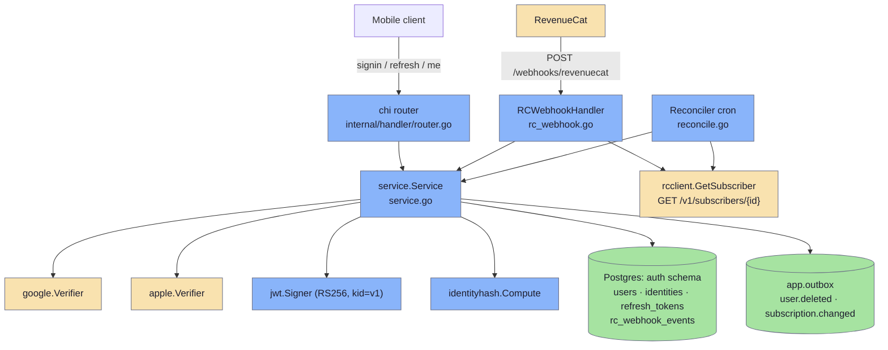
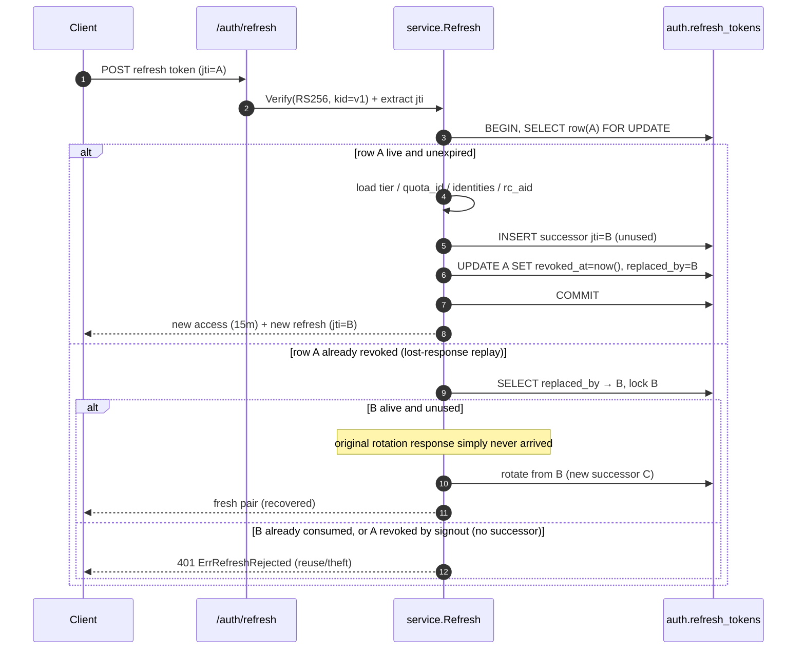
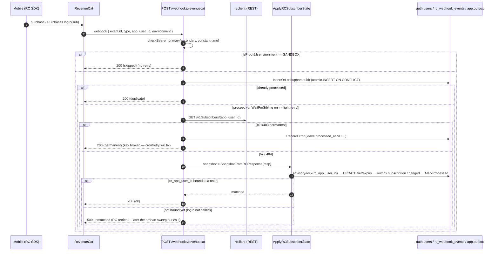

# Authentication service

The auth service is a small, stateless Go HTTP API (`FROM scratch` image, ~15 MB) that issues and refreshes the JWTs every other backend trusts, and mirrors each user's RevenueCat subscription tier into those tokens. It identifies users by one of three providers — anonymous `device`, `apple`, or `google` — keyed on `(provider, subject)`, persists users / identities / refresh-tokens in the shared Postgres `auth` schema, and signs RS256 tokens under a single key id `kid="v1"`. Access tokens carry the user's `tier` (`free`/`pro`) and a stable `quota_id` so the [chat pipeline](chat-pipeline.md) can rate-limit and attribute requests without round-tripping back here. A RevenueCat webhook (plus a backfill cron) drives the tier: on every subscription event the service re-fetches the authoritative state from RC's REST API and reconciles it onto `auth.users`.

> Code: `modules/services/auth/` — entry `cmd/auth/main.go`; business logic `internal/service/{service.go,subscription.go}`; JWT `internal/jwt/jwt.go`; identity hash `internal/identityhash/identityhash.go`; providers `internal/providers/{google,apple}`; RC REST shim `internal/rcclient/client.go`; webhook `internal/handler/rc_webhook.go`; backfill cron `internal/reconcile/reconcile.go`; routes `internal/handler/router.go`.

## Component map



## Identity model

A user (`auth.users`) is a thin row (id, name, picture, created_at, plus the mirrored subscription columns). Real-world identity lives in `auth.identities`, keyed on `(provider, subject)`:

| provider | subject | verified from |
|---|---|---|
| `device` | the client's `Device.getId()` (per-install UUID) | trusted as-is (no third-party check) |
| `google` | Google's `sub` from the id-token | `google.golang.org/api/idtoken` validates signature/exp/iss, then the service checks `aud` against `GOOGLE_CLIENT_IDS` (`internal/providers/google/google.go`) |
| `apple`  | Apple's `sub` from the id-token | JWKS fetched from `appleid.apple.com/auth/keys` (cached 10 min), RS256 + `iss=https://appleid.apple.com` checked, `aud` matched against `APPLE_BUNDLE_IDS` (`internal/providers/apple/apple.go`) |

A user is **anonymous** iff every one of their identities is a `device` row (`service.userIsAnonymous`). Signing in with Google/Apple while presenting an anonymous Bearer **upgrades** that same user in place (a new `identities` row is added, no new user is created — `service.signinSocial`, branch 2). When email collection is enabled by the profile policy and the provider returns a verified email, a fresh signin with no Bearer is cross-linked to any existing user that already owns an identity with the same verified email (branch 3); otherwise a new user is created.

> The cross-link-by-email branch is gated on `ProfilePolicy.Email.Enabled`. In a deployment that suppresses email (the `ru` profile), Google and Apple sign-ins for the same human deliberately become two separate accounts. See [multi-language / regional profiles](multilanguage.md) for how the profile policy varies per deployment.

### The identity hash (`quota_id`)

Rate-limit counters keyed on the JWT `sub` (the transient `auth.users.id`) would reset whenever a user deletes and recreates their account, refreshing the daily quota for free. `internal/identityhash` derives a stable, non-PII key that survives delete + recreate by hashing the **earliest** identity:

- **Non-device user:** `quota_id = sha256("<provider>:<subject>")` of the earliest non-`device` identity.
- **Device-only (anonymous) user:** `quota_id = sha256("device|<subject>|<pepper>")` of the earliest `device` identity, where the pepper is a per-deployment constant so an attacker who scrapes a device id can't precompute the Redis bucket.

Earliest-by-`created_at` is chosen for stability: adding a provider or deleting + re-signing-in via a different provider never resets the counter. Both forms emit a full 64-char hex so the chat-side validator (`^[0-9a-f]{64}$`) accepts them uniformly.

## JWT issuance

`internal/jwt/jwt.go` signs **RS256** tokens and always stamps `kid="v1"` (`jwt.SignerKid`). Multi-`kid` rotation was abandoned with the single-region collapse; the verifier requires the `kid` header and rejects any token without it or with a foreign id — symmetric with the chat service's Python verifier so a stale public key from a retired region can never be trusted by another service in the stack.

Every session issues a **pair** built from the same `IssueInput` base (`service.issueSession` / `service.rotateFrom` via `ProfilePolicy.BuildClaims`); only `aud`, TTL, and `jti` differ:

| token | TTL | `aud` | use |
|---|---|---|---|
| access | 15 min (`service.AccessTTL`) | `chat` (`jwt.AudienceChat`) | sent to the chat / share services; the chat verifier pins `aud="chat"` |
| refresh | 90 days (`service.RefreshTTL`) | `auth` (`jwt.AudienceAuth`) | single-use, presented to `POST /auth/refresh` |

### Claims

```jsonc
{
  "sub": "<auth.users.id uuid>",
  "aud": "chat" | "auth",
  "iat": 1718, "exp": 1718, "jti": "<uuid>",   // RegisteredClaims
  "anonymous": true,
  "tier": "pro",                  // omitempty; consumers default missing → "free"
  "tier_expires_at": 1719000000,  // UNIX seconds; 0 = lifetime / free
  "quota_id": "<sha256 hex>",     // stable rate-limit key (see identity hash)
  "rc_aid": "<rc_app_user_id>",   // RevenueCat appUserID, == sub after signin
  "ids": [ { "p": "google", "s": "1234…", "eh": "<sha256(email)>", "ev": true } ]
}
```

Notes backed by `jwt.Claims` and `profile.BuildClaims`:

- `tier` / `tier_expires_at` / `quota_id` / `rc_aid` / `ids` are all `omitempty`, so tokens minted before those fields existed stay byte-identical on the free/anonymous path.
- Email is never carried raw — `ids[].eh` is `sha256(lower(trim(email)))`, and `eh` + `ev` are stripped entirely per identity when the profile policy disables email collection. `p`/`s` (provider/subject) always survive so chat can attribute requests.
- `tier_expires_at` is defence-in-depth: the chat-side limiter coerces a `tier="pro"` claim whose expiry is in the past back to free limits, so a dropped RC `EXPIRATION` webhook can't keep a user on Pro past the real boundary. The same view-side coercion (`stillActive`, 60 s `expiryGrace`) is applied here when building claims and in `/auth/me`, without mutating the DB.

## Refresh-token rotation

Refresh is **single-use** and rotates under a row lock for race safety (`service.Refresh` → `RefreshTokens.LockAndRotate` does `SELECT … FOR UPDATE`). Each rotation creates the successor first, then revokes the presented row and points its `replaced_by` column at the new `jti` — building a forward chain:



### Reuse / replay handling

`service.resolveReplay` makes rotation **idempotent against a lost response**: a client that retries refresh token `A` after its rotation response was dropped finds `A.revoked_at != NULL`, follows `A.replaced_by → B`, and — if `B` is still alive and unused — rotates from `B` and recovers the session. But if the successor was already consumed (or `A` was revoked by **signout**, which leaves `replaced_by = NULL`), the presented token is genuine reuse/theft and the call returns `401 ErrRefreshRejected`.

The handler distinguishes failure classes carefully: `ErrRefreshRejected` (bad signature, unknown/revoked/expired `jti`) maps to **401** so the client drops the session, while every *other* error (DB unreachable mid-deploy, signer failure) is infrastructural and maps to **5xx** — so a brief backend blip does not log users out. Account deletion (`service.DeleteAccount`) explicitly bulk-revokes all of a user's refresh tokens *before* the cascading `DELETE`, taking row locks so any in-flight `/auth/refresh` blocks, then observes `revoked_at` and rejects — preventing a stranded session that outlives its account.

## RevenueCat integration

The service does **not** trust webhook payload fields to drive state. On every event it re-fetches the authoritative subscriber from RC's REST API and reconciles that. This sidesteps event ordering, refund/grace semantics, and payload-field churn between RC versions.

- **`internal/rcclient/client.go`** — thin shim for `GET /v1/subscribers/{app_user_id}` (10 s timeout, `Authorization: Bearer <RC_REST_API_KEY>`). It reads only `subscriber.original_app_user_id` and `subscriber.entitlements`. Status classification: `404 → ErrSubscriberNotFound` (soft success, returns an empty body so the user becomes free); `401/403` and other `4xx → ErrPermanent` (API key wrong/revoked — retrying won't help); `429 → *RateLimitError` carrying `Retry-After`; `5xx`/network → plain retryable error.
- **`service.SnapshotFromRCResponse`** — derives the durable `SubscriptionSnapshot{tier, tier_expires_at}`. `tier = "pro"` iff any entitlement is active (`expires_date` in the future, or `nil`/zero for a lifetime purchase); `tier_expires_at` is the latest active entitlement's expiry, or NULL for free/lifetime. nil response, nil subscriber, and missing required fields all yield a clean free snapshot (the malformed ones bump `rc_response_malformed_total` and log) — never a panic.
- **`service.ApplyRCSubscriberState`** — writes the snapshot to `auth.users` by `rc_app_user_id`, emits a `subscription.changed` row into `app.outbox`, and marks the `rc_webhook_events` row processed, all in one transaction guarded by a per-`rc_app_user_id` Postgres advisory lock so a webhook and the cron never both write conflicting state for the same customer.

### Linking the customer

The mobile client calls `Purchases.logIn(JWT sub)` so the RC `appUserID` equals our `auth.users.id`. `signinSocial` mirrors that into `auth.users.rc_app_user_id` via an idempotent `UPDATE … WHERE rc_app_user_id IS NULL` — without it the webhook's `UPDATE WHERE rc_app_user_id = …` would never match.

### Purchase → webhook → tier reconcile



### Webhook idempotency & dedup

Three layers guarantee **exactly one** `app.outbox` row per RC event:

1. **`InsertOrLookup`** — one atomic `INSERT … ON CONFLICT DO NOTHING RETURNING (xmax = 0)` on `rc_webhook_events.event_id`. `inserted=true` → first sighting, proceed; `inserted=false, processed=true` → return `200 {duplicate}`; `inserted=false, processed=false` → a sibling retry is mid-flight, so `WaitForSibling` serialises on a per-`event_id` advisory lock then re-reads `processed_at`.
2. **Intra-transaction re-check** inside `ApplyRCSubscriberState` under the `rc-subscription` advisory lock — short-circuits if a sibling already marked the event processed.
3. **Partial unique index** `outbox_dedup_idx` on `(event_type, source_event_id)` — even if the upstream check is torn, the duplicate `INSERT` into `app.outbox` becomes a silent no-op.

### TRANSFER events

A `TRANSFER` carries no `app_user_id`; the entitlement moves from `transferred_from` to `transferred_to` (`rcWebhookPayload`). The handler:

- Refetches and applies the **identified** (`firstIdentified`, non-`$RCAnonymousID:` ) destination id, which is the one bound to an `auth.users` row.
- After the primary apply commits, **inline-downgrades** any identified *source* id that lost the entitlement (`downgradeTransferSource`, under a distinct synthetic `event_id` `…:from:<id>`) — otherwise both old and new owner would read Pro until the next stale sweep, i.e. two Pro sessions from one purchase. This is best-effort: a failure is logged and left to the stale sweep, never failing the webhook.
- If **every** `transferred_to` id is still anonymous, the event is stored keyed on the anon target and answered `200 {deferred}` so RC stops retrying; the orphan sweep resolves it once the client binds the id via `Purchases.logIn`. Only a truly empty TRANSFER (no usable id at all) gets a `400`.

### Backfill cron (`internal/reconcile`)

Runs as a goroutine inside the same binary (only wired when RC creds are configured), firing immediately on boot then every `Interval` (default 6 h). Each tick has two phases:

1. **Stale-user backfill** — `ListStaleSubscribers` pulls users whose `tier_updated_at` is NULL or older than `StaleAfter` (default 24 h), re-fetches RC, and applies through the *same* `ApplyRCSubscriberState` path — a reconciled row is indistinguishable from a webhook-driven one (synthetic `event_id` `reconcile:<user>:<utc-timestamp>`, e.g. `reconcile:<uuid>:20060102T150405Z`, avoids the dedup short-circuit). Catches webhooks dropped past RC's ~80 min / 5-retry budget.
2. **Orphan sweep** — `rc_webhook_events` rows still unprocessed past `OrphanAfter` (default 7 d) get one final refetch; if the link finally bound, the apply marks them processed, otherwise they are stamped `error='orphaned_no_link'` so they stop driving the unprocessed gauge.

`ErrPermanent` from RC (bad API key) arms a per-user 24 h skip window so one misconfiguration doesn't burn quota on the whole batch; `429` is left for the next tick.

## HTTP endpoints

Wired in `internal/handler/router.go`. The user-facing endpoints live under `/auth/*`; the webhook is attached separately (only when secrets + REST key are configured) and carries its own Bearer, not a user JWT.

| Method | Path | Auth | Purpose |
|---|---|---|---|
| `POST` | `/auth/anonymous` | optional Bearer | Bootstrap an anonymous session by `deviceId`. Idempotent: a valid non-anonymous Bearer returns that session unchanged. |
| `POST` | `/auth/signin/google` | optional Bearer | Verify Google id-token; upgrade the anon Bearer if present, else cross-link or create. |
| `POST` | `/auth/signin/apple` | optional Bearer | Same for Apple; captures one-shot `fullName` on first signin. |
| `POST` | `/auth/refresh` | refresh token in body | Single-use rotation (see above). |
| `POST` | `/auth/signout` | required Bearer | Revoke this device's refresh token. Invalid token → no-op success. |
| `GET`  | `/auth/me` | required Bearer | userId, computed email, name, identities[] (shaped by the profile policy). |
| `POST` | `/auth/account/delete` | required Bearer | Cascade-delete the user; per-user 24 h cooldown limiter; `410 Gone` on double-tap. |
| `GET`  | `/auth/healthz` | — | Liveness (also the in-image `auth healthz` probe). |
| `GET`  | `/metrics` | — | Prometheus (Go collectors + `rc_webhook_auth_total`). |
| `POST` | `/webhooks/revenuecat` | RC webhook secret | RevenueCat subscription events (Bearer = `RC_WEBHOOK_SECRET_PRIMARY`/`SECONDARY`, constant-time compared; two slots for zero-downtime rotation). |

Account deletion also enqueues a `user.deleted` row into `app.outbox` (via the `app.emit_user_deleted` DB trigger) in the same transaction; the cleanup-worker consumes it for downstream cleanup (Langfuse traces, S3 prefixes). Rate-limit counters in Redis expire on their own day-bucketed TTL.

## Configuration

`internal/config/config.go` loads everything from the environment:

| Var | Purpose |
|---|---|
| `DATABASE_URL` | Postgres (required) |
| `JWT_PRIVATE_KEY_PATH` / `JWT_PUBLIC_KEY_PATH` | RSA PEM key pair (default `/secrets/{private,public}.pem`) — workspace-wide so the `kid=v1` signature is verifiable by every service |
| `GOOGLE_CLIENT_IDS` | comma-separated allowed Google OAuth client IDs (Android/iOS/Web) |
| `APPLE_BUNDLE_IDS` | comma-separated allowed Apple bundle / service IDs |
| `RC_WEBHOOK_SECRET_PRIMARY` / `_SECONDARY` | webhook Bearer slots (legacy single `RC_WEBHOOK_SECRET` promoted into PRIMARY) |
| `RC_REST_API_KEY` | RC REST key for `GET /subscribers/{id}` |
| `PROFILE` / `CONFIG_PATH` | selects the `profile_collection` block governing which optional fields (email/name/avatar) are collected and emitted (`global` vs `ru`) |
| `PORT` | default `8081` |

The RC webhook + reconcile cron are enabled only when at least one webhook secret **and** the REST API key are set; otherwise both are skipped and the service runs auth-only.

## Related pages

- [Chat pipeline](chat-pipeline.md) — the primary consumer of the access token (`aud="chat"`, `tier`, `quota_id`).
- [Multi-language / regional profiles](multilanguage.md) — how the profile policy varies which claims/fields a deployment collects.
- [Attribution](attribution.md) — chat-side request attribution using the identity claims in the token.
