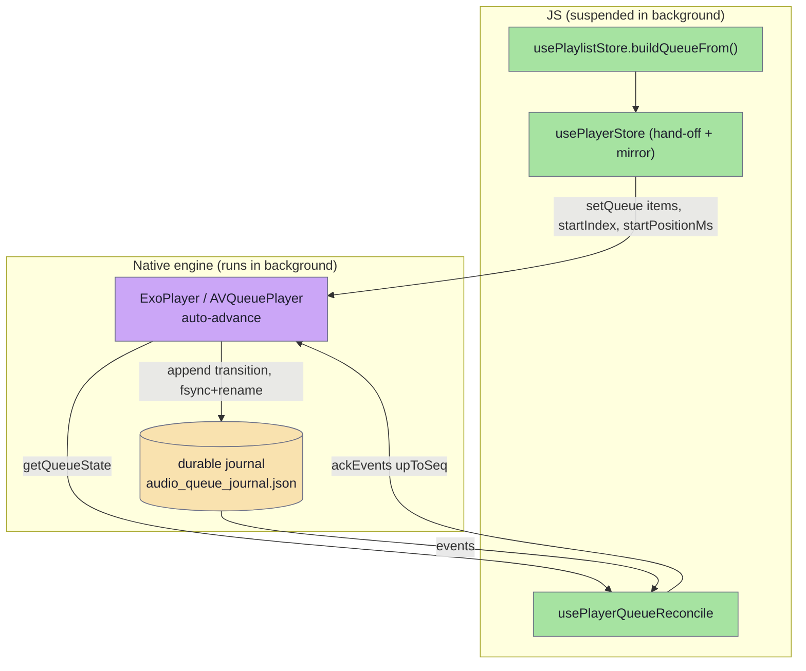
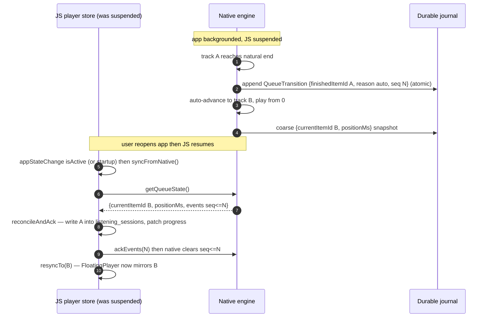

# Background playlist (Pro)

Continuous background playback: when a Pro user taps a playlist track with "Play next automatically" on, the **native audio engine** is handed the whole playlist tail as a queue and owns auto-advance from then on — it keeps moving track-to-track even while the app is backgrounded and the WebView JS is fully suspended, and survives the OS killing the process mid-queue. Every cross-item transition and a coarse position snapshot are written to a **durable on-disk journal**; the JS layer drains that journal on the next resume / app start to reconstruct listening history and resume position. It is Pro-gated (paywall slide `continuousPlayback`); free users get single-track playback that stops at the end of each lecture.

Shipped in `feat: continuous background playback (Pro) (#831)` — Android (Media3/ExoPlayer), iOS (`AVQueuePlayer`), and a web fallback.

## Why native owns the queue

WebView JS is suspended in the background on both platforms, so a JS-driven "play next on `ended`" loop cannot fire. The queue, auto-advance, and the journal therefore live in the native plugin; the JS Pinia stores only **build and hand off** the queue and **reconcile** the journal on resume.

- **Android** (`modules/plugins/audio-player/android/.../audioplayer/`): `AudioPlayerService` is a Media3 `MediaSessionService` over ExoPlayer with `setMediaItems(list, startIndex, startPositionMs)` and `WAKE_MODE_LOCAL` so battery optimisation doesn't kill long playback. `queue/QueuePlaybackManager` attaches a `Player.Listener` and journals every cross-item transition (driven by `onPositionDiscontinuity`, which carries the finished item's end position) before anything else; the error policy journals a failed item `reason="error"` and skips to next, bounded to 5 consecutive errors.
- **iOS** (`ios/Sources/AudioPlayerPlugin/`): an `AVQueuePlayer` auto-advances under the existing `.playback` session; the stereo-mix tap and playback rate are re-applied per enqueued item via a `currentItem` KVO; lock-screen next/prev map to native queue skips.
- **Web** (`src/web.ts`): same queue surface, but the tab owns the `HTMLAudioElement` so there is no background-suspension problem — it advances on `ended` and journals in memory.

## The durable journal

A single JSON file `audio_queue_journal.json` in the app files dir (iOS mirrors it as `queue-journal.json` in Application Support). Writes are **synchronous and atomic** — temp file → `fsync` → `rename` — so a kill mid-write can't corrupt it. It holds a persisted monotonic `seq`, the readable transition events, and an in-flight `{currentItemId, positionMs}` snapshot. A process-wide lock serialises the service-thread writer against the plugin-thread reader.

Each journal record is a **`QueueTransition`**: `finishedItemId`, `fromPositionMs`, `finishedAtMs`, `durationMs`, `startedItemId?`, `reason` (`auto` | `skip-next` | `skip-prev` | `error`), wall-clock `at`, monotonic `seq`. Only `reason: "auto"` (natural end) counts as a completion — a skip or an error finished the item part-way.

## Native ↔ JS contract

Port `ports/app/audioPlayer.ts` (`IAudioPlayer`), adapter `infra/audio/capacitor/useCapacitorAudioPlayer.ts`, raw plugin defs `plugins/audio-player/src/definitions.ts`. Methods that cross the bridge:

- `setQueue(items, startIndex, startPositionMs)` — replace the queue; auto-advanced items always start at 0, only the start item honours `startPositionMs`.
- `appendToQueue(items)` — extend the tail (used on resume to grow past the first loaded page).
- `getQueueState()` → `{currentItemId, positionMs, durationMs, playing, events[]}` — live snapshot **plus** the buffered journal; does not clear it.
- `ackEvents(upToSeq)` — clear journal entries with `seq <= upToSeq`.
- `skipToNext()` / `skipToPrevious()`.
- `onTransition(listener)` — foreground-only, best-effort low-latency push; the journal drained via `getQueueState` stays the source of truth.

**Unit boundary:** the plugin surface speaks seconds (like `HTMLMediaElement`); the `IAudioPlayer` port speaks milliseconds. `useCapacitorAudioPlayer.ts` is the single conversion point.

### Reconciliation on resume

`syncFromNative()` runs on three triggers: a foreground auto-advance (`onTransition`), app resume (`appStateChange` → `isActive`), and **once at startup** — the startup drain is what recovers a queue that played out (and maybe got killed) entirely in the background. `reconcileAndAck` sorts events by `seq`, writes each finished item into `listening_sessions`, patches the playlist progress map, then `ackEvents(top)`. It is **idempotent** across calls and restarts via three guards: an in-memory `lastSeq`, the playlist's `completedAt` map (foreground-completed items are already journaled by the live path), and native clearing acked events. Non-`auto` reasons patch progress with `allowCompletion: false` so a skip/error near the end never auto-archives an unfinished lecture.

## Pro gating

- Preference key `settings.playback.autoPlayNext` (default `false`) via `useAutoPlayNext()`.
- Feature key `continuousPlayback` in `ui/features/subscription/featureKeys.ts` → its paywall slide.
- The settings toggle (`ui/features/settings/AutoPlayNextSettingsItem.vue`) is a `ProBadge` switch: `effectiveChecked = value && isSubscribed`, so it reads OFF for non-subscribers regardless of the stored preference (an expired sub silently disables it without losing the choice). Tapping while unsubscribed emits `request-paywall`.
- Runtime gate in `usePlayerStore.openTrack`: the queue path is taken only when `autoPlayNext && isSubscribed && itemId !== undefined` — otherwise it falls through to the single-track `audioPlayer.open(...)` path. See [subscriptions](subscriptions.md) for how `isSubscribed` is derived.

## Prefetch for gapless background advance

`stores/playlist/usePlaylistPrefetch.ts` pulls each upcoming entry's audio into the offline cache (`useDownloadStore().prefetch`) and pre-warms transcripts (fan-out bounded to 3 parallel chains). This matters because the queue is built from local `file://` URLs where available, so the native engine can advance without a network round-trip while backgrounded; items not yet downloaded fall back to the public CDN URL. The start item is `ensureDownloaded` first and its local URL is patched into the queue slot before `setQueue`.

> **`file://` gotcha:** native engines get a **raw `file://…` URI**, never a `Capacitor.convertFileSrc()`-wrapped one — `convertFileSrc` rewrites it to the WebView's `http://localhost/_capacitor_file_/…` app-server URL, which ExoPlayer / `AVQueuePlayer` (running outside the WebView) cannot read. (Cover art is the inverse: a local `file://` artwork URI is ignored in favour of a bundled bitmap, because it silently fails to load in the system notification.)
