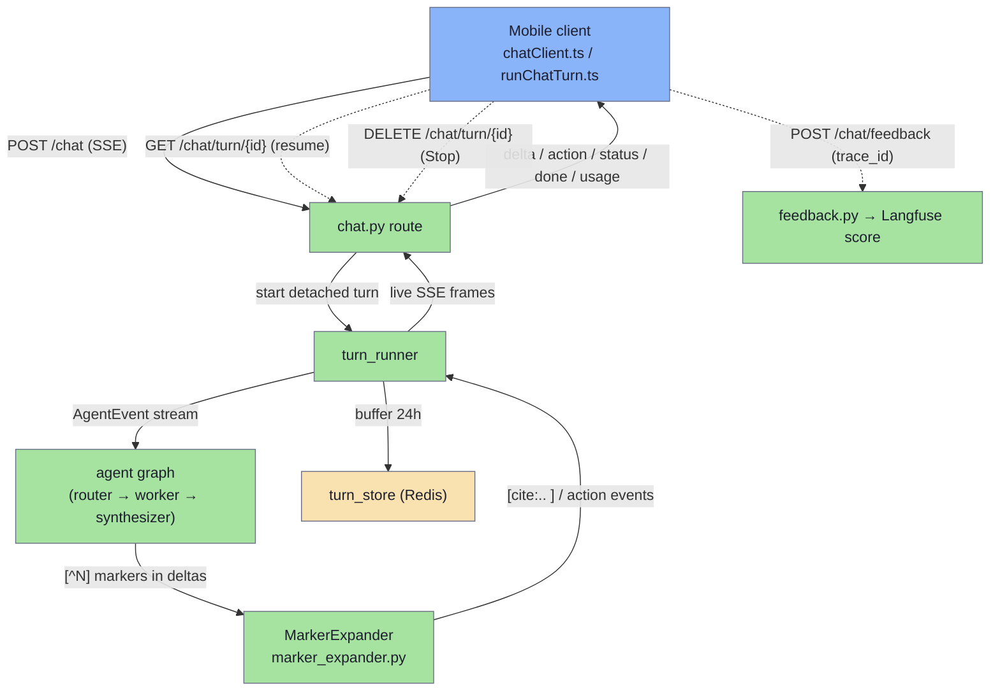
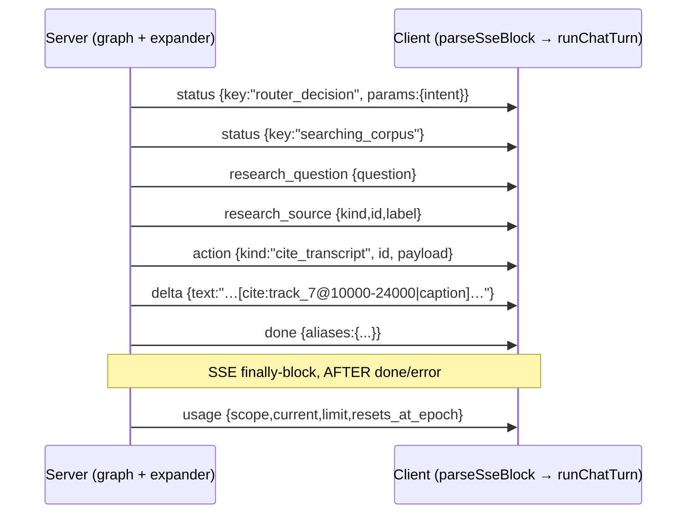
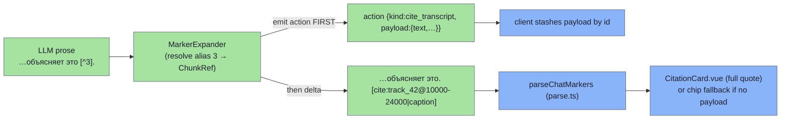
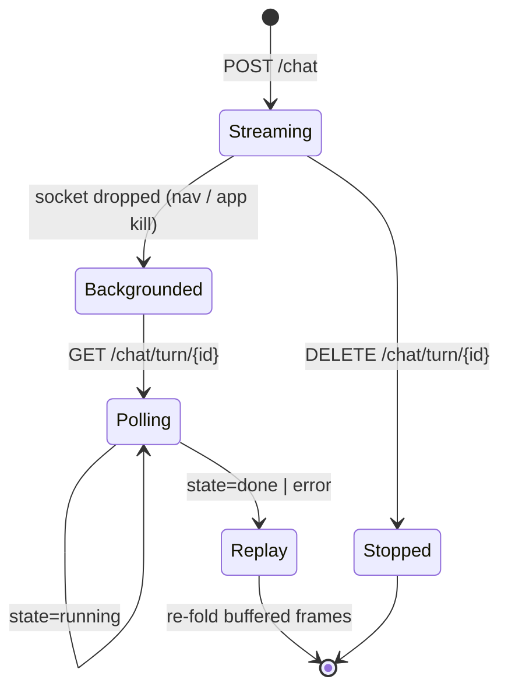

# Chat ↔ mobile wire protocol

The mobile app talks to the chat service over a single `POST /chat` call that returns a **Server-Sent Events** stream. The client opens the stream with `fetch` (not `EventSource`, because the request needs a POST body and custom headers), mints the assistant message id up front and sends its hyphenless 32-hex form as `X-Trace-Id` — that value **is** the Langfuse trace id, so the later thumbs-up/down `POST /chat/feedback` lands its score on the exact same trace. The server runs the turn **detached**: it keeps generating after the socket drops and buffers every SSE frame for 24h, so a backgrounded client can poll `GET /chat/turn/{id}` and replay the buffered frames through the *same parser* the live stream uses. The LLM writes compact numeric `[^N]` citation markers; the server expands them into the rich `[cite:track_X@start-end|caption]` / `[verse:…]` / `[chapter:…]` / `[media:…]` forms before they ever reach the client — that expansion is the protocol, not a bug. Each rich marker is preceded by an `action` SSE event carrying the card payload, which the client stashes and renders as a card.

> Code (server): `modules/services/chat/app/src/lectorium_chat/api/chat.py`, `.../api/schemas/chat.py`, `.../api/feedback.py`, `.../agent/events.py`, `.../agent/marker_expander.py`
> Code (mobile): `modules/apps/mobile/infra/chat/http/chatClient.ts`, `.../httpChatStreamClient.ts`, `.../httpChatResumeService.ts`, `modules/apps/mobile/usecases/chat/runChatTurn.ts`, `modules/apps/mobile/lectorium/composables/chatMarkers/parse.ts`

Related: [chat-pipeline.md](chat-pipeline.md) · [attribution.md](attribution.md) · [proactive-messages.md](proactive-messages.md) · [multilanguage.md](multilanguage.md)

## End-to-end shape

## The `POST /chat` request

The route is `chat()` in `api/chat.py`; the body validates against `ChatRequestDto` in `api/schemas/chat.py`. The client builds the body in `buildRequestBody()` (`chatClient.ts`).

### Headers

| Header | Required | Meaning |
| --- | --- | --- |
| `Authorization: Bearer <jwt>` | yes | Verified by `get_current_user`; the JWT sub becomes `user.id` and drives the rate-limit bucket and trace `user_id`. |
| `X-Chat-Protocol-Version: 1` | yes | `_check_protocol_version`. A missing/unsupported value is rejected with **426** and an `X-Chat-Supported-Versions` header — never a silent downgrade. |
| `X-Trace-Id` | recommended | **Client-minted.** The assistant `ChatMessage.id` (a UUIDv4) with hyphens stripped → 32 lowercase hex (OTel trace-id shape). The server validates it against `^[0-9a-f]{32}$` (and rejects all-zero) and **uses it verbatim** as the effective trace id / Langfuse trace id. Missing or malformed → server mints its own id, does **not** echo it, and the turn **cannot be resumed or feedback-scored**. |
| `Idempotency-Key` | optional | Per-turn key (`^[A-Za-z0-9-]{8,64}$`, generated as a UUIDv4 in `newIdempotencyKey`). A duplicate retry within the 10-minute TTL bounces with **409** *before* the rate limiter, so a retry doesn't burn quota. A malformed value is **400**. |

### Body (`ChatRequestDto`)

| Field | Type | Notes |
| --- | --- | --- |
| `messages` | `ChatMessageDto[]` (1–20) | Conversation history. `role` is `user`/`assistant`. User content ≤ 4000 chars, assistant ≤ 32000. |
| `messages[].aliases` | `{ "N": {track_id, start_ms?, end_ms?} }` | **Only on assistant turns.** The integer-alias map the server minted for that reply's chip markers. The client persists it and ships it back so the server can re-substitute the expanded `[cite:…]` markers in history back to `[^N]` form before showing the LLM — one consistent numbered-ref format throughout the conversation. Wire is snake_case; the client transforms from camelCase in `buildRequestBody`. |
| `lang` | string (default `en`) | Opaque locale (`ru`, `en`, `uk`, `sr-Latn`, `sr-Cyrl`, …). Drives answer prose; the corpus-language set is not hardcoded. |
| `translate_citations` | bool (default false) | When true, verbatim citations with no native variant in `lang` are machine-translated and shipped as a `(shown, original, mt)` triple. |
| `capabilities` | `{ [key]: bool }` | Client render capabilities (Microsoft-Graph style). `runChatTurn` sends `{ commentary_card: true }`. Additive — unknown keys are ignored and do **not** bump the protocol version. |
| `user_context` | `UserContextDto?` | Recent listening + the focus fragment the user dropped into chat. Note the wire DTO has **no** `user_id` — only the JWT knows it; the server injects it server-side. |
| `proactive` | `ProactiveRequestDto?` | When set, swaps the system prompt for a rule builder (`weekly_digest` / `inactivity` / `holiday`) and ignores `messages`. See [proactive-messages.md](proactive-messages.md). |
| `session_id`, `session_title` | string? | Local `chat_sessions` PK + title — group turns into a Langfuse Session. |
| `config` | `ChatTurnConfigDto?` | Per-turn A/B toggles (`enable_planner`, `enable_reranker`, `enable_early_intro`), all defaulting to the prod path. |

### Retry / failover on the request itself

`streamChat` retries transient HTTP failures (502/503/504, network blip) up to 3 times with exponential backoff (250 / 750 / 2250 ms), honouring a server `Retry-After` when present. **Once SSE bytes start flowing the connection is never retried** — the turn is detached server-side, so a dropped stream is resumed, not re-sent. Non-transient codes (400/401/403/429/426) bail immediately.

## The SSE event stream

The transport layer emits `AgentEvent { type, data }` (`agent/events.py`); `type` is the SSE `event:` name and `data` is its JSON payload. The client parses each block in `parseSseBlock` (`chatClient.ts`) into a typed `ChatStreamEvent`, which `runChatTurn` folds into the in-memory bubble. **Protocol v1 = 9 turn events plus the post-terminal `usage` frame.**

| `event:` | Payload | What the client does |
| --- | --- | --- |
| `delta` | `{text}` | Answer prose fragment. Appended to the bubble. A non-JSON payload is tolerated as raw text (documented fallback). |
| `tool_start` | `{name?}` | Spinner / "working" hint. |
| `tool_end` | `{name?}` | Tool dispatch finished. |
| `status` | `{key, params?}` | i18n status label — client renders `t(`chat.status.${key}`, params)`. Keys seen: `thinking`, `router_decision` (carries `params.intent`, which the server tails to decide quota), `searching_corpus`, `browsing_catalog`, `locating`, `composing_answer`. |
| `action` | `{kind, id, payload}` | A card payload, discriminated by `kind`. **Always emitted before the `delta` carrying its inline marker** (payload-before-marker invariant). Stashed on the message keyed by id/ref; the marker in the prose later renders it. See [Action payloads](#action-payloads--cards). |
| `research_question` | `{question}` | A sub-query the research pipeline is about to investigate. Ephemeral — shown in the "investigating" panel, cleared once prose deltas land; not persisted. |
| `research_source` | `{kind, id, label}` | A source being inspected right now (`verse` / `lecture_chunk` / `library_doc`). Server does **not** dedup; the client dedups by `id`. Ephemeral, same lifecycle as `research_question`. |
| `done` | `{aliases?, tokens?}` | **Terminal.** The integer-alias map ships inline here (there is no separate `aliases` event). The client persists `aliases` on the assistant message so the next turn can round-trip its markers. |
| `error` | `{code, message, retry_after?, …}` | **Terminal.** See [Errors & quota](#errors-quota--unavailability). |
| `usage` | `{scope, current, limit, resets_at_epoch}` | Quota chip. Emitted from the server's SSE **finally-block, AFTER `done`/`error`** — so the client keeps reading past the terminal event and only forwards a stray post-terminal frame if it is `usage`. Dropped silently if any field is missing. |

The two `research_*` events are additive; old clients drop unknown event names via the parser's default branch, so adding them did not bump the protocol version. (Per `events.py`, v1 also folded the prototype's separate `verse_payload` / `outline` / `aliases` events into `action.*` and `done.aliases`, and renamed `tool` → `tool_end`.)

## Cite / marker protocol

This is the load-bearing contract. **The LLM never writes the rich marker form.** It writes a compact footnote `[^N]` (optionally `[^N|s=0,2,5]` to sub-select commentary sentences), where `N` is a small sequential alias minted by `TurnAliasMap`. The `MarkerExpander` (`agent/marker_expander.py`) sits between the LLM stream and the SSE stream and rewrites each `[^N]` into the rich client form **before it is streamed**. So the client only ever sees the expanded form — seeing `[cite:track_X@start-end|…]` in the SSE deltas is the protocol working, not a hallucination.

### Expansion table (alias ref → client marker)

| LLM writes | Alias resolves to | Server emits in delta |
| --- | --- | --- |
| `[^N]` | `ChunkRef` with `start_ms`/`end_ms` (audio fragment) | `[cite:track_X@start-end\|caption]` (caption from `TurnAliasMap.captions`; omitted if not ready → chip degrades gracefully) |
| `[^N]` | `ChunkRef` without start/end (whole lecture) | `[card:track_X]` |
| `[^N]` | `VerseRef` | `[verse:source_id/tokens\|addr_label]` |
| `[^N]` | `ChapterRef` | `[chapter:source_id/region_token\|region_label]` |
| `[^N]` | `MediaRef` | `[media:item_id\|caption]` |
| `[^N]` or `[^N\|s=…]` | `CommentaryRef`, card client | `[commentary:N]` (text rides the `commentary` action payload) |
| `[^N]` or `[^N\|s=…]` | `CommentaryRef`, legacy client | inline markdown `> …` blockquote (no marker) |

Beyond expansion, the expander **enforces** the contract:

- **Punctuation swap** — `Текст [^1].` becomes `Текст. [cite:…]` so the chip never sits before the period.
- **Within-response dedup** — a repeated alias is dropped (except a commentary re-cite that selects a *different* sentence range).
- **Position→alias remap** — the synthesizer numbers `[^N]` by *note position*; `set_ref_remap` translates those back to the real alias so a chip never points at the wrong source.
- **Hallucination guards** — if the LLM bypasses the protocol and types a rich marker directly, it must (a) match the strict per-kind grammar and (b) be **grounded** (a verse/chapter alias that actually surfaced this turn, an `action` id that actually fired, an outline track that actually ran). Ungrounded or malformed keyword-brackets are **dropped** (counted as `malformed_markers_count`) so the client never renders garbage. A string-stuffed `[^foo]` is dropped — never guessed. Non-marker brackets like `[см. БГ 2.13]` pass through verbatim.

### Client-side parsing

The client parser is `parseChatMarkers` in `lectorium/composables/chatMarkers/parse.ts` (the `chatMarkers.ts` barrel re-exports it). It splits the finalised prose into a `ChatToken[]` using one regex per marker family — `CITE_RE`, `CARD_RE`, `VERSE_RE`, `CHAPTER_RE`, `MEDIA_RE`, `COMMENTARY_RE`, `OUTLINE_RE`, `ACTION_RE`, `DIGEST_RE`, plus a blockquote pass (`QUOTE_RE`) and a `FOLLOWUP_RE` pass that strips `[followup:…]` chips out of the prose (rendered outside the bubble; `extractFollowups` collects them, capped at 3). Adjacent `[card:…]` markers are folded into one `cards` token (a card stack with an "add to playlist" button). The trackId char class is permissive (`[A-Za-z0-9_.-]`) to match ids like `BG_1972_01.05`. Each non-text token is rendered by its card component; the join key (`trackId@start-end`, `ref`, `mediaId`, `sourceId/tokens`) looks up the payload the matching `action` event stashed — **absent payload ⇒ chip/no-op fallback**, never a broken card.

Because the server strictly enforces the grammar, the client parser stays strict too: a malformed marker simply isn't recognised and leaks into prose — the fix belongs in the prompt, never in a lenient client regex.

## Action payloads → cards

Every card is delivered as an `action` SSE event (`{kind, id, payload}`) **ahead of** the delta carrying its marker. `parseActionPayload` (`chatClient.ts`) decodes the v1 shape (kind-specific body under `payload`); `runChatTurn` maps it to a `RunChatTurnEvent` the store stashes by id/ref. The marker in the prose then renders the stashed payload.

| `action.kind` | Marker it pairs with | Payload (decoded) | Renders as |
| --- | --- | --- | --- |
| `cite_transcript` | `[cite:track@s-e\|cap]` | `{track_id, start_ms, end_ms, text, mt?, text_original?}` | `CitationCard.vue` (full transcript quote) |
| `verse` | `[verse:src/tokens\|label]` | `{source_id, tokens, addr_label, sanskrit, transliteration, translation{lang→text}, audio_url?, mt?}` | `VerseCard.vue` (sanskrit / IAST / translation, optional recitation audio) |
| `chapter` | `[chapter:src/region\|label]` | `{source_id, region_token, region_label, chapters[{tokens,title}]}` | `ChapterCard.vue` (where in scripture — `locate` intent) |
| `media` | `[media:id\|cap]` | `{id, url, type:"video"\|"audio", title, text, speaker?, mt?}` | `MediaCard.vue` (player + transcript) |
| `commentary` | `[commentary:N]` | `{ref, text, author_name, addr_label, kind, mt?, text_original?}` | `CommentaryCard.vue` (purport / prose-chapter / letter) — card clients only |
| `outline` | `[outline:track]` | `{track_id, items[{start_ms,title}]}` | interactive lecture outline list |
| `share_pdf` | `[action:share_pdf\|id=X]` | `{items[{track_id, transcript_key, references[], tags[], …}]}` | "share as PDF" button → builds the PDF |
| `enable_daily_reminder` | `[action:enable_daily_reminder\|id=X]` | `{time:"HH:MM"}` (bounds-validated, default `07:00`) | reminder-confirm button |
| `configure_smart_library` | `[action:configure_smart_library\|id=X]` | `{filters{authorIds?, tagIds?, sourceIds?, locationIds?, languageCodes?}}` | smart-library setup button |
| `upgrade_to_pro` | `[action:upgrade_to_pro\|id=X]` | `{reason}` | paywall CTA |

**find_track results** come back as `[card:track_X]` markers (the `find_track` intent runs the deterministic catalog worker, status `browsing_catalog`); consecutive cards group into a `cards` token rendered as a single lecture card or a card stack. **Weekly digest** is a fully client-rendered card from a `[digest:fromMs-toMs]` marker (no LLM, no payload — the card fetches its own data). This marker never crosses the wire: it is generated locally by the *client-side* proactive rule `lectorium/proactive/rules/weeklyDigest.ts` (`buildContent` → `` `[digest:${fromMs}-${toMs}]` ``), not by the chat service. (The chat service's own `weekly_digest` proactive rule is a separate, LLM-written summary path and emits no `[digest:]` marker.)

There is also a tenth, **client-only** action kind: `[action:queue_next_track|id=X]` (in `ActionKind` / `parseActionKind`). Unlike the others it has **no** server `parseActionPayload` branch — it's minted and handled entirely client-side, so it isn't part of the server→client action-event contract above.

## Resume / replay of an in-flight turn

The turn runs **detached** from the live socket. The route's SSE response is only a thin live view tailing the runner's queue; closing it does **not** cancel the turn — it keeps generating and buffers every frame in the turn store (24h TTL), keyed by the effective trace id.

- **`GET /chat/turn/{trace_id}`** (`get_turn`) returns `{state: "running"|"done"|"error", events: [{event, data}]}`. The client (`getTurn` in `chatClient.ts`) derives the trace id from the assistant message id (`replace(/-/g, "").toLowerCase()`). A 404 means the turn was never received, its buffer expired, or it belongs to another user — existence is never leaked across identities. On `done`/`error` the client parses each stored frame with `parseStoredFrame` → `parseSseBlock` (the **exact same** live parser, so no second parser can drift) and re-folds them through `runChatTurn`'s `replayEvents` path, overwriting the original placeholder by pinning `assistantMessageId`.
- **`DELETE /chat/turn/{trace_id}`** (`cancel_turn`, client `cancelTurn`) is an **explicit Stop** — really cancels the producer on this replica and sets a cross-replica Redis flag, vs. a passive disconnect (which lets the turn finish and buffer). Best-effort; a failure just lets the turn lapse on its own.

A Stop that lands **after** answer content already streamed keeps the charge and the idempotency key (the user got the answer). A genuine **pre-answer** Stop, or a hard failure, refunds the quota unit and releases the idempotency key so the same-key retry isn't 409-blocked (`finalize()` in `chat.py`).

## Errors, quota & unavailability

Some failures arrive as HTTP status on the request; others as the SSE `error` event. The client normalises both into one `{type:"error", code, …}` shape.

| Condition | Surfaces as | `code` | Client behaviour |
| --- | --- | --- | --- |
| Protocol mismatch | HTTP **426** | — | Throws `ProtocolVersionMismatchError` → "please update" toast with store-link CTA (no retry helps). |
| Quota exhausted | HTTP **429** (inline JSON `detail`) or mid-stream `error` event | `rate_limited` | `error` carries `retryAfter`, `tier`, `resets_at_epoch`, `current`, `limit`, `key_type`. The bubble shows the real "daily limit" reason + reset countdown and hydrates the usage chip from the rejection (`key_type:"user"` only; `ip` means a CGNAT peer hit the IP cap, this user's quota is fine). |
| Rate-limit backend down (Redis) | HTTP **503** `detail.code = rate_limit_backend_unavailable` | — | Throws `BackendUnavailableError` → chat_unavailable UX (can't make a quota decision). A plain 503 falls through to the SSE error path so the bubble can retry. |
| Network / empty body / stream blip | synthesised `error` event | `network` / `no_body` / `stream` | Bubble shows a retryable failure. |
| Other HTTP failure | synthesised `error` event | `http_<status>` | Bubble shows the failure. |
| LLM/turn failure mid-stream | `error` event from the graph | varies | Quota refunded in `finalize()`; idempotency key released. |

**Quota is best-effort and self-correcting.** The rate gate charges the turn *before* the router classifies intent. `_stream_with_intent_capture` tails the `router_decision` status event; in `finalize()` a quota-exempt intent (`help`), a failed turn, or a pre-answer Stop **refunds** the charged unit. The `usage` frame the client receives reflects the post-refund count and is part of the buffered turn, so a resuming client hydrates the chip too.

## Feedback endpoint

`POST /chat/feedback` (`api/feedback.py`) turns mobile thumbs up/down into Langfuse **scores** attached to the trace. The whole mechanism hinges on the client-minted `X-Trace-Id`: `postFeedback` (`chatClient.ts`) derives `trace_id` from the assistant message id the same way (`replace(/-/g, "").toLowerCase()`) so the score lands on the same trace the turn streamed under.

- Body: `{trace_id, value: "up"|"down", category?, comment?}`. `category` ∈ `off_topic` / `no_results` / `bad_citations` / `wrong_language` / `factually_wrong` / `other` (only meaningful on `down`). Comment ≤ 500 chars (server truncates).
- Scores use deterministic ids `{trace_id}:{name}` so repeated flips upsert in place: `user_feedback` (BOOLEAN), `user_feedback_category` (CATEGORICAL), `user_feedback_text` (TEXT).
- **RU privacy:** for `region=ru` the free-text comment never leaves the trust boundary — only the boolean + category scores ship.
- Best-effort: a Langfuse outage or a missing trace logs and still returns **200** so the UI doesn't show a misleading error.

**If the turn streamed with no client `X-Trace-Id`** (legacy client / malformed header), the server minted its own id and never echoed it — the client has no id to send back, so the feedback feature is hidden in the UI for that message and the row degrades gracefully.

## Adjacent endpoints on the same client

These reuse the same failover HTTP client + token provider but are plain JSON (no SSE), and are fire-and-forget on the client:

- **`POST /title`** — `fetchSessionTitle`: a 3-5 word LLM-rephrased session title, called after the first reply. Any failure → `null` ("keep current title").
- **`POST /questions`** — `fetchSuggestedQuestions`: 3-4 suggestion chips for a focus fragment. Any failure → `[]` ("no chips", no toast).
