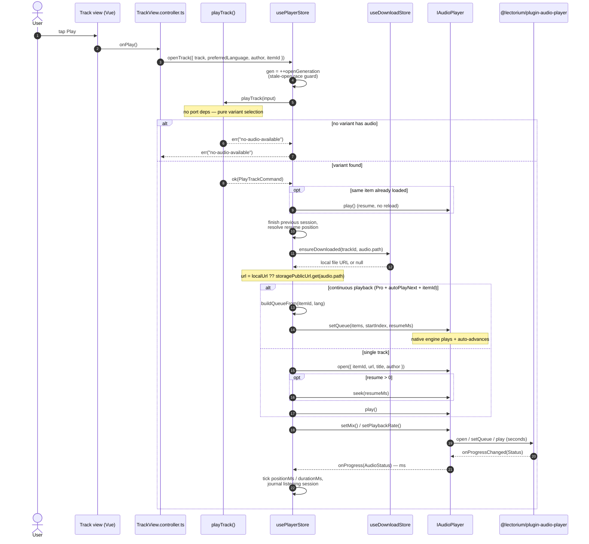
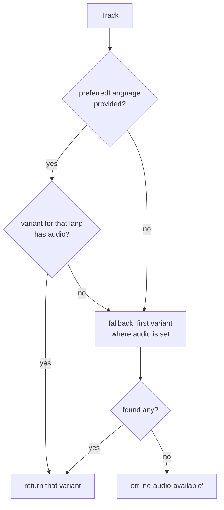

# Flow: Play track

End-to-end sequence from a tap on the play button to first audible audio. The use case `playTrack` is **pure** — it doesn't touch the audio port, the network, or any storage. It produces a `PlayTrackCommand` (variant selection, item id, title, author label, language). The player Pinia store (`usePlayerStore`) consumes that command: it resolves the playable URL (download cache or CDN), drives the `IAudioPlayer` port, and exposes reactive UI state. When continuous playback (a Pro feature) is on, the store hands the whole playlist tail to the engine as a native **queue** so it can auto-advance on its own — including in the background while the JS layer is suspended; otherwise it takes the single-track `open()` path. The platform adapter (`@lectorium/plugin-audio-player` on native, the same plugin's `HTMLAudioElement` web fallback) starts the bytes flowing.

## Variant selection rules

The pure logic in `pickVariantWithAudio` ([`playTrack.ts`](https://github.com/jiva-studio/lectorium/blob/main/modules/apps/mobile/usecases/playback/playTrack.ts)):

`PlayTrackCommand` carries a `matchesPreferred` flag: `false` when a `preferredLanguage` was asked for but no audible variant in that language existed and the first audible variant was used as fallback; `true` when no preference was supplied or the preferred variant was used as-is. The UI can use it to surface "playing in X — your preferred Y is unavailable".

The author-name fallback (`resolveAuthorName`) is defensive: try `author.names.get(language)`; on miss, return the **first** localised name in the map; on a `null`/empty author, return `""`. The author label is used only for the system-player UI.

## What the audio port does

`IAudioPlayer` (a tech port in `@ports/app`, file `modules/apps/mobile/ports/app/audioPlayer.ts`) wraps the platform-specific player. It is implemented by a single cross-platform adapter, `useCapacitorAudioPlayer` (`modules/apps/mobile/infra/audio/capacitor/useCapacitorAudioPlayer.ts`), over the `@lectorium/plugin-audio-player` Capacitor plugin. The plugin owns the native engine on Android/iOS and falls back to `HTMLAudioElement` on web — there is no separate web sibling.

The port surface — a single-track core plus a queue API that powers background continuous playback:

| Method | Purpose |
|---|---|
| `open({ itemId, url, title, author, cover? })` | Load a single media item into the engine and the system media session. (A thin convenience wrapper over a 1-item queue on the native side.) |
| `play()` | Start / resume playback. |
| `togglePause()` | Flip play/pause. |
| `seek(positionMs)` | Absolute seek. |
| `seekBy(deltaMs)` | Relative seek (engine clamps to `[0, duration]`). |
| `stop()` | Stop and tear down the current item. |
| `setMix({ enabled, ratio })` | Fold a bilingual stereo recording (original left / translation right) into mono with a left↔right bias. |
| `setPlaybackRate(rate)` | Set speed (1.0 = normal, pitch preserved). |
| `setProgressInterval(intervalMs)` | How often the engine pushes progress to the WebView; governs only the JS bridge (the lock screen interpolates independently). Driven by `usePlayerProgressCadence` — fast for transcript highlighting, slow heartbeat when backgrounded. |
| `onProgress(listener)` | Subscribe to `AudioStatus` ticks; returns an unsubscribe function. |
| `setQueue(items, startIndex, startPositionMs)` | Replace the native queue and start at the given item/position. The engine auto-advances through the queue on its own, including in the background. |
| `appendToQueue(items)` | Append items to the tail of the current queue (e.g. on resume when a download finished while backgrounded). |
| `getQueueState()` | Read the now-playing snapshot plus the drained transition journal. Reading does **not** clear the journal. |
| `ackEvents(upToSeq)` | Clear journal entries with `seq <= upToSeq` once JS has persisted them (idempotent). |
| `skipToNext()` / `skipToPrevious()` | Lock-screen / in-app skip between queue items. |
| `onTransition(listener)` | Foreground-only push on each item transition (UI sugar; the durable journal is the source of truth). |

`IAudioPlayer` speaks **milliseconds**; the underlying plugin speaks **seconds** (HTMLMediaElement convention). The Capacitor adapter is the single boundary that converts. The adapter also multiplexes listeners over the plugin's single fire-and-forget `onProgressChanged` subscription.

**Background continuous playback.** Native (ExoPlayer playlist / AVQueuePlayer) owns the queue and advances through items even while the app's JS is suspended. Each `QueueTransition` (an item finishing, maybe the next starting) is appended to a **durable on-disk journal** the instant it happens, so completions survive the app being killed in the background. JS drains the journal on launch / resume / foreground-advance via `getQueueState`, reconciles it into `listening_sessions`, then `ackEvents` clears the acknowledged entries.

## Store responsibilities

`usePlayerStore` ([`usePlayerStore.ts`](https://github.com/jiva-studio/lectorium/blob/main/modules/apps/mobile/lectorium/stores/usePlayerStore.ts)) is an app-singleton holding the reactive shape (`trackId`, `title`, `authorName`, `language`, `playing`, `positionMs`, `durationMs`, `itemId`, `mixPosition`, `playbackSpeed`) and orchestrating `openTrack / togglePause / pause / seek / skipBack / skipForward / playNext / playPrevious / stop`.

- **URL resolution** lives here, not in the port: `useDownloadStore().ensureDownloaded(trackId, audio.path)`, falling back to `storagePublicUrl.get(audio.path)` (active CDN URL).
- **Stale-open race guard:** each `openTrack` captures a generation token (`++openGeneration`) and bails at every `await` boundary if a newer open started, so two concurrent opens (tap A then tap B, or auto-advance racing a tap) can't interleave and leave the FloatingPlayer pointing at one track while another plays.
- **Re-tap on the current item** (same `itemId` + `trackId` + `language`) resumes playback instead of reloading, so engine position isn't reset to 0.
- **Item swap** nulls `itemId` first (to gate stale progress events), finishes the previous listening session, then opens the new item.
- **Continuous playback (Pro):** when `useAutoPlayNext` is on, the user is subscribed, and an `itemId` is present, the store builds the playlist tail (`usePlaylistStore().buildQueueFrom`) and hands it to `setQueue` so native auto-advances; otherwise it takes the single-track `open()` path. `queueActive` tracks which mode is live. `playNext` / `playPrevious` call `skipToNext` / `skipToPrevious` then `syncFromNative`.
- **Native sync / reconcile:** `syncFromNative` (run at startup, on app foreground via `App.addListener("appStateChange")`, on `onTransition`, and on a detected auto-advance) drains `getQueueState`, reconciles the journal into `listening_sessions` through `usePlayerQueueReconcile`, acks it, and resyncs the FloatingPlayer's identity (`resyncTo`) to whatever native is now playing. A drained transition with `reason: "error"` raises a `playbackFailed` toast.
- **Resume position** comes from `usePlayerResumePosition` / the `resumeFromMs` arg (deep-link timecodes from chat citation chips arrive as `?resumeFromMs=…`).
- **Mix + speed** (`mixPosition`, `playbackSpeed`, both persisted via `useConfig`) are re-applied right after every `open()` / `setQueue()` because a fresh native MediaItem / AVPlayerItem loses the processor binding and rate; they are also re-asserted on each `resyncTo` after a cold restore.
- **Audio orchestration:** the lecture registers as the orchestrator's `"main"` source (`registerAudioSource`), so it pauses inline snippets when it starts and gets paused when a snippet starts.
- **Progress persistence** is not a use case: each `onProgress` tick feeds `usePlayerSession` (which journals listening time into `listening_sessions`) and `usePlaylistStore().patchProgress`, which marks completion.
- **Skip** uses a `SKIP_DELTA_MS = 15000` relative `seekBy` with an optimistic local position update.

## Failure modes

| Where | What happens |
|---|---|
| `playTrack` returns `err("no-audio-available")` | `pickVariantWithAudio` found no variant with `audio` set. `openTrack` propagates the `err`; the caller surfaces it. |
| Any `IAudioPlayer` call throws during `openTrack` (`open`/`seek`/`play`) | Caught in the store; `openTrack` returns `err("engine-failed")`. |
| Late progress events from a previous track during a swap | Rejected by the guard: `itemId.value === null` drops the event; `status.itemId !== itemId.value` is treated as a native auto-advance and triggers `syncFromNative` instead. |
| Native engine fails on a queued item (404 / unreadable file) | Surfaces as a `QueueTransition` with `reason: "error"` in the drained journal; native auto-skips to the next item, and the store raises a `playbackFailed` toast (once per error, since events are ack'd). |
| A newer `openTrack` wins the race while an older one is mid-load | The stale open bails at its next `await` (generation token mismatch), returning `ok(undefined)` without writing its identity/refs. |
