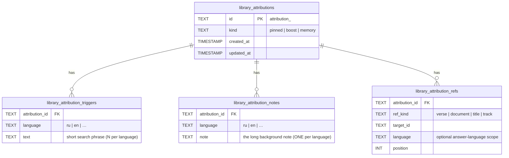
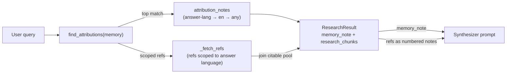

# Memory (curator background context)

A third [attribution](attribution.md) kind, **`memory`**: a curator-authored **note** (connective background knowledge that exists in no single retrieved chunk — e.g. *"the structure of Bhagavad-gītā"*, *"the story of Arjuna and Agnideva in chapter 1"*) plus **refs** to existing resources (verses, commentary, lectures). At chat time a memory is found by semantic similarity and its note is injected into the synthesizer prompt as **non-citable background context** — it shapes the prose and connects the sources, but is never cited. Its refs join the citable pool like `boost`.

It reuses the attribution storage, publish, index and lookup machinery wholesale; read [Attributions](attribution.md) first — this page only covers what memory adds.

| | pinned | boost | **memory** |
|---|---|---|---|
| source | user-style query | short topical label | a note + triggers |
| consumer policy | SHORT path (authoritative refs) | score lift in fanout | **note injected as background; refs join the pool** |
| citable? | refs yes | refs yes | **note no, refs yes** |

## The two axes — *findable* vs *citable*

Memory separates two independent properties that the chat pipeline otherwise conflates:

- **Findable** = embedded. A memory is found by its **triggers** (short concentrated search phrases — one reads like a title) AND by the **chunks of its note** (so a query close to the note's content surfaces it even when no trigger matches).
- **Citable** = given an `[^N]` marker. The note carries **no** marker, so it is *physically* uncitable — the synthesizer reads it as framing but has nothing to cite. Only the refs get markers.

So the note is embedded (to be found) but injected without a number (to stay uncited). These are orthogonal.

## What memory adds to the schema

Memory adds one `kind` value, one note table, and an optional `language` on refs. Everything else is the attribution schema.



- **`library_attribution_triggers`** is the renamed `library_attribution_texts` — across all kinds these texts are match phrases, so the name now says so. Many per `(id, language)`.
- **`library_attribution_notes`** is new. PK `(attribution_id, language)` — exactly **one note per language** (unlike the many-per-language triggers). Empty for pinned/boost.
- **`library_attribution_refs.language`** is new and optional. `NULL` = language-agnostic (a verse renders in any language); `en`/`ru` = used only when answering in that language (e.g. the EN vs RU lecture of the same talk).

The Postgres mirror gains the same: `attributions.kind` CHECK widened to include `'memory'`, a new `attribution_notes(attribution_id, language, note)` table, and an optional `"language"` key on each `attributions.refs` JSONB entry. See migration [`0039`](https://github.com/jiva-studio/lectorium/blob/main/infra/app/db/migrations/0039_attribution_memory_note.up.sql).

## Indexing — note chunks ride alongside triggers

`run_once_attribution` ([`attribution_indexer.py`](https://github.com/jiva-studio/lectorium/blob/main/modules/services/chat/app/src/lectorium_chat/indexer/library/attribution_indexer.py)) treats a memory's embed set as **triggers + note chunks**:

- The note is split with the document `split_into_chunks` chunker and each chunk is embedded into the same per-dim `attribution_emb_d{N}` table as the triggers, keyed to the attribution. A trigger **or** a note-chunk match therefore surfaces the memory through the unchanged lookup query (`GROUP BY attribution, MAX(score)`).
- The note text is folded into the `(id, lang)` etag, so editing the note re-embeds.
- The **full** note is mirrored into `attribution_notes` (not just chunks) so it can be fetched whole at injection time.

## Lookup

`find_attributions(kind="memory", …)` uses the same two-stage native→cross path as `boost` — **no LLM-confirm gate** (the note is advisory, not an authoritative source claim). Thresholds sit between pinned and boost (`research/constants.py`):

| Constant | value |
|---|---:|
| `MEMORY_ACCEPT_SCORE_NATIVE` | 0.72 |
| `MEMORY_ACCEPT_SCORE_CROSS` | 0.68 |
| `MEMORY_MAX_MATCHES` | 1 |

One memory per turn keeps the injected context focused.

## Pipeline → synthesizer



In `research/pipeline.py` a memory lookup runs **concurrently** with the rest and applies to **both** the SHORT and LONG paths (`_resolve_memory` → `_attach_memory`):

1. The top memory's note is fetched with a language fallback (`answer language → en → any`) and carried on `ResearchResult.memory_note`.
2. Its refs are **scoped to the answer language** (keep `language IS NULL OR == answer_lang`) and resolved into citable envelopes folded into `research_chunks` — they get `[^N]` like ordinary notes.
3. `research_worker_node` forwards `memory_note` onto the graph state; `synthesizer.py` passes it to `run_synthesizer_turn`.

The synthesizer ([`synthesizer_turn.py`](https://github.com/jiva-studio/lectorium/blob/main/modules/services/chat/app/src/lectorium_chat/application/synthesizer_turn.py)) injects it as a **BACKGROUND CONTEXT** block in the system prompt, above the numbered RESEARCH NOTES:

```
BACKGROUND CONTEXT (curator briefing — use it to shape and connect your answer,
but it is NOT a source: it has no [^N], never cite or quote it verbatim, and
answer in the user's language regardless of the language it is written in)
──────────────────────────────────────────────────────────────────
<the note>
```

Because the block carries no `[^N]`, the marker expander has nothing to expand — the note cannot be cited. The **answer language is unaffected** by the note's language: it stays driven by the planner's `{{LANG}}` directive, so a Russian user gets a Russian answer even when a fallback English note was injected.

## Authoring

Memory reuses the attribution MCP tools, plus note-specific ones:

| Tool | Purpose |
|---|---|
| `library.attribution.create` | `kind=memory` + optional inline `note` (auto-translated) |
| `library.attribution.note_set` / `note_remove` | upsert / drop the note for one `(id, language)` |
| `library.attribution.note_translate` | bulk translate notes `from`→`to` (fills MISSING only, never overwrites) |
| `library.attribution.trigger_add` / `trigger_remove` | the renamed `text_add` / `text_remove` — add/drop a trigger phrase |
| `library.attribution.ref_add` | now accepts an optional `language` (e.g. an EN vs RU lecture) |

Triggers and the inline note are author-once: `create` auto-translates triggers (short, pinned-style prompt) into every locale; the note is set in the source language and best-effort auto-translated (long-note prompt) — or filled later with `note_translate`. A worked example (find the book/chapter/verse, mint the memory, add triggers + note + refs) lives in the `library-attribution-seed` skill.

Authoring → publish (`library.publish`) → index (`POST /reindex`) → lookup is identical to [Attributions](attribution.md#publishing-librarydb-to-s3).

## Pitfalls

- **Stale notes** outrank fresh evidence in tone — keep notes about *structure / connection*, not facts that change.
- **Over-injection** — one note per turn, capped by the accept threshold; a long note that sprawls across topics is a signal to split into several memories, each with focused triggers, not to inject one giant block.
- **Don't embed facts to be cited** in a note — if a claim must be citable, attach it as a `ref` (verse/document/track), not as note prose.
