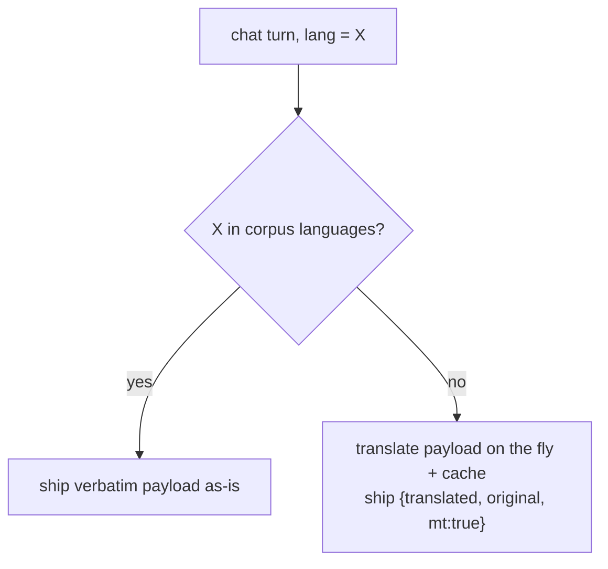
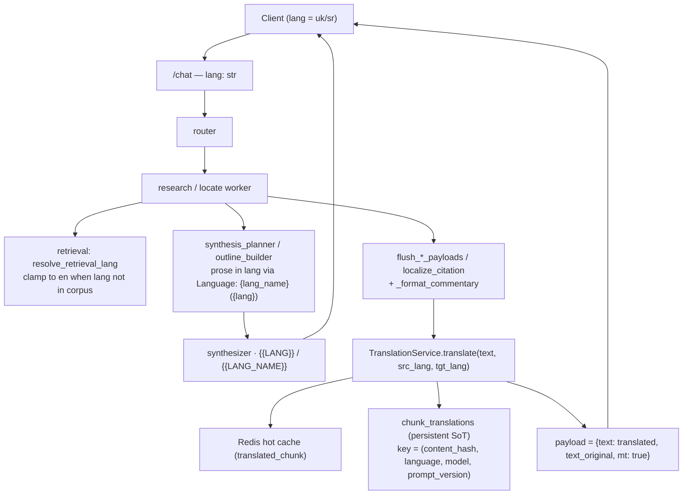

# Multi-language chat & UI

The app supports any number of UI/answer languages without backend code changes. A language is declared in exactly **one** place — the client locale config — and the backend treats `lang` as an opaque string. Whether a verbatim source fragment is shipped as-is or machine-translated is decided from **data** (which languages the corpus actually contains), never from a hardcoded language list.

Today the corpus exists in `ru` and `en`. The interface and the chat answer can be set to additional languages (e.g. `uk`, `sr`) for which no corpus chunks exist; for those the prose is generated directly in the target language and the verbatim citations are translated on the fly and cached.

## Two independent language dimensions

| Dimension | Source of truth | Hardcoded? |
| --- | --- | --- |
| **Languages a user can pick** (UI + answer) | Client locale config (`SUPPORTED_LOCALES` + i18n strings) | No — adding one is a config/strings change |
| **Languages present in the corpus** | `distinct_langs()` = `SELECT DISTINCT lang FROM chunks` (cached, `corpus_langs` ns) | No — derived from data |

The backend never enumerates the answer language. `lang` flows in as a free string and is passed straight into the prompts (`Language: {lang_name} ({lang})` in the planner writers, `{{LANG}}` / `{{LANG_NAME}}` in the synthesizer sections). The corpus-languages set is the only thing that gates the translation path. The bare locale code (e.g. `sr-Latn`) is resolved to a human language NAME from the catalog `languages` table before it goes into the directive, because a bare code makes the model drift to Russian.

## Decision rule

Add a new interface language and it is automatically *not* in the corpus → the translate branch engages with zero Python edits.

## End-to-end flow

## Backend: answer language is opaque, retrieval language is corpus-bound

The two backend lang concepts are kept apart. The **answer** language is a free string threaded into the prose prompts; the **retrieval** language must be a real corpus language (the ANN index is single-language), so it is clamped.

- `api/schemas/chat.py` — `lang: str = "en"` (no `Literal` enum). This is the answer language; it drives the prose prompts directly and a request that omits `lang` answers in English.
- `agent/prompts/language.md` — language-neutral (`REPLY STRICTLY IN {{LANG_NAME}}`, locale code in `{{LANG}}`), no ru/en answer examples baked in. `{{LANG_NAME}}` is substituted in `agent/prompts/__init__.py` with the human language name resolved from the catalog `languages` table (falling back to the raw code). Hosted in Langfuse (`chat-section-language`) — the live edit must be pushed there, not just to the repo `.md`.
- `research/outline_builder.py` — the planner-side writers (`build_outline`) render `Language: {lang_name} ({lang})` via `_lang_directive`, so the synthesis prose is generated in the answer language regardless of corpus.
- `research/pipeline.py` — `resolve_retrieval_lang` / `clamp_retrieval_lang` pick the language to RETRIEVE in. It probes the corpus languages (`distinct_langs`, cached under the `corpus_langs` namespace) and, when the answer language is **not** in the corpus, clamps retrieval to English (`_DEFAULT_RETRIEVAL_LANG = "en"`). So a `uk`/`sr` turn retrieves the English source while the prose stays in the answer language. The embedding model is multilingual, so the English chunks are reachable from a non-English query.
- The per-corpus **tools** (`agent/tools/*.py` — `chunks_search`, `chunks_get_window`, `chunks_get_by_address`, `chunks_find_similar`, `outline`, `list_tracks`, etc.) still declare `lang: {"enum": ["ru", "en"]}`. These read the corpus directly, so their `lang` is deliberately restricted to the corpus languages, not the free answer language. `agent/tools/outline.py` fetches a **precomputed** outline for the track's effective transcript language (it does not generate prose).

## Client: the only place languages are declared

- `SUPPORTED_LOCALES` (in `modules/apps/mobile/lectorium/i18n/index.ts`) + one i18n strings file per feature per locale (`lectorium/i18n/locales/<locale>/*.ts`); fallback to `en` is generic. Today the set is `en, ru, uk, sr-Latn, sr-Cyrl, es, pt, it, de, fr, pl, hu, hi, bn`.
- The chat stream sends the chosen locale verbatim as `lang: string` (`modules/libs/contracts/chat/chatStreamClient.ts`). The background `/title` refresh also forwards the same full `lang` (`usecases/chat/runChatTurn.ts` → `chatTitleService.fetchSessionTitle(turns, input.lang)`), so titles follow the answer language. The markdown export is the one auxiliary call that still collapses to `ru`/`en` via `appLanguage().startsWith("en")` (`views/Chat/composables/useChatExportMarkdown.ts`).
- **Answer language is a separate setting** — `useChatLanguage()` reads `settings.chatLanguage` (default empty string = follow the interface language `settings.appLanguage` via `useAppLanguage()`); overridable, e.g. UI in Serbian, answers in English.
- **Citation translation is its own toggle** — `useChatTranslateCitations()` reads `settings.chatTranslateCitations` (default ON). It surfaces server-side as `ctx.translate_citations`, which gates the machine-translation path for verbatim payloads.

## Verbatim payloads

The chat ships source material verbatim alongside the generated prose: lecture transcript fragments (`cite_transcript`), verse translations, inline commentary/letter sentences (woven into the `delta` stream), chapter titles, media text. Sanskrit and IAST transliteration are language-neutral and are **never** translated; only prose-bearing fields are.

When the target language is outside the corpus and `ctx.translate_citations` is on, each verbatim field is translated at its assembly choke-point. The `flush_*_payloads` helpers in `agent/graph/nodes/_worker_common.py` route every prose-bearing field (cite transcript, verse, chapter title, media text) through `localize_citation`, which calls `TranslationService.translate`; inline commentary quotes go through `_format_commentary` in `agent/marker_expander.py` (fed by `translate_commentaries`). The payload carries both the translated text and the original plus an `mt: true` flag. The client renders a "machine translation" badge with a tap-to-reveal original. Translations run in parallel with prose generation so they do not stack latency.

## Translation cache

| Layer | Role |
| --- | --- |
| `chunk_translations` (Postgres, `infra/translation/pg_translation_cache.py`) | Source of truth. PK columns `content_hash, language, model, prompt_version`; value `translated_text`. Reused across all users; auditable and hand-correctable. `PROMPT_VERSION` is currently `v1`. |
| Redis hot cache (`translated_chunk` namespace, deps `("llm", "library")`) | Hot tier in front of the table (`infra/translation/llm_translator.py` → `cached_str`). The version segment is composed from the dep tags in `infra/cache/versions.py`; `bump("llm")` or a `library` reload mass-invalidates by aging old keys out (no DELs). |

`content_hash` is `blake2b(source_text, digest_size=12)` hex. Hashing the **content** (not the chunk id) means re-chunking or a source edit naturally produces a fresh key. The model and `prompt_version` are part of the PK, so a model swap or a `PROMPT_VERSION` bump mints fresh rows and leaves the old ones to age out. The Redis key folds in the same parts plus the model and `pv` (`make_key` blake2b-hashes the full source text, so it never lands in the key verbatim).

## Adding a language — checklist

1. Add the locale to `SUPPORTED_LOCALES` and create its i18n strings files.
2. Offer it in the interface/answer-language settings.

That is the entire surface. The backend needs no change: a language absent from the corpus automatically takes the generate-in-target + translate-citations path, served from cache after first use.
