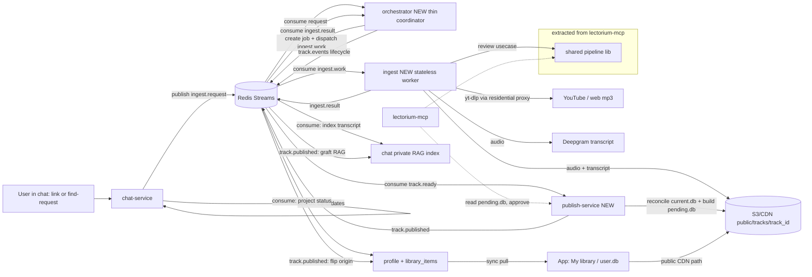
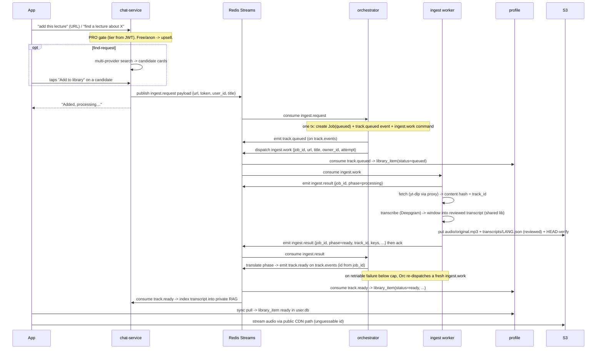
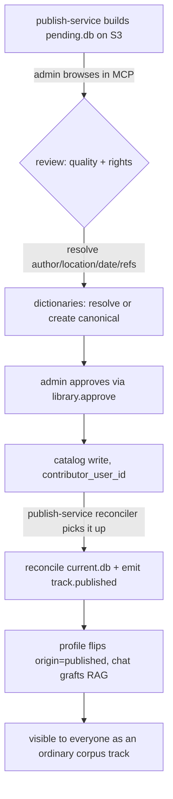

# Personal library (user-added lectures)

The **personal library** lets a user add lectures that are *not* in the shared corpus — by pasting a link, or by asking chat to find one on the internet — and have them downloaded, transcribed, reviewed, and dropped into a private, per-user collection that appears in a new **"My library"** section of the app. Small, single-responsibility cloud services carry the backend: a new stateless **`ingest`** worker does the heavy lifting (fetch → transcribe → review → store), then reports back to a new thin **`orchestrator`** coordinator that owns the `jobs` table, the retry policy, and the public `track.events` lifecycle (emitting `track.queued`/`processing`/`ready`/`failed`); a new **`publish-service`** owns the *publish* side (consume `track.ready`, reconcile the corpus `current.db`, build the admin review artifact `pending.db`, emit `track.published`); the existing **`profile`** service carries per-user membership. The ingest/review logic is reused from `lectorium-mcp`. The services never call each other directly — all cross-service traffic is over a dedicated **`redis-streams`** broker. Per-user metadata lives in the existing **`profile`** service as a new `library_items` collection and reaches the device over the existing profile-sync; audio and transcripts live at a **content-addressed public CDN path** (`public/tracks/<track_id>/…`, where `track_id` is the 256-bit content hash — unlisted by virtue of being unguessable), served exactly like corpus audio with no signing. A later phase lets an admin **promote** a user-added track into the shared corpus — a **zero-copy** operation by design (the bytes are already public; promotion only adds a catalog row and a shared-index entry), because every user track is processed *as a corpus candidate* from the start. Ingest is a **PRO-only** capability.

> **Status: implemented on feature branches, pending merge/deploy.** The `ingest`, `orchestrator`, and `publish-service` services, the `library_items` collection, the shared pipeline lib, the chat search/RAG path, and the mobile UI all exist on the `feat/personal-library-*` branches (see the [deploy runbook](../runbooks/personal-library-deploy.md)); they are not yet on `main` or in production. This page is the design of record and describes the intended end state. It builds on [Profile sync](profile-sync.md), [Chat intents & routing](chat-intents.md), and the `lectorium-mcp` pipeline.

## Scope and phasing

The feature splits cleanly into two releases with very different risk profiles:

- **Phase 1 — Private library.** A PRO user adds lectures; they are visible **only to that user**. This is low store-policy risk (nothing is shared between users) and has no dependency on the corpus-publish path. Ships first.
- **Phase 2 — Public promotion.** An admin reviews user-added tracks and promotes copyright-clean ones into the shared corpus, where every user sees them. This is shared user-generated content and gates on a compliance track (DMCA/takedown, Terms/Privacy, a rights basis) — see [Compliance](#compliance-non-technical-track). Ships later.

The data model and artifact layout are designed in Phase 1 so that Phase 2 is a promotion flip, not a reprocessing.

## Architecture at a glance



Responsibilities are split so each service does one thing: **search is conversational** (chat), **ingest is heavy and proxied** (the stateless `ingest` worker), **coordination is thin** (orchestrator owns the job/lifecycle/retry), and **publish is a background reconciler** (publish-service):

| Concern | Owner | Why |
|---|---|---|
| Detect "add to library" intent | `chat-service` | It already routes intents |
| Search the internet for candidates | `chat-service` | Interactive: present candidates, user picks; metadata-only, no proxy |
| Coordinate jobs, own lifecycle events + retry policy | `orchestrator` | Thin coordinator: owns the `jobs` table + outbox, maps `ingest.result` onto `track.events`, re-dispatches on retriable failure |
| Download bytes | `ingest` | Needs residential egress; heavy/long-running; stateless worker |
| Transcribe / review / normalize | `ingest` (reusing the shared lib) | Same logic as corpus ingest |
| Store per-user metadata | `profile` | Already the per-user data plane (sync, auth, anon, GDPR) |
| Store audio/transcript blobs | S3 (content-addressed) | Enables dedup and cheap public promotion |
| Deliver to device | `profile` sync + public CDN | Reuses the existing sync path; audio via the ordinary CDN path |
| Reconcile corpus `current.db`, build admin `pending.db`, emit `track.published` | `publish-service` | Single-responsibility publish plane; owns its own PG, isolated from ingest |
| Approve public promotion | `lectorium-mcp` (admin tools) | It owns the corpus DB and dictionaries; reads `pending.db` |

## Ingest flow



## The orchestrator and ingest services

The ingest backend is split into two single-responsibility services: a thin **`orchestrator`** coordinator that owns state and lifecycle, and a stateless **`ingest`** worker that does the heavy fetch/transcribe/review/store. They talk only over the broker (`ingest.work` out, `ingest.result` back); neither calls the other over HTTP.

### The orchestrator service (thin coordinator)

A generic **job orchestrator** where library-ingest is the first scenario — designed so future orchestrated tasks slot in without touching the core. Hexagonal / DDD, following the `lectorium-mcp` layout and the `profile` migration pattern. The orchestrator **never fetches, transcribes, or stores** — it owns the `jobs` table (source of truth) + a transactional outbox, re-verifies the PRO tier, dispatches work to the `ingest` worker, and maps the worker's `ingest.result` phases onto job-state transitions and the public `track.events` lifecycle. It also **owns the retry policy**: a `retriable` failure below the attempt cap re-dispatches a fresh `ingest.work`; otherwise the job dead-letters with `track.failed`.

```
modules/services/orchestrator/
  cmd/orchestrator/main.go        # wire + subcommands: serve | migrate
  internal/
    domain/
      job/                        # GENERIC core, kind-agnostic
        job.go                    # Job{id, kind, owner_id, state, spec, progress, result, attempts, ts}
        state.go                  # queued -> running -> done | failed | cancelled
      ingest/                     # bounded context: library-ingest (broker message shapes)
        request.go / work.go      # ingest.request (in), ingest.work (dispatched)
        result.go / event.go      # ingest.result (in), track.events (emitted)
    application/                  # use cases, one folder per scenario
      handlerequest/              # consume ingest.request -> tier check -> one tx: Job + track.queued + ingest.work
      handleresult/               # consume ingest.result -> job transition + track.events; retry on retriable
      getstatus/  canceljob/
    ports/                        # interfaces = the extension surface
      driving.go                  # IngestService (Status / Cancel)
      driven.go                   # EventBus, JobRepository, TierVerifier, Clock, IDGen
    infra/                        # adapters implement ports
      events/redisstream/         # consume ingest.request + ingest.result; dispatch ingest.work; emit track.* lifecycle events
      jobrepo/postgres/           # own DB + embedded self-run migrations
```

**Extensibility rule.** The `job` aggregate, `EventBus`, and `JobRepository` are kind-agnostic. Adding a new orchestrated task later = a new bounded context under `domain/`, a new use case under `application/`, and a handler registered for a new `JobKind`. Existing use cases and the core are untouched.

**Note — search is not in the orchestrator.** The `ingest.request` it consumes always carries a **concrete URL**. Query→URL resolution happens in chat first, so the orchestrator carries no NLU or candidate ranking, and there is no search port here.

### The ingest service (stateless worker)

The **`ingest`** worker is a pure, content-addressed, **stateless** function with **no Postgres**. It consumes `ingest.work`, does the heavy lifting — yt-dlp fetch → content-hash → transcribe (Deepgram) → window into the reviewed transcript (shared `libs/pipeline`) → store to S3 → HEAD-verify — emits exactly one terminal `ingest.result` (plus a `processing` heartbeat). It **acks its `ingest.work` only after that terminal result is durably published**: a publish fault leaves the entry pending, and redelivery re-runs the whole pipeline safely because the content-hash makes every step idempotent (a duplicate re-transcribe overwrites identical bytes at identical keys). It does **not** retry a business failure and does **not** track attempts (both live in the orchestrator). Artifacts match the MCP/corpus pipeline **exactly**: audio at `public/tracks/<hash>/audio/original.mp3` and the reviewed transcript (`transcript.Reviewed` — `{trackId,language,version,blocks}`) at `public/tracks/<hash>/transcripts/<lang>.json`. Its image ships `yt-dlp` + `ffmpeg` (not FROM-scratch). Every external dependency (Deepgram, yt-dlp, S3, Redis) sits behind a port, so swapping any of them is an adapter change.

```
modules/services/ingest/
  cmd/ingest/main.go              # wire + subcommand: serve (no migrate — stateless)
  internal/
    application/
      runingest/                  # consume ingest.work -> fetch -> hash -> transcribe -> review -> store -> emit ingest.result
    ports/
      driven.go                   # Transcriber, Reviewer, BlobStore, Fetcher, EventBus, Clock
    infra/
      fetch/ytdlp/                # yt-dlp + residential proxy
      transcribe/deepgram/
      review/                     # wraps the shared pipeline lib
      blob/s3/
      events/redisstream/         # consume ingest.work; emit ingest.result
```

### Messaging — no point-to-point internal HTTP

Both services talk to the rest of the system **only through the broker**, never through internal HTTP endpoints on other services.

> **Dedicated broker instance.** The shared prod Redis is a 1 GB LRU cache (`volatile-lru`) — stream entries have no TTL, so they would never evict and eventually OOM the cache that `chat` depends on. Streams therefore run on a **separate `redis-streams` broker** — a dedicated Redis instance configured `appendonly`, no LRU eviction, with `MAXLEN` trimming + reliable `XACK`. (Redis Streams was chosen over RabbitMQ/NATS: the go-redis client is already vendored, and the outbox→relay `XADD`/`XREADGROUP`/`XACK` pattern is thin.)

Streams:

- **`ingest.request`** — chat publishes the JSON `{url, token, user_id, title}` in a single `payload` stream field (the shared Redis-Streams envelope every service uses; `token` carries the caller's JWT, `title` the source title chat already resolved); the **orchestrator** consumes it, re-verifies tier, and creates the job. Durable and retryable; chat gets no synchronous reply and does not need one (it shows "processing" optimistically, and the item appears via sync).
- **`ingest.work`** — the **orchestrator** dispatches `{job_id, url, title, owner_id, attempt}` to the **`ingest`** worker (committed in the same tx as the job row + the `track.queued` event). A re-dispatch on a retriable failure carries an incremented `attempt` **and a not-before backoff**: the outbox row is stamped `available_at = now() + backoff(attempt)` (exponential, 15s → 2m cap) and the relay holds it until then, so a transient upstream outage — or an open yt-dlp circuit breaker serving its ~30s cooldown — isn't burned through in milliseconds. Immediate rows (all lifecycle events) drain unaffected.
- **`ingest.result`** — the **`ingest`** worker reports back to the **orchestrator**: `{job_id, attempt, phase, track_id?, lang?, title?, audio_key?, transcript_key?, source_url?, error?, retriable?}` with `phase ∈ {processing, ready, failed}`. The worker emits a `processing` heartbeat and exactly one terminal result, then acks its `ingest.work` **only after that terminal result is durably published** (a publish fault → redelivery re-runs, idempotent by content hash). `attempt` echoes the `ingest.work` attempt so the orchestrator can discard a stale/superseded result. The worker never emits `track.events`.
- **`track.events`** — the **orchestrator** (not the worker) emits track lifecycle events (`track.queued` / `track.processing` / `track.ready` / `track.failed`) with `{track_id, owner_id, keys, metadata, transcript_ref}`, by translating the worker's `ingest.result` phase onto a job-state transition. Event ids are derived from the **`job_id`** — stable across both streams and across redelivery, so downstream consumers stay idempotent. This is a **fan-out**: independent consumer groups subscribe —
  - **`profile`** projects the status/metadata into `library_items` (a server-authored change — **net-new substrate**: today `profile` has only the client `Push` path and no server-side HLC, so this needs a new `ApplyServerChange` method + an HLC generator + the Redis consumer + a transactional outbox, not just the ~6-step collection projection). The event `data` uses the projection's own column keys (e.g. `title_raw`) so it applies verbatim,
  - **`chat`** (a Python consumer) unwraps the `payload` envelope, and on `track.ready` fetches the transcript from the CDN by its `transcript_key` and indexes it into its private RAG index under `kind='user_track'`, and records `(owner_id, track_id)` in its local `owned` projection,
  - **`publish-service`** consumes `track.ready` into its own `publish.tracks` table; a ticker then reconciles the corpus `current.db` and rebuilds `pending.db` for admin review,
  - future consumers (analytics, etc.) attach without the orchestrator knowing.
- **`track.published`** — `publish-service` emits `{track_id, owner_id}` once a track is promoted into the shared corpus. Consumers: **`profile`** flips its `library_items.origin` to `published` (via the server-authored `MarkPublished` path — stamped with a **terminal HLC** so the flip always wins last-writer-wins over the earlier `track.ready` row, whose HLC is a high fnv-hash of a non-numeric `<job_id>:ready` id that an ordinary ms-based stamp would lose to), and **`chat`** runs the RAG *graft* (relabel `user_track` → `track_transcript`, drop the per-user `owned` rows) so the track becomes corpus-wide.
- **Removal (`track.removed` / `library.unlinked`) — consumers wired, producer NOT yet implemented.** The intended flow: when a user removes an item, `profile` deletes the `library_items` row and `chat` drops the `(owner_id, track_id)` row from its `owned` projection so the track leaves that user's RAG scope. Both consumers exist today — `profile` consumes a `track.removed` event on `track.events` (`op=delete`), and `chat` consumes a `library.unlinked` event — but **no service currently produces either event**, so removal is a no-op end-to-end. Two follow-ups remain before "remove from My library" works: (1) add the producer, triggered by a client→server removal request (same transport as "Add"); (2) reconcile the event name — the two consumers presently listen on **different** names (`track.removed` vs `library.unlinked`), which the producer must emit consistently (or the consumers realign on one).

Events are published from the producer's own DB via a **transactional outbox** (the row is the source of truth, the emit is derived), so a crash never drops an event. Delivery is at-least-once and every consumer handler is **idempotent** (profile by `(user_id, doc_id, hlc)`, chat by `track_id`), so redelivery is safe. This is why there is no `profile /internal/library.upsert` and no `chat /internal/index` — the completion is one event, not N point-to-point calls.

Two mechanics make "redelivery is safe" real rather than aspirational. **Reclaim:** Redis Streams does *not* auto-redeliver a stranded pending entry — the read loop only fetches *new* (`>`) entries — so every consumer runs an explicit **`XAUTOCLAIM` reclaim** pass each iteration that redelivers an entry left un-ACKed by a crash or a transient handler error (min-idle ~15 min on the Go consumers, ~2 min on chat; the window must exceed the slowest in-flight handle so a live-but-slow message on one replica isn't reclaimed out from under it). New consumer groups are also created at the stream head (`0`, not `$`) so a message published just before a group first existed isn't skipped. **Rank-ordered lifecycle HLC:** the `library_items` states share one membership `doc_id`, so their server HLCs are stamped by lifecycle *rank* (`queued` < `processing` < `ready` = `failed`, all below the publish `Terminal` flip) rather than a wall-clock/hash stamp — the later state then deterministically wins last-writer-wins on both the server projection and the client's change-log resolution, no matter the broker arrival order, while a redelivered state collides on the same stamp and stays idempotent.

### Shared pipeline library

The reusable ingest logic (`normalize`, `transcript/review`, `metadata`) currently lives in `lectorium-mcp/internal/application/*`. Go's `internal/` rules block cross-module import, so it is **extracted into a public package** (e.g. `libs/pipeline/*` or a dedicated module) imported by *both* `lectorium-mcp` and the `ingest` worker (the orchestrator does not import it — it never runs the pipeline). Three dependencies are abstracted behind ports because they are hardcoded to single-corpus / local-FS today:

- **Transcriber** — a `Deepgram` adapter is added alongside the existing transcriber-service adapter.
- **Storage** — a "write straight to the per-user content-addressed S3 prefix" adapter.
- **Fetch** — a new `Fetcher` port (yt-dlp + proxy); nothing like it exists in the MCP today.

## Identity and storage model

Two corrections to the naive design that are load-bearing for dedup and promotion:

### Content-addressed public storage

Blobs live at **`public/tracks/<track_id>/…`** — the **same path scheme as corpus audio** — where `track_id` is the SHA-256 of the content. There is no per-user prefix and **no signing**: the id is a 256-bit hash, so the path is effectively unguessable ("unlisted"), and these are copies of already-public lectures, not personal data. This is deliberately simple and buys three things:

> **Storage backend.** The public CDN (`b-cdn`) serves from a **pluggable object-storage backend** selected by `STORAGE_BACKEND`: **`bunny`** (Bunny Edge Storage — the source of truth on the global origin; **not** S3-compatible, so the ingest worker and publish-service talk its plain HTTP API via a `bunny` blob adapter) or **`s3`** (AWS / S3-compatible like Yandex, on the RU proxy and in dev). The chosen backend **must** match what the CDN pull-zone fronts, or the app and chat can't read the artifacts. Both new Go services carry the same `STORAGE_BACKEND` / `STORAGE_ZONE` / `STORAGE_KEY` switch the `share-*` services and the corpus pipeline already use; chat reads the transcript back by building the CDN URL from the `transcript_key` and its `media_base_url`.

- **No new client code** — the app resolves audio/transcript through the existing CDN template, identical to corpus tracks; there is no private-URL branch.
- **Storage-level dedup** — if user B adds a video user A already processed, both `library_items` point at the same content-addressed blob (same hash) and share one set of RAG chunks (keyed by `track_id`). The worker does **not** short-circuit a duplicate: it re-fetches and re-transcribes, but converges on the **identical keys** (idempotent overwrite), and chat's per-track indexer is a no-op by `track_id`. (An earlier design added a worker-side `linked` fast-path, but it was dropped: it couldn't name the `transcripts/<lang>.json` key without transcribing, and it clashed with at-least-once redelivery. In practice yt-dlp output isn't byte-stable across downloads, so byte-identical cross-user dups are uncommon anyway.)
- **Zero-copy promotion** — the bytes are already public, so promoting to the shared corpus moves nothing; it only adds a catalog row and a shared-index entry.

What stays private is **not** the bytes but the **membership** (`library_items` syncs only to its owner — "what I added" is private) and the **RAG isolation** (per-user retrieval filter, unaffected by blob storage). The one trade-off is a copyright one — see [Compliance](#compliance-non-technical-track).

### Membership id vs content id

The content hash is unknown at submit time (the file has not been downloaded yet), and a primary key cannot change. So `library_items` separates two identifiers:

| Field | Meaning | Assigned |
|---|---|---|
| `library_item.id` | per-user **membership** id (UUID) | at submit — lets the app show "processing" immediately |
| `library_item.track_id` | content hash | after fetch computes it |

`listening_sessions`, `notes`, and `playlist_items` key off **`track_id`**, which is safe because those only accrue after a track is playable (you cannot listen to a queued track), by which point `track_id` exists. Keeping `track_id` stable across private→public means all that per-user history survives promotion untouched, and other users who add the same content share the same id (free dedup).

## Data model

### `profile.library_items` (new collection)

Added to the `profile` service as a sixth synced collection (see [Profile sync](profile-sync.md) for the mechanism). Extending the whitelist + projection is a bounded ~6-step change; the transport, HLC, auth, and endpoints are untouched.

| Column | Notes |
|---|---|
| `user_id` | owner (`auth.users.id`); PK part |
| `doc_id` | membership id (UUID); PK part |
| `track_id` | content hash; null until fetched |
| `title_raw`, `author_raw`, `location_raw`, `date_raw`, `lang_hint` | lossless captured metadata |
| `author_id`, `location_id`, `date`, `date_precision`, `lang`, `lang_confidence` | resolved values; null when unresolved (`lang` is ASR-detected — authoritative) |
| `status` | `queued` \| `processing` \| `ready` \| `failed` |
| `origin` | `private` \| `published` |
| `error` | user-visible failure reason |
| `audio_key`, `transcript_key`, `duration` | filled on ready |
| `cover_key` | re-hosted YouTube thumbnail in S3; null → app shows a plain placeholder (no generated cover) |

**`library_items` is 100% server-authored; the client only reads it.** The client never edits it, so the `profile` substrate's whole-document LWW is never contended — one writer (the server), no field-level merge, no client-owned split. This is possible because **all metadata is settled up front, in chat, before ingest**: chat confirms the concrete source (and asks the user only if something is genuinely ambiguous), and `ingest.request` is not published until the required info is in hand. Title/author/language are then detected by the pipeline (filename parse, ASR), not hand-edited later. Any later mutation — e.g. "remove from My library" — is likewise a **server-authored action** triggered by a client→server request (the same transport as "Add"), not a client sync-push. On the client this collection is **pull-only**: no outbox, no journal, no merge rule beyond "apply the server's version."

**`library_items` is the source of truth for ownership.** It is per-user membership: one row per membership, keyed `(user_id, doc_id)` where `doc_id` is the membership id (the ingest `job_id`, assigned at submit) — the same `doc_id` carries the row through every lifecycle state. `track_id` (the content hash) is a nullable column filled on `ready`, so several adds — by different users, or the same user twice — produce several membership rows sharing one `track_id`, each with their own status plus their own listening/notes — over a **single** shared blob and a single shared set of RAG chunks (both keyed by `track_id`). Each user's ingest runs independently and emits its own `track.ready`; because storage is content-addressed and chat's indexer is idempotent by `track_id`, the second ingest converges on the identical blob and is a no-op at the index (it does re-fetch/re-transcribe — the compute is not shared, only the result). Removing one user's row leaves the shared content intact for the others (refcount GC when the last owner leaves).

**Metadata is captured in three states** per dimension (author / location / date / references): `*_raw` (always, lossless), the resolved id/value (only when confidently matched), and a status/confidence. While private, unresolved is fine — the app shows `author_raw`. Normalization is only *required* at the public-promotion gate.

### `orchestrator` own Postgres (`ingest` has none)

The orchestrator owns a separate Postgres with a `jobs` table (`Job` aggregate) as the **source of truth**. Emitted `track.events` are a transactional-outbox projection of the job, so a crash between steps never leaves an orphaned `queued` item — it is recoverable from the job row and re-emitted. Migrations are **embedded and self-run** on startup, copying the `profile` pattern exactly: an `orchestrator migrate` subcommand (no separate binary), a `pg_advisory_lock` so parallel containers do not race, a `schema_migrations` ledger, and a `/readyz` gate until applied. See `modules/services/profile/internal/store/store.go` for the reference implementation.

The **`ingest`** worker has **no database at all** — it is stateless and content-addressed, so all durable state (jobs, attempts, lifecycle) lives in the orchestrator's Postgres, and `publish-service` keeps its own separate Postgres for the publish projection.

### Migrations, by service

**Two mechanisms — don't mix them up.** Self-run embedded migrations (the `profile` pattern) are only for services with their **own** Postgres. Services on the **shared `lectorium` DB** (`chat`, auth, billing, …) migrate through the central golang-migrate `migrator` container against `infra/app/db/migrations/` — `chat` has **no** migration runner of its own (an earlier draft wrongly said it self-migrates).

| Service | New schema | How it ships |
|---|---|---|
| `profile` | `library_items` (server-owned, pull-only for clients): table + whitelist + projection + purge + the server-authored write path (`ApplyServerChange` / `MarkPublished`) | self-run (own DB, embedded) |
| `orchestrator` | `jobs` + outbox tables | self-run (own DB, embedded) |
| `ingest` | none — **stateless worker, no database** | n/a (no `migrate` subcommand) |
| `publish-service` | `tracks` (publish projection) + outbox tables | self-run (own DB, embedded) |
| `chat` | new `kind='user_track'` partial HNSW index on the existing embedding tables + an `owned(user_id, track_id)` projection table | **central migrator** — new `NNNN_*.up/.down.sql` in `infra/app/db/migrations/` |
| mobile `user.db` | `library_items` table + wire type (pull-only — no outbox/journal) | on-device migration, ships with the app version |

## Search layer (in chat-service)

When corpus search returns nothing (or low confidence), chat does not dead-end — it offers to search the internet, returns several **candidate cards** (cover thumbnail + title + channel + duration), each with an **"Add to library"** button that makes chat publish an `ingest.request` for that concrete URL. The thumbnail both looks good and helps the user pick the *right* lecture.

Search is a **multi-provider port** with an ordered-fallback resolver — "whichever works":

| Priority | Provider | Cost | Notes |
|---|---|---|---|
| 1 | YouTube Data API v3 | free (~100 searches/day; extendable) | native thumbnails, reliable, no proxy |
| 2 | yt-dlp `ytsearch` | free | scrapes the YT frontend — needs the proxy, ban-prone; rarely fires behind #1 |
| 3 | SerpApi | free 250/mo | open-web mp3 where YouTube API does not help |
| 4 | DataForSEO YouTube SERP | pay-go ~$0.002 | overflow only, once both free tiers are exhausted |

On day one the search layer is **$0** (providers 1 + 3 are free). The resolver tries providers in priority order and stops at the first non-empty result, conserving the free quotas. It must include **per-provider timeout + circuit breaker** (a flaky yt-dlp must not hang the chat turn), **quota-aware ordering** (skip a provider known to be exhausted), and, if ever switched to aggregate mode, **dedup by video id / normalized URL**. Every adapter normalizes to a common `Candidate{source_url, title, author, duration, thumbnail, lang_hint}`.

### Sources beyond YouTube

YouTube covers most cases, but lectures also live on archives like iskcondesiretree and on the open web as bare mp3s. Two mechanisms must be kept distinct:

- **Discovery** — YouTube API only finds YouTube. Everything else is reached through the **web-SERP** providers (SerpApi / DataForSEO), which return **pages**, not media URLs.
- **Extraction** — turning a page into a downloadable mp3 + metadata. This is a step YouTube hides (yt-dlp resolves it by id), but a generic page needs it. It lives in the `ingest` worker's `Fetcher` port, generalized into a **registry of extractors keyed by domain**: **yt-dlp is the default multi-site extractor** (1000+ sites, plus a generic `<audio>` / `*.mp3` handler), and **site-specific adapters** (iskcondesiretree, speaker archives) are added behind the same port as they prove worth it.

**Metadata from the filename.** Archives like iskcondesiretree encode rich metadata in the file name / path — speaker, date, place, scripture reference (e.g. `SB_01.02.06_Class_Prabhupada_Los-Angeles_1972.mp3`). This is exactly what `lectorium-mcp`'s `track.metadata.extract` already does (LLM filename parse + ffprobe + dictionary resolve), so the shared lib **reuses it**: for archive sources the `*_raw` metadata comes mostly from the filename, then feeds the same resolve step. "What to download" is not ambiguous — the user picked a specific candidate = a specific media URL; if a page holds several mp3s, discovery returns them as **separate candidates** and the user chooses.

**A full web crawler is deliberately out of scope.** User-triggered add of one lecture needs only SERP discovery + per-page extraction — bounded and cheap. A crawler (robots/politeness/unbounded space) is only justified for **bulk-indexing a whole archive**, which is a *separate* admin feature that would feed the corpus directly via the existing `lectorium-mcp` lake — not this per-user path. Do not conflate the two.

## Language handling

The authoritative language of a track comes from the **audio, not the metadata** — metadata is an unreliable hint. So language, like author/location/date, is a raw-vs-resolved pair:

- **`lang_hint` (raw)** — best-effort from the provider metadata / title / the user's locale. Used only to filter and rank candidates; never trusted as truth.
- **`lang` (resolved, authoritative)** — set by **ASR auto-detection** during transcription (Deepgram detects the spoken language), stored with a confidence. If `lang` disagrees with `lang_hint` or confidence is low, the item is flagged.
- **Multilingual talks** — an English lecture quoting Sanskrit, or Russian/English and Hindi/Bengali mixes: ASR resolves the dominant language and code-switching lowers accuracy (this is where the Sanskrit/IAST caveat bites). The corpus is per-language, so at the **public-promotion gate** the admin verifies `lang` exactly as they verify author and date.

## Access control

Ingest is **PRO-only**. The subscription tier is already a JWT claim (see [Subscriptions](subscriptions.md)) that chat reads for its own limits, so no new plumbing. Gated in **two places** (defense in depth): `chat-service` decides whether to show the search/add affordance and only publishes `ingest.request` for a PRO user; `orchestrator` **re-verifies the tier from the JWT** carried on the consumed request, since it must not trust the publisher — but only on **first receipt** (when it creates the job). A redelivered request for an already-created job is not re-judged, so a token that lapses *after* acceptance can't fail a job whose `ingest.work` is still in flight. Anonymous users have no access — this closes the `/auth/anonymous` spam/cost vector entirely. A soft **per-PRO-user quota** still guards against a PRO user submitting hundreds of URLs.

**Free/anon see an upsell**, not a hidden feature: at the moment corpus search comes up empty, the app offers "I can find and add this lecture — available in PRO", with the button leading to the paywall. This turns the moment of explicit need into a free→PRO conversion hook.

## Mobile client

Phase 1 client work, reusing the existing playlist / user.db / sync stack:

- **Entry point — a shelf on the Library page** — the personal library surfaces as another widget/shelf on the existing library-landing page (alongside the smart-library and other shelves, driven by `useLibraryLandingStore`), not as a new tab. Tapping through opens the full **"My library"** route + view + store, mirroring the playlist store; both read `library_items` from `user.db` (synced from `profile`).
- **Completion indication — in-app.** Ingest takes minutes; when `ready`/`failed` flips arrive via sync, the app surfaces them through the existing in-app mechanisms (a badge on the shelf and the item card). No push notification — if the user has left the app they simply see it on return.
- **Delivery is decoupled from the chat turn.** Ingest can take ~10 minutes (fetch + transcribe + review), so the client must **not** be held in chat waiting. The chat turn ends immediately after publishing `ingest.request` ("added, it will appear in My library"). Status then arrives purely through `profile` sync, driven by an **app-wide background sync poller**: while any `library_item` is **pending** (`queued`/`processing`) in `user.db`, the app polls sync on a short interval (with backoff) **on any screen**, not only in chat, and stops once everything settles. This is the same shape as a background-download tracker — the trigger is the presence of a pending row, not an open channel.
  - Leaving the chat screen keeps the poller running (app still open). Closing the app stops it; the next foreground sync catches up. No push notification needed.
  - The first `queued` row only needs to reach `user.db` once for the poller to see it — either a single sync fired right after the tap, or the next periodic sync. (A chat-SSE nudge can make that first appearance faster but the mechanism does not depend on it.)
- **Library-item card** — cover (or fallback), title, author, duration, and a **status badge**: `processing` (spinner), `ready`, or `failed` (with a retry action). The card updates as sync pulls status flips.
- **Audio/transcript playback** — resolved through the **existing CDN template**, identical to corpus tracks (`public/tracks/<track_id>/…`), for both `private` and `published` items. No signed URLs, no private-URL branch — the storage-URL resolver and transcript loader are reused unchanged.
- **Chat candidate cards** — a new inline component rendered by the chat renderer: cover + title + channel + duration + an **"Add to library"** button whose action makes chat publish an `ingest.request` for that URL.
- **user.db schema** — a new `library_items` table + wire type in the persistence-user submodule, with the outbox/HLC bookkeeping the sync engine already expects.

### Cover images

Covers are kept deliberately simple — **we generate nothing**:

- **YouTube** — the search result has a thumbnail (`i.ytimg.com`). It is **re-hosted into S3** (`public/tracks/<track_id>/cover.jpg`) rather than hotlinked, so it is stable across promotion and works offline, and `cover_key` is set.
- **Anything else** (archives, web mp3) — usually no image → `cover_key` stays null. We do **not** scrape `og:image` and do **not** generate a cover.
- When `cover_key` is null the app shows its existing plain placeholder tile (the `CachedImage` fallback) — no client-side cover generation.

## Chat over the personal library

A chat question must be answered over the **union of the shared public corpus and the asking user's own private tracks**, in a single ranked answer.

**The corpus RAG index is already Postgres + `pgvector`** — a `chunks` table (+ per-dim embedding tables with partial HNSW indexes) that `chat` queries at runtime; corpus lectures live there as `kind='track_transcript'`. (`library.db` is **not** the runtime index — it is a build-time SQLite *source artifact* that gets re-indexed into that Postgres table; earlier drafts of this doc got that wrong.) So a private user-track index is **the same rows in the same table**, not a separate store: index private tracks with a **new `kind='user_track'`**, content-addressed by `track_id`, same embedding model/dimensions, and add one partial HNSW index for that kind. The retriever already supports an `eligible_track_ids` ACL filter, so union retrieval reuses existing machinery.

> **Isolation is a hard requirement here, not a nicety.** The default corpus lane queries `kind='track_transcript'` with `eligible_track_ids=None`. If private tracks were stored under that kind they would **leak to every user**. Storing them as `kind='user_track'` keeps them out of the default lane automatically; the private lane adds them back **only** filtered by the asking user's owned `track_id`s. And the ACL set must come from the server-side `owned` projection keyed on the JWT `sub` — **never** from client-supplied context (today's `user_history_search` derives ids from client `recent_tracks`, which is safe only for the user's own public history, not for private ACL).

### How a personal track gets indexed

The orchestrator does **not** touch the index — both because of own-your-DB and because `chat` is Python (its chunker/embedder is Python) while the orchestrator is Go and could not run it anyway. Instead it happens over the broker:

- The orchestrator emits `track.ready {track_id, transcript_ref}` on `track.events`; `chat` is a **consumer group** on that stream.
- On consuming it, `chat` runs **its own** indexer (chunker + embedder — the existing per-track `_process_one` path) and writes chunks/embeddings into the `chunks` table as **`kind='user_track'`**, keyed by `track_id`. Idempotent by `track_id` (dedup — re-indexing an existing track is a no-op), so redelivery is safe. No internal HTTP endpoint is involved.
- On the same event `chat` records `(owner_id, track_id)` in a small local **`owned` projection** — this is how it knows the ACL set at query time without a hot-path call to `profile`. `profile` remains the *source of truth* for ownership; `owned` is a derived read-model kept current by `track.ready` (add) and `library.unlinked` (remove — consumer wired, producer pending; see the removal note above).

### Query time — corpus ∪ private

- `chat` takes `user_id` from the JWT `sub`.
- It reads that user's `track_id`s from its local `owned` projection (populated by events — no cross-service call on the hot path).
- Retrieval runs over the **corpus index plus the private index filtered to those `track_id`s**, ranked together into one answer. Both indexes are `chat`'s own data.

### Isolation — how other users never see them

1. **Query-time ACL filter.** The private search is always `WHERE track_id IN (<track_ids the asking user owns>)`, taken from `chat`'s `owned` projection keyed on the trusted JWT `sub` — **never from a client-supplied parameter** (or a user could name someone else's `track_id`). No token / not an owner → zero private hits. Deletes self-heal: a `library.unlinked` event drops the row from `owned`, so the track leaves that user's scope (shared content is GC'd later by refcount once no owner remains).
2. **Kind separation.** Private chunks carry `kind='user_track'`, which the default corpus lane (`kind='track_transcript'`, no ACL) never queries — so they are unreachable by anyone else's search by construction, not just by filter. On **promotion** the track is re-indexed as a corpus kind; until then it exists only in the private lane.

### One mechanism, no phasing

Single-track Q&A and whole-library search are the **same query with a different filter set** — `{one track_id}` when asking about a specific lecture, `{all owned track_ids}` for "find where I heard about Y across everything I added" — so both ship together. On **promotion** the same embeddings graft into the corpus index; indexing was on the corpus path all along, so nothing is reprocessed.

### Who touches what

| Service | Role in RAG |
|---|---|
| `chat` | owns the RAG index (corpus + private `kind='user_track'` rows in the same `chunks` table); runs the union retrieval and the per-track indexer; on `track.published`, grafts the private track into the corpus namespace |
| `ingest` | produces the transcript and stores it to S3, then reports `ingest.result` to the orchestrator. No index DB access |
| `orchestrator` | translates `ingest.result` into `track.ready` on `track.events`; `chat` consumes and indexes. No index DB access, no HTTP call |
| `publish-service` | consumes `track.ready`; on admin approval, reconciles the corpus and emits `track.published`, which triggers the chat graft. No index DB access |
| `profile` | source of truth for ownership (`user_id → track_id`); `chat` reads it to build the ACL filter |

## Public promotion (Phase 2)

Because user tracks are processed as corpus candidates from the start (same content-hash id, same public artifact path, same metadata format, same review quality), promotion is **zero-copy** — no bytes move, it only adds a catalog row and a shared-index entry:

There is **no user-facing "suggest to corpus" action** — a user cannot propose anything for publication. The admin simply reviews the user-generated tracks and approves the worthwhile ones.



- **The admin review artifact is `pending.db`** — a SQLite snapshot of user-generated tracks that **`publish-service` builds and uploads to S3** (never a user-submitted queue; there is no "suggest" action). `lectorium-mcp` self-fetches it exactly as it fetches `current.db`.
- **Admin approval runs through `lectorium-mcp`** (it owns the corpus DB and the author/location dictionaries). New tools mirror the existing `track.*` / `<dict>.resolve` style: `library.pending.list` / `.get` read from the fetched `pending.db`; `<dict>.resolve` matches existing canonical entries, and `author.create` / `source.create` / `location.create` mint a **new** canonical entry — **only at the gate**, never automatically from uncertain pipeline output (that is how dictionaries stay free of duplicates). `track.metadata.set` (already exists) applies admin corrections; `library.approve` commits the catalog row. The `publish-service` reconciler then updates `current.db` and emits `track.published` (no byte copy).
- **One corpus schema concession:** a nullable `contributor_user_id` (and optional `visibility`/`origin`) on the corpus track — attribution only, does not disturb the otherwise ownerless model.
- **After promotion** the `track_id` is unchanged, so the author's `library_item` (and everyone's listening/notes) keeps working; the item is marked `origin=published`. Playback already used the public CDN path, so nothing about audio delivery changes — the track simply also appears in the shared catalog for everyone.

## Reliability and edge cases

- **Concurrent duplicate submits.** Two users submitting the same video at once each fetch + transcribe + write; because both write the **same content-addressed keys**, the concurrent writes are an idempotent overwrite of identical bytes, not a corrupting race — no claim-lock is needed. The only cost is a redundant transcribe (bounded, and uncommon since yt-dlp output isn't byte-stable).
- **Retry is serialized.** A retriable `ingest.result` re-dispatches a fresh `ingest.work`, but the orchestrator re-loads the job `FOR UPDATE` and re-checks the echoed `attempt` under the row lock — so two consumers racing the same result (e.g. via the reclaim window) can't both increment + re-dispatch. The loser sees the bumped attempt and no-ops.
- **Failure path.** A fetch/transcribe failure sets `status=failed` (projected to `library_items` like every other lifecycle state, so the app's failed badge + retry affordance render from the synced row). Poison jobs (age-restricted, removed, geo-locked) are non-retriable and hit a **max-attempts dead-letter** so Redis redelivery does not loop forever. An **empty transcript** — a 200-but-silent ASR response yielding zero reviewed blocks — is treated as a *retriable* failure, not a ready track with no text, so it retries and then dead-letters as `failed` rather than masquerading as ready. Orphaned blobs from failed jobs are cleaned up.
- **Input limits.** Enforce max duration / max size at submit to cap Deepgram cost (a 10-hour stream or a movie should be rejected).
- **Transcript format matches the corpus exactly.** The Deepgram adapter yields a `transcript.Raw` (per-sentence segments + detected language); the worker then windows it into `transcript.Reviewed` (`{trackId,language,version,blocks}`) via the shared review lib — the **same shape and key the MCP pipeline and the app transcript renderer read** (`public/tracks/<hash>/transcripts/<lang>.json`). Quality caveat: Deepgram handles **Sanskrit / IAST verses** poorly, so such lectures transcribe below corpus quality.
- **Anon → signed-in upgrade.** If auth re-keys `user_id` on upgrade, `library_items` must migrate alongside `playlist_items` / `notes`. Confirm how the existing per-user data handles this and include the new collection.
- **GDPR + dedup.** `profile` purge covers the `library_items` row, but content-addressed blobs are shared across users — S3 deletion needs **refcounting / GC**, not eager delete on one user's removal.
- **Denoise (optional).** YouTube audio is often noisy; the corpus denoise stage can be reused as an optional step.
- **CDN propagation lag.** The `ingest` worker writes to Bunny Edge Storage; the client reads via the CDN pull zone. A `track.ready` can beat CDN availability → the audio 404s briefly. The worker therefore **HEAD-verifies** the object before reporting `ingest.result` `phase=ready`, so the orchestrator only emits `track.ready` after the object is confirmed present (or have the client tolerate a short retry).
- **First always-on writer to the corpus bucket.** Today corpus audio reaches `public/tracks/…` via an offline `aws s3 sync` from the curator box; the `ingest` worker would be the **first prod service** writing there. Scope its S3 credentials to hash-derived paths to bound blast radius on the real catalog.
- **`storage-sync` mirrors it for free.** Writing to Bunny under `public/tracks/…` is automatically mirrored to the RU (Yandex) region by the existing hourly `storage-sync` — no extra multi-region work.

## Compliance (non-technical track)

Letting users add arbitrary internet lectures makes the app a **user-generated-content app**, which touches App Store (guideline 1.2) and Google Play UGC policy — but the exposure differs sharply by phase:

- **Phase 1 (private)** — the *membership* is visible only to the adding user (nothing is shared between users in-app), so **store-policy (UGC)** risk stays low. The **copyright** angle is the real caveat and it is sharpened by the simple storage choice: the audio bytes sit at an unlisted-but-**public** CDN path (unguessable id), which is a weaker "personal use" posture than truly-private storage. Since these are copies of third-party lectures, whether we may host them publicly-unlisted is a **legal go/no-go** — the simple no-signing design is adopted on the assumption counsel approves it; otherwise fall back to private + signed URLs.
- **Phase 2 (public)** — shared UGC triggers the full policy set, but because promotion is **admin-gated**, the human review *is* the moderation/filtering mechanism the stores require, and curated publishing is safer than open user-to-user sharing.

Phase 2 depends on a compliance workstream, not more architecture: a **DMCA/takedown (depublish) path**, **EULA/Terms** (user responsible for added content; grant of license on promotion; takedown described), **Privacy policy** updates (e.g. Deepgram processing), a **rights basis** for each promoted lecture (speaker/organization permission, CC, or public domain — admin judgment is not a rights basis on its own), and possibly App Store review notes explaining the moderation. This should go through legal counsel.

## Open questions

1. **Egress proxy** — **decided:** a **configurable** proxy behind the `Fetcher` port, starting with a **commercial residential** provider (not the home machine / personal tailnet — that couples prod to a personal network and is a home SPOF). Provider is host-only config, kept out of committed docs. A **circuit-breaker + failed-job** path is required so a proxy/provider outage degrades to `status=failed` (retryable), not a stuck queue.
2. **Copyright policy** — admin approves only copyright-clean content for publish (decided in principle). The simple storage design hosts audio at an unlisted-**public** CDN path (no signing); this needs a **legal go/no-go** — if declined, fall back to a private prefix + signed URLs. The per-lecture rights basis for promotion also needs legal sign-off.
3. **How the offline admin sees user tracks** — because the admin `lectorium-mcp` is a **local, offline daemon** (not a prod service, no prod-DB access), the list of **user-generated tracks** to review is delivered as a **published artifact** — a small `pending.db` on S3 that the MCP self-fetches exactly like it already fetches `current.db`. A prod producer (profile/orchestrator) exports the user-generated tracks into it (this is *not* a user-submitted queue — users never propose anything); `library.approve` writes back via `catalog.publish`. The prod producer is the remaining Phase-2 piece.

## Verified-against-code corrections (implementation notes)

Ground-truthed against the tree; these refine the plan without changing its shape:

- **Shared pipeline lib is bigger than "3 ports."** The mcp usecases are welded to `lakeport.Registry` + `transcriptport.Store` and (for metadata) the whole catalog surface — not just Transcriber/Storage/Fetch. Extract the **pure functions** (review chunking/boundaries/aggregate/fallback, `domain/transcript`) into a **new shared Go module** (no `go.work` exists today — 15 independent `go.mod`s), and have the `ingest` worker write its **own thin `Run`** against the `ingest.work` spec instead of implementing `lakeport.Registry`. For private ingest, **skip** the catalog auto-create/resolve in `extractmeta` (normalization is a promotion-gate concern).
- **Client playback needs a `library_item → synthetic Track` adapter.** The storage-URL resolver / downloader / transcript loader are path-agnostic and reused unchanged, but they consume a `Track` from the corpus `library.db`. A `library_item` isn't there, so build a synthetic `Track` whose variant paths point at `public/tracks/<track_id>/…`; then playback/download/transcript are genuinely zero-new-code.
- **Poll-while-pending is new client behavior.** The app-wide sync loop exists but runs a flat 3-minute cadence — too slow for a ~10-min ingest. Add a dynamic short-backoff interval **while any `library_item` is pending**, in the existing `useSyncEngine`, plus a `requestSync()` right after the "Add" tap so the first `queued` row lands fast.
- **"Add to library" needs a new client→server call.** Every existing chat action is purely client-side; there is no client→server action dispatch today. The candidate-card action must reach `chat` to publish `ingest.request` (PRO-gated) — new transport.
- **Deploy ordering.** Watchtower rolls containers individually, but the central `migrator` is one-shot — for schema-coupled changes (chat) drive the release with `deploy.sh` (which orders the migrator) rather than relying on Watchtower alone. There is **no cross-service integration test in CI today**; add a compose-based integration job (the `docker-compose.dev.yml` / `local-stack` harness already stands up postgres+redis) to exercise the add→ready flow.
