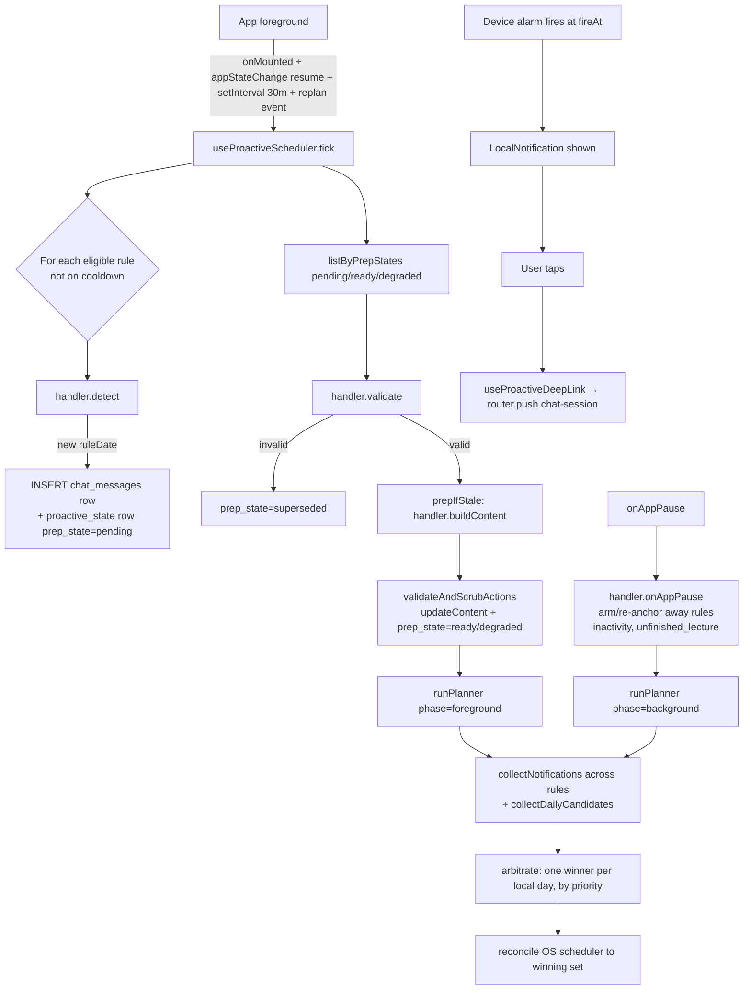

# Proactive Messages

The chat agent ("Sadhu") can initiate conversations on its own — weekly digests, holiday lecture selections, inactivity nudges, unfinished-lecture reminders, a daily wisdom excerpt, and contextual upsells — without a server-side cron or remote push. Scheduling, content preparation, and delivery all happen on the device during foreground and pause transitions; the backend is only called to generate the body of the one LLM-driven rule (`holiday`). There is no daemon, no FCM/APNs, and no synchronized listening-history mirror.

A mobile-side scheduler (`useProactiveScheduler`) ticks on every foreground session, runs a registry of rules, persists agent-initiated rows into a sidecar table next to `chat_messages`, and feeds a single OS-notification arbiter (`notificationPlanner`) that keeps at most one Capacitor `LocalNotification` per local day across every push source. The holiday calendar and per-rule config overrides ride along in the published `config.json` and are managed through the `catalog.proactive.*` MCP tools.

## Rule kinds

`ProactiveRuleId` (`modules/libs/domain/config.ts`) is the closed set of rules. Each kind has a handler module under `modules/apps/mobile/lectorium/proactive/rules/`; the one backend-driven kind (`holiday`) additionally has a prompt builder under `modules/services/chat/app/src/lectorium_chat/agent/proactive_prompts/` (only `holiday.md`, `weekly_digest.md`, and `inactivity.md` exist there, but only `holiday` is wired to the backend today).

| Rule | Source of `ruleDate` | `notify` | Backend | Session strategy |
|---|---|---|---|---|
| `holiday` | `config.proactive.calendars.holidays[*].date` | yes (08:00 local of the holiday) | yes — `buildContent` calls `proactiveChat.run` (LLM curates lectures) | `new_session`, title = holiday name |
| `weekly_digest` | computed (next-Sunday boundary) | yes (Sunday 09:00 local) | no — `buildContent` emits a deterministic `[digest:from-to]` marker rendered by `WeeklyDigestCard.vue` | `new_session`, title = localized `proactiveSessionTitleWeeklyDigest` |
| `inactivity` | constant `"ladder"` (single reused row) | row `notify=false`; the planner derives the 3/7/14/30/60-day ladder via `collectNotifications` | no — static i18n welcome body | `new_session`, reused across absences via `repo.rearm` |
| `unfinished_lecture` | abandoned track id | yes (~24 h after the user left the lecture, fired in background) | no — local i18n + catalog title + `queue_next_track` action | `new_session` |
| `enable_notifications_hint` | now (condition first holds) | no | no (local i18n template) | `new_session` |
| `smart_library_hint` | now | no | no (local i18n template) | `new_session` |
| `next_shloka` | next track id (after finishing a series track) | no | no (catalog lookup, local template + `queue_next_track` action) | `new_session` |
| `daily_wisdom` | `wisdom.id` (one row shown at most once) | no (`visibleAt: null`, silent — the daily reminder push provides the nudge) | no — picks a **random** `daily_wisdom` fragment from the whole corpus **in one of the user's library languages** (not topic-scoped), emits a `[cite:track@start-end|text]` marker + pre-seeded `cites` snippet | `new_session`, title = localized `proactiveSessionTitleDailyWisdom` |

Rules are bootstrapped by side-effect imports in `proactive/rules/index.ts`; each module calls `registerRule()` from `proactive/registry.ts` at load time. `useProactiveScheduler` imports `rules/index.js` once so the registry is populated before the first tick.

`inactivity` and `unfinished_lecture` are **away-only** rules: their `detect` returns `[]` (a foreground tick always sees a present user) and they arm themselves from `onAppPause` instead.

## Design overview



Two distinct moments:

1. **Prep** — during a tick, the handler's `buildContent` generates the body markdown ahead of time and the scheduler writes it onto the `chat_messages` row (via the sidecar repository). The row is hidden until `visibleAt`.
2. **Delivery** — once `visibleAt <= now`, the row passes the render filter and appears in chat. For `notify=true` rows the notification planner arms a Capacitor `LocalNotification` so it fires from the device alarm independently of the app being open.

`visibleAt` is a **single unified unix-seconds moment**: the row becomes visible in chat at that instant; for `notify=true` rows it is also the base the planner derives the push fire time(s) from. `null` means real-time / no gate (silent attach-to-current-session hints).

## Schema

There are **no new columns on `chat_messages`**. All proactive bookkeeping lives in a 1:1 sidecar table created by migration `008_chat_messages_proactive_state` (`modules/apps/mobile/infra/persistence/migrations/user/008_chat_messages_proactive_state.ts`). Regular user/assistant rows have no sidecar entry, so the render query LEFT-joins.

```sql
CREATE TABLE IF NOT EXISTS chat_messages_proactive_state (
  chat_message_id  TEXT    PRIMARY KEY,
  rule_kind        TEXT    NOT NULL,
  rule_date        TEXT    NOT NULL,         -- 'YYYY-MM-DD' dedup key
  prep_state       TEXT    NOT NULL,         -- pending | ready | degraded | dismissed | superseded
  prepared_at      INTEGER,                  -- unix sec content was prepped
  visible_at       INTEGER,                  -- unix sec; unified visible + push moment (NULL = real-time)
  notify           INTEGER NOT NULL DEFAULT 0,  -- 0/1: register a LocalNotification at visible_at
  seen_at          INTEGER,                  -- unix sec the user first opened the session (NULL = unseen)
  UNIQUE(rule_kind, rule_date),
  FOREIGN KEY (chat_message_id) REFERENCES chat_messages(id) ON DELETE CASCADE
);

CREATE INDEX IF NOT EXISTS idx_proactive_state_prep_state ON chat_messages_proactive_state(prep_state);
CREATE INDEX IF NOT EXISTS idx_proactive_state_seen_at    ON chat_messages_proactive_state(seen_at);
CREATE INDEX IF NOT EXISTS idx_proactive_state_visible_at ON chat_messages_proactive_state(visible_at);
```

`UNIQUE(rule_kind, rule_date)` is the idempotency key — "one Sunday digest", "one Janmashtami digest". Detectors INSERT blindly and rely on the constraint; `repo.create` returns `null` on the dedup collision so the scheduler can roll back the orphan `chat_sessions` row it just minted.

`prep_state` values (`ProactivePrepState` in `modules/libs/domain/ports/proactiveStateRepository.ts`):

- `pending` — row exists, body not generated yet.
- `ready` — body is fresh and displayable.
- `degraded` — body came from a fallback (backend unreachable, marker validation stripped something). Still visible; retried next tick.
- `dismissed` — user closed the card / notification without engaging. Cooldown treats this like a successful firing.
- `superseded` — the rule's condition lapsed before visibility (permission granted, subscribed, returned from inactivity). Hidden.

The cascading FK means deleting a chat row removes its sidecar; the daily GC sweep (`sweepTerminal`) deletes terminal-state sidecar rows older than 90 days, and the cascade cleans the underlying messages.

## The repository port

`IProactiveStateRepository` (`modules/libs/domain/ports/proactiveStateRepository.ts`, SQL impl `modules/apps/mobile/infra/repositories/sql/proactiveStateRepository.sql.ts`) is the persistence boundary the scheduler drives:

- `create(input)` — atomically insert both the visible `chat_messages` row and the sidecar; returns `null` if `(ruleKind, ruleDate)` already exists.
- `attach(...)` — record a proactive firing against a `chat_message` produced by the **regular** chat flow (used when the LLM emits an inline `[action:enable_daily_reminder|...]` during a normal turn, so the scheduler's cooldown sees it).
- `listByPrepStates(states)` — sidecar rows in the given states, joined with the chat columns.
- `listUnseenSessionIds()` / `markSeen(sessionId, atSec)` — drive the per-session dot and the tab-level Sadhu badge; opening a session clears every row in it.
- `findByRuleAndDate` / `listRecentByRule` — dedup and cooldown lookups.
- `updatePrepState` / `updateContent` — state transitions and body writes.
- `rearm(chatMessageId, visibleAtSec)` — move a reused row's visibility moment forward and clear `seen_at` so it goes dormant + re-lights the badge. The `inactivity` ladder keeps ONE row and re-anchors it to the user's latest background on every `onAppPause`, instead of minting a new row/session per absence.
- `sweepTerminal(olderThanUnixSec)` — daily GC.

## Lifecycle

`useProactiveScheduler` (`modules/apps/mobile/lectorium/composables/useProactiveScheduler.ts`) is mounted once in `App.vue`. Ticks fire on:

- `onMounted`
- `setInterval` every 30 minutes (`TICK_INTERVAL_MS`) while the app is open
- `appStateChange` with `state.isActive` (resume)
- the `replan` event on the proactive bus (e.g. Settings flips the daily-reminder toggle), so the daily push is (un)armed promptly instead of waiting up to 30 minutes

Because `App.vue` mounts the composable before Welcome finishes opening the user/content DB, the first ticks may find no repository; the scheduler fast-retries every 5s up to 60 times rather than waiting a full 30-minute interval. A `tickInFlight` guard serializes overlapping ticks (mount + resume + interval can all fire within milliseconds on cold start), and a per-`(ruleKind, ruleDate)` `inFlight` mutex prevents double `buildContent` calls.

Each `tickInner`:

1. **Master kill switch** — reads `config.proactive.master_enabled`; `=== false` aborts the whole subsystem.
2. **Gather context** — `gatherContext()` snapshots `ProactiveContext`: now/local date+time, timezone, locale, notifications permission, subscription state, and a listening-activity overview (`getActivityOverview`, `ACTIVITY_WINDOW_DAYS = 224`) yielding `totalListenedSeconds`, `currentStreak`, `completedTracks`. It stamps `proactive.firstSeenAtMs` on first run for `days_since_install_at_least`. The context also carries the resolved `repos` bundle and the `proactiveChat` port so handlers stay framework-free.
3. **Resolve rules** — `resolveRules()` layers `config.json` overrides on bundled defaults and drops `enabled: false` rules and any rule without a registered handler.
4. **Detect** — for each eligible (`isEligible`) rule not on cooldown, call `handler.detect(ctx)`. For each new `ruleDate`, mint a session via `resolveSessionId`, then `repo.create` a hidden `chat_messages` row (empty body) plus a `pending` sidecar row. Emits `row-created` on the proactive event bus.
5. **Re-validate + prep** — for every `pending|ready|degraded` row, `handler.validate`; if invalid → `superseded` (no notification to cancel here — the planner owns OS pushes and simply won't re-emit a candidate for a superseded row). Otherwise `prepIfStale` (stale = `preparedAt` older than `refresh_if_older_than_hours`) runs `buildContent`, scrubs action markers, writes content, touches the session's `updated_at`, flips to `ready`/`degraded`, and emits `row-prepped`.
6. **Plan notifications** — `runPlanner(ctx, rules, "foreground")` runs after prep so freshly-built bodies feed their notification preview. See [Notification planner](#notification-planner).

### onAppPause

On `appStateChange` with `!state.isActive`, `onPause()` calls `handler.onAppPause(ctx)` for any rule that defines it (`inactivity`, `unfinished_lecture`) — away-only arming/re-anchoring that prepares the future push before the user is gone — then runs `runPlanner(ctx, rules, "background")` so those away-only candidates get armed for the OS while the app is closed.

### Cooldowns and dismiss

`isOnCooldown` (delegating to the pure `isWithinCooldown` in `proactive/cooldown.ts`) blocks a new instance until `cooldown_hours` pass since the most recent non-`pending`/non-`superseded` instance. `dismissed` counts the same as `ready` for cooldown, except a rule with `dismiss_resets_after_hours` set uses that shorter window for dismissed rows — letting soft upsells return sooner.

## Notification planner

Every engagement local-notification — proactive cards AND the Settings daily reminder — flows through one arbiter, `proactive/notificationPlanner.ts`. Sources don't schedule OS pushes themselves; each rule's `collectNotifications(entry, ctx, phase)` returns flat `NotificationCandidate`s, and the planner keeps at most ONE per local calendar day so an inactive user with the daily reminder on can't collect a stack of pushes in a single day.

`runPlanner` (in `useProactiveScheduler`) on each tick:

1. Reads every `ready`/`degraded` row (`listByPrepStates(["ready","degraded"])`) and calls each rule's `collectNotifications`. Proactive (session-backed) candidates leave `title` empty; the planner resolves the chat session's title (holiday name, "Weekly progress", …) — falling back to the app name — before arbitration.
2. Appends the rolling daily-reminder candidates from `collectDailyCandidates` (one per local day for the next `DAILY_HORIZON_DAYS = 14`, at the Settings `notificationsTime`), reading the `settings.notificationsEnabled` / `settings.notificationsTime` config keys.
3. `arbitrate(candidates, nowMs)` — drops past candidates, buckets by local calendar day, keeps the single highest-`priority` per day (tie-break: earliest `fireAtMs`, then `kind` ascending).
4. `reconcile(winners, notifications, plannerManaged)` — (re)schedules each winner whose signature (`fireAtMs|title|body`) changed and cancels every previously-managed id no longer desired. `plannerManaged` (a `Map<id, signature>`) makes re-running on every tick cheap — unchanged pushes aren't re-armed or re-logged.

`phase` is `"foreground"` on a tick (user present → away-only rules like `inactivity` return `[]`, so the planner cancels their armed alarms) and `"background"` from `onAppPause`. Priorities (`NOTIFICATION_PRIORITY`): `holiday` 50, `unfinished_lecture` 40, `inactivity` 30, `weekly_digest` 20, `daily` 10.

Notification ids are stable djb2 hashes (`notificationIdFor` in `proactive/hash.ts`) — of the `chat_message_id` for single-shot rules, or of `chat_message_id#inactivity-<day>` per ladder stage, or `daily#<iso-date>` per daily occurrence. On the first planner run, `migrateLegacyDailyAlarm` cancels the old recurring daily alarm (id `9001`) once so the new per-date rolling ids don't double-fire.

## Badge and chat-store sync

- `useProactiveInboxBadge` reads `listUnseenSessionIds()` to light the per-session dot in chat history and the tab-level Sadhu badge.
- `useChatStoreProactiveSync` listens on the proactive event bus (`tick-ready`, `row-created`, `row-prepped`) and refreshes the chat store's sessions list so new/updated proactive rows surface without a tab switch. The scheduler stays decoupled — it emits events via `proactive/events.ts` and never imports a UI store.

## Configuration model

### Code owns (`proactive/registry.ts`)

`BUNDLED_DEFAULTS` ships a full `ProactiveRuleConfig` for every rule, so the subsystem works with no remote config. Each rule's handler module owns its `detect` / `validate` / `buildContent` (and optional `onAppPause`).

### `config.json` owns

The published `config.json` (delivered via the existing `catalog.publish` flow) carries an optional `proactive` block that **overrides** bundled defaults by rule `id`. The mobile side replaces the entire bundled entry with the remote one, so an override must carry the full object — partial patches drop omitted fields.

```ts
// modules/libs/domain/config.ts
export interface RemoteAppConfig {
  readonly databases: readonly RemoteDbEntry[]
  readonly proactive?: ProactiveConfig
}

export interface ProactiveConfig {
  readonly master_enabled?: boolean
  readonly rules: readonly ProactiveRuleConfig[]
  readonly calendars: ProactiveCalendars
}

export interface ProactiveCalendars {
  readonly holidays: readonly HolidayEntry[]
}

export interface ProactiveRuleConfig {
  readonly id: ProactiveRuleId
  readonly enabled: boolean
  readonly mode: "pre_baked" | "lazy"
  readonly prep_window_hours: number
  readonly refresh_if_older_than_hours: number
  readonly session_strategy: "new_session" | "append_current" | "system_session"
  readonly session_title_template?: string
  readonly cooldown_hours: number
  readonly dismiss_resets_after_hours?: number
  readonly eligibility?: readonly EligibilityPredicate[]   // AND across the array
}

export type EligibilityPredicate =
  | { readonly predicate: "total_listened_seconds_at_least"; readonly value: number }
  | { readonly predicate: "current_streak_at_least"; readonly value: number }
  | { readonly predicate: "completed_tracks_at_least"; readonly value: number }
  | { readonly predicate: "has_notifications_permission"; readonly value: boolean }
  | { readonly predicate: "is_subscribed"; readonly value: boolean }
  | { readonly predicate: "days_since_install_at_least"; readonly value: number }

export interface HolidayEntry {
  readonly id: string
  readonly name: Record<string, string>    // { en: "...", ru: "..." }
  readonly date: string                    // 'YYYY-MM-DD'
}
```

`session_strategy: "system_session"` routes a rule into a single stable `sadhu-system` session (created lazily); `"append_current"` reuses the most recent session; `"new_session"` mints a fresh one titled from `session_title_template` or the detector's `sessionTitleOverride`. See `proactive/sessions.ts`.

### Calendar source-of-truth: `proactive.json`

The holiday calendar, per-rule overrides, and master switch are authored in a standalone `artifacts/catalog/proactive.json` (owned by `modules/tools/lectorium-mcp/internal/application/catalog/proactive/usecase.go`) and inlined into the published `config.json` `proactive` block at `catalog.publish` time. The mobile app reads it straight from `config.json` (`publicRemoteConfigPath = "public/config.json"`).

`proactive.json` is managed entirely through MCP tools (`modules/tools/lectorium-mcp/internal/mcp/tools/proactive.go`):

- `catalog.proactive.get` — read the file (rules + holidays + master switch).
- `catalog.proactive.master_set` — flip `master_enabled`.
- `catalog.proactive.holiday_add` / `.holiday_remove` / `.holiday_list` — manage `calendars.holidays[]`.
- `catalog.proactive.rule_set` / `.rule_remove` / `.rule_list` — manage per-rule overrides (full object required on `rule_set`).

## Action cards

Backend- and locally-built bodies can emit inline `[action:<kind>|id=<id>]` markers. The `ChatActionPayload` discriminated union (`modules/libs/domain/chatMessage.ts`) and the components under `views/Chat/components/` cover:

| Marker kind | Component |
|---|---|
| `share_pdf` | `ActionCardSharePdf.vue` |
| `enable_daily_reminder` | `ActionCardEnableReminder.vue` |
| `configure_smart_library` | `ActionCardConfigureSmartLibrary.vue` |
| `upgrade_to_pro` | `ActionCardUpgradeToPro.vue` |
| `queue_next_track` | `ActionCardQueueNextTrack.vue` |

`ChatTokenRenderer.vue` dispatches on `token.kind === 'action'` + `token.actionKind` to render the matching card (cards share `ActionCardShell.vue`); each card runs its own `pending → executing → done/error` state machine. The `weekly_digest` rule is rendered separately: its body is a `[digest:from-to]` marker that parses to a `token.kind === 'digest'` and renders `WeeklyDigestCard.vue`, which loads the recap for that 7-day window itself. At prep time the scheduler runs `validateAndScrubActions` (`proactive/markerValidator.ts`) over the builder output: it narrows untyped LLM payloads to the union and strips markers referencing non-existent track ids, marking the row `degraded` when it has to drop something.

## Notification deep-linking

When a `LocalNotification` is scheduled for a proactive message, its `extra` payload carries `{ chatSessionId, chatMessageId }`. `useProactiveDeepLink` (`modules/apps/mobile/lectorium/composables/useProactiveDeepLink.ts`), mounted once in `App.vue`, listens for `localNotificationActionPerformed` and routes via `router.push({ name: "chat-session", params: { sessionId } })`.

This works from cold start (launched by tapping the notification) and from foreground taps — Capacitor delivers a queued action event after init. Notifications without `chatSessionId` in `extra` (the legacy daily reminder) are ignored, so the two surfaces coexist.

## Backend integration

There is **no new endpoint** for proactive messages. The existing `POST /chat` request body carries an optional `proactive` object with `rule_kind` and `rule_context` (`modules/services/chat/app/src/lectorium_chat/api/chat.py`). When present, the service runs `run_proactive_turn` (`application/proactive_turn.py`) instead of `run_chat_turn`: it swaps in a rule-specific system prompt and a synthesized user message via `agent/proactive_prompts/` (`build_system_prompt` / `build_synthetic_user_message`), then runs the **same** LLM loop with the **same** tool registry. The response is the same SSE token stream; the client collects it into a single `chat_messages.content` body rather than rendering it live.

On the mobile side this is reached through the `IProactiveChatService` port (`modules/libs/contracts/chat/proactiveChat.ts`, imported as `@lib/contracts`; HTTP impl `modules/apps/mobile/infra/chat/http/httpProactiveChatService.ts`). Only `holiday`'s `buildContent` calls `proactiveChat.run`; every other rule builds its body locally (deterministic markers or i18n templates) and never touches the network. (`weekly_digest.md` and `inactivity.md` still ship in `proactive_prompts/`, but those rules no longer hit the backend.)

This keeps a single endpoint, auth, rate-limit, and tool surface. Prompts live in code (Python builders) and update per release.

## Edge cases

- **Condition lapses between prep and visibility** — every tick re-validates `pending`/`ready`/`degraded` rows; lapsed conditions go `superseded`, drop out of `listByPrepStates(["ready","degraded"])`, and the next `runPlanner` pass cancels their alarm by absence from the winning set.
- **Permission denied** — proactive messages still arrive in chat; only the `LocalNotification` step is skipped. The badge still works.
- **Locale change** — content is regenerated on the next refresh window; until then it shows in the locale it was prepared in.
- **Reinstall** — the sidecar and chat tables are device-local; reinstall starts clean. iOS `LocalNotifications` do not survive a full reinstall.
- **Backend unreachable during prep** — `buildContent` throwing leaves the row `degraded`; the next tick retries.
- **Re-entrant prep** — `tickInFlight` serializes ticks; the `(ruleKind, ruleDate)` `inFlight` mutex guards against double LLM/template builds and double writes; `repo.create` deduping on the UNIQUE constraint rolls back the orphan session.
- **Malformed action markers** — `validateAndScrubActions` strips markers whose track ids don't exist, keeps the rest of the body, and sets `prep_state='degraded'`.
- **Multiple devices** — each device runs its own scheduler; the same proactive message can appear on both. Not deduped.
- **Garbage collection** — `sweepTerminal` runs once per cold start, deleting `dismissed`/`superseded` rows (and their cascaded chat rows) older than 90 days (`PROACTIVE_GC_RETENTION_DAYS`).
- **Master kill switch** — `config.proactive.master_enabled === false` disables the entire subsystem (and `onAppPause`) without an app release.

## Privacy

The chat backend already receives recent tracks and current playback as part of `/chat` requests. Only one proactive rule reaches the backend:

- `holiday` sends only the holiday id, localized name, date, and days-until (no user data) as `rule_context`.
- Every other rule (`weekly_digest`, `inactivity`, `unfinished_lecture`, `enable_notifications_hint`, `smart_library_hint`, `next_shloka`, `daily_wisdom`) builds its body on-device and does not touch the network — `weekly_digest`'s listening aggregate is computed locally inside `WeeklyDigestCard.vue` and never leaves the device, and `daily_wisdom` reads its excerpt straight from the bundled `daily_wisdom` catalog table.

## Code layout

```
modules/libs/domain/
  config.ts                       (ProactiveRuleId, ProactiveConfig, ProactiveRuleConfig,
                                   EligibilityPredicate, HolidayEntry, master_enabled)
  chatMessage.ts                  (ChatActionPayload union: share_pdf, enable_daily_reminder,
                                   configure_smart_library, upgrade_to_pro, queue_next_track)
  ports/proactiveStateRepository.ts  (IProactiveStateRepository, ProactiveStateEntry, prep states, rearm)
  ports/dailyWisdomRepository.ts     (IDailyWisdomRepository: topicsWithWisdom/byTopic/byId)

modules/libs/contracts/chat/
  proactiveChat.ts                (IProactiveChatService port, imported as @lib/contracts)

modules/apps/mobile/lectorium/
  composables/
    useProactiveScheduler.ts      ← tick loop + runPlanner, mounted in App.vue
    useProactiveInboxBadge.ts     ← unseen count for the Sadhu badge
    useProactiveDeepLink.ts       ← localNotificationActionPerformed → chat-session route
    useChatStoreProactiveSync.ts  ← refreshes chat store on proactive events
  proactive/
    types.ts                      ← ProactiveContext, DetectResult, ProactiveRuleHandler, collectNotifications
    registry.ts                   ← BUNDLED_DEFAULTS + registerRule/resolveRules
    eligibility.ts                ← predicate evaluator (isEligible)
    cooldown.ts                   ← isWithinCooldown (pure)
    sessions.ts                   ← resolveSessionId per session_strategy
    events.ts                     ← in-process event bus (tick-ready/row-created/row-prepped/replan)
    hash.ts                       ← notificationIdFor (djb2)
    markerValidator.ts            ← validateAndScrubActions
    notificationPlanner.ts        ← arbitrate/reconcile/collectDailyCandidates, NOTIFICATION_PRIORITY
    notificationPreview.ts        ← toNotificationPreview (body_md → push body)
    notificationTiming.ts         ← shared fire-time helpers
    rules/
      index.ts                    ← side-effect imports register all handlers
      holiday.ts                  ← backend rule (proactiveChat.run)
      weeklyDigest.ts             ← local [digest:from-to] marker
      inactivity.ts               ← away-only ladder (3/7/14/30/60d) + onAppPause + rearm
      unfinishedLecture.ts        ← away-only, local i18n + queue_next_track + onAppPause
      enableNotificationsHint.ts  ← local i18n template
      smartLibraryHint.ts         ← local i18n template
      nextShloka.ts               ← local template + catalog lookup + queue_next_track
      dailyWisdom.ts              ← samples a daily_wisdom fragment by interest topic, silent cite card
  views/Chat/components/
    ActionCardShell.vue           ← shared card chrome
    ActionCardSharePdf.vue
    ActionCardEnableReminder.vue
    ActionCardConfigureSmartLibrary.vue
    ActionCardUpgradeToPro.vue
    ActionCardQueueNextTrack.vue
    WeeklyDigestCard.vue          ← renders the [digest:from-to] token
    ChatTokenRenderer.vue         ← dispatches on token.kind / token.actionKind

modules/apps/mobile/infra/
  persistence/migrations/user/008_chat_messages_proactive_state.ts
  repositories/sql/proactiveStateRepository.sql.ts
  repositories/sql/dailyWisdomRepository.sql.ts  ← daily_wisdom corpus reads (topicsWithWisdom/byTopic/byId)
  chat/http/httpProactiveChatService.ts

modules/services/chat/app/src/lectorium_chat/
  api/chat.py                     ← recognizes the `proactive` request body
  application/proactive_turn.py   ← run_proactive_turn
  agent/proactive_prompts/        ← build_system_prompt / build_synthetic_user_message
                                     (holiday.md / weekly_digest.md / inactivity.md)

modules/tools/lectorium-mcp/internal/
  application/catalog/proactive/usecase.go  ← proactive.json owner
  mcp/tools/proactive.go                    ← catalog.proactive.* tools
```
