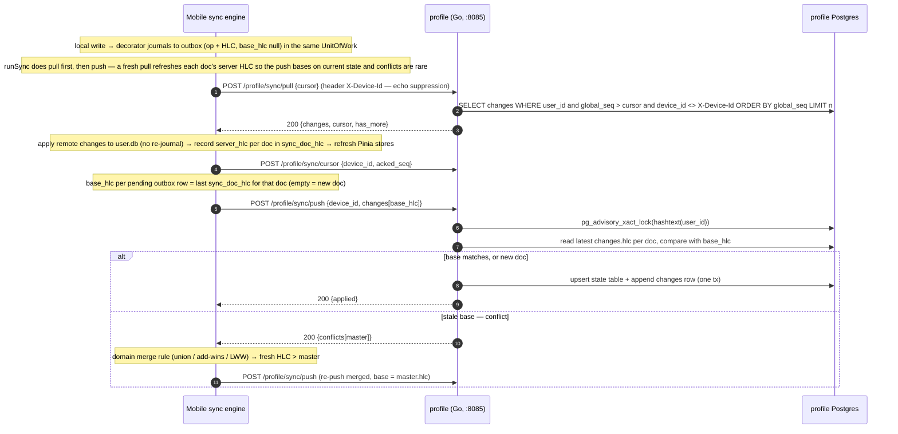
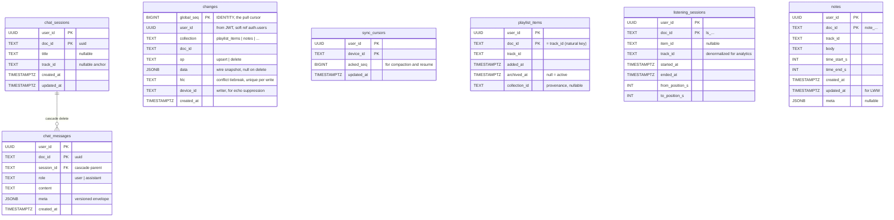
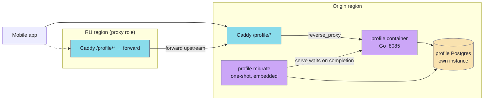

# Profile sync

`profile` is a planned Go service that syncs a user's own application data — their library, listening history, notes, and chat — across all the devices signed into the same account, and keeps a server-side copy as a backup. Today user data lives only in the on-device `user.db` (Capacitor SQLite) and never leaves the phone; there is no server-side copy and no cross-device continuity. This page is the design of record: a small delta-sync protocol (pull-since-checkpoint / push-changes) over the existing REST + JWT stack, a change-log as the source of truth with typed state tables as an analytics-friendly projection, per-data-type merge rules, and a dedicated Postgres. It keys everything on `auth.users.id`, and **runs only for signed-in accounts** — an anonymous user's data stays on the device until they sign in through a real account, at which point that stable id carries it to the server. The service owns no business rules about the *content* of the data — it is a thin, generic sync substrate; all merge logic runs on the client.

> **Status: design, not yet built.** No `profile` service or schema exists in the tree yet. This page describes the final intended design in present tense (house style); treat it as the spec the implementation lanes build against.

## What is synced

Only user-*generated* / user-*state* data from `user.db` — never the read-only content catalog (that is a separate one-way CDN pull). Each synced table maps to one **collection**; the collection name equals the local `user.db` table name.

| Collection | Source table | Volume | Merge semantics |
|---|---|---|---|
| `playlist_items` | library (added tracks) | dozens–hundreds | add-wins set, keyed by `track_id` |
| `listening_sessions` | playback history + progress | thousands | grow-only union (closed sessions only) |
| `notes` | timecoded notes | dozens | last-write-wins (LWW) |
| `chat_sessions` | chat conversations | tens | LWW on title, union on create |
| `chat_messages` | chat history | hundreds–thousands | append-only union, LWW on finalize |

**Not synced:** `media_items` (offline-download cache — device-local, points at a local file path); the read-only content DB; the *chat-sync toggle* itself and other device-local preferences. User settings (`onboarding.topics`, `search.filters`, playback prefs) are a **later phase** with an explicit key whitelist — region choice, dev flags, and auth tokens are device-local and must never sync.

**Only signed-in accounts sync at all.** An anonymous user's data lives only on their device; the sync engine stays off until they sign in through a real account (Google / Apple / email). The server enforces this too — it rejects a token whose `anonymous` claim is true on the sync endpoints.

## Sync model — change-log is the source of truth

The server stores two things per user: a single append-only **change log** (`profile.changes`) that is the authority for both sync and conflict detection, and a set of **typed state tables** that are a clean projection of the latest state for reads and analytics.

- A local write funnels through the SQLite repository layer, which (via a decorator) journals the change into a local outbox and stamps it with an HLC — atomically, in the same transaction as the domain write.
- **Push** sends outbox rows to the server. The server writes the row into its state table *and* appends a `changes` row, in one transaction.
- **Pull** reads `changes` since the client's cursor. The cursor is a single monotonic integer (`global_seq`) — the client always pulls *all* collections, so one cursor is correct and ordering is total.
- `changes.data` carries the row in the **client-native wire shape** (the exact `user.db` row); pull ships it back untouched. The typed state tables are derived from it (converted to real columns/timestamps) — the wire→state conversion lives only in the push handler, so pull never touches the state tables.
- **First sync is free:** a brand-new device pulls from cursor 0 over the compacted log, which preserves the latest change per document — i.e. the full current state. There is no separate snapshot endpoint.

A separate `profile.sync_cursors` table records the highest `global_seq` each device has acknowledged; it drives resume and log compaction.

### Hybrid Logical Clock (HLC)

Every change is stamped with an HLC — `<physical_ms>:<counter>:<device_id>` — so two devices deterministically and identically pick a winner on conflict without trusting phone wall-clocks. The `counter` bumps when the clock does not advance (or goes backwards); `device_id` is the final tiebreak so both sides converge on the same winner. HLCs compare lexicographically on `(physical, counter, device_id)`. HLC is the conflict tiebreak for LWW collections and, because `(counter, device_id)` makes each write unique, the idempotency key for retried pushes.

### Merge rules (run on the client, in the domain layer)

Conflicts are rare because the data types are chosen to avoid them; when they happen the server rejects the stale write and the client re-merges:

- **`listening_sessions` — grow-only union.** A session is immutable once *closed* (its in-memory tracker calls `finish`/`finishAt`); only closed sessions sync, so two devices never write the same row. Set-union by id, no conflict possible.
- **`playlist_items` — add-wins, keyed by `track_id`.** The sync `doc_id` is the natural key `track_id` (not the local surrogate `pl_…`), so adding the same track on two devices collapses to one document. In the library iff `max(added_at) ≥ max(archived_at)`; a stale device can neither resurrect nor wrongly delete.
- **`notes` — LWW** by HLC (short single-author text, no field-level merge needed).
- **`chat_*` — union + LWW** (see [Chat sync](#chat-sync)).

## API

Three POST endpoints under `/profile/`, all authenticated by the shared RS256 JWT (`sub` = user id). `user_id` is taken **only** from the token — the client-supplied body never carries it. The server **rejects a token whose `anonymous` claim is true (403)** — only signed-in accounts sync — and the client does not run the engine while anonymous. Endpoints are POST-only (the edge CORS allowlist is `GET, POST, OPTIONS`); push and pull are both size-bounded and paginated, because the edge caps the request body.

- `POST /profile/sync/push` — send local changes. Server applies each row if its `base_hlc` matches the current master (or the doc is new); otherwise returns it under `conflicts` with the master row for the client to re-merge.
- `POST /profile/sync/pull` — receive changes since `cursor`, ordered by `global_seq`, excluding the caller's own device (echo suppression), paginated via `has_more`.
- `POST /profile/sync/cursor` — acknowledge the highest applied `global_seq` (drives compaction).

Plus ops endpoints `GET /healthz` and `GET /readyz` (the latter gates traffic until migrations are current), and one **internal** endpoint `POST /internal/purge {user_id}` reachable only container-to-container (not routed by the public edge), which `cleanup-worker` calls to wipe a deleted user's data (see [Deletion](#deletion--the-service-erases-its-own-data)). The server clamps `pull.limit` to a hard maximum, so a client cannot demand an unbounded page.

### Wire contract

Hand-authored, mirrored on both sides per project convention: Go structs in the service handler, TypeScript `*Wire` types in `@lib/contracts/sync/`. `data` is an opaque JSON blob to the transport.

```go
// snake_case JSON on the wire
type Change struct {
    ServerSeq  int64           `json:"server_seq,omitempty"` // pull only
    Collection string          `json:"collection"`
    DocID      string          `json:"doc_id"`
    Op         string          `json:"op"`               // "upsert" | "delete"
    Data       json.RawMessage `json:"data,omitempty"`   // null on delete
    HLC        string          `json:"hlc"`
}

type PullRequest  struct { Cursor int64 `json:"cursor"`; Limit int `json:"limit"` }
type PullResponse struct { Changes []Change `json:"changes"`; Cursor int64 `json:"cursor"`; HasMore bool `json:"has_more"` }

type PushItem struct {
    Collection string          `json:"collection"`
    DocID      string          `json:"doc_id"`
    Op         string          `json:"op"`
    Data       json.RawMessage `json:"data,omitempty"`
    HLC        string          `json:"hlc"`
    BaseHLC    string          `json:"base_hlc,omitempty"` // last-seen server hlc; "" = new doc
}
type PushRequest  struct { DeviceID string `json:"device_id"`; Changes []PushItem `json:"changes"` }
type Ref          struct { Collection string `json:"collection"`; DocID string `json:"doc_id"` }
type Conflict     struct { Collection string `json:"collection"`; DocID string `json:"doc_id"`; Master Change `json:"master"` }
type PushResponse struct { Applied []Ref `json:"applied"`; Conflicts []Conflict `json:"conflicts"` } // no cursor: the pull cursor advances only via pull

type CursorRequest struct { DeviceID string `json:"device_id"`; AckedSeq int64 `json:"acked_seq"` }
```

### Pull / push / merge flow



The wire `PullRequest` body carries only `{cursor, limit}`; the caller's own device id travels in the **`X-Device-Id`** header, which the server uses to exclude the caller's own writes from the returned page.

## Server schema

Own Postgres, schema `profile`. The change log and cursor table are sync infrastructure; the rest are typed projections.



Key DDL details:

```sql
CREATE TABLE profile.changes (
    global_seq bigint GENERATED ALWAYS AS IDENTITY PRIMARY KEY,
    user_id    uuid   NOT NULL,
    collection text   NOT NULL,
    doc_id     text   NOT NULL,
    op         text   NOT NULL CHECK (op IN ('upsert','delete')),
    data       jsonb,
    hlc        text   NOT NULL,
    device_id  text   NOT NULL,
    created_at timestamptz NOT NULL DEFAULT now(),
    UNIQUE (user_id, collection, doc_id, hlc)          -- push idempotency
);
CREATE INDEX changes_pull_idx ON profile.changes (user_id, global_seq);
CREATE INDEX changes_doc_idx  ON profile.changes (user_id, collection, doc_id, global_seq DESC);
```

- **Advisory lock.** Every push transaction takes `pg_advisory_xact_lock(hashtext(user_id))`, serializing one user's writes so `global_seq` is assigned in commit order — without it, a slow transaction could commit a lower seq after a reader advanced its cursor past it, silently dropping the change.
- **Idempotency.** The `UNIQUE (user_id, collection, doc_id, hlc)` constraint makes a retried push a no-op — the HLC is unique per logical write.
- **Composite chat FK.** `chat_messages` references `chat_sessions` by `(user_id, session_id)` → `(user_id, doc_id)` `ON DELETE CASCADE` (the state PKs are composite on `user_id`), so deleting a session removes its messages server-side too, mirroring the client cascade.
- **Compaction.** A background worker deletes `changes` rows below the minimum acknowledged cursor across a user's devices, keeping only the latest row per `doc_id` (so first-sync-from-0 still yields full state). Device cursors not updated within a TTL (e.g. 60 days) are ignored, so an abandoned device cannot hold back GC forever — if it ever returns, it re-syncs from 0 and gets the compacted current state.

**Client-side sync tables** (mobile `user.db`, not on the server) live in migrations `013_sync_outbox` and `014_sync_doc_hlc`:

- `outbox` — append-only journal of local writes (`collection, doc_id, op, data, hlc, base_hlc, sent`); the decorator writes a row in the same UnitOfWork as each data mutation. `base_hlc` is journaled **null** and reconciled at push time.
- `sync_state` — per device: `pull_cursor`, `acked_seq`, `pushed_outbox_id`.
- `sync_doc_hlc` — the last server-known HLC per `(collection, doc_id)`. The engine maintains it (set on pull-apply and on push-applied/conflict) and reads it to fill each pending row's `base_hlc` for optimistic concurrency. A backfilled or never-pulled doc has no entry → `base_hlc = ""` → treated as a new doc.

## Deletion — the service erases its own data

Account deletion erases **all** of a user's synced data, chat included, and **`profile` erases it itself** — it is simply *told* to, over HTTP. It connects to no database but its own and is **not** an outbox consumer; the service knows nothing about the shared `lectorium` schema.

The flow reuses the existing choreography without coupling `profile` to it:

1. The user calls the existing `POST /auth/account/delete`. `auth` deletes the `auth.users` row; an `AFTER DELETE` trigger emits `user.deleted` into `app.outbox` in the same transaction.
2. [`cleanup-worker`](../modules/cleanup-worker.md) — already the sole consumer of `app.outbox` — gains one handler for `user.deleted` that POSTs `profile`'s internal purge endpoint (`profile:8085/internal/purge`, container-to-container, never through the public edge), retrying on failure through its existing infinite-retry outbox loop.
3. `profile` handles `POST /internal/purge {user_id}` by deleting every row for that user in **its own** database — every state table, every `changes` row, its `sync_cursors` — every collection, no exceptions. Idempotent, so a retried purge is a no-op.

So `profile` stays a plain HTTP service with a **single** database connection (its own). `cleanup-worker` learns only `profile`'s URL (config), never its tables — it says "user X is gone", and `profile` cleans itself. This mirrors the existing machine-to-machine convention (`auth`'s `POST /internal/subscription/grant`).

On the device, the existing `dataWipe` path clears the local `user.db` tables and the sync outbox/cursor. Deletion is a full erase, not a tombstone.

## Chat sync

Chat is synced **by default**, with a device-local **"Sync chats"** toggle in the chat settings section (setting key `settings.syncChatsEnabled`, default on, stored in Preferences, itself never synced, read live so a flip gates the next write). It follows the same generic model as two collections, with chat-specific rules:

- **User-initiated only, journaled lazily.** Proactive/scheduler-generated content is written straight to SQL by `proactiveStateRepository` and never reaches the journaling decorator, so proactive sessions and the `chat_messages_proactive_state` sidecar are never synced. A session enters sync **lazily** — only when its first user-initiated message is journaled, at which point the session row is journaled first (parent-before-child). A session that only ever held proactive content therefore never syncs, and its later delete emits no tombstone.
- **Parent-before-child ordering** is guaranteed by the single `global_seq` cursor: a session's change row precedes its messages, so pull applies the session first (satisfying the `session_id` foreign key). This is a hard reason the client pulls all collections under one cursor rather than per-collection.
- **Tombstone-per-session cascade.** Deleting a session emits one `delete` change for the session; each receiving device's own foreign-key cascade removes the messages. No per-message tombstones.
- **Orphan-drop.** A message that arrives for an already-tombstoned session is dropped, never resurrecting the session.
- **Completed messages only.** An in-flight (streaming) assistant message is mutable and is not synced until its turn completes — the same "closed only" rule as listening sessions.
- **Versioned `meta`.** The message `meta` is a `{_v, data}` envelope; a receiving device must tolerate another device's `_v` (forward/backward compatibility).

Chat is personal data, so enabling server-side chat sync is also what drives the **Privacy Policy / Terms** update (disclosing server-side storage, retention, and deletion of library, history, notes, and chat).

## Web client (read-only chat)

`profile` has two clients: the **mobile app** (full read-write sync of every collection into `user.db`) and the **web app** — the static Astro "Shruti" site, whose "Ask Sadhu" chat should show the signed-in user the chat sessions they started on mobile.

The web app is a **pure static build** (no SSR, no server runtime), so its sync client lives entirely in the client-side Vue island — exactly like the existing `useChatStream` / `useWebAuth` / `useChatHistory` composables. It already has everything needed to authenticate: `useWebAuth.ensureToken()` returns a valid Bearer (bootstrapping an anonymous device identity if needed, with Google/Apple/email-OTP upgrade in place), a per-browser device id in `localStorage`, and it already reuses the monorepo libs (`servers.ts`, `@lib/ui/chat/*`, `libs/contracts/*`) through the Astro source alias.

Scope for v1 is **read-only chat**: a `useProfileSync` composable pulls the signed-in user's `chat_sessions` / `chat_messages` from `profile` and renders them through the existing chat components; the current `localStorage` history (`useChatHistory`) serves as the local cache. **Write-back is deferred** — an anonymous web visitor has a per-browser identity, so pushing web-created sessions would fragment identity across devices; once the [account-merge](#account-merge-on-sign-in) story is settled, web can push the sessions a *signed-in* user creates. The web client needs no new token: it already holds the `aud="chat"` access token that `profile` accepts (see below), a `profileBaseUrl` in `servers.ts`, and the shared `libs/contracts/sync` wire types. As a read-only client it need not register a sync cursor, so it never holds back log compaction.

## Account merge on sign-in

Sync is off while a user is anonymous; it **activates at sign-in**, when the device runs its first full sync — pull the account's existing server state, merge the data accumulated locally while anonymous by the per-collection rules, and push. Two paths reach a signed-in id:

- **Upgrade in place** (anonymous → Google/Apple/email on the same device): the `user_id` is unchanged, so the device just starts syncing and pushes its local data for the first time under that id.
- **Cross-link** (two devices each anonymous, then both sign into the *same* account): they collapse to one server `user_id`; a device whose local `user_id` changed should reset its cursor and run the first full sync under the new id.

**First-sync backfill.** Rows created before journaling existed (or while anonymous) have no `outbox` entry and no `sync_doc_hlc`, so they would never upload. On the anonymous→signed-in edge the engine runs `backfillLocal`: it enumerates such rows in `notes` / `playlist_items` / `listening_sessions` (anti-join on `outbox` + `sync_doc_hlc`) and enqueues each as an `upsert` with `base_hlc = ""`, reusing the decorator's exact wire snapshot so a backfilled row is byte-identical to a journaled one. It is idempotent (the anti-join drops enqueued rows) and runs once per account, guarded by a device-local marker `sync.backfilled.<userId>`. Because the merge rules are union / add-wins, data from both devices combines with nothing lost.

**As-built gaps to close:** (1) `backfillLocal` covers the three data collections but **not chat** — pre-existing (or toggle-was-off) conversations do not retroactively upload; only new chat activity journals. (2) The **Cross-link** cursor-reset on a changing `user_id` is not yet implemented — the auth layer does not surface "stable id changed vs stayed", so today the new id simply gets its own one-time backfill. Sign-out stops the engine; whether to also wipe local synced data so it does not leak to the next anonymous user is still a product decision.

## Layer map

The feature is placed to respect the ESLint-enforced [layer rules](layers.md) on mobile and the `handler → service → store` split on the Go side. Business rules (HLC, merge) stay in the pure layers; adapters only move bytes and journal changes; the scheduler only triggers use-cases.

**Mobile** (domain module named `sync`, distinct from the backend service `profile`):

| Concern | Layer | Location |
|---|---|---|
| HLC value object, per-type merge functions (`mergeNote`/`mergeListeningSession`/`mergePlaylistItem`/`mergeChat*`) | `@lib/domain` | `libs/domain/sync/` |
| Outbox / sync-state / sync-apply / backfill ports | `@lib/domain/ports` | `ports/{outbox,syncState,syncApply,syncBackfill}Repository.ts` |
| pull→merge→push orchestration, collection routing, backfill | `@usecases` | `usecases/sync/{runSync,pullAndMerge,pushLocal,mergeRouting,backfillLocal}.ts` |
| Wire DTOs (snake_case) **and** the gateway port `ISyncClient` | `@lib/contracts` | `libs/contracts/sync/syncClient.ts` |
| HTTP gateway adapter (maps domain ↔ wire, sends `X-Device-Id`) | `@infra` | `infra/sync/http/syncClient.ts` |
| Outbox / sync-state / sync-apply / backfill SQL repos, write-decorator over the 3 data repos + chat | `@infra` | `infra/repositories/sql/` (decorator at `index.ts`) |
| Scheduler (startup / interval / resume / flush / sign-in) — triggers use-cases only | `lectorium/` | `composables/useSyncEngine.ts`, `services/syncEvents.ts` |
| Post-pull store refresh (event bus) | `lectorium/` | Pinia stores |

The gateway port lives in `@lib/contracts` (named `ISyncClient`), not `@lib/domain/ports`, because the `ports/**` layer may not import `@lib/*` wire types — the same reason chat's stream client port sits there. Pull-apply uses a dedicated `ISyncApplyRepository` that writes local rows **without** re-journaling (so a pull does not echo back into the outbox), separate from the journaling data repos.

**Backend** — new `services/profile` mirroring `services/auth`:

| Layer | Responsibility |
|---|---|
| `handler/` | chi routes `/sync/{pull,push,cursor}` (bearer JWT) + network-only `/internal/purge`, request/response DTOs, collection whitelist |
| `service/` | apply changes, optimistic-concurrency (base_hlc), advisory lock, compaction, purge-user |
| `store/` | pgx repos: `ChangesRepo`, `CursorRepo`, state-table repos; row structs |
| `jwt/` | verify RS256 `kid=v1` (same public key chat uses) |
| `cmd/profile/main.go` | composition root; `serve` and `migrate` subcommands |

## Deployment and routing

`profile` is origin-only, JWT-bearing, and operationally identical to `auth`/`chat` — except it owns its **own Postgres** and carries its **own embedded migrations** (a deliberate departure from the shared `lectorium` DB + central migrator, to isolate small frequent user-data writes from the chat/RAG load).



Deploy checklist:

- **Migrations** ship inside the image; a one-shot `profile migrate` (advisory-locked) runs before `serve`, which refuses traffic until the schema is current. No shared migrator involvement.
- **Postgres** is a dedicated `profile-postgres`, origin-only. RU forwards `/profile/*` upstream and needs no database.
- **Caddy** — the origin role terminates `/profile /profile/*` to `profile:8085` (strip the region header — the service is region-agnostic, keyed on `user_id`; set a generous `request_body max_size` so bounded push batches fit); the proxy role appends `/profile /profile/*` to its forward matcher. Add a dedicated `profile` rate-limit zone and exclude the prefix from the generic zone. Only `/profile/sync/*` is public; `/internal/purge` is never routed by the edge — `cleanup-worker` reaches it directly at `profile:8085`.
- **JWT** — mount the shared `public.pem`. Simplest path: `profile` **accepts the existing `aud="chat"` access token** that both the mobile and web clients already hold, so no auth-service change is needed to ship. Optionally widen the minted `aud` to include `profile` later for cleaner audience semantics.
- **cleanup-worker** — its existing `user.deleted` handler POSTs `${PROFILE_INTERNAL_URL}/internal/purge {user_id}` (new env var, e.g. `http://profile:8085`), reusing its retry loop — so `profile` needs **no** connection to the shared database and is not an outbox consumer. The var defaults **empty = no-op**, so deletions don't fail before `profile` ships; it must be set at rollout or a deleted user's synced data won't be purged.
- **Mobile app** — add `profileBaseUrl` per region in `servers.ts` (optional field; **absent ⇒ engine stays off, no fallback to `chatBaseUrl`**), and wire the failover sync client + `getDeviceId` in the composition root.
- **Web app** — `PUBLIC_PROFILE_API_URL` build env for the static site; empty ⇒ `useProfileSync` no-ops (no fallback). Read-only v1.
- CORS/TLS are inherited from the edge — the service must not re-emit CORS, and needs no new certificate.

### As-built deploy wiring

The service and its full deploy surface are in the tree and validated (`docker compose … config`, `caddy validate` both roles, `go build`/tests across `profile`, `cleanup-worker`, `lectorium-mcp`; mobile 678 tests):

- **Compose** (`infra/app/compose/docker-compose.yml`, `profiles: [origin]`): `profile-postgres` (stock `postgres:16-alpine`, own `profiledata` volume, user/db `profile`), `profile-migrate` (one-shot `command: ["migrate"]`, mirrors the central `migrator`), and `profile` (`:8085`, JWT keys mounted read-only like `auth`, `depends_on` migrate `service_completed_successfully`). `cleanup-worker` gains `PROFILE_INTERNAL_URL: http://profile:8085`.
- **Secret** `LECTORIUM_PROFILE_POSTGRES_PASSWORD`: generated for dev by `gen-dev-env.sh`; **set by hand in the prod host `.env`** — `deploy.sh` deliberately never touches secrets.
- **CI** (`services-ghcr.yml`): `profile` added to the change-filter + dispatch + detect matrix → image `ghcr.io/jiva-studio/lectorium-profile`; on-host watchtower auto-pulls `:latest`.
- **Config publish**: the runtime `config.json` `regions` are **live MCP state**, published via `catalog.config.regions.upsert` + `catalog.config.publish` (not a repo file). The upsert tool + `regions.Region` gained an optional `profileBaseUrl` field (it previously would have silently stripped it). Publishing a region with `profileBaseUrl` set is what **turns sync on** for that region's clients; omitting it keeps sync off (client `isValidRegion` tolerates absence).
- **Web**: `PUBLIC_PROFILE_API_URL` in `modules/apps/web/.env` (empty ⇒ no-op); deployed by the `web-deploy` skill.

**Rollout order** (clients stay off until the config publish, so the backend can be verified first): build image → `deploy.sh --role origin` (brings up `profile-postgres` → `profile-migrate` → `profile`, updates `cleanup-worker`) → verify `/profile/healthz` + `/readyz` → `deploy.sh --role proxy` (RU forward) → `catalog.config.regions.upsert` each region with `profileBaseUrl` + `catalog.config.publish` → set web `PUBLIC_PROFILE_API_URL` and re-run `web-deploy`.

> **Test status.** Backend now has an integration suite (16 tests, `-race`, throwaway Postgres via `TEST_DATABASE_URL`) covering advisory-lock/`global_seq` monotonicity, `base_hlc` conflict, idempotency, pull echo-suppression, chat cascade/orphan-drop, and purge isolation; skips cleanly with no DB. Open follow-ups: `backfillLocal` does not backfill legacy chat, and the Cross-link cursor-reset on a changing `user_id` is not implemented.

## Parallelization lanes

Work is decoupled by three seams — the wire contract (backend ↔ mobile), the gateway port (engine ↔ transport, fakeable), and the local outbox table (write-path producer ↔ engine consumer):

- **Sprint 0 (blocking, small):** freeze the wire contract + HLC format + collection list + merge-rule table + decisions (`aud`, `profileBaseUrl`). This page is that artifact.
- **Lane A — backend service + own Postgres + deploy/routing** (Go). Independent of mobile; testable with a fake client.
- **Lane B — mobile schema + write-path**: local migration (sync columns, outbox, sync-state), soft-delete, HLC, `playlist_items.doc_id = track_id`. Pure local.
- **Lane C — mobile transport**: `profileBaseUrl`, failover client, `syncGateway.http.ts`. Runs against a fake server.
- **Lane D — sync engine**: pull→merge→push, per-type merge, scheduler, store refresh. Needs B (outbox) + C (client); skeleton earlier against a fake.
- **First collection end-to-end:** `playlist_items`, then the rest fan out (`listening_sessions`, `notes`, chat).
- **Lane E — identity/merge + sign-out**, integrated last. Plus the Privacy Policy / Terms update alongside chat.

Critical path: contract → (A ‖ B ‖ C) → D → one collection e2e → remaining collections in parallel → E.

## Constraints worth remembering

- **Sync data is small** (a few MB even for a heavy user, dominated by `listening_sessions` and `chat_messages`) — no CRDT engine, no managed sync engine; a hand-rolled delta protocol on the existing stack is the right size.
- **One global LWW rule would be wrong** — position/history want union, the library wants add-wins; the strategy is per collection.
- **Never hard-delete a synced row on the server** — deletes replicate as tombstones (`op = 'delete'`), except final account deletion which is a full erase.
- **Push and pull are bounded** — the edge caps the request body; the client chunks pushes and pages pulls.
- **The scheduler holds no merge logic** — it only triggers use-cases; merge lives in the domain, so it is unit-testable in isolation and its convergence (commutative, idempotent) can be property-tested.
