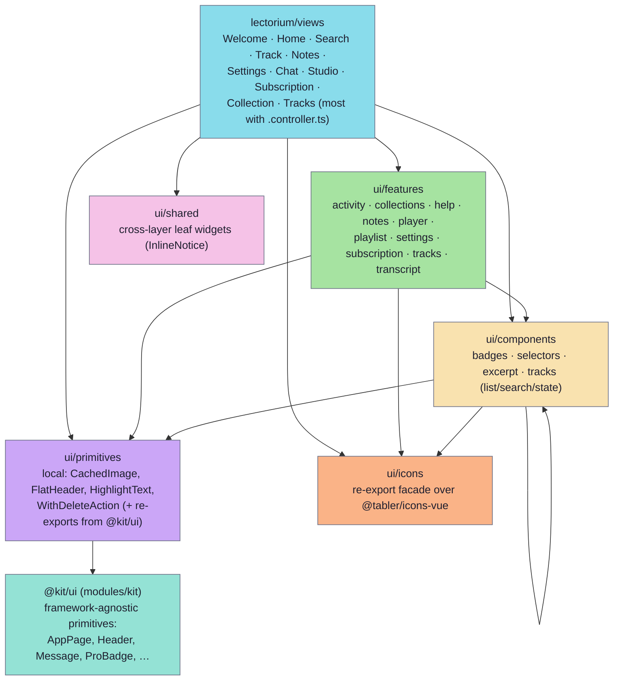
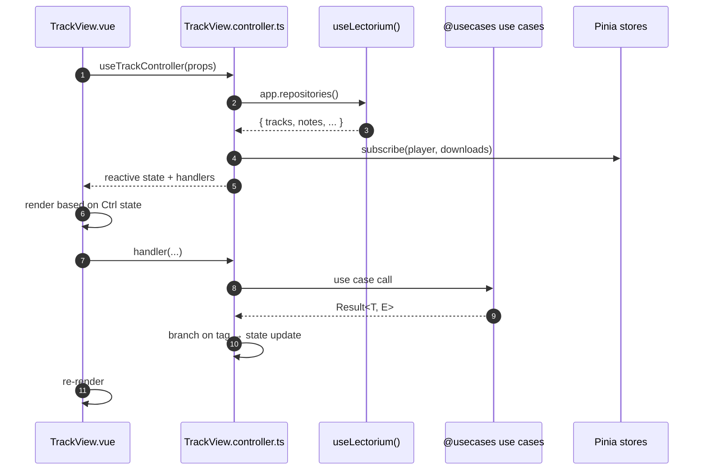

# UI components

The mobile app's UI is split across **five stacked sub-layers** under `modules/apps/mobile/ui/` (`primitives`, `icons`, `shared`, `components`, `features`), plus thin **views** at `modules/apps/mobile/lectorium/views/`. The generic, framework-agnostic primitives have been hoisted out of the app into the shared toolkit package **`@jiva-studio/kit`** (`modules/kit/src/ui/`, imported as `@kit/ui`); the app's `ui/primitives/` re-exports them so `@ui/primitives` importers keep working. Components below `ui/` know nothing about repositories, use cases or the domain — they take props and emit events. Views own routing, controllers, state and call into use cases. ESLint `no-restricted-imports` (see `modules/apps/mobile/eslint.config.js`) forbids any UI file from importing `@lib/domain`, `@usecases`, `@ports/*`, `@infra/*`, `@lectorium/*` or `@capacitor/*`.

## Layer stack



**Dependency rule:** imports flow strictly downward. Sibling features may **not** import each other; shared widgets must be promoted to `ui/components/`. The rule has per-layer ESLint blocks: primitives may import nothing else under `ui/`; icons may import no other UI layer; components may import primitives, icons and sibling components but never features; features may import primitives, icons and components but never other features.

## Views with controllers — the controller pattern

Non-trivial views split logic into a sibling `*.controller.ts` file. The view component is then a thin reactive shim that imports the controller and binds its outputs to the template. Most views have a controller (e.g. `TrackView.controller.ts`, `ChatView.controller.ts`, `StudioView.controller.ts`); the lighter list/detail views (`Collection/`, `Tracks/`) keep their logic inline in the `.vue`.



The controller owns:

- Calls into use cases — translating UI events into use-case inputs.
- Mapping `Result<T, E>` tags into UI states (toast, error overlay, success state).
- Composing Pinia stores with view-local reactive state.

The view stays focused on rendering and never sees a raw exception.

The views (routes defined in `modules/apps/mobile/lectorium/router/index.ts`; the tab bar in `views/TabsLayout.vue` mounts Home, Search, Chat, Notes and Settings):

| Path | Purpose |
|---|---|
| `views/Welcome/` | Bootstrap (CDN probe, DB download, scheme validation, migrations) — see [startup-flow](../architecture/startup-flow.md) |
| `views/Home/` | Tab: active playlist + suggestions + subscription nag |
| `views/Search/` | Tab: free-text search + filter chips |
| `views/Chat/` | Tab: conversational search over the corpus (sessions, cite markers) |
| `views/Notes/` | Tab: recent notes, search, inline audio player (`NotesInlinePlayer.vue`) |
| `views/Settings/` | Tab: language, theme, server, sadhana, account, data, danger |
| `views/Track/` | Track detail + player + transcript + notes (`/tabs/track/:trackId`) |
| `views/Collection/` | Collection / collection-group / topic track listings (`CollectionView.vue`, `CollectionListView.vue`) |
| `views/Tracks/` | Flat track list (`/tabs/search/tracks`) |
| `views/Studio/` | Studio screen (pushed from Notes) |
| `views/Subscription/` | Paywall / subscription feature carousel |

## `ui/primitives/` — atomic, no-dep building blocks

`primitives/index.ts` is a barrel. Most generic primitives now live in the shared toolkit `@kit/ui` (`modules/kit/src/ui/`) and are re-exported here; only a handful of app-specific ones stay local.

Re-exported from `@kit/ui`:

| Primitive | Role |
|---|---|
| `AppPage`, `Header`, `SafeAreaHeaderGradient` | Page chrome and safe-area handling |
| `Message` | Inline status banner |
| `PageSticker` | Sticky empty-state / above-the-fold widget |
| `SectionHeader` | Section title with optional action |
| `IconChip` | Icon + label pill |
| `ProBadge` | Pro-tier inline label |
| `LazyImage`, `BuildInfo` | Misc |

`@kit/ui` also exports `Badge`, `Heatmap`, `FloatingTabBar`, `AppLoading` and a settings-item family (`SettingsGroup`, `SettingsItem`, `SettingsToggleItem`, `SettingsSelectItem`, `SettingsTimeItem`, `SettingsActionItem`, `SettingsAccountItem`); these are framework-agnostic (text via props/slots, navigation via events, appearance via CSS tokens).

Kept local in `ui/primitives/` (app-specific):

| Primitive | Role |
|---|---|
| `HighlightText` | Renders search-result `<mark>` highlight markup (search-specific) |
| `WithDeleteAction` | Swipe-to-delete wrapper (hardcodes the `IconTrashFilled` app icon) |
| `CachedImage` (+ `useCachedImageUrl`) | Asset image with local cache / failover |
| `FlatHeader` | App-styled flat page header |

A primitive **may not** import another UI layer — primitives forbid `@ui/components`, `@ui/features` and `@ui/icons`. Any cross-layer dependency must be lifted into `ui/components/`.

## `ui/icons/` — re-export facade over `@tabler/icons-vue`

`ui/icons/index.ts` is a single barrel that re-exports a hand-curated subset of `@tabler/icons-vue` under app-local aliases (e.g. `IconHomeFilled as IconHome`, `IconArticleFilled as TranscriptIcon`). There are no hand-written SVG `.vue` files. The layer has no UI dependencies and ESLint forbids it from importing primitives, components or features; new icons are added by exporting another Tabler icon from the barrel.

## `ui/shared/` — cross-layer leaf widgets

Small presentational widgets that several layers (including views directly) reuse but that don't fit the primitive/component split. Currently `InlineNotice.vue` (the quota / error notice rendered inside chat bubbles). Files here fall under the base `ui/**` import ban only.

## `ui/components/` — generic widgets

Shared between multiple features. Allowed to import siblings inside `components/`, plus `primitives` and `icons`. Top-level widgets: `LectureOutline`, `RowDivider`, `SectionLabel`. Subdirectories:

- `components/badges/` — `DurationBadge`. Generic display badges.
- `components/selectors/` — `SelectorDialog`, `ListItemSelectorDialog`, `MultiListItemSelectorDialog` (plus a `composables/` helper). Generic dialog scaffolds used by filter chips and language switchers.
- `components/excerpt/` — `ExcerptCard` (library excerpt / cited-passage card).
- `components/tracks/list/` — `TracksList` container + `TrackListItem` row (with `TrackHeader`, `TrackMetaLine`), taking a `UiTrackRow` mirror type (see "UI mirror types" below).
- `components/tracks/search/input/` — cross-platform `SearchInput` with `SearchInputAndroid` / `SearchInputIOS` variants.
- `components/tracks/state/` — `TrackStateIndicator`, `IconIndicator` and `RadialIndicator` (the small "downloaded / downloading / progress" badges shown on track rows).

## `ui/features/` — feature-specific component suites

One subdirectory per feature surface. Sibling features **never import each other** — if two features want the same widget, it gets promoted to `ui/components/`.

| Feature | What's inside |
|---|---|
| `features/activity/` | Listening-streak heatmap (`ActivityHeatmap`, `ActivitySection`, `StreakBadge`, `CompletedBadge`) |
| `features/collections/` | Collection browsing: `CollectionsCarousel`, `CollectionCard`, `CollectionListItem`, `CarouselSection`, `TileSection`, `SectionHeader`, `AuthorAvatar`, `LibraryBanner` |
| `features/help/` | In-app help dialog (`HelpDialog`, `HelpToc`, `HelpMarkdown`, `HelpPage`, `pages/`) |
| `features/notes/` | Note list + list item (`NotesList`, `NotesListItem`) |
| `features/player/` | Player controls, speed slider, speed/skip panel, mix control, floating mini-player (`FloatingPlayer`, `FloatingPlayerPageDots`, `FloatingPlayerPlayButton`) |
| `features/playlist/` | Playlist section, items, row, count badge, starter packs, subscription nag banner (`NagBanner`) |
| `features/settings/` | Settings item rows + grouped sections (`groups/Settings*Group.vue`), time picker, smart-library dialog, logs dialog, track-info dialog |
| `features/subscription/` | Paywall pieces (`FeatureCarousel`, `FeatureSlide`, `SubscriptionFooter`) |
| `features/tracks/` | `TrackLanguageSelector` + `search/filters/` chips and `icons/` (authors, sources, languages, locations, dates, topics, tags, sort) |
| `features/transcript/` | Transcript viewer (`TranscriptText`, `TranscriptBlockRenderer`, sentence/verse blocks, selection popover + actions, dialog + header, status, language/text selectors, `Timestamp`) |

## UI mirror types

A component under `ui/*` **cannot import from `@lib/domain`** — UI must not know the domain. When a widget needs a type that already exists in the domain (e.g. `Track` to render a row), it declares a **structurally identical mirror** in a local `types.ts` (e.g. `UiTrackRow` in `ui/components/tracks/list/types.ts`).

Sync rule: a mirror is a **snapshot, not a live link**. When the domain type gains a field, the mirror and the builder that produces its values must be updated in the same change — TypeScript's structural typing won't catch the drift.

A single composable per surface converts domain inputs into UI types — `buildTrackRow` (`lectorium/composables/buildTrackRow.ts`) produces `UiTrackRow`, and `buildTranscriptViewData` (`lectorium/composables/buildTranscriptViewData.ts`) builds the transcript view model. Adding a new field is: domain → mirror → builder → template.

## Where to add a new component

```
Is it a Vue piece needed in a single feature only?
  └─ ui/features/<feature>/

Is it a generic widget reused by ≥2 features (or by a view directly)?
  └─ ui/components/<area>/

Is it a no-dep building block (button, banner, layout primitive)?
  └─ ui/primitives/

Is it a single icon?
  └─ export a @tabler/icons-vue alias from ui/icons/index.ts

Is it bound to a route / does it own state?
  └─ lectorium/views/<View>/  (with a sibling .controller.ts)
```

For the broader layer rules and the full decision tree see [`../architecture/layers.md`](../architecture/layers.md#decision-tree-where-does-new-code-go).
