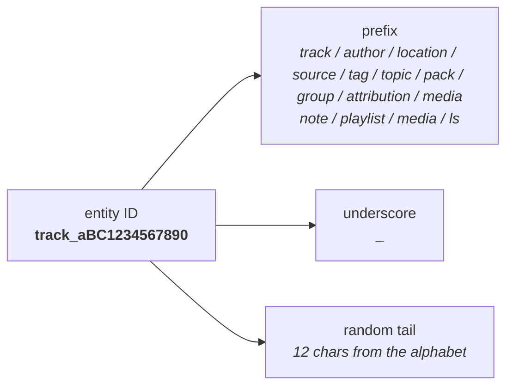
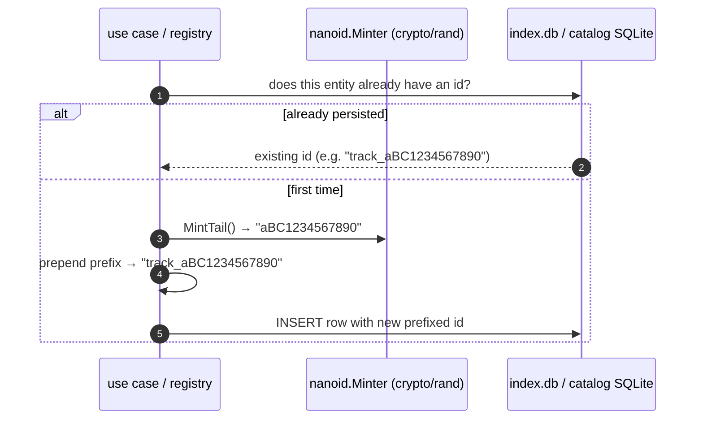

# Identifiers and ID generation

Every persisted entity in Lectorium has a string ID shaped as a **type prefix** + an underscore + a **12-character random tail**. Catalog IDs (track, author, location, source, tag, topic, collection, collection group, attribution, media) are minted by the `lectorium-mcp` pipeline (Go) and are **stable** because they are persisted once into the pipeline/catalog SQLite databases and never re-rolled. User-side IDs (note, playlist item, media item, listening session) are minted on-device when the user creates the entity. This page documents both pipelines and the conventions they share.

## Identifier shape



| Aspect | Catalog IDs (`lectorium-mcp`, Go) | User-side IDs (mobile app, TS) |
|---|---|---|
| Generator | `crypto/rand` over a fixed 62-char alphabet | `nanoid` (default URL-safe alphabet) |
| Tail length | 12 | 12 |
| Alphabet | `A–Z a–z 0–9` (62 chars, no `-` or `_`) | URL-safe Base64 `A–Z a–z 0–9 - _` (default) |
| Stability | **Stable** — minted once on ingest/create and stored in the pipeline/catalog DB | Random per call — generated and saved together |
| Where it lives | `modules/tools/lectorium-mcp/internal/infra/ids/nanoid/minter.go` | `modules/apps/mobile/infra/repositories/sql/idGenerator.ts` |

The ID type aliases used across the domain (`TrackId`, `AuthorId`, `LocationId`, `SourceId`, `TagId`, `TopicId`, `NoteId`, `PlaylistItemId`, `MediaItemId`, `ChatSessionId`, `ChatMessageId`) are declared in `modules/libs/domain/core.ts`. They are plain `string` aliases — **not** branded/nominal types; the discipline is that the type travels in the variable/parameter name, not in the value.

## What gets which prefix

| Entity | Prefix | Side | Source |
|---|---|---|---|
| `Track` | `track_` | catalog | `internal/infra/lakeregistry/sqlite/registry.go` |
| `Author` | `author_` | catalog | `internal/domain/catalog/dict.go` → `Kind.IDPrefix()` |
| `Location` | `location_` | catalog | same |
| `Source` | `source_` | catalog | same |
| `Tag` | `tag_` | catalog | same |
| `Topic` | `topic_` | catalog | same |
| `Collection` | `pack_` | catalog | `internal/domain/catalog/collection.go` → `CollectionIDPrefix` |
| `CollectionGroup` | `group_` | catalog | `internal/domain/catalog/group.go` → `CollectionGroupIDPrefix` |
| `Attribution` | `attribution_` | library | `internal/application/library/attribution/usecase.go` |
| `Media` | `media_` | library | `internal/application/library/media/usecase.go` |
| `Run` | `run_` | pipeline | `internal/infra/runregistry/sqlite/registry.go` |
| `Note` | `note_` | user | `notesRepository.sql.ts` |
| `PlaylistItem` | `playlist_` | user | `playlistItemsRepository.sql.ts` |
| `MediaItem` | `media_` | user | `mediaItemsRepository.sql.ts` |
| `ListeningSession` | `ls_` | user | `listeningSessionsRepository.sql.ts` |

> The `Collection` entity keeps the legacy `pack_` prefix value even though it was renamed from `Pack`; existing catalog ids stay valid. The catalog-side `Media` (`media_`, library media items) is unrelated to the on-device `MediaItem`, which happens to share the same `media_` prefix.

`Language` is not in the table because it has **no random ID** — its primary key is the ISO-639 `code` itself (`"ru"`, `"en"`, `"hi"`), typed as `LanguageCode` in `core.ts`.

---

## Catalog IDs — `lectorium-mcp` (Go)

The `lectorium-mcp` pipeline mints catalog IDs from a single tail generator and lets each caller prepend the kind prefix. The generator is `crypto/rand`-backed and locked to a 62-char alphanumeric alphabet so published catalogs stay stable across minter changes.

```go
// modules/tools/lectorium-mcp/internal/infra/ids/nanoid/minter.go
const Alphabet = "ABCDEFGHIJKLMNOPQRSTUVWXYZabcdefghijklmnopqrstuvwxyz0123456789"
const TailLength = 12

func (Minter) MintTail() string { /* 12 random chars from Alphabet */ }
```

The port (`internal/ports/ids/minter.go`) is intentionally minimal — it only knows how to mint a tail; the **caller prepends the prefix**:

- **Track** — `internal/infra/lakeregistry/sqlite/registry.go` builds `"track_" + minter.MintTail()` on first ingest of a file and stores it in the `files` table of the pipeline `index.db`. The same path always maps to the same `track_id` afterwards, so re-ingest is idempotent.
- **Dict entries** (author / location / source / tag / topic) — `internal/application/catalog/dictcrud/usecase.go` and `internal/application/extractmeta/usecase.go` build `kind.IDPrefix() + minter.MintTail()`, where `Kind.IDPrefix()` (`internal/domain/catalog/dict.go`) returns `author_` / `location_` / `source_` / `tag_` / `topic_`. Topic dict entries are also minted by the topic builder (`internal/application/topics/build.go`).
- **Collection** — `internal/application/catalog/collectioncrud/usecase.go` builds `catalog.CollectionIDPrefix + minter.MintTail()` (`CollectionIDPrefix = "pack_"`, `internal/domain/catalog/collection.go`).
- **CollectionGroup** — `internal/application/catalog/collectiongroupcrud/usecase.go` builds `catalog.CollectionGroupIDPrefix + minter.MintTail()` (`CollectionGroupIDPrefix = "group_"`, `internal/domain/catalog/group.go`).
- **Attribution** — `internal/application/library/attribution/usecase.go` builds `"attribution_" + minter.MintTail()`.
- **Media** (library media items) — `internal/application/library/media/usecase.go` builds `"media_" + minter.MintTail()`.
- **Run** — `internal/infra/runregistry/sqlite/registry.go` (and the in-memory variant) build `"run_" + minter.MintTail()` when the caller doesn't supply a run id.

### The flow



Stability comes from **persistence, not a re-keyable map**: the first time a track file is ingested (or a dict/collection/attribution is created) the id is minted and written; every later operation reads it back. There is no checked-in JSON id map.

### Why a custom alphabet?

The default `nanoid` alphabet is URL-safe Base64 — it includes `-` and `_`. The catalog side drops both:

1. **S3 key cleanliness** — published track assets live under `tracks/{trackId}/…`; plain alphanumerics keep URLs and copy-pasted paths clean.
2. **CLI ergonomics** — an ID that starts with `-` is occasionally mistaken for a flag by shell tools.

`62¹² ≈ 3.2 × 10²¹` — same order of entropy as `nanoid(12)` over Base64 (`64¹²`). Collision risk is unchanged.

---

## User-side IDs — generated in the mobile repositories

The mobile app creates `Note`, `PlaylistItem`, `MediaItem` and `ListeningSession` entities at user-trigger time. Their IDs are minted inside the corresponding SQL repository — never by callers, never by use cases — using a single shared factory.

```ts
// modules/apps/mobile/infra/repositories/sql/idGenerator.ts
import { nanoid } from "nanoid"
export const createIdGenerator =
  (prefix: string) => (): string => `${prefix}_${nanoid(12)}`
```

```ts
// notesRepository.sql.ts
const newNoteId = createIdGenerator("note")
// playlistItemsRepository.sql.ts
const newPlaylistItemId = createIdGenerator("playlist")
// mediaItemsRepository.sql.ts
const newMediaItemId = createIdGenerator("media")
// listeningSessionsRepository.sql.ts
const newSessionId = createIdGenerator("ls")
```

These use the **default** `nanoid` (URL-safe Base64). The cleanliness reasons that mattered for S3 keys don't apply here — these IDs only live inside the user DB and across the JS boundary.

> Chat IDs (`ChatSession`, `ChatMessage`) are an exception: the repositories accept an `id` supplied by the caller (chat layer / server) rather than minting one, so they are not produced by `createIdGenerator`. Notes can likewise accept a caller-supplied deterministic `id` (e.g. derived from a chat action) for an idempotent insert; absent that, `newNoteId()` is used.

### Why generate inside the repo?

- **Domain stays pure.** `INoteRepository.create(input)` accepts a `CreateNoteInput` *without* an ID — generation is an infrastructure concern (the ID needs to come from somewhere, and "somewhere" is the layer that talks to the DB).
- **One generator factory.** Changing the format (length, alphabet, uuid) is a single edit in `idGenerator.ts` that covers every entity type.
- **Test ergonomics.** Use cases can be tested with a fake repository that returns a fixed ID; the real generator is exercised only in the SQL repo's tests.

## Summary table

| Entity | Prefix | Tail | Where minted |
|---|---|---|---|
| `Track` | `track_` | 12 chars `[A-Za-z0-9]` | `lectorium-mcp` `internal/infra/lakeregistry/sqlite/registry.go` |
| `Author` / `Location` / `Source` / `Tag` / `Topic` | `author_` / `location_` / `source_` / `tag_` / `topic_` | 12 chars `[A-Za-z0-9]` | `internal/domain/catalog/dict.go` (`Kind.IDPrefix()`) + dict/extract/topics use cases |
| `Collection` | `pack_` | 12 chars `[A-Za-z0-9]` | `internal/domain/catalog/collection.go` + `internal/application/catalog/collectioncrud/usecase.go` |
| `CollectionGroup` | `group_` | 12 chars `[A-Za-z0-9]` | `internal/domain/catalog/group.go` + `internal/application/catalog/collectiongroupcrud/usecase.go` |
| `Attribution` | `attribution_` | 12 chars `[A-Za-z0-9]` | `internal/application/library/attribution/usecase.go` |
| `Media` (library) | `media_` | 12 chars `[A-Za-z0-9]` | `internal/application/library/media/usecase.go` |
| `Run` | `run_` | 12 chars `[A-Za-z0-9]` | `internal/infra/runregistry/sqlite/registry.go` |
| `Language` | — (PK is the ISO-639 code) | — | Source data |
| `Note` | `note_` | 12 chars `[A-Za-z0-9_-]` | `notesRepository.sql.ts` |
| `PlaylistItem` | `playlist_` | 12 chars `[A-Za-z0-9_-]` | `playlistItemsRepository.sql.ts` |
| `MediaItem` | `media_` | 12 chars `[A-Za-z0-9_-]` | `mediaItemsRepository.sql.ts` |
| `ListeningSession` | `ls_` | 12 chars `[A-Za-z0-9_-]` | `listeningSessionsRepository.sql.ts` |
