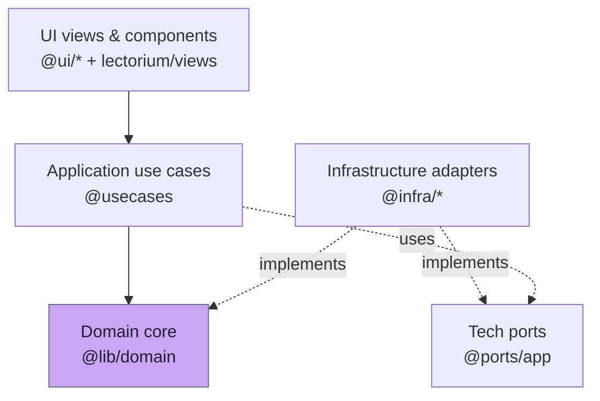

# Domain

The domain layer (`@lib/domain` — `modules/libs/domain/`) is the innermost layer of the Lectorium app: pure entities, value objects, side-effect-free domain services and repository **ports** with **zero external dependencies**. Application use cases sit on top of it, infrastructure adapters implement its ports, and the UI never touches it directly.

## Where it sits in the architecture

The domain knows nothing about Vue, Capacitor, SQLite, S3, the CDN or HTTP. Everything platform-specific is reached through a port — see [Ports](./ports.md).

## What lives here

| Group | Files | Purpose |
|---|---|---|
| Identity / scalars | [`core.ts`](https://github.com/jiva-studio/lectorium/blob/main/modules/libs/domain/core.ts) | `TrackId`, `AuthorId`, `NoteId`, `PlaylistItemId`, `MediaItemId`, `ChatSessionId`, `ChatMessageId`, `LanguageCode`, `IsoDate`, `UnixMs`, … |
| Result helper | [`@kit/core`](https://github.com/jiva-studio/lectorium/blob/main/modules/kit/src/core) (shared kernel) | `Result<T, E>` discriminated union (+ `ok` / `err` constructors) for recoverable errors — one shared type across domain, application, and infra |
| Catalog entities | `track.ts`, `trackVariant.ts`, `author.ts`, `location.ts`, `source.ts`, `tag.ts`, `topic.ts`, `language.ts`, `reference.ts` | Library content shipped via the prebuilt content DB |
| User entities | `note.ts`, `playlistItem.ts`, `listeningSession.ts`, `mediaItem.ts` | User-generated rows stored in the on-device user DB |
| Chat (Sadhu) entities | `chatSession.ts`, `chatMessage.ts` | Conversations and their messages, including action-card payload shapes |
| Transcripts | `transcript.ts` | Time-aligned blocks fetched as JSON from S3 (not stored in SQLite) |
| Remote config | `config.ts` | Shape of `public/config.json` — advertised DB versions (`RemoteAppConfig`, `RemoteDbEntry`), per-region `CdnServer[]`, plus the proactive-chat config (`ProactiveConfig`, rule kinds, eligibility predicates, holiday calendar) |
| CDN / regions | `servers.ts` | `SERVERS` bootstrap list of region descriptors (`CdnServer`, extending `@kit/servers`' base with per-region share/auth/chat endpoints) + re-exported `buildServerUrl` |
| Pure services | `services/localizedName.ts`, `services/references.ts` | Side-effect-free helpers: `resolveLocalizedName` (language fallback) and reference-range collapsing |
| UI constants | `durationFilters.ts`, `dateFilters.ts`, `sortMethods.ts` | Duration / date filter buckets and sort methods used by the catalog UI |
| Ports | `ports/*.ts` | 16 repository / unit-of-work interfaces — see [Ports](./ports.md) |

## Reading order

1. **[Entities](./entities.md)** — the shape of the data: `Track`, `TrackVariant`, `Note`, `PlaylistItem`, `ListeningSession`, `MediaItem`, `ChatSession`, `ChatMessage`, dictionaries. Includes a class diagram and the state machines for items with lifecycle.
2. **[Value objects](./value-objects.md)** — primitive ID types, `Result<T, E>`, `LanguageCode`, `UnixMs`, and why nothing here is branded.
3. **[Ports](./ports.md)** — repository interfaces. The contract every storage adapter must satisfy.

## Rules of the layer

- **Near-zero deps.** Anything imported by `@lib/domain` is either another `@lib/domain` module, a TypeScript built-in, or the dependency-free **shared kernel** (`@kit/core` for `Result`, `@kit/servers` for `buildServerUrl`; see [layers.md](../architecture/layers.md#layer-reference)). No `vue`, no `@capacitor/*`, no `sql.js`, no ports/infra. Verified by ESLint `no-restricted-imports`.
- **No I/O.** No `fetch`, no SQL, no filesystem. Side effects belong in adapters.
- **No exceptions for recoverable failures.** Domain entities throw only on programmer error (impossible state). Recoverable validation flows through `Result<T, E>` — defined in [`@kit/core`](https://github.com/jiva-studio/lectorium/blob/main/modules/kit/src/core) — and the policy in [`../architecture/layers.md`](../architecture/layers.md#error-handling-policy).
- **Paths are full bucket keys.** `audio_path` and `transcript_path` are stored complete (`public/tracks/.../audio/original.mp3`). The domain never concatenates prefixes — see [Storage layout](../infra/s3-layout.md).
