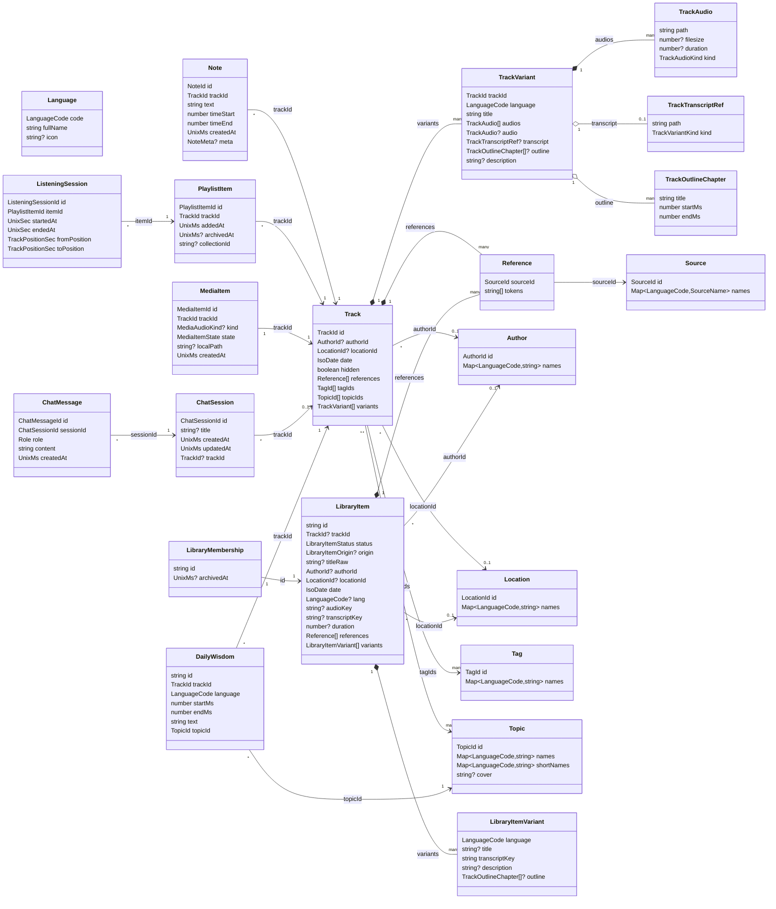
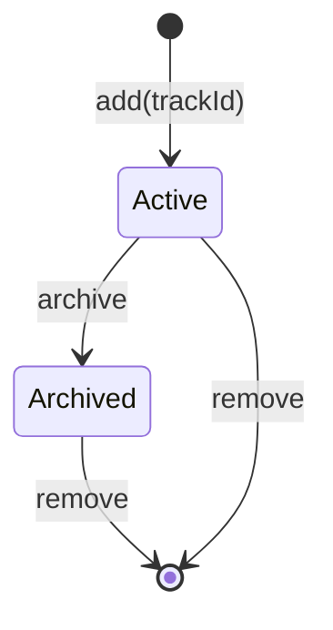
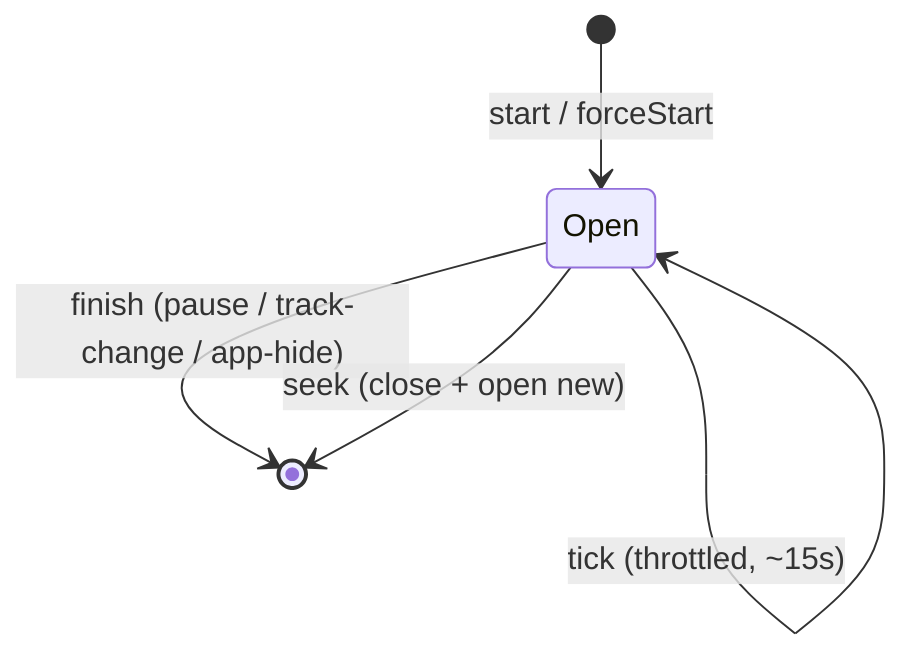
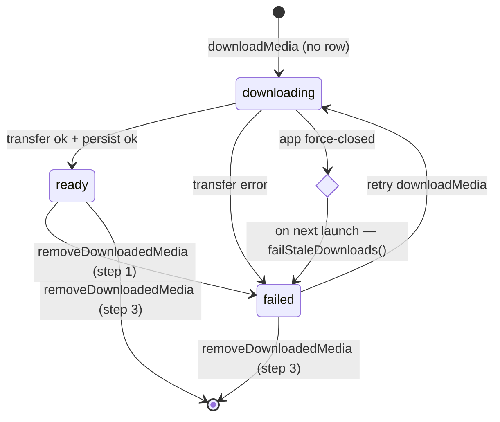
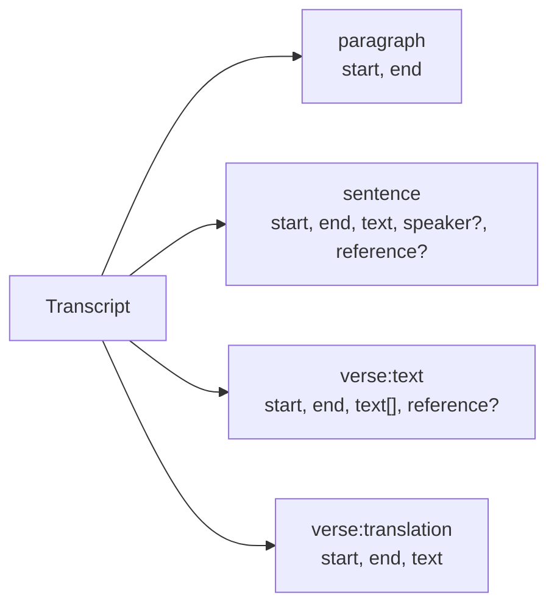
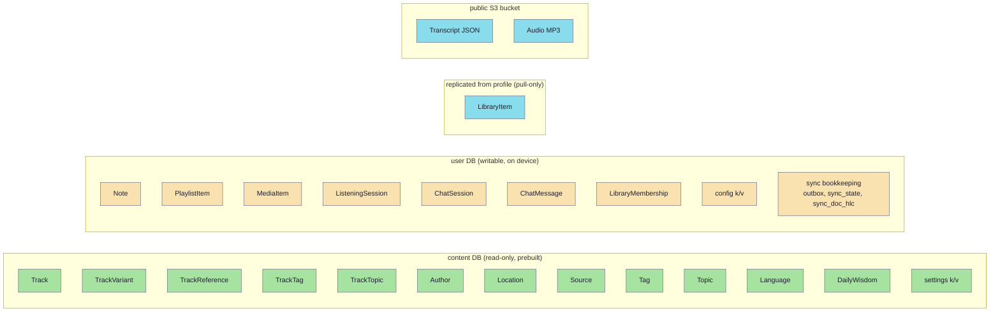

# Domain entities

Lectorium's data model has two halves: a **catalog** of lectures (read-only, shipped via the prebuilt content DB) and a set of **user entities** (notes, playlist, offline cache, listening journal, Sadhu chat, personal library) stored in a writable user DB. Part of the user half is replicated to the `profile` service by the sync engine, which adds a small set of transport-shaped domain primitives of its own. The diagram below shows every domain entity and its relations; the rest of this page lists fields and lifecycle for each one.

## Class diagram

Solid diamond `*--` = composition (variants and references live with the track row, no separate identity). Hollow `o--` = optional component. Arrow `-->` = reference by id.

`LibraryItem` is the one entity that does not have a table in the content DB *or* a plain user-authored row: it lands in the user DB by replication from the `profile` service, and `libraryItemToTrack` adapts it into a synthetic `Track` so the rest of the model can ignore where a lecture came from.

---

## Catalog entities (content DB, read-only)

### `Track` — [`track.ts`](https://github.com/jiva-studio/lectorium/blob/main/modules/libs/domain/track.ts)

A single lecture recording. Language-independent metadata only — per-language titles, audio and transcripts live in `TrackVariant`.

| Field | Type | Notes |
|---|---|---|
| `id` | `TrackId` | Stable across rebuilds — see [ID generation](../db/ids.md) |
| `authorId` | `AuthorId \| null` | Null for legacy recordings without metadata |
| `locationId` | `LocationId \| null` | Null for legacy recordings without metadata |
| `date` | `IsoDate` | `"YYYY-MM-DD"` or null when unknown |
| `hidden` | `boolean` | Excluded from default lists / search results |
| `references` | `Reference[]` | Scripture citations; one entry per ref group |
| `tagIds` | `TagId[]` | Many-to-many, stored as `track_tags` join rows |
| `topicIds` | `TopicId[]` | Canonical recommender topics, ordered by descending weight; stored as `track_topics` join rows |
| `variants` | `TrackVariant[]` | Per-language content (title, audio, transcript) |

`track.ts` also exports two pure helpers over a loaded `Track`: `maxAudioDurationMs(track)` returns the longest variant's audio duration in ms (the progress denominator, so percentages can't exceed 100 % when the played variant is longer than the first one), and `pickPlayableVariant(track)` chooses a variant with audio without a language signal — returning the first variant whose `audio` (already the preferred clean-over-original pick) is non-null, else `null` for translation-only tracks.

Authoritative SQL: see [Content DB tables](../db/content-db.md#tracks).

### `TrackVariant` — [`trackVariant.ts`](https://github.com/jiva-studio/lectorium/blob/main/modules/libs/domain/trackVariant.ts)

One row per (track, language). Holds the localised title, the available audio versions plus a transcript pointer, and the optional generated outline / description.

| Field | Type | Notes |
|---|---|---|
| `trackId` | `TrackId` | Composite key with `language` |
| `language` | `LanguageCode` | ISO-639 code: `"ru"`, `"en"`, `"hi"`, … |
| `title` | `string` | Lecture title in this language |
| `audios` | `TrackAudio[]` | All published audio versions (original + optional denoised `clean`); empty for translation-only variants |
| `audio` | `TrackAudio \| null` | Convenience pick of the version to play (clean over original over first); `null` when there is no audio |
| `transcript` | `TrackTranscriptRef \| null` | Null when no transcript is published |
| `outline` | `TrackOutlineChapter[] \| null` | Chapter table-of-contents; `null` when not generated |
| `description` | `string \| null` | Short lecture overview; `null` when not generated |

`pickPlayableAudio(audios)` is the pure helper that computes the `audio` convenience pick: `clean` kind, else `original` kind, else the first entry, else `null`.

Two kind discriminators live here:

- `TrackAudioKind` is `"original" \| "clean"` — the source recording vs. the denoised version. Each `TrackAudio.kind` is one of these.
- `TrackVariantKind` is `"original" \| "generated" \| "edited"` — recorded on `TrackTranscriptRef.kind` so the UI can mark machine-generated transcripts distinctly.

`TrackOutlineChapter` is `{ title, startMs, endMs }` — one heading spanning `[startMs, endMs)` in milliseconds (the last chapter's `endMs` is the track duration).

`TrackAudio.path` and `TrackTranscriptRef.path` are **full bucket keys** including the `public/` prefix (e.g. `public/tracks/abc123/audio/original.mp3`). The client never concatenates prefixes — see [`useStoragePublicUrl.ts`](https://github.com/jiva-studio/lectorium/blob/main/modules/apps/mobile/infra/storagePublicUrl/useStoragePublicUrl.ts) and [Storage layout](../infra/s3-layout.md).

`TrackAudio.duration` is in **milliseconds**.

### `Reference` — [`reference.ts`](https://github.com/jiva-studio/lectorium/blob/main/modules/libs/domain/reference.ts)

A scripture citation: `{ sourceId: "source_dsicuBsFvinZ", tokens: ["18", "66"] }` reads as Bhagavad-gītā 18.66. `sourceId` is the catalog `sources.id` primary key — UI composers turn it into a localised "BG"/"Bhagavad-gītā" via the [`sources`](#dictionaries--author--location--source--tag--topic--language) dictionary. `tokens` is kept as an array so the client can range-detect ("10.5–10.7") without re-parsing.

### Dictionaries — `Author` / `Location` / `Source` / `Tag` / `Topic` / `Language`

The "named id" dictionaries follow the same shape: an id plus a `Map<LanguageCode, string>` of localised names. `Source` differs — its localised value is a `SourceName { fullName, shortName }` per locale, so its names map is `Map<LanguageCode, SourceName>` (e.g. "BG" / "Bhagavad-gītā"). The SQL tables behind them use a composite `(id, language)` primary key — one row per locale — see [content DB tables](../db/content-db.md#dictionaries).

`Topic` — [`topic.ts`](https://github.com/jiva-studio/lectorium/blob/main/modules/libs/domain/topic.ts) — is the recommender-theme dictionary (mirrors `Tag`). Beyond `id` + `names` it carries `shortNames` (a `Map<LanguageCode, string>` of tighter chip/shelf labels, possibly absent for a locale) and `cover` (a generated, language-neutral cover-image key, or `null`). A track's membership + weight lives separately in `track_topics` (see `Track.topicIds`, ordered by descending weight).

`Language` is the registry of locales itself (English name + optional flag emoji), keyed by `code` rather than `(id, language)`.

### `DailyWisdom` — [`dailyWisdom.ts`](https://github.com/jiva-studio/lectorium/blob/main/modules/libs/domain/dailyWisdom.ts)

A short, playable excerpt of a lecture tied to a topic. Authored on the MCP side and shipped in the content DB alongside the catalog; the daily-wisdom proactive rule samples one for a topic the user picked and posts it into chat as a playable cite.

| Field | Type | Notes |
|---|---|---|
| `id` | `string` | Fragment id |
| `trackId` | `TrackId` | The lecture the fragment is cut from |
| `language` | `LanguageCode` | Language of `text` — the rule filters by the user's library languages |
| `startMs` | `number` | **Milliseconds** — fragment start within the track |
| `endMs` | `number` | **Milliseconds** — fragment end |
| `text` | `string` | The excerpt / aphorism shown in chat |
| `topicId` | `TopicId` | Topic the fragment illustrates |

Read through [`IDailyWisdomRepository`](./ports.md#idailywisdomrepository). The content DB also carries an untyped `settings` key/value table (opaque strings, read via [`ISettingsRepository`](./ports.md#isettingsrepository)) — it is configuration shipped with the catalog, not a domain entity.

---

## User entities (user DB, writable)

These entities live in the per-device user DB built by [`runMigrations.ts`](https://github.com/jiva-studio/lectorium/blob/main/modules/apps/mobile/infra/persistence/migrations/user/runMigrations.ts). Some of them stay on the device (`MediaItem`) and some are replicated to the `profile` service — `Note`, `PlaylistItem`, `ListeningSession`, `ChatSession`, `ChatMessage` and `LibraryMembership` are pushed from the device, while `LibraryItem` is pulled from the server. See [Sync primitives](#sync-primitives) below.

### `Note` — [`note.ts`](https://github.com/jiva-studio/lectorium/blob/main/modules/libs/domain/note.ts)

| Field | Type | Notes |
|---|---|---|
| `id` | `NoteId` | Generated client-side with `note_${nanoid(12)}` |
| `trackId` | `TrackId` | The track the note is attached to |
| `text` | `string` | Trimmed; up to `MAX_NOTE_LENGTH` (4000) chars |
| `timeStart` | `number` | **Milliseconds** within the track — same unit as transcript block `start`/`end` |
| `timeEnd` | `number` | **Milliseconds**; must be ≥ `timeStart` |
| `createdAt` | `UnixMs` | ms since epoch |
| `meta` | `NoteMeta \| null` | Free-form `Record<string, unknown>` sidecar; `null` (not `undefined`) when the row has no meta. Convention: one top-level key per feature (e.g. `meta.studio`) |

Field invariants live on the entity in `validateNoteFields(input)`, called by both the create and update use cases (update validates the *merged* values). It trims `text`, rejects empty / over-length text (`empty-text`, `text-too-long`), non-finite or negative `timeStart` (`invalid-time`, `invalid-range`), and `timeEnd < timeStart` (`invalid-range`), returning the normalised fields on success.

### `PlaylistItem` — [`playlistItem.ts`](https://github.com/jiva-studio/lectorium/blob/main/modules/libs/domain/playlistItem.ts)

| Field | Type | Notes |
|---|---|---|
| `id` | `PlaylistItemId` | `playlist_${nanoid(12)}` |
| `trackId` | `TrackId` | The queued track |
| `addedAt` | `UnixMs` | When the item was added |
| `archivedAt` | `UnixMs \| null` | Active list filters by `archived_at IS NULL` |
| `collectionId` | `string \| null` | The collection the track was added FROM (when a whole collection was queued at once); `null` for individually added tracks. Drives Home-playlist collection grouping by stored intent |

The row deliberately holds queue state only. **Resume position, completion and daily totals are derived from the [`ListeningSession`](#listeningsession--listeningsessionts) journal** — there is no `progress` or `completedAt` column on `PlaylistItem`. This keeps the source of truth single-headed: a session row covers a real play interval, while "completion" is just "the latest session's `to_position ≥ duration − 2`".

#### State machine

The "active" list shown on Home is `archived_at IS NULL`. Completion is a *derived* presentation hint — it does not transition the row; the playlist row stays Active until archived.

### `ListeningSession` — [`listeningSession.ts`](https://github.com/jiva-studio/lectorium/blob/main/modules/libs/domain/listeningSession.ts)

A single play→pause/seek/track-change interval. The journal is what powers resume, completion, the daily heatmap and the streak.

| Field | Type | Notes |
|---|---|---|
| `id` | `ListeningSessionId` | `session_${nanoid(12)}` |
| `itemId` | `PlaylistItemId` | The playlist row this interval belongs to |
| `startedAt` | `UnixSec` | When the interval opened (unix seconds) |
| `endedAt` | `UnixSec` | Last tick or close — moves while the session is open |
| `fromPosition` | `TrackPositionSec` | Track offset at session open. For continuous play this is the previous session's `toPosition`; on `forceStart` (after a seek) it equals the seek target. |
| `toPosition` | `TrackPositionSec` | Track offset at the most recent tick. `toPosition − fromPosition` = seconds listened in this session. |

`DailyListeningTotal` (`{ date, listenedSeconds }`) is the aggregation shape returned by `getDailyTotals` — one row per local-timezone day. See [`IListeningSessionRepository`](./ports.md#ilisteningsessionrepository) for the read-side queries.

#### Lifecycle

`tick` is throttled at the application boundary (`useListeningSessionTracker` in `lectorium/composables/`) so a 30-minute session writes ~120 rows, not one per audio frame. A user-initiated seek closes the open session and opens a fresh one — the discontinuity is preserved so background listening between two foreground sessions doesn't get back-attributed to a single seek jump.

### `MediaItem` — [`mediaItem.ts`](https://github.com/jiva-studio/lectorium/blob/main/modules/libs/domain/mediaItem.ts)

Tracks the offline cache state for one audio version of a track, after an explicit user-initiated download.

| Field | Type | Notes |
|---|---|---|
| `id` | `MediaItemId` | `media_${nanoid(12)}` |
| `trackId` | `TrackId` | Keyed together with `kind` — a track can cache its original and clean files independently |
| `kind` | `MediaAudioKind \| undefined` | `"original" \| "clean"` — which audio version this entry caches. Persistence always sets it (migration default `"original"`); optional on the type so older fixtures stay valid |
| `state` | `MediaItemState` | `"pending" \| "downloading" \| "ready" \| "failed"` |
| `localPath` | `string \| null` | Local URL once `state === "ready"` |
| `createdAt` | `UnixMs` | When the row was first inserted |

#### Download state machine

Stale `downloading` rows on app start are flipped to `failed` by [`IMediaItemRepository.failStaleDownloads()`](https://github.com/jiva-studio/lectorium/blob/main/modules/libs/domain/ports/mediaItemRepository.ts) so a force-close mid-download doesn't permanently lock the row with `already-in-progress`. See [`downloadMedia.ts`](https://github.com/jiva-studio/lectorium/blob/main/modules/apps/mobile/usecases/downloads/downloadMedia.ts) and [`removeDownloadedMedia.ts`](https://github.com/jiva-studio/lectorium/blob/main/modules/apps/mobile/usecases/downloads/removeDownloadedMedia.ts) for the full transition rules.

### `LibraryItem` — [`libraryItem.ts`](https://github.com/jiva-studio/lectorium/blob/main/modules/libs/domain/libraryItem.ts)

A lecture the user added that is **not** in the shared corpus — the personal library. The `profile` service owns the row: it runs the ingest (fetch → transcribe → translate), writes the metadata, and the device receives it as a pull-only sync collection. The client never edits it.

| Field | Type | Notes |
|---|---|---|
| `id` | `string` | Per-user membership id (UUID) — also the sync `doc_id` |
| `trackId` | `TrackId \| null` | Content hash; `null` until the fetch step computes it |
| `status` | `LibraryItemStatus` | `"queued" \| "processing" \| "ready" \| "failed"` |
| `origin` | `LibraryItemOrigin \| null` | `"private"` (owner-only) or `"published"` (promoted to the shared corpus, a later phase) |
| `titleRaw` / `authorRaw` / `locationRaw` / `dateRaw` | `string \| null` | Raw ingest metadata — always present and lossless |
| `authorId` / `locationId` / `date` | resolved ids / `IsoDate` | `null` until the pipeline confidently matches the raw values |
| `langHint` / `lang` | `LanguageCode \| null` | Requested hint vs. ASR-detected content language (`lang` is authoritative when present) |
| `audioKey` / `transcriptKey` / `coverKey` | `string \| null` | **Full bucket keys**, populated once `status === "ready"` |
| `duration` | `number \| null` | **Milliseconds** |
| `references` | `Reference[]` | Parsed from the title but left unresolved — carried as `sourceName` + tokens |
| `variants` | `LibraryItemVariant[]` | One per stored transcript language |
| `sourceUrl` | `string \| null` | Where the lecture was added from; `null` on older rows |
| `error` | `string \| null` | Failure reason when `status === "failed"` |
| `createdAt` / `updatedAt` | `UnixMs \| null` | Server-stamped |

`LibraryItemVariant` is `{ language, title, transcriptKey, description, outline }` — a per-language transcript with its own generated overview. Audio is shared across a track's variants, so it is not repeated per variant.

`libraryItemToTrack(item)` is the pure adapter that turns an item into a synthetic [`Track`](#track--trackts), and it is the reason the personal library needed no changes to playback: the storage-URL resolver, the download store and the HTTP transcript repository all read a `Track`'s variant paths and never touch SQL. Variant paths point at the content-addressed CDN location `public/tracks/<track_id>/…` — the server-supplied keys when present, else the deterministic scheme. It returns `null` while `trackId` is `null`, because nothing is playable before the content hash exists.

### `LibraryMembership` — [`libraryMembershipRepository.ts`](https://github.com/jiva-studio/lectorium/blob/main/modules/libs/domain/ports/libraryMembershipRepository.ts)

The client-owned companion to the server-owned `LibraryItem`: the user's remove/re-add intent, merged last-write-wins.

| Field | Type | Notes |
|---|---|---|
| `id` | `string` | The library item id (= `LibraryItem.id`, the sync `doc_id`) |
| `archivedAt` | `UnixMs \| null` | When the item was removed; `null` when active (re-added) |

**Absence means active.** A row exists only once the user has acted on an item, and the client only ever upserts — a remove sets `archivedAt`, a re-add clears it — so "no row" and `archivedAt === null` are the same state and the LWW merge stays total. The shape is declared next to its port rather than in its own entity module.

### `ChatSession` — [`chatSession.ts`](https://github.com/jiva-studio/lectorium/blob/main/modules/libs/domain/chatSession.ts)

One Sadhu-tab conversation. Persisted in the user DB (`chat_sessions`), surfaced in the History sheet sorted by `updatedAt` most-recent-first.

| Field | Type | Notes |
|---|---|---|
| `id` | `ChatSessionId` | |
| `title` | `string \| null` | Initially derived locally from the first user message (`deriveTitle`), then replaced by an LLM 3–5-word rephrase via `/title` on the first assistant turn. Stays `null` if `/title` fails — UI falls back to a generic header, no retry |
| `createdAt` | `UnixMs` | |
| `updatedAt` | `UnixMs` | Advances on each new message; drives History-sheet ordering |
| `trackId` | `TrackId \| null` | Track this session is anchored to (set when started by tapping Sadhu on a transcript selection). `null` for free-form chats opened without a transcript context |

### `ChatMessage` — [`chatMessage.ts`](https://github.com/jiva-studio/lectorium/blob/main/modules/libs/domain/chatMessage.ts)

One row of a chat (`chat_messages`). Assistant `content` is raw markdown carrying inline markers (`[cite:…]`, `[card:…]`, `[action:…|id=…]`, `[outline:…]`, `[media:…]`, `[verse:…]`, `[chapter:…]`, `[commentary:…]`, `[followup:<text>]`) whose card bodies are streamed ahead of the marker on a matching SSE action and stashed in the structured sidecar fields below — so each card renders without re-fetching and survives a reopen.

| Field | Type | Notes |
|---|---|---|
| `id` | `ChatMessageId` | |
| `sessionId` | `ChatSessionId` | Owning `ChatSession` |
| `role` | `"user" \| "assistant"` | |
| `content` | `string` | Raw markdown (mutable; grows as a stream lands) |
| `createdAt` | `UnixMs` | |
| `actions` | `Record<string, ChatActionPayload>?` | Action-card payloads keyed by the marker's `id` (`share_pdf`, `enable_daily_reminder`, `configure_smart_library`, `upgrade_to_pro`, `queue_next_track`) |
| `actionStates` | `Record<string, ChatActionState>?` | Per-action user-confirmation state: `pending \| executing \| done \| error \| dismissed` (legacy `dismissed` collapses to `pending` at render) |
| `outlines` | `Record<string, ChatOutlinePayload>?` | Outline payloads keyed by `track_id` |
| `media` | `Record<string, MediaPayload>?` | `[media:<id>]` card bodies keyed by id; `url` is a relative storage path resolved to a CDN URL at render |
| `verses` | `Record<string, ChatVerseBody>?` | `[verse:…]` library-verse bodies keyed `"<sourceId>\|<tokens>"` (sanskrit + transliteration + per-locale translation, optional recitation `audioUrl`) |
| `cites` | `Record<string, ChatCiteSnippet>?` | `[cite:…]` transcript snippets keyed `"<trackId>\|<startMs>-<endMs>"` — the only on-device text source for the citation card |
| `chapters` | `Record<string, ChatChapterBody>?` | `[chapter:…]` chapter-location regions keyed `"<sourceId>\|<regionToken>"` |
| `commentaries` | `Record<string, ChatCommentaryBody>?` | `[commentary:<ref>]` purport/prose-chapter/letter quotes keyed by the per-turn integer alias ref |
| `followups` | `string[]?` | Tappable follow-up chips from `[followup:…]`, capped at 3; rendered under the last assistant message |
| `aliases` | `Record<string, ChatAliasEntry>?` | Server-minted integer→chunk alias map round-tripped to the server next turn so the LLM sees `[cite:N\|…]` numbered form |
| `error` | `ChatMessageError?` | Set when a stream ended abnormally: `truncated` (partial kept) / `failed` (error row + Retry, with `code` and `rate_limited` `retryAfterAt`/`tier`) / `stopped` (user tapped stop) |
| `focus` | `ChatFocusPayload?` | Present on a user message inserted by the "Ask Sadhu" flow over a transcript selection — carries `startMs`/`endMs`, quoted `text`, and pinned bibliographic coordinates so the bubble renders as a focus card with an inline player |
| `feedbackState` | `"up" \| "down"?` | Last thumbs value; `down` may carry `feedbackCategory` + `feedbackComment` |

`chatMessage.ts` also defines the typed HTTP adapter errors `ProtocolVersionMismatchError` (server 426, version mismatch → "please update" CTA) and `BackendUnavailableError` (server 503, rate-limiter down).

---

## Transcripts (fetched, not stored)

`Transcript` — [`transcript.ts`](https://github.com/jiva-studio/lectorium/blob/main/modules/libs/domain/transcript.ts) — is downloaded as JSON from S3 on demand and **never written to SQLite**. It is a sequence of typed blocks:

The block discriminator (`type`) lets the UI render paragraphs, sentences, and verse blocks differently while keeping a single time-aligned stream. See [`ITranscriptRepository`](./ports.md#itranscriptrepository) for the fetch contract and [`flows/transcript-load.md`](../architecture/flows/transcript-load.md) for the request lifecycle.

---

## Sync primitives

[`modules/libs/domain/sync/`](https://github.com/jiva-studio/lectorium/tree/main/modules/libs/domain/sync) holds the pure value objects the profile-sync merge rules reason over. They are not entities — they are the *transport shape* of the entities above — but they live in the domain because the merge rules must stay pure and property-testable. The engine, the wire types and the server side are described in [Profile sync](../architecture/profile-sync.md).

| Type | Shape | Notes |
|---|---|---|
| `SyncCollection` | union of `user.db` table names | `playlist_items`, `listening_sessions`, `notes`, `chat_sessions`, `chat_messages`, `library_items`, `library_memberships` — the collection name **is** the table name |
| `SyncOp` | `"upsert" \| "delete"` | As journaled in the outbox and replicated over the wire |
| `SyncDoc<T>` | `{ docId, hlc, deleted, data }` | One version of a document. `docId` is the *natural* key — `track_id` for `playlist_items`, the row id elsewhere — not the local surrogate `pl_…` id. `data` is `null` iff `deleted` |
| `Hlc` | `{ physical, counter, deviceId }` | Hybrid Logical Clock; serialized `<physical>:<counter>:<device_id>` with zero-padded fixed widths so a lexicographic string compare matches `compareHlc`. `(counter, deviceId)` makes every write unique, so the HLC doubles as the push idempotency key |

Each collection has a payload type and a merge rule beside it in `merge.ts`. `PlaylistItemSyncData` (`trackId`, `addedAt`, `archivedAt`, `collectionId`) merges **add-wins** field-wise — the item is in the library iff `addedAt >= archivedAt`, so a stale device can neither resurrect nor wrongly delete it. `listening_sessions` is a **grow-only union** (a closed session is immutable, so a "conflict" is just the same row arriving twice). `notes`, chat, and `LibraryMembershipSyncData` are **last-write-wins** by HLC, with a delete tombstone competing on the same footing. `LibraryItemSyncData` has no field-level merge at all: the collection is server-owned, so the rule applies the server's version wholesale. Every rule is pure, idempotent, and commutative in outcome.

---

## Where each entity is stored

`LibraryItem` rows physically land in the user DB like the rest, but they are drawn apart because the device only ever *reads* them — the sync engine writes them through `ISyncApplyRepository` from the server's version.

For the full database picture see [DB overview](../db/README.md), for the replication mechanics see [Profile sync](../architecture/profile-sync.md) and [Personal library](../architecture/personal-library.md), and for the wire-level layout see [S3 layout](../infra/s3-layout.md).
