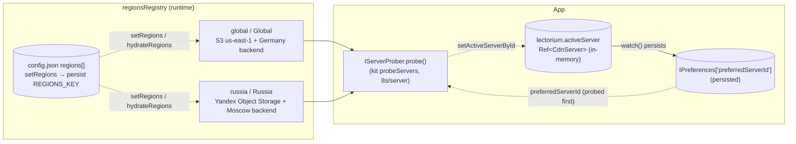
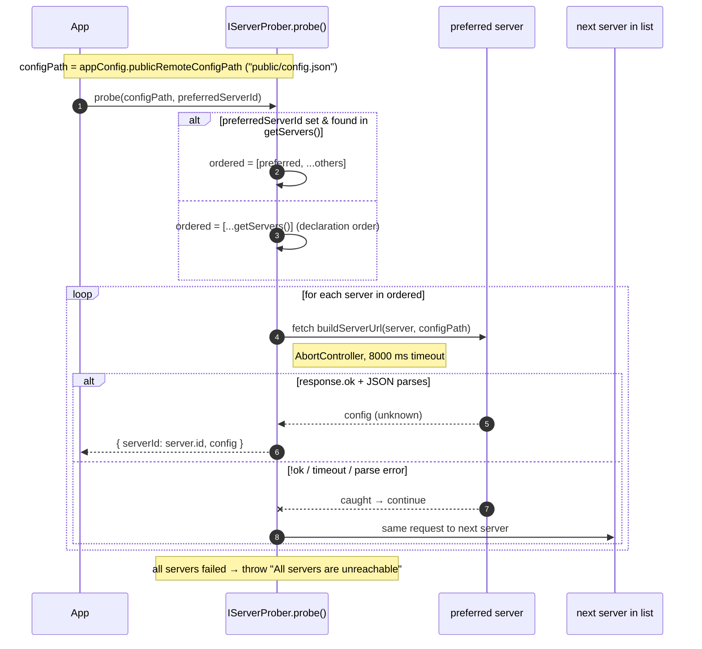
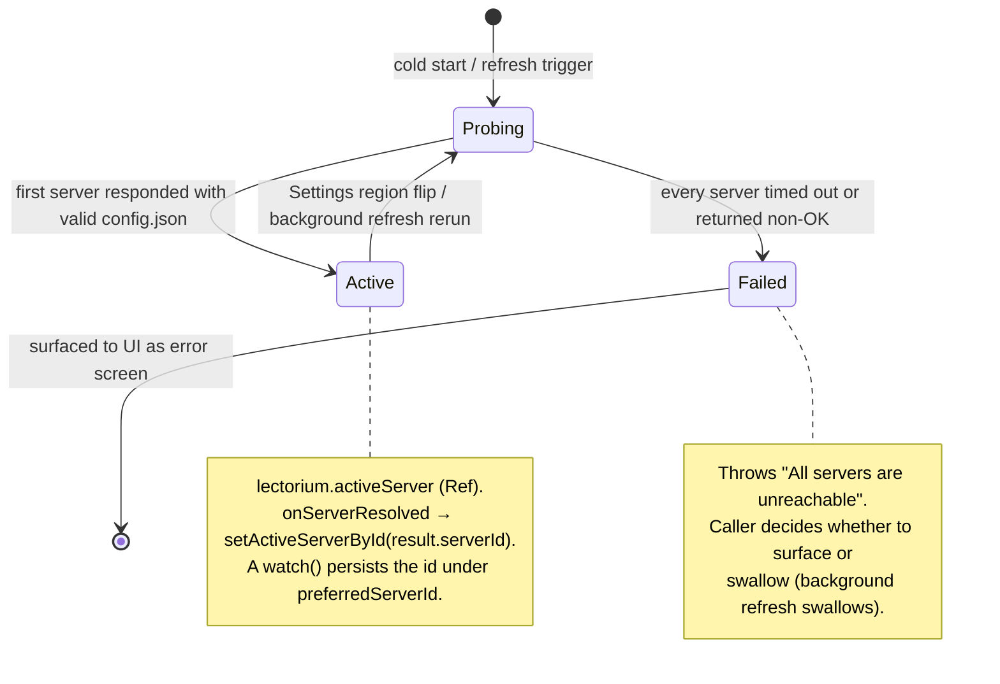
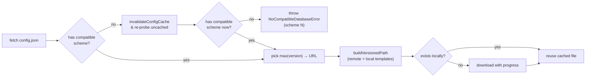
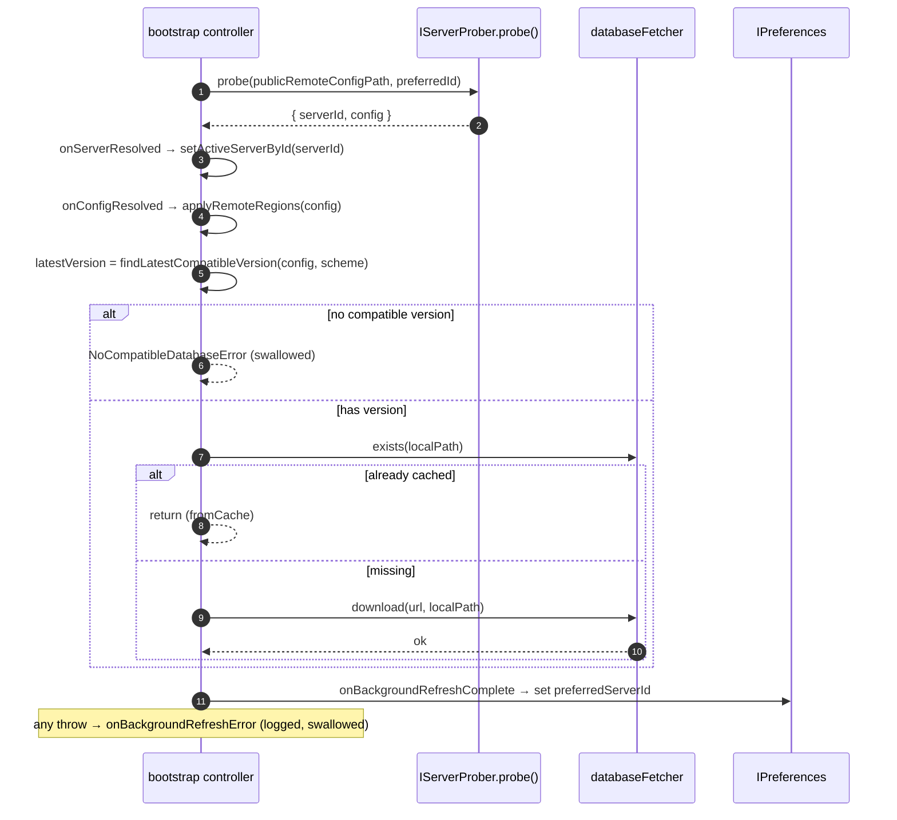

# CDN architecture

The mobile app reaches the Lectorium content bucket through one of several regional servers. The region list is **not compiled in** as the source of truth: it is published server-side in `public/config.json` (managed via lectorium-mcp `catalog.config.regions.*`) and downloaded on startup. A bundled `SERVERS` list only seeds the runtime registry to break the bootstrap chicken-and-egg (the app needs *some* region to know where to fetch `config.json`). On every cold start the app **probes the regions sequentially** (preferred region first), picks the first one that responds with a parseable `config.json`, and uses that region for the rest of the session. The probe also doubles as the config download — no separate request. Each region entry is more than a CDN mirror: it bundles the per-region storage template plus the auth, chat, and share-service base URLs, so flipping the active region reroutes all backend traffic for that region. There is **no automatic home-region detection** — the bundled `global` entry is the cold-start default, and the user can switch in Settings → Region.

## Bundled bootstrap list — `@lib/domain/servers.ts`

These entries seed the registry on the very first launch (and are the fallback when no downloaded list is persisted). Once a `config.json` with a `regions` block has been fetched, the downloaded list replaces them.

<!-- BEGIN AUTOGEN -->

| ID | Display name | Storage URL template | Auth / chat host |
|---|---|---|---|
| `global` | Global | `https://akds-lectorium.s3.us-east-1.amazonaws.com/{path}` | `https://api.shruti.local` (global origin) |
| `russia` | Russia | `https://akds-lectorium.storage.yandexcloud.net/{path}` | `https://62-109-31-177.sslip.io` (RU origin) |

<!-- END AUTOGEN -->

`CdnServer` extends kit's generic [`CdnServer`](https://github.com/jiva-studio/lectorium/blob/main/modules/kit/src/servers/cdnServer.ts) (`{ id, name, urlTemplate }`) with the app-specific per-region service endpoints. `buildServerUrl` is re-exported from `@kit/servers` — kit owns both the generic shape and the probe/failover machinery; app code only adds the extra fields.

```ts
// modules/libs/domain/servers.ts
import type { CdnServer as KitCdnServer } from "@kit/servers"
export { buildServerUrl } from "@kit/servers"

export interface CdnServer extends KitCdnServer {
  // KitCdnServer: { id, name, urlTemplate } — urlTemplate has {path} → full bucket key
  readonly shareAudioUrl: string        // /share/audio/excerpts on the regional backend
  readonly shareVideoUrl: string        // /share/video/reels    on the regional backend
  readonly shareTranscriptUrl?: string  // /share/transcripts base — OPTIONAL; client appends /pdf
  readonly authBaseUrl: string          // <host>/auth — resolved at call time
  readonly chatBaseUrl: string          // <host>      — resolved at call time
}
```

`urlTemplate` is per-region object storage (AWS S3 `us-east-1` for `global`, Yandex Object Storage for `russia`); the mobile client streams lecture audio and downloads the content DB straight from it. The `authBaseUrl` / `chatBaseUrl` / `shareAudioUrl` / `shareVideoUrl` fields point at the region's Caddy-fronted backend (sslip.io hostnames so Caddy can auto-provision Let's Encrypt certs without owning a domain). The reverse proxy strips the `/share/...` prefix before the request reaches the FastAPI / Express handlers. Every per-region field differs by region: RU users hit RU containers end-to-end — auth, chat, **and** `share-audio` / `share-video` run on the Moscow VPS (under the `proxy` compose profile) and upload to the Yandex bucket, keeping excerpts/reels on data-resident storage. The Germany (`global`) host serves everyone else.

`shareTranscriptUrl` (the [share-transcript](../modules/share-transcript.md) base, client appends `/pdf`) is **optional**, unlike the required `shareAudioUrl` / `shareVideoUrl`: a published `config.json` that predates the field stays valid, and the composition root derives the value from `chatBaseUrl` (`${chatBaseUrl}/share/transcripts`) when it's absent — the share-* routes live behind the same Caddy as chat. Once `config.json` is republished with the field, that value is used verbatim.

`buildServerUrl` is the **only** place a storage URL is assembled. `IStoragePublicUrl.get(path)` (via `useStoragePublicUrl`), `resolveAssetUrl` in the region registry, and kit's startup probe all go through it so the rule "paths are already full bucket keys; the client only swaps templates" stays in one place. See [Storage layout § Path convention](./s3-layout.md#path-convention).

## Runtime region registry — `lectorium/services/regionsRegistry.ts`

The downloaded region list lives in a small Vue-`ref`-backed module (`modules/apps/mobile/lectorium/services/regionsRegistry.ts`). Every consumer that used to import `SERVERS` directly — the prober, the failover HTTP clients, the download fallback, the Settings picker, `setActiveServerById` — reads through this registry instead (`getRegions()`, `findRegion(id)`), so a region flip or a freshly-published region takes effect without an app release.

- `hydrateRegions(preferences)` runs once at startup (in `main.ts`, **before mount** so the first CDN probe in the Welcome flow uses the persisted list) and replaces the bundled seed with the last-fetched list persisted under `REGIONS_KEY = "remoteRegions"`. Invalid/absent → keep the bundled seed.
- `setRegions(list)` applies a freshly-fetched `regions` block from `config.json`: it validates (`isValidRegionList` rejects empty/malformed lists so a bad publish can't strand the client), replaces the runtime list, and persists it for next launch.
- `setActiveRegionId(id)` / `activeRegion()` / `resolveAssetUrl(key)` mirror the composition root's active server so cover/avatar asset URLs follow a region promotion.
- A `dev` region (`Local (dev)`) is prepended via `withDev()` only when `VITE_DEV_REGION=true`; production builds tree-shake it away.

## Server map



## Cold-start region selection

There is **no** first-launch home-region heuristic (no timezone / device-language / IP `whoami` detection). The bundled `global` entry (`getRegions()[0]`) is the `initialServer` seed; the very first probe defaults to it, and on every later launch the persisted `preferredServerId` is probed first. So a user who succeeded on Russia last time stays on Russia unless it goes down. The user explicitly switches in Settings → Region.

## Probe algorithm — `infra/servers/useHttpServerProber.ts`

`useHttpServerProber(getServers, timeoutMs = 8000)` returns an `IServerProber` (port: `ports/app/serverProber.ts`) whose `probe(configPath, preferredServerId)` resolves to a `ServerProbeResult` `{ serverId, config }`. `getServers` is injected by the composition root (`() => getRegions()`) so the registry's current list is read at probe time, and the actual race/pick-first-responder mechanism is delegated to kit's generic [`probeServers`](https://github.com/jiva-studio/lectorium/blob/main/modules/kit/src/servers/prober.ts).



Key parameters:

| Parameter | Default | Note |
|---|---|---|
| `timeoutMs` | `8000` | Per-server fetch budget (`AbortController` + `setTimeout`) |
| `preferredServerId` | `lectorium.activeServer.value.id` (seeded from `IPreferences['preferredServerId']`) | Reorders the list to try the user's last-known-good region first |
| Retry policy | none | First success wins; no exponential backoff, no per-server retry |

The probe **doesn't try all servers in parallel** — it walks them sequentially. A parallel race would waste data on the loser, especially when the loser is reachable but slow. With 8 s per server you trade tail latency for bandwidth, and since the probe only happens once per startup that's fine.

## Active server lifecycle

The chosen server is held in-memory on `lectorium.activeServer` (a `Ref<CdnServer>`, seeded with `getRegions()[0]` and swapped by the bootstrap flow via `setActiveServerById`, which resolves the id through `findRegion`). A Vue `watch` on that ref persists the new id under `PREFERRED_SERVER_KEY` whenever it actually changes, and mirrors it into the region registry via `setActiveRegionId` so `resolveAssetUrl` follows the promotion. `IStoragePublicUrl`, the share-audio/share-video/share-transcript services, and the auth/chat HTTP clients all read the server through a getter closure, so a region flip reroutes their traffic without an app restart.



- The bootstrap controller surfaces probe failures via `controller.error` / `controller.isError`, rendered as a fatal error screen with a retry.
- The post-bootstrap background refresh **swallows all errors** silently (`onBackgroundRefreshError` just logs) — yesterday's DB still works, no need to disturb the user.

## Selecting a database version — `findLatestCompatibleVersion`

After a successful probe the parsed `config.json` (`RemoteAppConfig` from `@lib/domain/config.ts`) is filtered for scheme-compatible databases. The resolve/probe/scheme-retry/background-refresh logic now lives in kit's generic Stale-While-Revalidate orchestrator ([`@kit/bootstrap/contentDatabaseResolver.ts`](https://github.com/jiva-studio/lectorium/blob/main/modules/kit/src/bootstrap/contentDatabaseResolver.ts)); the Lectorium `WelcomeView.controller.ts` only injects the app-specific ports (composition root, region registry, preferences) into `createBootstrapController` and handles navigation:

```ts
// modules/kit/src/bootstrap/contentDatabaseResolver.ts
export function findLatestCompatibleVersion(
  config: RemoteContentConfig,
  supportedScheme: number
): number | null {
  const compatible = (config.databases ?? []).filter((db) => (db.scheme ?? 1) === supportedScheme)
  return compatible.length > 0 ? Math.max(...compatible.map((db) => db.version)) : null
}
```



The `(db.scheme ?? 1) === supportedScheme` line treats a missing `scheme` field as `1` for the very first published configs. `supportedScheme` is `SUPPORTED_DB_SCHEME`, injected at build time (`__DB_SCHEME__` via Vite `define`) from [`modules/db-scheme.json`](https://github.com/jiva-studio/lectorium/blob/main/modules/db-scheme.json). `resolveContentDatabase` scans the local DB directory first (offline-first), validating each candidate newest-first via `store.exists()` (drops corrupt/truncated files), and only probes the CDN (`downloadFromCdn`) when no usable cached DB exists. When the resolved config advertises no scheme-compatible DB it throws the typed `NoCompatibleDatabaseError`; the controller treats that as a likely-stale cached config, invalidates it (`invalidateConfigCache`), and re-probes once before giving up.

## Caching strategy

| Resource | Cached where | Invalidation |
|---|---|---|
| `public/config.json` | `filesStorage` (Cache API on web, Filesystem on native) | On `NoCompatibleDatabaseError` → `invalidateConfigCache` (`filesStorage.delete`) & re-probe once |
| `public/db/lectorium.{ver}.db` | Local filesystem under `lectorium/databases/` | On scheme rejection / corrupt-file detection — `databaseFetcher.delete(path)`; otherwise kept until next launch picks a newer file |
| `public/tracks/{id}/audio/...` | `filesStorage` (when streamed) **or** `IMediaDownloader` (when explicitly downloaded for offline) | Manual via `removeDownloadedMedia` |
| `public/tracks/{id}/transcripts/{lang}.json` | `filesStorage` | None — once cached, served from cache forever |

There are **no integrity hashes / signatures** in the config or anywhere else. Trust is derived from HTTPS + a successful JSON parse — that's it.

## Background refresh

After the bootstrap flow serves a usable DB and hands off to Home, the kit controller fires a best-effort `downloadFromCdn` revalidation (the "revalidate" half of Stale-While-Revalidate):



The new file lands alongside the currently-open one; `findLocalDatabaseVersion` picks it up on the **next** launch via `max(version)` over the timestamp-based version numbers. The currently-running session keeps using the old DB — no hot-swap.

## Persisted preference — `preferredServerId`

`PREFERRED_SERVER_KEY = "preferredServerId"` (`lectorium/services/preferredServer.ts`) holds the chosen region's id. It is written in two places, both to the same key:

- The `watch(activeServer)` watcher in `initLectorium` persists (and only when the id actually changes) whenever `setActiveServer` / `setActiveServerById` flips the active server — foreground probe success and Settings region flip both go through this single hook (the formerly separate "set active" and "remember for next launch" knobs are now collapsed).
- The background refresh's `onBackgroundRefreshComplete` callback writes `lectorium.activeServer.value.id` directly, ensuring the probed server is remembered for next launch.

On the next cold start that id becomes the first server tried, so a user who succeeded on Yandex last time stays on Yandex unless it goes down. See `Welcome/WelcomeView.controller.ts` for the wiring (`createBootstrapController` from `@kit/bootstrap`).

## What is *not* implemented

These choices are deliberate — not gaps:

- **No integrity check.** Files are accepted on `2xx` + parse-success. There's no checksum or signature on the DB or transcripts.
- **No retry loop inside the probe.** First success wins; failed servers are not retried with backoff.
- **No CDN-of-CDNs / edge.** The storage templates are origin object-storage endpoints (S3 / Yandex), not Cloudfront / Fastly. There's no edge cache the app would have to bust.
- **No signed URLs.** Everything under `public/` is anonymous-readable.
