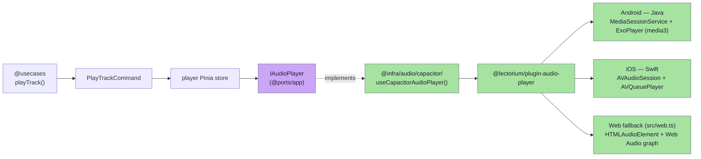
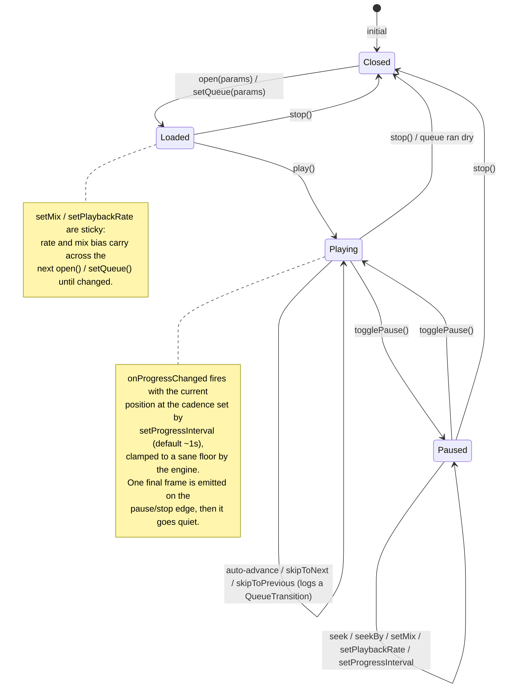

# Audio player plugin

`@lectorium/plugin-audio-player` is an in-house **Capacitor plugin** that owns audio playback on Android, iOS and the web. It exposes the same JavaScript API on every platform; only the platform implementation differs. The native sides drive a system media session (lock-screen controls, headset buttons, background playback); the web side is a self-contained `HTMLAudioElement` fallback bundled inside the plugin, so app code never needs a separate web adapter.

Source: [`modules/plugins/audio-player/`](https://github.com/jiva-studio/lectorium/tree/main/modules/plugins/audio-player).

## Why a custom plugin?

Capacitor doesn't ship an audio player plugin. `HTMLAudioElement` works on web, but on mobile we need:

- A **native media session** so the lock screen shows track / author / artwork / play-pause and responds to headset buttons, the ±15s skip controls and next/previous.
- **Background continuous playback** that survives app suspension — a native **playback queue** that auto-advances through items even while the app's JS is suspended, backed by a Media3 `MediaSessionService` (Android) and an `AVQueuePlayer` under the `AVAudioSession.playback` category (iOS).
- **A durable on-disk transition journal** so completions that happen in the background (possibly while the app is later killed) are never lost — JS drains it on next launch / resume to reconcile listening sessions.
- **Stereo→mono blending** for bilingual recordings (original lecture in the left channel, translation in the right), plus pitch-preserving playback-rate control.

The integration matches our `IAudioPlayer` port shape exactly.

## Where it sits



There is a **single** app-side adapter, `@infra/audio/capacitor/` (`useCapacitorAudioPlayer.ts`). It wraps the plugin on every platform — Capacitor itself routes to the web fallback (`src/web.ts`) in the browser, so no separate `@infra/audio/web/` adapter exists. The adapter is also the one boundary that converts units: the plugin surface speaks **seconds** (matching `HTMLMediaElement`), while the `IAudioPlayer` contract speaks **milliseconds**.

## API

```ts
// modules/plugins/audio-player/src/definitions.ts
export interface AudioPlayerPlugin extends Plugin {
  // Single-track playback (a thin convenience over a 1-item queue)
  open(params: OpenParams): Promise<void>
  play(): Promise<void>
  togglePause(): Promise<void>
  seek(options: { position: number }): Promise<void>          // seconds
  seekBy(options: SeekByParams): Promise<void>                 // relative, seconds
  stop(): Promise<void>
  setMix(params: SetMixParams): Promise<void>
  setPlaybackRate(params: SetPlaybackRateParams): Promise<void>
  setProgressInterval(params: SetProgressIntervalParams): Promise<void>
  onProgressChanged(callback: (status: Status) => void): Promise<AudioPlayerListenerResult>

  // Native playback queue (background continuous playback)
  setQueue(params: SetQueueParams): Promise<void>
  appendToQueue(params: { items: QueueItem[] }): Promise<void>
  getQueueState(): Promise<QueueState>
  ackEvents(options: { upToSeq: number }): Promise<void>
  skipToNext(): Promise<void>
  skipToPrevious(): Promise<void>
  onItemTransition(callback: (t: QueueTransition) => void): Promise<AudioPlayerListenerResult>
}

export type OpenParams = {
  itemId: string   // playlist item id; used by the system player to identify the track
  url:    string   // audio URL; resolved via IStoragePublicUrl from the active CDN
  title:  string   // shown on the lock screen
  author: string   // shown on the lock screen
  cover?: string   // http(s)/content artwork URL; file:// is ignored (bundled image used)
}

export type Status = {
  itemId:   string
  playing:  boolean
  position: number  // seconds (adapter converts to ms for IAudioPlayer)
  duration: number  // seconds
}

export type SeekByParams = { delta: number }                  // seconds, negative = back
export type SetMixParams = { enabled: boolean; ratio: number } // ratio 0=left .. 1=right
export type SetPlaybackRateParams = { rate: number }          // 1.0 = normal; pitch preserved
export type SetProgressIntervalParams = { intervalMs: number } // onProgressChanged cadence

export type QueueItem = {
  itemId: string; url: string; title: string; author: string
  cover?: string                // lock-screen artwork (http(s)/content; file:// ignored)
  duration?: number             // seconds, if known — lets native report completion duration
}
export type SetQueueParams = { items: QueueItem[]; startIndex: number; startPosition: number }

export type QueueTransition = {
  finishedItemId: string
  fromPosition:   number        // where listening on the finished item began, s
  finishedAt:     number        // position the finished item ended at, s (~= duration on auto)
  duration:       number        // total duration of the finished item, s
  startedItemId:  string | null // next item, or null when the queue ran dry
  reason: "auto" | "skip-next" | "skip-prev" | "error"
  at:  number                   // native wall-clock of the transition, epoch ms
  seq: number                   // monotonic per-install sequence; drives ack-based clear
}

export type QueueState = {
  currentItemId: string | null
  position: number; duration: number; playing: boolean
  events: QueueTransition[]     // the drained-but-not-cleared transition journal
}
```

`seekBy` clamps to `[0, duration]` on every platform. `setMix` blends the two channels into a mono signal with loudness compensation so perceived volume stays roughly constant across the `ratio` range; `enabled: false` passes the original stereo through unchanged. `setPlaybackRate` preserves pitch — `preservesPitch` on web, `PlaybackParameters` (pitch=1) on Android, `audioTimePitchAlgorithm = .timeDomain` on iOS — and the rate is clamped to `[0.5, 2.0]` on the native bridges (`[0.25, 4]` on web).

`setProgressInterval` tunes how often `onProgressChanged` pushes to the WebView (the lock screen / system player updates independently): ~500 ms for transcript word-highlighting, ~1000 ms for just the floating-player ring, and a slow heartbeat when backgrounded so a 2 Hz stream doesn't pile up in the throttled WebView and flush as a janky burst on resume.

### The queue and the durable journal

A single track is just a queue of length 1, so `setQueue` is the one real play path — `open()` is a thin convenience wrapper. Native (ExoPlayer playlist on Android, `AVQueuePlayer` on iOS) **auto-advances** through the queue on its own when the app's JS is suspended, labelling the lock screen from each `QueueItem` without calling back into JS.

Every transition (auto-end, skip, or error) is appended to a **durable on-disk journal** the instant it happens, so completions survive the app being killed in the background before JS ever wakes. On launch / resume the app calls `getQueueState()` to read the now-playing snapshot **and** drain the buffered transitions, reconciles `reason: "auto"` ends into `listening_sessions`, then calls `ackEvents({ upToSeq })` to clear what it has persisted. Reading does *not* clear the journal, so nothing is lost on a crash mid-drain; the `seq` makes the clear idempotent across multiple background→kill cycles. `onItemTransition` is best-effort foreground UI sugar — the journal, not the live callback, is the source of truth.

## Lifecycle



## Native implementations

| Platform | Folder | Implementation |
|---|---|---|
| Android | `android/src/main/java/studio/akdasa/lectorium/audioplayer/` | `AudioPlayerPlugin` talks to a Media3 `MediaSessionService` (`AudioPlayerService`) over a `MediaController`. The service owns the `ExoPlayer` + `MediaSession`; Media3 builds and keeps the MediaStyle notification, and the session advertises custom ±15s skip commands (`SessionCommand`, `SEEK_STEP_MS = 15_000`) alongside next/previous. Queue auto-advance + journaling live in `queue/QueuePlaybackManager` + `queue/QueueJournal`. Stereo→mono via a custom `StereoMixAudioProcessor` injected into the renderer. |
| iOS | `ios/Sources/AudioPlayerPlugin/` | `AudioPlayerPlugin` drives an `AVQueuePlayer` under `AVAudioSession.playback` (`mode: .default`, `[.allowAirPlay]`) as the primary, non-mixing session; lock-screen `MPNowPlayingInfo` + `MPRemoteCommandCenter` (next/previous → queue skips, seekForward/seekBackward → ±30s system steps). `AVQueuePlayer` auto-advances the queue; transitions are journaled to `QueueJournal.swift`. Stereo→mono via a per-item `MTAudioProcessingTap` (`StereoMixTap.swift`). |
| Web | `src/web.ts` | `AudioPlayerPluginWeb` — single reused `HTMLAudioElement`; the queue is a JS list advanced on the `ended` event with an in-memory journal. Stereo→mono via a lazily-built Web Audio graph (`ChannelSplitter` → per-channel `GainNode` → sum). No system session. |

The Capacitor plugin contract (`registerPlugin('AudioPlayer', …)` in `src/index.ts`) guarantees method names line up across all three; the adapter only sees `Status` / `QueueTransition` events and calls the JS methods.

## Integration in the app

Where the plugin gets called from app code (`modules/apps/mobile/infra/audio/capacitor/useCapacitorAudioPlayer.ts`):

```ts
import { AudioPlayer, type Status } from "@lectorium/plugin-audio-player"

// onProgressChanged has no off() — the adapter registers the plugin
// callback once and multiplexes app-side listeners over it. Positions
// arrive in seconds and are converted to ms here.
await AudioPlayer.onProgressChanged((status: Status) => {
  for (const fn of listeners) {
    fn({
      itemId:   status.itemId,
      playing:  status.playing,
      position: Math.round(status.position * 1000),
      duration: Math.round(status.duration * 1000),
    })
  }
})

await AudioPlayer.open({
  itemId: command.itemId,        // from PlayTrackCommand
  url:    storagePublicUrl.get(command.audio.path),
  title:  command.title,
  author: command.authorName,
  cover:  command.coverUrl,      // optional lock-screen artwork
})
await AudioPlayer.play()
await AudioPlayer.seek({ position: positionMs / 1000 })  // ms → s at the boundary

// On launch / resume: drain the durable transition journal, reconcile
// background completions, then ack what was persisted.
const state = await AudioPlayer.getQueueState()
// …reconcile state.events into listening_sessions…
const lastSeq = state.events.at(-1)?.seq
if (lastSeq !== undefined) await AudioPlayer.ackEvents({ upToSeq: lastSeq })
```

The store consumes these status events to keep the UI in sync, and the in-app listening tracker ticks the open session (throttled). The durable transition journal drained via `getQueueState()`, not the playlist row, is the source of truth for resume position and background completion.

The full playback flow is documented in [Play track flow](../architecture/flows/playback.md). For the journal contract, see [`IListeningSessionRepository`](../domain/ports.md#ilisteningsessionrepository).
