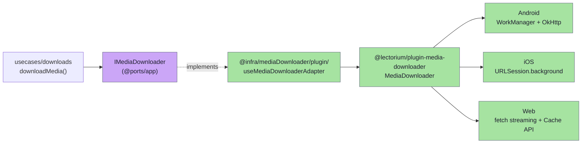
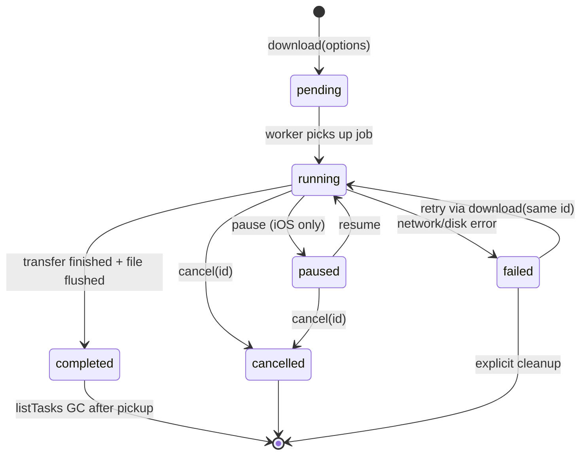

# Media downloader plugin

`@lectorium/plugin-media-downloader` is an in-house **Capacitor plugin** that owns long-running media downloads on Android, iOS and the web. It exposes one JavaScript API (`MediaDownloader`) on every platform; the platform implementation differs, and `registerPlugin` selects the right backend at runtime.

Source: [`modules/plugins/media-downloader/`](https://github.com/jiva-studio/lectorium/tree/main/modules/plugins/media-downloader). Mobile-side adapter: [`modules/apps/mobile/infra/mediaDownloader/plugin/`](https://github.com/jiva-studio/lectorium/tree/main/modules/apps/mobile/infra/mediaDownloader/plugin).

## Why a custom plugin?

Capacitor's stock `Filesystem` + `Http` plugins don't survive backgrounding on long downloads — and lectures are tens to hundreds of megabytes. The bespoke plugin gives us:

- **Background-capable transfers.** On Android the work runs under WorkManager, so it keeps going when the app is backgrounded; on iOS the system continues the transfer while the app is suspended and may relaunch the app to deliver completion.
- **Resumable, deduplicated downloads** addressed by an app-chosen `id` — calling `download(id)` while a job with the same id is in flight returns the existing task (idempotent), so a tap-twice doesn't fork two parallel transfers.
- **One adapter, no `isNative` branching** for the downloader in the composition root: `registerPlugin` in `@capacitor/core` picks the Android/iOS/Web backend, so `main.ts` wires a single `useMediaDownloaderAdapter(...)`.

The web backend exists for parity (so the dev server and unit tests don't take a different code path) — its lifecycle is bound to the tab; closing the tab cancels the in-flight download.

## Where it sits



The `downloadMedia` use case is layer-pure: it can't import `@ports/app`, so the caller (the download store) passes the adapter-backed transfer as a plain `MediaTransferFn` (`modules/apps/mobile/usecases/downloads/downloadMedia.ts`). That keeps the use case test-suite-friendly and lets it iterate a list of CDN candidates, retrying the transfer against the next server on failure.

## API

```ts
// modules/plugins/media-downloader/src/definitions.ts
export interface MediaDownloaderPlugin extends Plugin {
  download(options: DownloadOptions): Promise<DownloadTask>
  pause(options: { id: string }): Promise<void>      // iOS only; Android/Web reject
  resume(options: { id: string }): Promise<void>      // iOS only; Android/Web reject
  cancel(options: { id: string; deletePartial?: boolean }): Promise<void>
  getTask(options: { id: string }): Promise<{ task: DownloadTask | null }>
  listTasks(): Promise<{ tasks: DownloadTask[] }>
  resolveLocalUrl(options: { url: string }): Promise<{ localUrl: string | null }>
  deleteFile(options: { url: string }): Promise<void>

  addListener(event: "progress",     fn: (e: ProgressEvent)     => void): Promise<PluginListenerHandle>
  addListener(event: "stateChanged", fn: (e: StateChangedEvent) => void): Promise<PluginListenerHandle>
  addListener(event: "completed",    fn: (e: CompletedEvent)    => void): Promise<PluginListenerHandle>
  addListener(event: "failed",       fn: (e: FailedEvent)       => void): Promise<PluginListenerHandle>
  removeAllListeners(): Promise<void>
}

export type DownloadDestination = {
  directory: "cache" | "data"      // base folder; "data" is durable, "cache" is OS-evictable
  subdir?:   string                // optional path under base (native only — web ignores it)
  filename:  string                // final segment
}

export interface DownloadOptions {
  id:          string                        // app-chosen, also the dedup key
  url:         string
  destination: DownloadDestination
  headers?:    Record<string, string>        // extra HTTP request headers
  network?:    "any" | "wifi-only"           // default "any"
}

export type TaskState = "pending" | "running" | "paused" | "completed" | "failed" | "cancelled"

export interface FailedEvent {
  id:        string
  error:     string
  /** Recoverable on retry (network drop) vs terminal (404, disk full). */
  retryable: boolean
}
```

`pause` / `resume` are iOS-only — Android's WorkManager and the web backend reject with an unimplemented error. Cancel + restart is the cross-platform equivalent.

`DownloadOptions` carries no notification fields: the Android worker runs as a regular (non-foreground) WorkManager task and emits progress through `setProgress()`, not via a foreground-service notification.

## Lifecycle



The platform retains finished tasks so `listTasks()` / `getTask()` can surface them after a relaunch, but the mobile app does not currently drive a restart flow off `listTasks` — recovery runs through the per-call listeners and `failStaleDownloads()` (see below).

## Integration with `IMediaDownloader`

The port (`modules/apps/mobile/ports/app/mediaDownloader.ts`) is deliberately small and URL-keyed:

```ts
export interface IMediaDownloader {
  download(url: string, onProgress?: ProgressCallback): Promise<string>  // returns local URL
  delete(url: string): Promise<void>
  cancel(url: string): Promise<void>          // abort an in-flight transfer + drop the partial
  resolveLocalUrl(url: string): Promise<string | null>
}
```

`ProgressCallback` (`modules/apps/mobile/ports/app/persistence.ts`) is `(receivedLength, totalLength, isDownloading) => void`.

The adapter ([`useMediaDownloaderAdapter.ts`](https://github.com/jiva-studio/lectorium/blob/main/modules/apps/mobile/infra/mediaDownloader/plugin/useMediaDownloaderAdapter.ts)) bridges the plugin's task-id model to this URL-keyed port:

| Concern | What the adapter does |
|---|---|
| **Task id** | `idFor(url)` = `new URL(url).pathname`, so the same URL is always the same task — guarantees idempotency through the port. |
| **Destination** | `destinationFor(url)` splits `URL.pathname` into `subdir` (`<cacheDir>/<dir-part>`) + `filename` under `directory: "data"` (durable app storage — Android `filesDir`, iOS `NSDocumentDirectory`; `"cache"` was OS-evictable and let saved lectures vanish, #51). The layout matches `useCapacitorRemoteFilesStorage` (transcripts), which uses the same `directory: "data"` + `<cacheDir>/<URL.pathname>` mapping, so `IRemoteFilesStorage.has()/get()` find files the plugin wrote. |
| **Progress** | `progress` events are mapped to the `ProgressCallback(received, total, isDownloading)` shape `downloadMedia` understands; `completed` resolves with `localUrl`. |
| **Listeners** | Per-call `progress` / `completed` / `failed` listeners are pushed into a local handle set and `await h.remove()`-d in `finally`, so concurrent downloads don't leak subscriptions. Listeners are attached **before** `download()` is called, so a fast / already-cached completion can't fire its event before the handler is in place. |

`main.ts` wires it as `useMediaDownloaderAdapter({ cacheDir: "lectorium" })`. `downloadMedia` then consumes the adapter's `download` as its `transfer`:

```ts
// modules/apps/mobile/usecases/downloads/downloadMedia.ts
const result = await downloadMedia(
  { trackId, path, candidates },                       // path = bucket key; candidates = ordered CDN servers
  { mediaItems, unitOfWork, transfer: downloader.download },
  (pct) => updateUiBar(pct),                            // rounded 0..100, only when total is known
)
```

The use case claims the "downloading" slot atomically through `unitOfWork`, iterates `candidates` building a fresh URL per attempt (`buildServerUrl`), and returns the first server that delivers bytes — making it the runtime CDN fallback.

## Native implementations

| Platform | Folder | Backbone |
|---|---|---|
| Android | `modules/plugins/media-downloader/android/src/main/java/studio/akdasa/lectorium/mediadownloader/` | `WorkManager` `CoroutineWorker` (`DownloadWorker`) + `OkHttp` streaming. Writes to a `.download` temp file, then atomically renames. Network errors retry up to 3 attempts via WorkManager backoff. Regular (non-foreground) execution. |
| iOS | `modules/plugins/media-downloader/ios/Sources/MediaDownloaderPlugin/` | `URLSessionConfiguration.background(withIdentifier: "studio.jiva.shruti.mediadownloader")` with `sessionSendsLaunchEvents = true` — survives suspension; the OS may relaunch the app to deliver completion through `DownloadDelegate`. |
| Web | `modules/plugins/media-downloader/src/web.ts` | `fetch()` streaming response into the Cache API (cache name `"lectorium"`, key `URL.pathname`); lifecycle bound to the tab. |

The `network: "wifi-only"` option is honored on Android (`Constraints` with `NetworkType.UNMETERED` vs `NetworkType.CONNECTED`). iOS and Web do not currently special-case it.

## App-side recovery

The mobile app does not rebuild download state by polling `listTasks()` on launch. Instead, `useDownloadStore` calls `IMediaItemRepository.failStaleDownloads()` (`modules/apps/mobile/infra/repositories/sql/mediaItemsRepository.sql.ts`, see [User DB · `media_items`](../db/user-db.md#media_items)) so any row left in `"downloading"` after a force-close is flipped to `"failed"` and offered for retry. Live progress and completion for an active audio download arrive through the per-call `progress` / `completed` / `failed` listeners that `useMediaDownloaderAdapter.download()` registers around each transfer.
