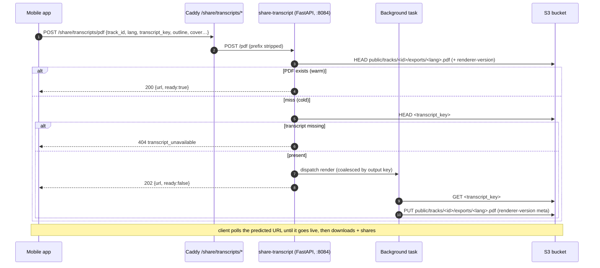
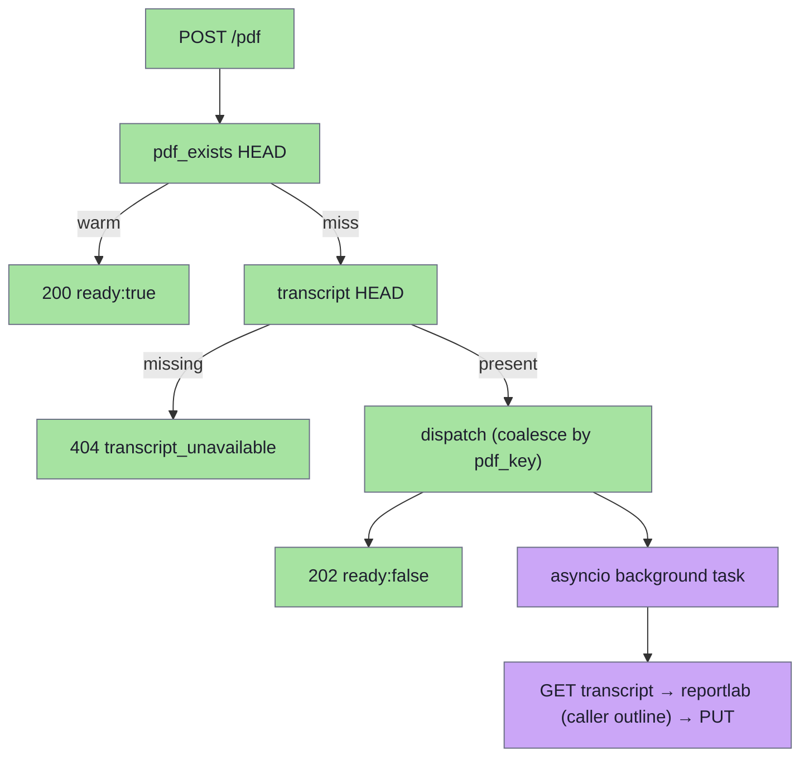
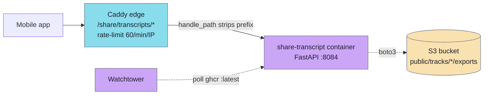

# share-transcript

A small Python/FastAPI HTTP service that renders a **printable transcript PDF** for one lecture and uploads it to S3 under `public/tracks/{trackId}/exports/{lang}.pdf`. It runs as a container in the host app stack (`infra/app/compose`) behind Caddy at `/share/transcripts/`, alongside `share-audio` and `share-video`. A `POST /pdf` with the track's cover metadata, an optional precomputed outline, and the S3 key of the transcript HEAD-probes for an existing PDF and — on a miss — dispatches a background render (fetch transcript → reportlab → upload) and returns the predicted public URL. The mobile app polls that URL, downloads it, and shares it like any other piece of content.

PDF rendering used to live inside the **chat** service (the `track_pdf_generate` tool rendered inline during a chat turn). It was extracted here so the renderer is owned by one place and **both** the chat share card and the Library share menu can render-on-tap through it, client-initiated, without the chat turn blocking on generation. See [chat-pipeline](../architecture/chat-pipeline.md).

The service is **stateless and purely a renderer**: it never opens the catalog DB and does no domain derivation of its own. The caller (chat, which has the catalog; or the mobile app, from its local content DB) assembles the cover metadata, the lecture outline (chapter headings, used as the PDF table of contents), and the transcript S3 key, and sends them all on the wire. The service only fetches the transcript JSON and renders.

## Layout

```
modules/services/share-transcript/
├── app/pyproject.toml                module lectorium-share-transcript (fastapi, boto3, reportlab; litellm still declared but unused since outline generation moved out)
├── app/src/share_transcript/
│   ├── main.py                        FastAPI app: lifespan, /healthz, POST /pdf, CORS
│   ├── config.py                      env-driven Settings loaded once at boot (+ RU URL-parity guard)
│   ├── pipeline.py                    prepare_pdf: warm HEAD → 404 gate → coalesced background render
│   ├── s3.py                          boto3 wrapper: pdf HEAD (renderer-version) / get json / put pdf
│   ├── meta.py                        TrackMeta/RefMeta — the wire cover metadata the caller supplies
│   └── render/                        reportlab renderer (render.py) + bundled DejaVu TTFs (fonts/)
├── Dockerfile                         python:3.12-slim, uvicorn share_transcript.main:app on :8084
└── README.md
```

The service is wired into the stack in `infra/app/compose/docker-compose.yml` (service `share-transcript`) and routed by `infra/app/compose/caddy/Caddyfile` under `handle_path /share/transcripts/*`.

## API

`GET /healthz` → `200 {"status":"ok","build":{"sha":"...","time":"..."}}`

`POST /pdf` (Caddy strips the `/share/transcripts` prefix, so the service sees `/pdf`; the format is the path segment — `/txt` etc. can be added later as sibling routes):

```json
{
  "track_id": "abc123",
  "lang": "ru",
  "transcript_key": "public/tracks/abc123/transcript.ru.json",
  "title": "…", "author_name": "…", "author_id": "…", "date": "1972-08-01",
  "location_name": "…", "location_id": "…",
  "references": [{"short_name": "ШБ", "full_name": "…", "source_id": "…", "tokens": "1.2.3"}],
  "tags": ["…"],
  "outline": [{"title": "Вступление", "start": 0, "end": 120000}]
}
```

`outline` is the precomputed lecture outline (chapter headings, `start`/`end` in milliseconds) the caller takes from the catalog; the service renders it as the PDF table of contents and as in-body section headings. Omit it (or send `[]`) for a TOC-less PDF — the service never generates an outline itself.

```json
{
  "track_id": "abc123",
  "lang": "ru",
  "url": "https://<bucket>.s3.<region>.amazonaws.com/public/tracks/abc123/exports/ru.pdf",
  "ready": true
}
```

Status codes (same client-initiated contract as share-audio's `/excerpts`):

- **200** — warm: the PDF is already on the CDN, `ready: true`, `url` is live now.
- **202** — cold: the render was dispatched to a background task; the response carries the predicted URL with `ready: false`. The client polls the URL until the object appears.
- **400** `{"detail": {"code": "bad_transcript_key"}}` — `transcript_key` outside `SOURCE_KEY_PREFIX`.
- **404** `{"detail": {"code": "transcript_unavailable"}}` — no transcript object at `transcript_key` (the common RU case); checked synchronously so it fails fast rather than as a poll timeout.
- **500** `{"detail": {"code": "render_failed"}}` — synchronous dispatch error.

### Request constraints

- `transcript_key` must start with `SOURCE_KEY_PREFIX` (default `public/tracks/`), rejected with 400 before any S3 GET.
- `lang` is any catalog language code (2–16 chars), not limited to `ru`/`en` — labels (Лектор / Дата / Содержание) fall back to English chrome for unknown codes; the transcript itself can be in any language.
- Cover fields (incl. `outline`) are all optional; the renderer degrades to an id-only cover with no TOC.
- The output key is deterministic from `(track_id, lang)`, so repeated calls reuse the same PDF (a warm HEAD short-circuits; concurrent cold renders are coalesced).

## Request flow



The cheap legs (warm HEAD, transcript-existence HEAD) run synchronously before responding; the heavy legs (transcript GET, reportlab render with the caller-supplied outline, PUT) run in a background task detached from the request, so a client disconnect doesn't kill the render.

## Concurrency model



`pipeline.py` coalesces background renders by the output key (`_inflight` dict): the first cold call for a `(track_id, lang)` starts an `asyncio` task and marks the key in-flight; concurrent calls while it runs reuse the running task; the key is released on completion (via `task.add_done_callback`). This is process-local best-effort (one uvicorn worker); a cross-worker duplicate just re-renders and overwrites the same idempotent key.

## Storage and URLs

`s3.py` (boto3, each call wrapped through `asyncio.to_thread`) touches two families of keys — **both schemes match what the chat renderer wrote, so a PDF produced before the extraction is reused as-is, and vice-versa**:

- **PDF (public, read + write):** `public/tracks/<id>/exports/<lang>.pdf`. The renderer version (`PDF_RENDER_VERSION = "v4"`) travels in object metadata (`x-amz-meta-renderer-version`), not the key — a HEAD whose tag mismatches the current version is treated as absent, so a layout bump re-renders in place without leaving orphans. The `put_pdf` also stamps `Content-Disposition: inline` (with the share filename) and `Cache-Control: public, max-age=86400`.
- **Transcript (read-only):** `<transcript_key>`, the published transcript JSON the caller names.

The outline is supplied by the caller in the request body, so the service neither reads nor writes any outline-cache key (that cache lives on the chat side).

The returned URL is `PDFS_PUBLIC_BASE + "/" + key` when set, otherwise the virtual-hosted `https://<bucket>.s3.<region>.amazonaws.com/<key>`. **This URL must byte-match what the mobile client predicts from the region `urlTemplate`**, or the warm-cache probe never hits and every share cold-renders — see the RU note under Configuration.

## Configuration

| Var | Default | Notes |
|---|---|---|
| `PORT` | `8084` | HTTP listen port. |
| `LECTORIUM_S3_BUCKET` (or `BUCKET`) | required | Target bucket; boot fails if unset. |
| `SOURCE_KEY_PREFIX` | `public/tracks/` | Only prefix the service will read transcripts from; others → 400. |
| `PDFS_PUBLIC_BASE` (or `LECTORIUM_S3_PUBLIC_BASE`) | (unset) | Public CDN base for the returned URL; overrides the virtual-hosted form. |
| `AWS_REGION` | `us-east-1` | |
| `S3_ENDPOINT_URL` | (unset) | For S3-compatible stores (Yandex Object Storage on RU). |
| `ENV`, `SERVICE_VERSION`, `LOG_LEVEL` | `dev`, `dev`, `info` | |
| `LECTORIUM_BUILD_SHA`, `LECTORIUM_BUILD_TIME` | (build args) | Stamped on `/healthz`. |

AWS credentials come from the standard env chain (`AWS_ACCESS_KEY_ID` / `AWS_SECRET_ACCESS_KEY`).

> **RU URL-parity (load-bearing).** `config.load()` **fails loudly at boot** if `S3_ENDPOINT_URL` is set but the public base is empty. On the RU proxy, S3 writes land on Yandex; if the public base isn't set to the Yandex host, the service would return `amazonaws.com` URLs for Yandex objects — the mobile warm-cache probe (Yandex `urlTemplate`) would never match the returned URL, so **every share cold-renders** and the URL may even 404. Set `LECTORIUM_S3_PUBLIC_BASE=https://akds-lectorium.storage.yandexcloud.net` on RU.

## Deployment



Image `ghcr.io/jiva-studio/lectorium-share-transcript:${LECTORIUM_SHARE_TRANSCRIPT_TAG:-latest}`, declared in `infra/app/compose/docker-compose.yml` under both the `origin` and `proxy` profiles — it runs on **both** roles so the RU proxy renders close to the Yandex bucket the PDF lands in. It runs under the shared `app-hardening` anchor with a `curl /healthz` healthcheck and the Watchtower label. Caddy routes `/share/transcripts/*` to `share-transcript:8084` (`handle_path`, `request_body max_size 100KB`, a `share_transcript` 60/min/IP rate-limit zone, `response_header_timeout 30s`). CORS is anonymous (`*` origins, `POST`/`OPTIONS`, `Content-Type` only — no `Authorization`).

## Why Python (vs share-audio/share-video in Go)

The renderer is reportlab — Python, lifted wholesale out of the chat service. Re-implementing the PDF layout in Go would diverge the renderer from the one chat was already validated against, for no benefit. The deploy shape (Dockerfile/compose/Caddy/CI) mirrors the Go share-* services; only the language differs.

## Constraints worth remembering

- **Pure renderer, no catalog.** The service never reads the catalog DB and derives nothing — the caller supplies the cover metadata, the outline, and the transcript key. The service only fetches the transcript JSON and renders.
- **Cold renders are asynchronous** — a miss returns 202 + the predicted URL; the object appears once the background task uploads it. Clients tolerate the URL 404'ing briefly.
- **PDF-artifact parity with chat is exact** (PDF key, `renderer-version=v4`). Changing either in one place without the other splits the cache.
- **No JWT.** Like share-audio, the endpoint is anonymous; the `SOURCE_KEY_PREFIX` gate + the Caddy per-IP rate-limit are the defence.

## Manual operations

```bash
# Health / build stamp
curl -fsS https://<host>/share/transcripts/healthz

# Smoke-test a render
curl -X POST https://<host>/share/transcripts/pdf \
  -H 'Content-Type: application/json' \
  -d '{"track_id":"<id>","lang":"ru","transcript_key":"public/tracks/<id>/transcript.ru.json","title":"Smoke"}'

# Local dev (compose)
docker compose -f infra/app/compose/docker-compose.yml \
               -f infra/app/compose/docker-compose.dev.yml \
               up --build share-transcript
```
