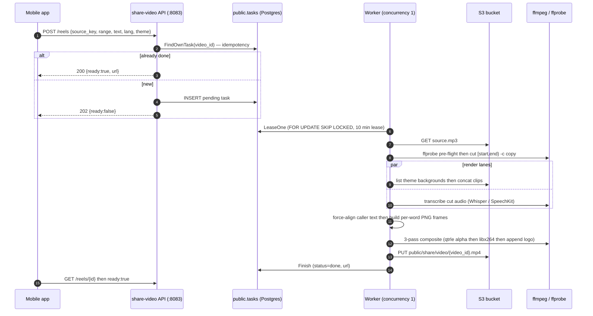
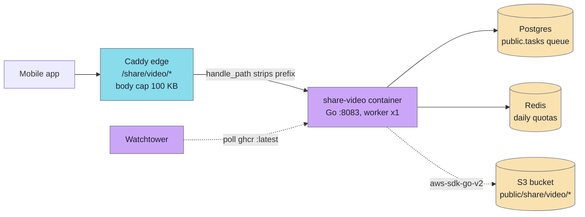

# share-video

A Go HTTP service that renders a **9:16 vertical reel** (720×1280 MP4) from an MP3 fragment plus the caller-supplied transcript text: words are highlighted in sync with the audio over a randomised video background, with an optional title card and a trailing logo clip. Unlike [share-audio](share-audio.md) — a sub-second stream-copy cut with no datastore — share-video is a heavyweight, multi-pass ffmpeg encode (~minutes) backed by a **durable Postgres task queue**, Redis daily quotas, and JWT auth. It runs as a container in the host app stack behind Caddy at `/share/video/*`, with worker concurrency deliberately pinned to **1** (720p ffmpeg ≈ 1.75 vCPU).

## Layout

```
modules/services/share-video/
├── cmd/share-video/main.go         boot: config, S3, DB queue, JWT verifier, chi server, worker loop
├── internal/config/config.go       env-driven Config (slide size, prefixes, transcriber, quotas)
├── internal/httpx/server.go        chi router: /healthz, POST /reels, GET /reels/{id}
├── internal/httpx/reels.go         handlers — idempotency, quota, 202+poll envelope
├── internal/httpx/validate.go      request validation (source_key regex, ≤120 s, body ≤32 KB)
├── internal/worker/loop.go         single worker: lease → render → finish, 2.5 s poll, 10 min lease
├── internal/db/tasks.go            public.tasks queue (FOR UPDATE SKIP LOCKED, lease/revive/retry)
├── internal/pipeline/render.go     Renderer.Render — the staged render pipeline
├── internal/pipeline/ffmpeg.go     ffprobe pre-flight + cut (-c copy) + concat helpers
├── internal/pipeline/backgrounds.go S3 theme-pack listing, deterministic clip pick, concat
├── internal/pipeline/align/        force-align caller text to recogniser word timings (LCS)
├── internal/pipeline/reel/         per-word PNG frames + 3-pass composite (qtrle → x264 → logo)
├── internal/storage/s3.go          aws-sdk-go-v2 wrapper (region/endpoint aware)
├── Dockerfile                      golang:1.25-alpine → alpine:3.20 (ffmpeg + tini)
└── README.md
```

Wired into `infra/app/compose/docker-compose.yml` (service `share-video`, profiles `[origin, proxy]`) and routed by `infra/app/compose/caddy/Caddyfile` under `/share/video/*` → `share-video:8083`. A legacy Serverless/Lambda TypeScript variant survives under `dist/` for parity reference only — the Go service is what ships.

## API

`GET /healthz` → `200 {"status":"ok","build":{"sha":"...","time":"..."}}` (open, no auth).

`POST /reels` and `GET /reels/{id}` both require a **JWT (RS256)** via the `RequireAuth` middleware.

```json
// POST /reels
{
  "source_key": "public/tracks/<id>/audio/source.mp3",
  "start_ms": 125000,
  "end_ms": 187000,
  "text": "the punctuated transcript for this excerpt …",
  "lang": "en",
  "theme": "calm_water",
  "video_id": "optional-stable-id",
  "title": "optional title card (≤120 chars)"
}
```

```json
// 202 Accepted (cold) / 200 (cached & done)
{ "video_id": "5f…", "ready": false }

// GET /reels/{id} once done
{ "video_id": "5f…", "ready": true, "url": "https://…/public/share/video/5f….mp4" }
```

Status codes:

- **200** — `video_id` already rendered (`status=done`), `ready: true` with the URL.
- **202** — task is `pending`/`running`; client polls `GET /reels/{id}` until `ready: true`.
- **400** `{"error": "..."}` — validation (bad `source_key`, excerpt > 120 s, oversized body, bad `lang`/`theme`).
- **404** — unknown id, or an id owned by another user (ownership is enforced in SQL, so a foreign id returns 404, never 403 — ids can't be probed).
- **429** `{"code":"rate_limited","limit":N,"current":M,"key_type":"user"}` — daily quota exceeded.
- **500** `{"error": "..."}` — render failure.

### Request constraints

- `source_key` must match `^public/(tracks|shares)/[^\s]+\.mp3$`; excerpt ≤ **120 s**; `text` ≤ 5000 chars; `lang` is ISO-639-1 (two lowercase letters); `theme` is `[a-z0-9_-]{1,32}`; JSON body ≤ 32 KB with unknown fields rejected.
- `video_id` (if supplied) is the idempotency key: a repeat is looked up **before** the quota check, so re-polling a known id never burns quota.
- Daily quota is a Redis per-user counter — anon **3** / signed-in **20** reels/day (configurable).

## Render pipeline



Highlights of `Renderer.Render` (`internal/pipeline/render.go`):

1. **Download + ffprobe pre-flight** — rejects non-mp3/m4a, bad codec, zero/over-long duration before any ffmpeg call.
2. **Cut** `[start_ms, end_ms)` with `ffmpeg -ss -i -t -c copy` (same stream-copy invocation as share-audio).
3. **Backgrounds and transcription in parallel** (`errgroup`): the theme pack `private/share/video/backgrounds/<theme>/*.mp4` is listed (5-min in-process cache), clips picked deterministically via a Fisher-Yates shuffle seeded by `sha256(video_id)` (byte-compatible with the legacy TS picker), and concat-demuxed to the cut duration; meanwhile the cut audio is transcribed for word timings.
4. **Force-align** the caller's punctuated `text` to the recogniser timings (LCS + interpolation) and group into ≤ 60-char slides.
5. **Per-word PNG frames** (NotoSans-Bold, gold highlight on the active word) with an optional title card on the first 0.5 s.
6. **3-pass composite**: PNG concat → `qtrle` `.mov` with alpha → overlay on background + map audio to `libx264 -crf 23 -pix_fmt yuv420p -r 30` + `aac` → optional logo append. ffmpeg shells out with a 5 s `WaitDelay` so a cancelled context kills the subprocess.

## Durable queue

share-video shares the `public.tasks` table with `kind = 'share_video.render'` (`internal/db/tasks.go`). `LeaseOne` claims the oldest `pending` row with `FOR UPDATE SKIP LOCKED` plus a single `UPDATE … RETURNING`, stamping a 10-minute lease and a `worker_id`. `Finish`/`Fail` are lease-guarded (`status='running' AND worker_id=$x`, else `ErrLeaseLost`), and `ReviveExpired` flips any lapsed `running` row back to `pending` at boot — so a crash mid-render is retried, not lost. `Fail` runs on a background 10 s context so the status UPDATE survives a mid-render cancel, and retries up to the row's `max_attempts`.

## Configuration

| Var | Default | Notes |
|---|---|---|
| `PORT` | `8083` | HTTP listen port. |
| `DATABASE_URL` | required | Postgres queue (`public.tasks`). |
| `REDIS_URL` | required | Daily per-user quota counters. |
| `LECTORIUM_S3_BUCKET` (or `BUCKET`) | required | Target bucket. |
| `LECTORIUM_S3_BACKGROUNDS_PREFIX` | `private/share/video/backgrounds` | Theme packs (read-only). |
| `LECTORIUM_S3_VIDEO_PREFIX` | `public/share/video` | Rendered reel output prefix. |
| `OUTPUT_PUBLIC_BASE` (= `LECTORIUM_S3_PUBLIC_BASE`) | (unset) | CDN base; **must** be set on the RU proxy or URLs point at AWS while files live on Yandex. |
| `TRANSCRIBER` | `whisper` | `whisper` (needs `OPENAI_API_KEY`) or `speechkit` (needs `SPEECHKIT_API_KEY`). |
| `AWS_REGION` | `us-east-1` | |
| `S3_ENDPOINT_URL` | (unset) | S3-compatible override (Yandex Object Storage on the RU proxy). |
| `JWT_PUBLIC_KEY_PATH` | `/secrets/public.pem` | RS256 verify key. |
| `SHARE_VIDEO_ANON_PER_DAY` / `SHARE_VIDEO_SIGNED_IN_PER_DAY` | `3` / `20` | Redis daily quota. |
| `FFMPEG_BIN` / `FFPROBE_BIN` | `/usr/bin/...` | |
| `TEMP_ROOT` | `/tmp/render` | Per-task scratch dir, removed after each render. |

AWS credentials come from the standard env chain (`AWS_ACCESS_KEY_ID` / `AWS_SECRET_ACCESS_KEY`).

## Deployment



Ships as `ghcr.io/jiva-studio/lectorium-share-video:${TAG:-latest}`. The two-stage Dockerfile builds a static binary then runs it on `alpine:3.20` with `ffmpeg`, `curl`, `ca-certificates`, `tini`, and the bundled assets (`logo.mp4`, `icon.png`, `NotoSans-Bold.ttf`) as an unprivileged `share` user. Compose deps: `postgres` healthy, `redis` healthy, `migrator` completed; a named volume `share_video_scratch:/tmp/render`; Watchtower-enabled. Caddy caps the request body at 100 KB and the response-header timeout at 30 s.

## Constraints worth remembering

- **Excerpt ≤ 120 s** and a single worker — reels render serially; a backlog queues in Postgres rather than fanning out.
- **JWT required** on `/reels` (unlike share-audio, which is open) — the reel embeds the user's transcript text and counts against their quota.
- **Cold renders are async** — a miss returns 202; poll `GET /reels/{id}` until `ready: true`. The object 404s until the worker uploads it.
- **`OUTPUT_PUBLIC_BASE` must be set on the RU proxy**, or returned URLs are AWS virtual-host paths pointing at files that actually live on Yandex → broken playback.
- **Themes are S3 theme packs**, not bundled — a missing `private/share/video/backgrounds/<theme>/` yields a render with no background.

## Manual operations

```bash
# Health / build stamp
curl -fsS https://<host>/share/video/healthz

# Kick a render (needs a valid JWT)
curl -X POST https://<host>/share/video/reels \
  -H "Authorization: Bearer $JWT" -H 'Content-Type: application/json' \
  -d '{"source_key":"public/tracks/<id>/audio/source.mp3","start_ms":5000,"end_ms":20000,
       "text":"...","lang":"en","theme":"calm_water","video_id":"smoke"}'

# Poll
curl -fsS -H "Authorization: Bearer $JWT" https://<host>/share/video/reels/smoke
```
