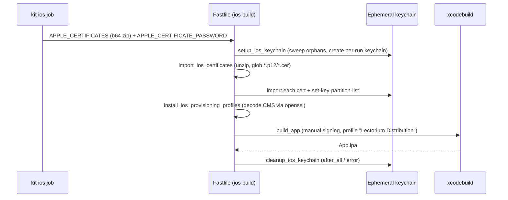

# App Store Certificates

During the build and release process, you will need to sign the app with your Apple Developer certificates. To do so, you must have all the certificates and private key in the keychain. Provisioning profiles are also needed.

1. Create a certificate signing request (CSR) using Keychain Access. 
   - Open Keychain Access on your Mac.
   - In the menu bar, select `Keychain Access` > `Certificate Assistant` > `Request a Certificate From a Certificate Authority`.
   - Select "Saved to disk" for the CSR option. Save the CSR file to your computer.
   - Save the private key also. This is important for signing the app. Without the private key, all the certificates will be untrusted.

2. Go to the [Apple Developer Certificates](https://developer.apple.com/account/resources/certificates/list) page and create a new certificate. Use the CSR you created in step 1. 
   - Create a Development certificate.
   - Create a Distribution certificate.

3. Got to the [Apple Developer Provisioning Profiles](https://developer.apple.com/account/resources/profiles/list) page and create a new provisioning profile. 
   - Select the type of provisioning profile you need (Development or Distribution).
   - Select the app ID, devices, and certificate you created in step 2.
   - Download the provisioning profile.

4. Download all the certificates and provisioning profiles to your computer. 
   - The certificates will be in `.cer` format.
   - The provisioning profiles will be in `.mobileprovision` format.
   - Private key will be in `.p12` format.

5. Put the `.p12` private key, the `.cer` certificates, and the `.mobileprovision` provisioning profiles into a single **ZIP** archive. The Fastfile unzips the decoded bundle (`unzip -o output.zip`), so the bundle must be a zip — not a tar or any other format.

6. Convert the zip to base64 format.
   - Use the following command:
     ```bash
     base64 -i <archive_file.zip> -o <output_file>
     ```
7. Store the base64 string in the `LECTORIUM_APPLE_CERTIFICATES` repository secret, and store the `.p12` export password in the `APPLE_CERTIFICATE_PASSWORD` repository secret. The `Mobile / Binaries` workflow (`.github/workflows/apps-mobile-binaries.yml`) passes `LECTORIUM_APPLE_CERTIFICATES` into the kit reusable workflow as the generic `APPLE_CERTIFICATES` secret, which the Fastfile reads (`ENV.fetch("APPLE_CERTIFICATES")`); the key is read with `APPLE_CERTIFICATE_PASSWORD` when importing each `.p12`.

8. Filenames inside the bundle are not hardcoded — `modules/apps/mobile/fastlane/Fastfile` walks the unpacked archive recursively (`Dir.glob("**/*.p12")`, `**/*.cer`, `**/*.mobileprovision`) and imports **every** matching file it finds into an ephemeral per-run keychain. What does have to match is the provisioning profile's **internal name**, which the Fastfile pins to:

    - `Lectorium Distribution` (constant `IOS_PROVISIONING_PROFILE_NAME` in `Fastfile`)

    Make sure your distribution profile is named exactly that on Apple Developer; the local filenames inside the zip are irrelevant.

9. The signing flow is triggered by the manual `Mobile / Binaries` workflow (`.github/workflows/apps-mobile-binaries.yml`, `workflow_dispatch` only). It delegates to kit's reusable `akdasa-studios/kit/.github/workflows/mobile-binaries.yml@main`, which runs the `ios build` lane (`fastlane ios build`). Per-push CI (`.github/workflows/apps-mobile.yml`) stays web-only and never signs — so the binaries workflow is the canonical place to look when signing breaks in CI.

## How the bundle is consumed at build time

The `ios build` lane (`modules/apps/mobile/fastlane/Fastfile`) sets signing up in three private lanes before archiving:



The keychain is unique per CI run (`lectorium-build-<GITHUB_RUN_ID>.keychain`) and is swept/deleted around the build so parallel iOS jobs on the shared self-hosted runners don't clobber each other. Provisioning profiles are decoded with `openssl cms -verify -noverify` (not fastlane's built-in parser, which breaks on newer macOS) and copied into `~/Library/MobileDevice/Provisioning Profiles/` keyed by their UUID.
