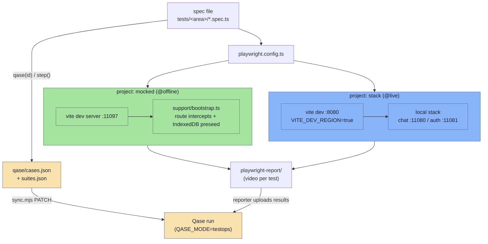
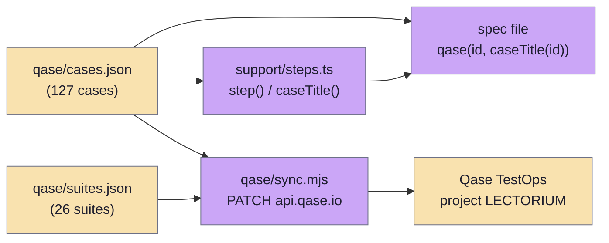

# Testing & Qase

Lectorium's end-to-end coverage is a Playwright suite that drives the **mobile web app** through real user gestures (`tests/e2e/mobile`), plus the chat service's `pytest` graph tests (`modules/services/chat/app/tests`). The Playwright suite runs on two axes — an **execution tag** that picks a server/project (`@offline` deterministic fixtures vs `@live` real local stack) and an **area tag** that names the screen — and a single run produces one HTML report (a video per test). A JSON case registry (`qase/cases.json`, `qase/suites.json`) is the single source of truth for both step text and what gets synced into Qase, and the Playwright run can push pass/fail + screenshots/video/trace into an existing Qase run via the `playwright-qase-reporter`.

> Code: `tests/e2e/mobile/playwright.config.ts` · `tests/e2e/mobile/support/` · `tests/e2e/mobile/qase/sync.mjs` · `tests/e2e/mobile/scripts/` · `.github/workflows/e2e.yml` · `modules/services/chat/app/tests/test_graph_e2e.py`

> The suite lives at `tests/e2e/mobile` in the repo (at the repo root, not under `modules/`). Paths below are relative to that directory.

## At a glance



## The mobile Playwright suite

### Layout

Specs are grouped by app area under `tests/`, each a `*.spec.ts` driven through the rendered UI only. The top-level area dirs are:

- `tests/account`, `tests/chat`, `tests/downloads`, `tests/help`, `tests/home`, `tests/library`, `tests/player`, `tests/search`, `tests/settings`, `tests/subscription`.
- Deeper journeys live in subgroups, **not** their own top-level dir: transcript + notes specs are under `tests/player/transcript` / `tests/player/notes`; collection + topic specs under `tests/library/collections` / `tests/library/topics`; chat rate-limit/history specs under `tests/chat/rate-limits` / `tests/chat/history`.

Support harness in `support/`:

| File | Role |
| --- | --- |
| `support/test.ts` | Shared `test`/`expect` re-export plus `requireFixtures()` — `test.skip` when the gitignored binary fixtures aren't present, so a plain CI checkout stays green instead of erroring. |
| `support/bootstrap.ts` | Offline `boot()` (and `interceptContent()`) — Playwright route intercepts for `**/public/config.json`, `**/public/db/lectorium.*.db`, `**/public/tracks/*/audio/*` (the silent MP3 stub) **and `**/public/tracks/*/transcripts/*.json`** (a fixture transcript with `trackId`/`language` rewritten to match the request), then pre-seeds the user DB into IndexedDB (`lectorium` DB) before boot. |
| `support/live.ts` | `bootLive()` for `@live`: intercepts nothing, navigates to the real app (served with `VITE_DEV_REGION=true`), waits for `**/tabs/home`. Has `askChat()`/`assistantBubble()` helpers. |
| `support/chat-mock.ts` | Offline chat error/quota mocks — mints an unsigned JWT carrying `tier`/`quota_id`, mocks `**/auth/anonymous` + `**/auth/me`, and `mockChatStream()` builds an SSE body from `delta`/`done`/`action` frames. |
| `support/fixtures.ts` | Fixture paths + presence checks (`fixturesReady()`, `missingFixtures()`); resolves the catalog DB version from `modules/db-scheme.json`. |
| `support/globalSetup.ts` | Refreshes `content.db` from the newer local lake catalog and runs `prepare-fixtures.sh` if anything is missing — best-effort, never fails the run. |
| `support/steps.ts` | The registry bridge: `caseTitle(id)`, `step(page, caseId, index, body)` — pulls action/expected text from `qase/cases.json` and, in Qase mode, attaches an end-of-step screenshot. |
| `support/nav.ts` | Navigation helpers (`gotoTab`, etc.). |

### Fixtures

The app bounces to `/welcome` without a catalog DB and a user DB, so the suite pre-seeds both rather than clicking through onboarding (`fixtures/`, gitignored except `silent.mp3`):

- `content.db` — snapshot of the published catalog DB (from the local lake `resources/lake-out/artifacts/catalog/current.db`, the screenshot pipeline's copy, or fetched from the CDN).
- `user-<locale>.db` in three strategies — `preseed` (full demo: ~9 playlist tracks, history, notes), `.clean` (schema + config only), `.single` (one queued downloaded track). Produced by the screenshot pipeline's generator (`modules/tools/screenshots/generate-fixtures`).
- `silent.mp3` — a valid ~1s silent MP3 so playback genuinely starts.

Recreate the gitignored fixtures with `scripts/prepare-fixtures.sh`. Transcript JSON **is** intercepted by `interceptContent()` (one fixture transcript served for every track, `trackId`/`language` patched to match the URL), so the reader renders offline + deterministically; the transcript-error / offline specs override that route with `route.abort("failed")` to exercise the failure path. (The committed `README.md` still says transcripts hit real S3 — that note is stale; `support/bootstrap.ts` adds the transcript intercept.)

### Tag taxonomy & the project split

Every spec carries two tag axes (`README.md`):

- **Execution tag** picks the server + Playwright project:
  - `@offline` — deterministic, fixture-backed, no backend. Runs in the **`mocked`** project against a Vite dev server on `E2E_PORT` (default `11097`). This is what `npm test` runs.
  - `@live` — drives the real local stack (chat + auth). Runs in the **`stack`** project against the app served with `VITE_DEV_REGION=true`. Only added when `E2E_INCLUDE_LIVE=1`.
- **Area tag** — the README documents `@home` · `@library` · `@player` · `@transcript` · `@notes` · `@settings` · `@chat`, and in practice specs also carry `@search` · `@account` · `@subscription` (plus a few `@welcome` / `@error`). Filter with `npx playwright test --grep @chat` across both tiers.

`playwright.config.ts` defines the two projects with `grep: /@offline/` and `grep: /@live/`. Project names are deliberately `mocked`/`stack`, not the tag names, so the project chip doesn't duplicate the tag chip in the report. `test:all` (`E2E_INCLUDE_LIVE=1 playwright test`) runs both into one `playwright-report/`.

### The `@live` CORS gotcha

The live app **must be served from a CORS-whitelisted origin (port `8080`)**. The chat service's `CORS_ALLOW_ORIGINS` (in `infra/app/.env.dev`) whitelists `8080`/`11001`. An arbitrary port gets its CORS **preflight rejected (400)**, the chat `POST` is silently blocked, and the UI hangs on **"Thinking…"**. `playwright.config.ts` defaults `LIVE_PORT` to `8080` (override with `E2E_LIVE_PORT` only if your CORS list differs); `11001` is avoided because it's the app's own dev port. See [chat-pipeline.md](../architecture/chat-pipeline.md) for the chat service behind the `@live` tier.

### Running the suite

A `Makefile` wraps everything (from `tests/e2e/mobile`):

```bash
make install     # one-time: npm install + chromium + prepare-fixtures.sh
make test        # offline suite (fast, no backend)        → npm run test:offline
make all         # offline + live, one report               → scripts/run-all.sh
make live        # live only (brings the stack up first)
make report      # open the HTML report (video per test)
make stack       # just bring the local backend stack up    → scripts/live-up.sh
```

The npm scripts behind them (`package.json`):

| Script | Effect |
| --- | --- |
| `test` / `test:offline` | `playwright test --project=mocked` (the `@offline` tier). |
| `test:live` | `E2E_INCLUDE_LIVE=1 playwright test --project=stack`. |
| `test:all` | `E2E_INCLUDE_LIVE=1 playwright test` (both projects, one report). |
| `test:qase` / `test:qase:all` | as above with `QASE_MODE=testops` to publish results. |
| `report` | `playwright show-report`. |

The two helper scripts:

- `scripts/run-all.sh` — brings the stack up if `chat /readyz` isn't already green (`docker compose` with the `origin` profile: postgres + redis + migrator + auth + chat), serves live from the CORS-whitelisted `:8080`, then runs `test:all`.
- `scripts/live-up.sh` — first-run `make stack-setup` if `infra/app/.env.dev` is absent, injects secrets from `tests/e2e/mobile/.env.local` (`OPENROUTER_API_KEY`, optional `AWS_*`) into `.env.dev`, `make stack-up`, then waits for chat `/readyz`. Chat can't answer (`/readyz` stays false) without `OPENROUTER_API_KEY`; an empty corpus still streams an ungrounded reply — enough for the send/receive smoke test.

### What CI does

Two CI paths touch this suite (`README.md`):

- **`e2e (manual)` workflow** (`.github/workflows/e2e.yml`) — the **real run**, `workflow_dispatch` only (kept manual because it boots the app and is heavier than unit jobs). It fetches the `kit` submodule via ssh, builds the in-house Capacitor plugins (`build-audio-player`, `build-media-downloader`), `npm ci` for the mobile app and the e2e deps, runs `prepare-fixtures.sh` (which fetches the published catalog from the CDN and seeds the user DBs), installs Chromium, runs `npx playwright test` (offline tier), and uploads `playwright-report/` as an artifact.
- **kit reusable `e2e` job** (auto, on mobile PRs) — a **no-op**: it activates because `package-lock.json` is committed, but every spec `test.skip`s when the fixtures aren't prepared (`support/test.ts` → `requireFixtures()`), so it stays green without real work.

## Qase sync

The JSON registry under `qase/` is the single source of truth, used in two directions:



- **`qase/cases.json`** — a map of Qase case id → `{ suite_id, automation, title, description, preconditions, steps[], tags }`. Each step is `{ action, expected }`. `support/steps.ts` reads this file so a spec's step text lives in exactly one place; a spec links itself with `test(qase(id, caseTitle(id)), …)` and drives each step with `step(page, id, index, body)`.
- **`qase/suites.json`** — a map of suite id → `{ title, parent_id, description }` (nested suites, e.g. `Playlist` under `Home`, `Filters`/`Tracks` under `Search`).
- **`qase/sync.mjs`** — one-way push of the registry **into** Qase. It `PATCH`es `/case/<PROJECT>/<id>` (title/description/preconditions + classic `steps`) and `/suite/<PROJECT>/<id>`. Token from `QASE_TESTOPS_API_TOKEN` (env or `tests/e2e/mobile/.env.local`); project defaults to `LECTORIUM`. Modes: `node qase/sync.mjs` (all), `… 85 86` (specific ids), `--suites`, `--cases`, `--dry`.

### Pushing run results

Result publishing is separate from the registry sync and is handled by the `playwright-qase-reporter`, which is always configured but a no-op unless `QASE_MODE=testops` (`playwright.config.ts`). To push results **into an existing run** (created from a Qase test plan) without closing it:

```bash
QASE_MODE=testops \
  QASE_TESTOPS_API_TOKEN=… \
  QASE_TESTOPS_RUN_ID=<id> \
  npm run test:qase
```

`run.complete` stays `false` (override with `QASE_TESTOPS_RUN_COMPLETE=true`) so the run stays open for the remaining manual cases. `uploadAttachments` is on, so each result carries its Playwright screenshot/video/trace. To keep within the Free plan's storage, Qase mode drops to failure-only video unless `QASE_VIDEO_ALL=1`.

## Chat service tests (pytest)

The chat service has its own Python test suite under `modules/services/chat/app/tests` (`pytest` with `asyncio_mode = "auto"`, configured in `modules/services/chat/app/pyproject.toml`). It is unit/integration-heavy — router, react loop, synthesizer, marker expansion, citation localization, idempotency, etc. — plus:

- **`test_graph_e2e.py`** — a graph-level end-to-end test that wires a `FakeLLM` for the router and another for the synthesizer + workers, drives the full chat graph through `astream`, and asserts the SSE stream shape. It deliberately does not test individual nodes (those have their own files); it exists to catch wiring regressions — schema mismatches, missing edges, broken context plumbing.
- **`tests/integration/`** — heavier integration flows (`test_attribution_full_flow.py`, `test_xff.py`) with their own `conftest.py`.
- **`tests/evals/`** — eval harness and observers for offline scoring runs.

See [chat-pipeline.md](../architecture/chat-pipeline.md) for the chat graph these tests exercise and [attribution.md](../architecture/attribution.md) for the attribution flow under `test_attribution_full_flow.py`.
</content>
</invoke>
