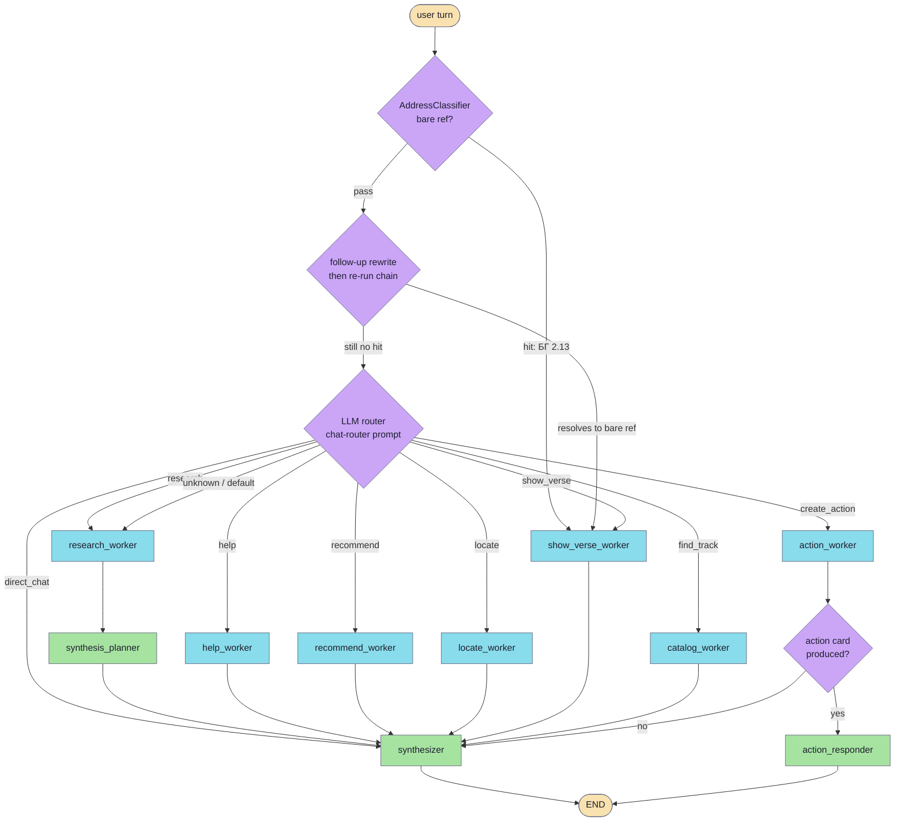
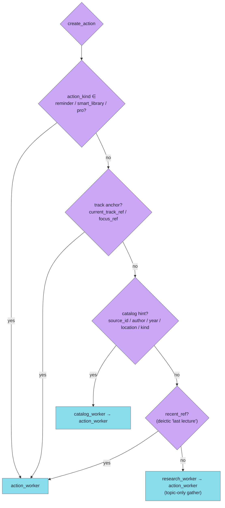
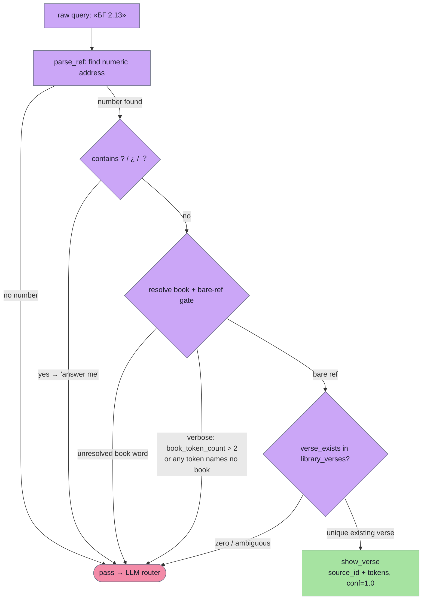
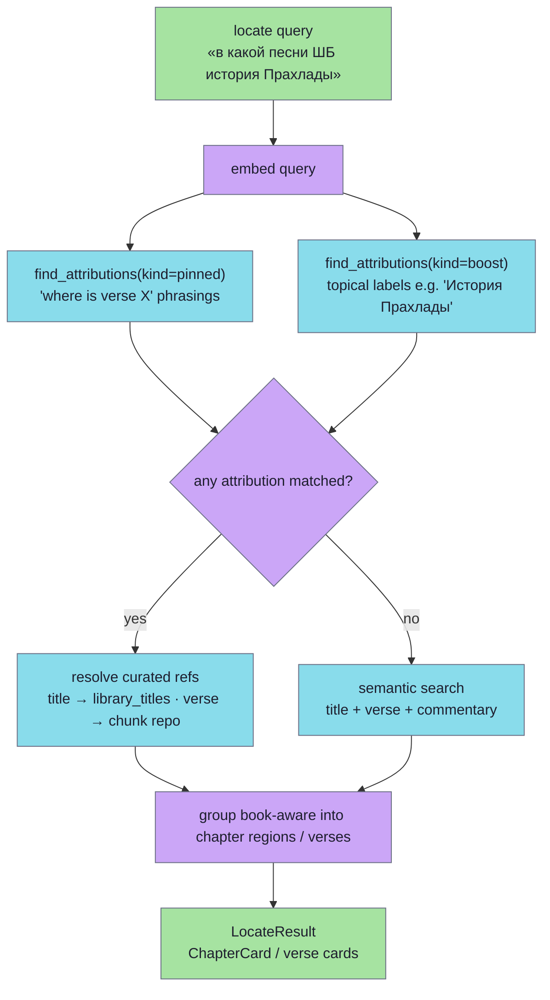

# Chat intents & routing

Every chat turn opens with a **router** that classifies the user's message into one of nine intents and dispatches it to a dedicated worker, which gathers grounding before the synthesizer writes the answer. Classification runs as a chain: a cheap, deterministic `AddressClassifier` is tried first and short-circuits bare scripture references (`БГ 2.13` → `show_verse`) without ever calling the LLM; everything it passes on falls through to the LLM router. The router is deliberately retrieval-biased — a philosophical or doctrinal question is always `research` (it must reach the corpus), and a genuinely uncertain turn degrades to `unknown`, which still runs a light research pass rather than emitting a canned "not found". This page documents the intent set, the deterministic short-circuit, the routing graph, and the curated-attribution path that powers `locate` / pinned answers.

> Code: `modules/services/chat/app/src/shruti_chat/agent/graph/nodes/router.py`, `application/router_turn.py`, `agent/prompts/router.md`, `domain/routing.py`, `agent/graph/conditional.py`, `agent/classify/address.py`, `research/locate.py`, `research/attribution_lookup.py`

Related: [chat-pipeline.md](chat-pipeline.md) · [attribution.md](attribution.md) · [multilanguage.md](multilanguage.md)

## The intent set

The intent enum is the single source of truth in `domain/routing.py` (`Intent = Literal[...]`). Adding an intent there is the one place routing has to change to recognise it.

| Intent | Meaning | Worker | Notes |
|---|---|---|---|
| `direct_chat` | Greetings, thanks, meta-talk; nothing to search. | *(none)* → `synthesizer` | Tool-less; goes straight to the synthesizer. |
| `help` | Questions about the **app itself** (how to make a playlist, what the green dot means). | `help_worker` | Reads bundled in-app docs. Personal-history asks ("что мне послушать") are NOT help. |
| `research` | ANY content search across lectures / verses / commentaries / letters / media — **including** every philosophical / theological question. | `research_worker` → `synthesis_planner` → `synthesizer` | The retrieval-bearing default. Deictic recaps set `recent_ref` / `current_ref` (see below). |
| `locate` | WHERE in scripture a topic / story / verse lives — the structural ADDRESS (canto / chapter / verse), not a retold answer. | `locate_worker` | Reverse lookup: topic → address. Driven by curated attributions. |
| `find_track` | Catalog lookup by metadata (title, source/verse address, date, location, author) or listening history by time window. Playlist requests too. | `catalog_worker` | Any "show / list / покажи LECTURES" phrasing — the user wants a list of track cards, not a snippet. |
| `recommend` | Personal "what to listen to next" with **no** named topic / author / date. | `recommend_worker` | Deterministic topic-affinity over listening history; no LLM ReAct loop, no extracted args. |
| `show_verse` | A bare scripture reference (`БГ 2.13`) — fetch and show that verse. | `show_verse_worker` | Normally produced by the deterministic `AddressClassifier`, not the LLM. |
| `create_action` | User wants to TRIGGER / CREATE something — PDF/transcript export, daily reminder, smart-library, Pro upgrade. | `action_worker` (possibly via a pre-action search) | `action_kind` ∈ `pdf` / `reminder` / `smart_library` / `pro`. The action token wins over any topic or verse address in the query. |
| `unknown` | Genuinely out-of-scope (weather, "write me Python"), nonsense, or empty; also the soft fallback. | `research_worker` (light pass) | A real question about the teachings is NEVER `unknown` — when in doubt, choose `research`. |

### `unknown` vs `research` — why philosophical questions must reach retrieval

Short, blunt, or yes/no doctrinal questions ("сколько лет богу", "вечен ли Бог", "does the soul die") read like trivia but are exactly what Prabhupāda's lectures and the scriptures answer. The router prompt forbids sending such queries to `unknown`. Two layers enforce this:

- **Router prompt** (`agent/prompts/router.md`): a philosophical / theological / doctrinal question is ALWAYS `research`, even when phrased as one plain fact.
- **`run_router_turn` low-confidence collapse** (`application/router_turn.py`): a sub-0.5 confidence normally collapses an intent to `unknown` (the soft fallback). But `_RETRIEVAL_BEARING_INTENTS = {"research", "locate", "find_track"}` are **exempt** — a low-confidence `research` still runs its worker's search rather than being flattened into a tool-less reply. Only genuinely low-signal intents (`direct_chat` / `help` / `recommend` / `show_verse` / `create_action`) collapse.

Even what does reach the router as `unknown` is not refused outright: `route_after_router` sends `unknown` (and any unrecognised intent) through a **light research pass**. A single misclassification therefore can't produce a confident, retrieval-skipped "not found" — `research_worker` either grounds the answer or honestly comes up empty, and the synthesizer phrases the result.

## Routing graph

The graph topology is built in `agent/graph/builder.py`; the first hop out of the router is decided by `route_after_router` in `agent/graph/conditional.py`. Only the `research_worker → synthesizer` arm passes through `synthesis_planner` — that is the only path that produces prose-grounding notes. Catalog / recommend / help / locate / show_verse workers emit list-tile or pointer envelopes and go straight to the synthesizer.

### `create_action` — first hop depends on what's already known

`create_action` has the richest dispatch. `route_after_router` chooses the pre-action step so the `action_worker` (which has no search tools of its own) receives real `track_ids`:

When the `action_worker` produces a card (a `tool_result` with an `action_id` and a `kind` ∈ `share_pdf` / `enable_daily_reminder` / `configure_smart_library` / `upgrade_to_pro`), `route_after_action` routes to the deterministic `action_responder` (emits just the `[action:<kind>|id=…]` marker, no LLM). When nothing was produced, it falls through to the synthesizer, which writes the localized "не нашёл…" message — the only part that needs an LLM.

### Deictic recap routing (`recent_ref` / `current_ref`)

A `research` recap of the user's OWN history can only be resolved against listening history, not a blind corpus search:

- `recent_ref: true` ("перескажи последнюю лекцию") → `catalog_worker` (resolves the track via `user_tracks_list`).
- `current_ref: true` with the `current_track_ref` anchor set ("перескажи текущую лекцию") → `catalog_worker` (carries the anchor + `track_outline_get`).

Routing either of these to `research_worker` is the historical bug class where the code-driven research path never sees the anchor and refuses with an empty-corpus message.

## The deterministic `AddressClassifier` short-circuit

Before the LLM router runs, `router_node` runs a deterministic classifier chain (`_DETERMINISTIC_CHAIN = [AddressClassifier()]`) on the **raw** query. The classifier contract lives in `agent/classify/base.py`: each link either claims the turn (returns a `RoutingDecision`) or passes (`None`); the first non-None wins; the LLM router is the last link. A rule that raises is treated as a miss so one buggy rule can never break routing.

### Why pre-router

The LLM router lossily collapses references — e.g. it turned `Мадхья лила 17.80` into `source_id="CC"`, dropping the lila (CC Adi and CC Madhya both have a 17.80, so it becomes unrecoverable). Reading the raw query keeps the lila and resolves it. Running on the raw query **before** the follow-up rewrite also protects the fast path: the rewriter tends to dress `БГ 2.13` up as `Что говорится в БГ 2.13?`, which is no longer a bare address.

Decision steps in `agent/classify/address.py`:

1. **Normalize digits** — Devanagari (`०-९`) and Bengali (`০-৯`) digits → ASCII.
2. **Find a numeric address** with loose separators (`. space : , - –`). No number → not ours.
3. **Resolve the book** — exact abbrev or fuzzy full-name across ALL locales, or a structural default by address depth (3-level → SB, 2-level → BG) when no book word is present.
4. **Validate against `library_verses`** — a unique existing verse wins; zero or ambiguous → `None` (fall through).

### The "verbose query defers" rule

A bare reference's surrounding text is JUST the book — an abbreviation (`БГ`), a spaced full name (`Шримад Бхагаватам`, `ЧЧ Мадхья`), or a fuzzy single word (`Гита`). The structural gate `_is_bare_reference` decides this **without** any per-language keyword list:

- single-token booktext → bare (the resolver already validated it as a book word);
- multi-token booktext → bare ONLY if EVERY token itself resolves to some source above the confidence floor (`Шримад`, `Бхагаватам`, `ЧЧ`, `Мадхья` all do). One token that resolves to nothing (`erkläre`, `что`, `по`, `का`) is alien surrounding text → defer.

Because scripture **structure** words (`глава`, `стих`, `lila`, `chapter`, `verse`, …) are stripped first but **intent verbs are deliberately left in**, a verb-laden request inflates `book_token_count` and trips the gate. So:

- `сделай pdf по БГ 4.18` → the extra `сделай`/`pdf`/`по` tokens name no book → **defer to the LLM router**, which (by its `create_action` HARD RULE) returns `create_action`, `action_kind=pdf`, `source_id=BG`, `tokens=4.18` — NOT `show_verse`.
- `что значит BG 2.13` → trailing surrounding text / `?` cue → defer → `research`.
- `БГ 2.13` (bare) → claimed as `show_verse` deterministically, confidence `1.0`.

A trailing `?` / `¿` / `？` anywhere is a universal "answer me" hint that also defers to research. This generalises to every UI language: an extra word in German, Spanish, or Hindi is alien just like a Russian one (no per-language verb lists — see [multilanguage.md](multilanguage.md)).

### Follow-up rewrite re-runs the chain

If the deterministic chain passes, `router_node` resolves a context-dependent follow-up ("а ещё БГ 2.13?") into a self-contained query via `resolve_followup_query`, then **re-runs the chain on the rewrite** so a follow-up that resolves to a bare ref still takes the `show_verse` fast path. Only then does the LLM router run as the final fallback. A genuine router parse failure (structured-output retries + fallback model + JSON salvage all exhausted) is caught and degraded to `unknown` rather than killing the turn.

## `locate` / pinned answers — the curated-attribution path

`locate_worker` calls `run_locate` (`research/locate.py`), a code-driven orchestrator (no LLM tool-selection) that answers "where in scripture is this?" with a structural address. It fuses three precision-first signals:

1. **Curated attributions** — the only reliable signal for narrative *scope* (e.g. Prahlāda = SB 7.1–7.10, including the Hiraṇyakaśipu setup chapters). When an attribution matches, its hits are used **exclusively**; semantic hits are NOT merged in, so a stray verse can't leak into the clean curated chapter list.
2. **Chapter-title semantic match** — the `title` chunk kind (many chapters are named after the very story).
3. **Verse-translation semantic match** — the long-tail fallback.

### How attributions are matched

`find_attributions` (`research/attribution_lookup.py`) runs a two-stage pgvector lookup against the `attributions` / per-dim `attribution_emb_d{N}` mirror, with asymmetric thresholds:

- **Native stage** filters by the user's language (`accept_native`); **cross stage** retries across all languages with a slightly lower bar (`accept_cross`) to compensate for the cross-lingual penalty.
- **`pinned` kind** is critical: a border-zone match (cosine in `[border, accept)`) cannot be asserted on cosine alone — it goes through a judge (cross-encoder reranker, with an LLM yes/no fallback). **No judge / no confirmation → REJECT**, because surfacing a curated "this is THE source" answer on a sub-threshold cosine would be a fabricated authoritative attribution, the worst failure mode for this product. Rejecting just falls through to ordinary fanout.
- **`boost` kind** skips the LLM-confirm (a topical boost isn't worth a second round-trip).

`run_locate` queries **both** kinds and unions their refs: locate stories are curated as `boost`/topical entries (`История Махараджи Прахлады`), while `pinned`-kind covers "where is verse X" phrasings — querying only one would silently drop half the curated corpus. Locate uses slightly lower boost-accept thresholds (`_LOCATE_BOOST_ACCEPT_NATIVE = 0.60`, `_LOCATE_BOOST_ACCEPT_CROSS = 0.58`) because it matches the user's full query against topical labels, where cosines run lower than the boost-vs-extracted-topic case the global thresholds were tuned for.

A matched `title` ref resolves to a chapter via `fetch_titles` (`library_titles`, verbatim — never fabricated); a `verse` ref resolves via `chunk_repo.get_chunks_by_target` (user-lang first, falling back to any lang only when the verse has no rows in the user's language). The same curated pinned-chapter notes also feed the research SHORT path via `build_pinned_chapter_notes`, so a curated chapter still renders as a chapter card there.

The dataset behind all of this — `pinned` (question → verse) and `boost` (topic → scope) attributions, auto-translated into every locale — is curated through `library.attribution.import`; see [attribution.md](attribution.md) for the full model.
