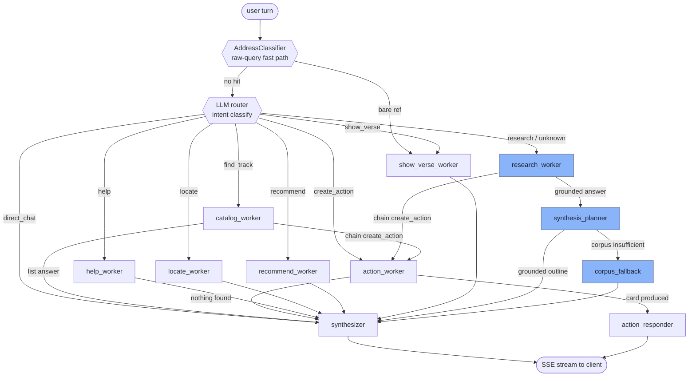
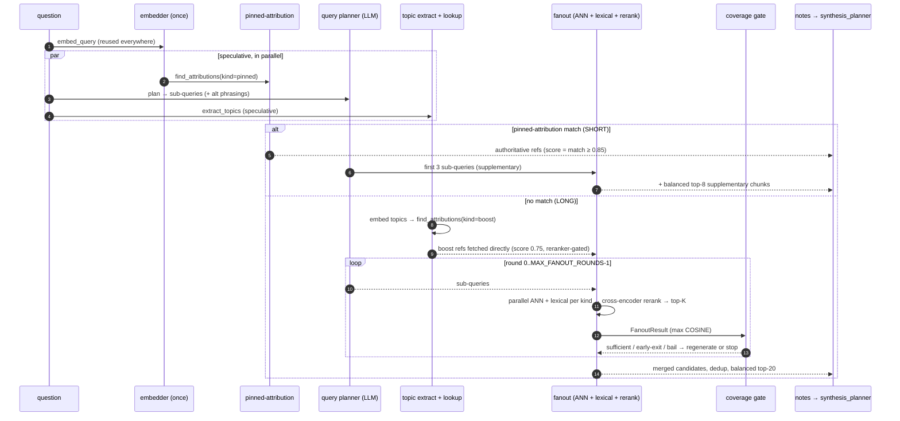
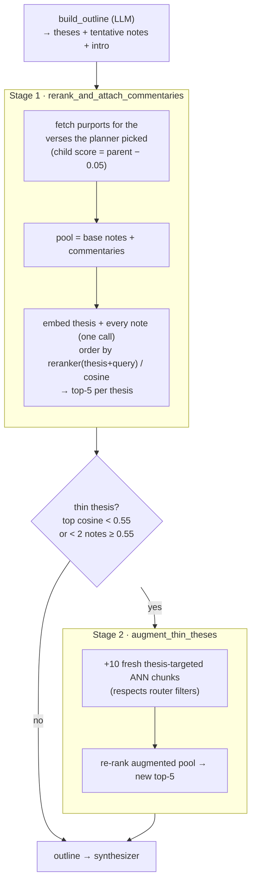
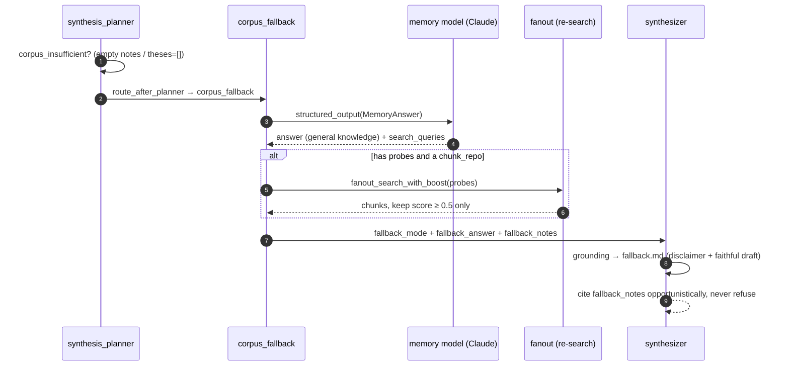
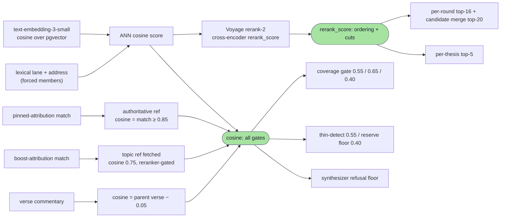

# Chat pipeline (retrieval + grounding)

The chat service answers a user turn with a **multi-agent LangGraph**: a router picks an
intent, a worker gathers material, a synthesis planner turns research notes into a grounded
outline, and a synthesizer streams the final answer. Retrieval is **hybrid + reranked** — a
bi-encoder ANN (`openai/text-embedding-3-small`, 1536-dim, cosine over pgvector) and a
non-cosine lexical lane (full-text + `pg_trgm` address) feed a candidate pool, which a
**Voyage cross-encoder reranker** (`rerank-2`) then re-orders. Two scores coexist: the raw
**cosine** still drives every coverage / attribution / thin-thesis *gate*, while the
cross-encoder `rerank_score` drives *ordering* and the final cut. Curator **attributions**
(`pinned` question-level and `boost` topic-level) pin authoritative refs and back-fill the
pool on top of retrieval.

> Code: `modules/services/chat/app/src/shruti_chat/`. Graph in `agent/graph/builder.py`;
> retrieval pipeline in `research/`; planner in `agent/graph/nodes/synthesis_planner.py`;
> reranker adapter in `infra/rerank.py`. See also [attribution lookup](attribution.md).

## 1. Agent graph

`build_chat_graph()` compiles a `StateGraph` over `ChatState` with `TurnContext` as the
per-turn context (carries `llm`, `chunk_repo`, `embedder`, `catalog_repo`, `reranker`,
`aliases`, tool bags). A deterministic classifier chain (`AddressClassifier`) runs first on
the raw query — a bare scripture reference (`БГ 2.13`) short-circuits to the `show_verse`
worker without the LLM. Otherwise the LLM router classifies intent; workers fan into a
single synthesizer (or, for produced action cards, a deterministic `action_responder`).



Nodes shaded blue (`research_worker`, `synthesis_planner`, `corpus_fallback`) are where
retrieval and grounding happen. `research_worker` runs the code-driven research pipeline
(`run_research`); `synthesis_planner` builds the outline and re-grounds each thesis.
`synthesis_planner` sits **only** on the `research_worker → synthesizer` arm — it's the only
path that produces prose-grounding notes; catalog / action / help / locate / recommend /
show_verse workers emit list tiles, location pointers or action cards and go straight to the
synthesizer. `unknown` (and any unrecognised intent) falls through a light `research_worker`
pass rather than answering tool-less, so a single misclassification never yields a confident
"not found". When the planner finds the corpus **insufficient** (empty retrieval or every
note rejected), the turn detours through `corpus_fallback` — the out-of-corpus memory-pass
(§4) — instead of refusing.

## 2. Research pipeline (`research_worker` → `run_research`)

A deterministic pipeline replaces an LLM ReAct loop. It embeds the question once (often
reusing a speculative embed task `chat_turn` kicked off in parallel with the router), then
forks on whether a curator **pinned (question-level) attribution** matches:

- **SHORT path** — a `pinned`-attribution hit. Fetch its authoritative refs directly, add a
  lean supplementary fanout, return. The curator's "this is the answer" decision wins.
- **LONG path** — no pinned match. Extract topics, resolve **`boost` (topic-level)
  attributions**, fetch those refs directly, then **fanout** ANN+lexical across
  `{lecture, verse, commentary, prose_chapter, letter, media}`, rerank, iterating under a
  **coverage gate** (up to `MAX_FANOUT_ROUNDS = 2`).

Every external call is wrapped in `asyncio.wait_for` with a stage timeout; on timeout the
orchestrator falls through with partial results and never blocks the turn. The lone
exception is a provider-availability failure (out of credits / key rejected), which
re-raises so the turn becomes a calm `chat_unavailable` instead of a confident ungrounded
answer.

A third curator signal, the **`memory` attribution**, runs concurrently and applies to
**both** paths: `_resolve_memory` finds the best-matching memory, carries its **note** on
`ResearchResult.memory_note`, and folds its (answer-language-scoped) refs into the citable
pool. The synthesizer injects the note as a **non-citable BACKGROUND CONTEXT** block — it
shapes and connects the answer but has no `[^N]`, so it can't be cited. See
[Memory](memory.md).



### Fanout (`research/corpus_fanout.py`)

`fanout_search_with_boost` embeds every `(sub_query, alt_phrasing)` in a single batched call,
then per query runs concurrent lanes: a lecture ANN (`search_by_embedding`), a dedicated
**verse-only** ANN, a combined ANN for the rest of the library kinds
(`{commentary, prose_chapter, letter, media}`), and a **lexical recall lane**
(`search_chunks_lexical`: full-text + `pg_trgm` address). An **address fast-path** parses
exact references (`БГ 2.13`) out of the question and fetches the verse + commentary
deterministically (`get_chunks_by_addr_label`) at `ADDRESS_HIT_SCORE = 0.85`.

Lexical and address hits are **`forced`** members: they carry their true (often low) cosine
but bypass the cosine floor and are guaranteed into the rerank pool so the cross-encoder can
judge them on text. The two lanes are **not** rank-fused — guaranteed membership plus the
cross-encoder is what merges them; there is no reciprocal-rank scoring anywhere in the chat
service.

**Ranking is two-pass.** When a reranker is wired (`rerank_active`):

1. Per-sub-query ANN fetch widens to `RERANK_FETCH_TOP_K = 24`; the cosine floor drops to a
   permissive `RERANK_NOISE_PREFLOOR = 0.18` (drops pure garbage only) so ~0.30 verses
   survive to rerank.
2. The deduped pool is capped to `RERANK_POOL_CAP = 60` by cosine (forced members kept past
   the cap), cross-encoded against the question, and cut to `RERANK_TOP_K = 16` by
   `rerank_score` — with **per-family reserves** (`≥2` lectures, `≥2` verses, `≥2` other
   library docs, gated by `RERANK_RESERVE_FLOOR = 0.40`) so terse verses the cross-encoder
   under-scores aren't starved out of the cut.

With no reranker the lanes collapse to the legacy cosine path: floor `_RELEVANCE_FLOOR = 0.45`,
sort by cosine, take `TOPK_PER_QUERY = 8` (capped at 16). The `max_score` returned to the
coverage gate is always the max **cosine** of the kept set, never the rerank score, so the
gate's tuned thresholds keep their meaning.

A modest **explicit-kind nudge** (`KIND_BOOST_DELTA = 0.15`) is added to the rerank *sort key*
(and a `RERANK_MIN_BOOST = 3` reserve applied) only when the user explicitly asks for a kind
("покажи видео…" → media, "…с пурпортами" → commentary/verse). It is ordering-only — the
cosine `score` that feeds the gates is untouched. There is **no** flat topic-boost added to
fanout scores; topic-attribution influence comes from fetching `boost` refs directly (below).

`catalog_repo.filter_track_ids` applies the user's router filters (author / source /
location / tag / date) up front, so the lecture lane never returns out-of-scope tracks.

### Coverage gate (`research/coverage_gate.py`)

The gate decides whether a fanout round is dense enough to stop, all on the cosine `max_score`:

| decision | rule |
|---|---|
| **sufficient** (stop) | `max_score ≥ COVERAGE_MIN_MAX_SCORE (0.55)` **and** `≥ COVERAGE_MIN_LECTURES (2)` lecture chunks |
| **early-exit** | `max_score ≥ 0.65` (a confident hit beats the lecture-count bar, from round 0) |
| **bail** (skip regenerate) | round 0 `max_score < 0.40` (regenerate rarely recovers) |

Lectures are the headline content, so the strict gate requires at least two; a single
high-confidence hit (`≥ 0.65`) is accepted even with sparse lectures. Between rounds
`_regenerate_queries` produces fresh sub-queries that avoid the angles already tried, capped
to `REGEN_MAX_SUBQUERIES = 4` primary texts (no alt-phrasings) to bound round-1 tail latency.

### Candidate merge

The LONG path merges directly-fetched `boost` refs (score `0.75`) with the reranked fanout
chunks, dedups by `_dedup_key` (`(item_kind, item_id, segment_index)` for library/media,
`("lecture", track_id, start_ms, end_ms)` for lectures) keeping the higher cosine, then sorts
with a **two-tier key**: authoritative/attribution refs (no `rerank_score`) pin first by
cosine, reranked fanout chunks follow by `rerank_score`, so the two scales are never compared
against each other. `_balanced_cut` then takes the top **20**, back-filling at least one verse
and one library doc from the tail (gated on `RERANK_RESERVE_FLOOR`) so a hard cap can't drop
the kinds the reserve fought to seat. Commentaries are **not** attached here — that moved into
the planner (Stage 1 below), so the candidate pool stays lean instead of flooding the
synthesizer with up to 12 purports per verse.

## 3. Synthesis planner (grounding)

`synthesis_planner` calls `build_outline` (LLM decomposes the question into theses with
tentative `supporting_notes` + an intro / conclusion), then **re-selects** each thesis's
notes — the LLM's picks are kept only as a hint for *which verses to pull commentaries for*.
Final ordering is owned by the cross-encoder reranker (cosine fallback) against each thesis.
Two stages run; either degrades gracefully (on LLM/embedder/DB failure it keeps the prior
selection, and the node always falls back to `outline=None` → free-form synthesis). The
claim-bearing intro is rewritten concurrently with Stage 1 and **streamed early** (before
grounding finishes) so the answer begins on screen seconds sooner.



- **Anchor is the thesis statement** (`t.thesis`), augmented with the user question for the
  reranker, not the question alone — theses are self-contained sentences, the sharpest
  per-thesis signal.
- **Stage 1** pulls purports only for verses actually picked into `supporting_notes`, caps at
  `STAGE1_COMMENTARIES_PER_VERSE = 4` (the standalone expansion cap is
  `MAX_COMMENTARIES_PER_VERSE = 12`), gates auto-attached purports at `STAGE1_ATTACH_FLOOR =
  0.30`, then orders the combined pool by the cross-encoder (cosine when the reranker is off)
  and rewrites each thesis to its top `5`. New commentary envelopes are appended to
  `tool_results` (append-reducer) so the synthesizer sees a consistent index space.
- **Stage 2** is a CRAG-style remedy: a thesis is **thin** when its best note scores below
  `THIN_THESIS_MIN_SCORE = 0.55` or fewer than `THIN_THESIS_MIN_STRONG_NOTES = 2` clear it.
  Each thin thesis gets one focused ANN fetch (`AUGMENT_FRESH_TOP_K = 10`, router-filtered),
  then a re-rank. Conservative by design: fires per-thesis only when needed, never chains.
  The fetches run concurrently under a **per-thesis** budget (`TIMEOUT_AUGMENT_S = 6.0`) — a
  hung shard costs only its own thesis, which falls back to Stage 1's picks
  (`outcome: fetch_failed`) while the theses that answered keep their fresh chunks. The
  `augment_summary` log carries `fetch_ms` per thesis and `fetch_ms_max` per turn.

## 4. Out-of-corpus fallback (memory-pass)

When the corpus genuinely has nothing relevant, the chat used to emit a flat
«не нашёл в корпусе» refusal. The **memory-pass fallback** instead answers from a large
model's general knowledge — clearly disclaimed — then re-searches the corpus on probes
derived from that answer and weaves in any genuine hits.

**Trigger.** `synthesis_planner` sets `corpus_insufficient` on state in **exactly** two
genuine-miss cases: empty `tool_results` (nothing retrieved), or `Outline(theses=[])` (notes
retrieved but the planner rejected every one). It is **not** set on planner degradation
(disabled by config, no LLM, build failure) — those keep the canned refusal. `route_after_planner`
then branches a flagged turn into `corpus_fallback` instead of straight to the synthesizer.



**`corpus_fallback` node** (`agent/graph/nodes/corpus_fallback.py`):

1. One structured call to `llm_fallback_knowledge` (a capable Claude) returns
   `MemoryAnswer{answer, search_queries}` — the from-knowledge answer in the user's language
   plus 1–5 corpus probes derived from it. The prompt forbids fabricated verse numbers /
   quotes / dates.
2. **Re-search** the probes via `fanout_search_with_boost`, keeping only chunks with
   cosine `≥ 0.5`. The original query already retrieved (and the planner rejected) the junk
   pool, so a lower floor would just re-import the same junk under the disclaimer. Card
   payloads for any survivors are flushed before the synthesizer streams their markers.
3. Returns `fallback_mode=True`, `fallback_answer`, `fallback_notes`, `outline=None`.

**Graceful degrade.** No LLM, a failed structured call, or an empty answer → the node returns
`{}` (no `fallback_mode`) and the synthesizer runs the **normal refusal** — so today's
behaviour is reachable in every failure mode. A re-search blow-up leaves the answer
memory-only (uncited), never failing the turn.

**Synthesizer in fallback mode.** It swaps the strict `grounding` section for `fallback.md`
(open with the mandatory "not found in corpus, answering from memory" disclaimer in the
user's language; present the draft faithfully; cite the re-searched notes with `[^N]` only
where they directly support a point; **never refuse**). The citable pool is `fallback_notes`,
**not** `tool_results` — that field's append-reducer still holds the rejected junk pool, which
the fallback answer must not cite.

> The disclaimer is mandated by the prompt (like the existing refusal), so it localizes to
> every UI language. There is deliberately **no** runtime truthfulness gate — answer quality
> is verified offline (control questions) rather than by a per-turn judge. `fallback.md` is a
> Langfuse-hosted section (`chat-section-fallback`) with the bundled `.md` as fallback.
>
> Gotcha: Anthropic's structured-output endpoint rejects `maxItems`, so the `MemoryAnswer`
> schema carries no pydantic `max_length` on `search_queries`; the cap is applied in code.

## 5. Scoring model — cosine gates, cross-encoder ordering

Two scores coexist on every chunk. The bi-encoder **cosine** `[0, 1]` is the *gate* scale:
every coverage gate, attribution accept/reject, reserve floor and thin-thesis check reads it,
so a number means the same thing everywhere. The Voyage **`rerank_score`** is the *ordering*
scale: it drives the per-round cut, the candidate-merge order and the per-thesis selection.
The two are deliberately never compared head-to-head — a two-tier sort keeps reranked chunks
and (un-reranked) authoritative refs in separate tiers.



| score source | value | set by |
|---|---|---|
| fanout chunk (cosine) | raw cosine, floored at 0.45 (cosine path) / 0.18 (rerank path) | `corpus_fanout.py` |
| fanout chunk (order) | `rerank_score`, `+0.15` sort nudge for an explicitly-requested kind | `corpus_fanout.py` |
| address hit | cosine `0.85` (forced) | `corpus_fanout._parse_addresses` |
| authoritative ref (SHORT) | the matched pinned score (`≥ 0.85`) | `pipeline._fetch_refs` |
| topic ref (LONG, fetched directly) | cosine `0.75` (reranker-gated at `BOOST_REF_RERANK_ACCEPT = 0.40`) | `pipeline._research_path` |
| attached commentary | parent verse cosine `− 0.05` | `commentary_expansion.py` |
| per-thesis note order | reranker(`thesis+question`, note) / cosine | planner Stage 1 / 2 |

Attribution accept thresholds are asymmetric by kind and by native-vs-cross-lingual query
(`text-embedding-3-small` carries a ~10–15pt MIRACL penalty on non-English queries):

| attribution | native accept | cross-lingual accept | notes |
|---|---|---|---|
| `pinned` (question) | `0.85` | `0.80` | `0.70`–accept → cross-encoder gate (`PINNED_RERANK_ACCEPT = 0.50`); becomes authoritative |
| `boost` (topic) | `0.70` | `0.65` | fetched at cosine `0.75`, reranker-gated; weaker signal |

## 6. Config reference

Embedder wiring (`config.py`):

```text
EMBED_PROVIDER=openrouter      # openrouter | openai
EMBED_MODEL=openai/text-embedding-3-small
EMBED_DIM=1536                 # must match the model; selects attribution_emb_d{N} table
EMBED_BASE_URL=                # override per deployment (e.g. self-hosted on RU)
EMBED_CONCURRENCY=2
```

Reranker wiring (`config.py`, adapter in `infra/rerank.py`). On by default; `get_reranker`
returns `None` when the provider is `none` or the Voyage key is missing, and the pipeline
then runs the cosine path unchanged — so a keyless deploy never breaks:

```text
RERANK_PROVIDER=voyage         # none | voyage | tei (tei reserved, not implemented)
RERANK_MODEL=rerank-2
VOYAGE_API_KEY=                # required for provider=voyage
RERANK_BASE_URL=               # future self-hosted (tei)
RERANK_CONCURRENCY=2
RERANK_TIMEOUT_S=10.0
```

Behavioural knobs live in `research/constants.py`:

```text
TOPK_PER_QUERY=8               # cosine-path ANN fetch per (sub-query, kind); cap 16
RERANK_FETCH_TOP_K=24          # rerank-path per-sub-query ANN fetch (recall)
RERANK_POOL_CAP=60             # cross-encoder input cap (top-N by cosine)
RERANK_TOP_K=16                # keep top-N by rerank_score; feeds the outline
RERANK_RESERVE_FLOOR=0.40      # cosine floor for per-family reserve eligibility
RERANK_NOISE_PREFLOOR=0.18     # permissive cosine pre-floor on the rerank path
COVERAGE_MIN_MAX_SCORE=0.55    # + COVERAGE_MIN_LECTURES=2
MAX_FANOUT_ROUNDS=2
REGEN_MAX_SUBQUERIES=4
LEXICAL_FETCH_TOP_K=24         # hybrid lexical lane per-sub-query fetch
LEXICAL_TRGM_MIN_SIM=0.3       # pg_trgm floor for the lexical address match
ADDRESS_HIT_SCORE=0.85
THIN_THESIS_MIN_SCORE=0.55     # + THIN_THESIS_MIN_STRONG_NOTES=2
AUGMENT_FRESH_TOP_K=10
TIMEOUT_AUGMENT_S=6.0          # per-thin-thesis Stage 2 ANN budget
STAGE1_COMMENTARIES_PER_VERSE=4   # planner Stage 1 (standalone cap MAX_COMMENTARIES_PER_VERSE=12)
STAGE1_ATTACH_FLOOR=0.30
```

**Per-turn toggles** (`config` in the request body, `ChatTurnConfigDto`):

- `enable_planner` (default `true`) — when `false`, the planner node short-circuits to
  `outline=None` and the synthesizer takes its free-form path over the *same* retrieval.
- `enable_reranker` (default `true`) — bypasses the cross-encoder reranker in **both**
  Stage A (fanout pool ordering, read in `research_worker`) and Stage B (per-thesis
  grounding, read in `synthesis_planner`); when `false` the whole pipeline runs the
  bi-encoder cosine path.
- `enable_early_intro` (default `true`) — controls the early intro paint in the planner.
- `enable_corpus_fallback` (default `true`) — the out-of-corpus memory-pass (§4); when
  `false`, a corpus-insufficient turn keeps the canned «не нашёл в корпусе» refusal. Overrides
  the global `Settings.enable_corpus_fallback`.

Out-of-corpus fallback model (`config.py`):

```text
LLM_FALLBACK_KNOWLEDGE=openrouter/anthropic/claude-sonnet-4.6   # memory-pass model (capable Claude)
ENABLE_CORPUS_FALLBACK=true                                     # global master switch
```

> `anthropic/claude-3.5-sonnet` is retired on OpenRouter (404 "no endpoints") — the 4.x
> family is current. The cheap planner/fallback models (haiku) can't reliably emit the
> structured `MemoryAnswer` JSON, so the memory-pass uses a dedicated capable model.

Retrieval itself (research_worker fanout) reads the reranker from `TurnContext`, wired from
the `RERANK_*` config above — but honours the per-turn `enable_reranker` toggle, passing
`None` to the fanout when it is `false`.
