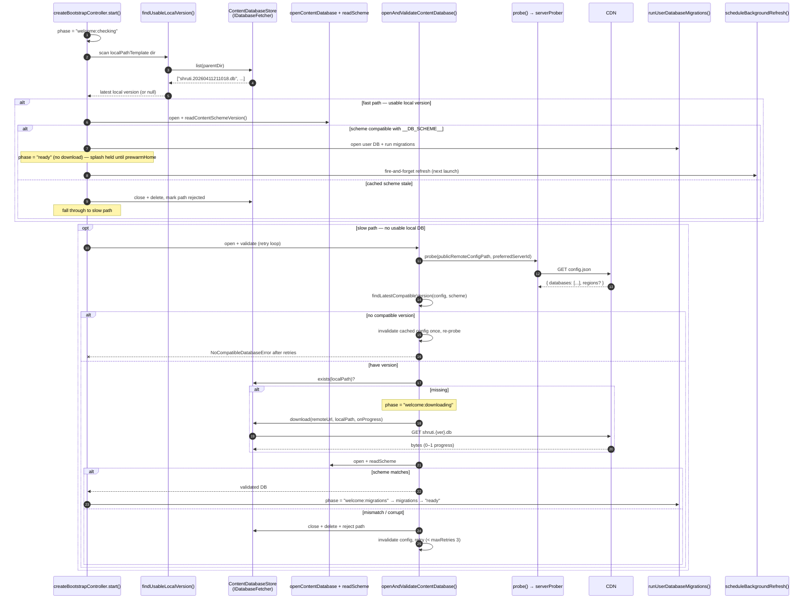
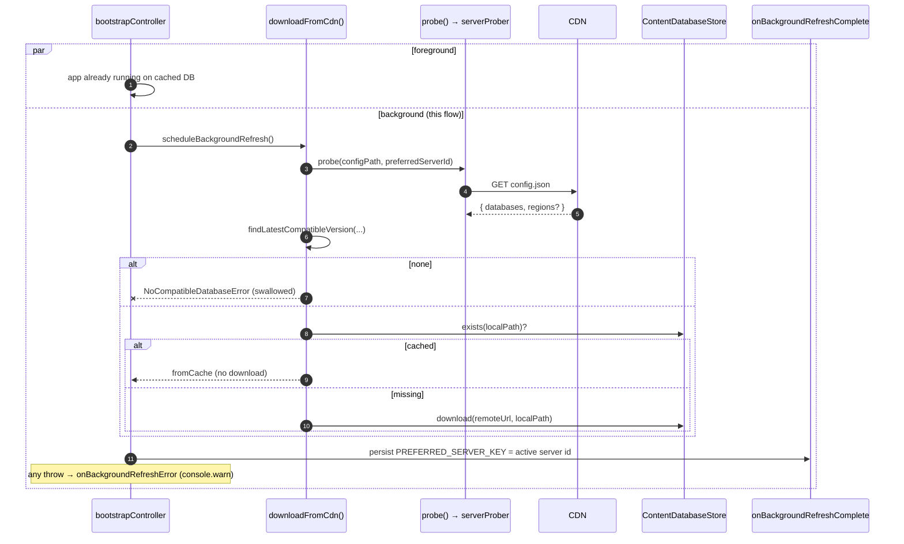
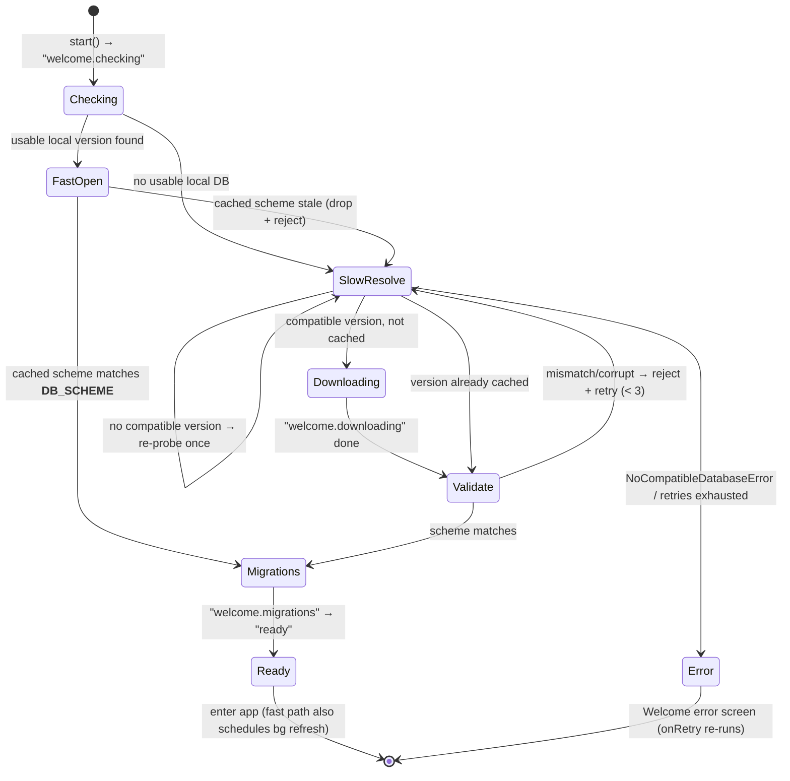

# Flow: Content DB refresh on launch

Every cold start, Shruti runs a **Stale-While-Revalidate** startup: if a scheme-compatible content DB is already cached locally it opens that copy and reaches the `ready` phase **immediately** (no foreground download, no progress bar), then probes the CDN in the **background** and downloads a newer compatible DB for the *next* launch. Only when there is no usable local DB does it fall back to a foreground probe → download → validate, showing the download progress on the welcome splash. In both paths the welcome splash (`AppLoading`) stays on screen until startup finishes pre-hydrating Home and the controller navigates away — the fast path just clears it quickly. The downloaded copy lives next to any previous copies; the newest `{version}` wins. All of the resolve / probe / scheme-retry / background-refresh logic is framework-light and generic — it lives in the shared `@kit/bootstrap` package; the app only injects its ports.

## Where the content DB comes from

There is no standalone builder service; the content DB is produced and shipped by **shruti-mcp** and consumed by the app over the CDN. The CDN is the S3 bucket `shruti-engine` (`https://cdn-s3.shruti.local`) — there is no in-repo CDN server.

- **Build + publish:** the pipeline materialises `out/artifacts/catalog/current.db`. `catalog.publish` (async) bumps the version, copies `current.db` → `public/db/shruti.{ver}.db`, merges `public/config.json` (the `databases[]` manifest with `{version, scheme}` entries), and uploads `public/` to S3 incrementally (see `modules/tools/shruti-mcp/README.md`). The published `config.json` is what every client probes on launch.
- **Scheme source of truth:** `modules/db-scheme.json` (`{ "scheme": 20260614 }`). The same value is injected into the mobile build as `__DB_SCHEME__` via Vite `define`, and read by `modules/db-sync.sh`.
- **Bundled copy:** `modules/db-sync.sh [android|ios|e2e|all]` is a thin wrapper that exports Shruti's parameters (`APP_NAME`, `CDN_URL`, `SCHEME_FILE`, the dist dirs) and `exec`s the shared, parametrized kit script `modules/kit/scripts/db-sync.sh`. The kit script downloads the latest CDN DB matching the scheme in `db-scheme.json` (caching it under `modules/.db-cache/`) and copies it into the native asset dirs (`modules/apps/mobile/android/app/src/main/assets/databases`, `modules/apps/mobile/ios/App/App/databases`) and the e2e fixture dir (`modules/tests/e2e/mobile/fixtures/public/db`, plus the matching `config.json` at `modules/tests/e2e/mobile/fixtures/public/config.json`), deleting any stale `shruti.*.db` so lexicographic pickup never returns an old file. This bundled DB is the offline-first seed the app finds before any network call.

## Cold-start sequence

The orchestrator is the generic `createBootstrapController()` (`modules/kit/src/bootstrap/bootstrapController.ts`), wired up by `useWelcomeController()` (`modules/apps/mobile/shruti/views/Welcome/WelcomeView.controller.ts`). It runs in two passes: a **fast path** (cached DB → straight to `ready`, no download) and a **slow path** (foreground download + scheme validation). The controller only flips its own `navigated` ref (and tears the splash down) after `prewarmHome()` finishes, so both paths keep the splash up until Home's data is hydrated.

## Background refresh (post-bootstrap)

On the fast path, once the cached DB is open and user migrations have run, `createBootstrapController` calls `scheduleBackgroundRefresh()` — a fire-and-forget task that re-runs `downloadFromCdn()` (`modules/kit/src/bootstrap/contentDatabaseResolver.ts`): probe the CDN pool, pick the latest compatible version, and download it if it is not already on disk. It does **not** touch the UI (no phase/progress wiring).

The newer file lands alongside the currently-open one. The session continues using the **old** DB; the **next** cold launch picks the new one (newest version wins). There is no hot-swap.

## State view

`phase` is a coarse `BootstrapPhase` ref the status-message composable binds to.

## Scheme validation and retry

`openAndValidateContentDatabase()` (`modules/kit/src/bootstrap/schemeValidation.ts`) wraps resolve → open → read-scheme in a counter-capped loop (`maxRetries`, default **3**). A DB passes when `isSchemeCompatible(scheme, __DB_SCHEME__)` holds — i.e. the recorded scheme equals `__DB_SCHEME__` (or is the legacy `0`). On a mismatch — or when opening/reading the scheme **throws** (a structurally-corrupt file that passed the cheap existence gate) — it closes the DB, adds the path to the session-local `incompatibleDbPaths` set, deletes the local file, and invalidates the cached `config.json` so the next attempt re-probes and re-fetches. If `resolveContentDatabase` throws `NoCompatibleDatabaseError` (a stale cached config listing nothing for this scheme), it drops the cached config **once** and re-probes before giving up. After `maxRetries` it throws an error listing the observed schemes, pointing the operator at `catalog.publish` or `modules/db-scheme.json`.

The fast path applies the same compatibility check inline (`isSchemeCompatible`): a cached DB whose scheme no longer matches is closed, deleted, and seeded into the slow path's reject set so the re-scan never picks it again.

## Background refresh ports

`scheduleBackgroundRefresh` reuses `downloadFromCdn` with its own fresh probe (rather than reusing the foreground result). When it completes, `onBackgroundRefreshComplete(downloadedNewVersion)` persists the active server id under `PREFERRED_SERVER_KEY` so the next launch probes that region first; `onConfigResolved` also adopts any freshly-fetched `regions` block via `applyRemoteRegions` and re-points the active server. Any throw is routed to `onBackgroundRefreshError` (a `console.warn`) — the session keeps running on the already-open DB. The Shruti-specific port wiring (probe adapter, region registry, preferences, content-DB open/close) lives in `WelcomeView.controller.ts`; the generic SWR logic lives entirely in `@kit/bootstrap`.
