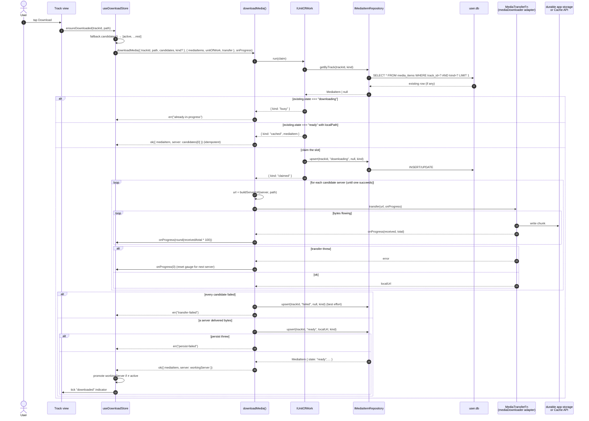
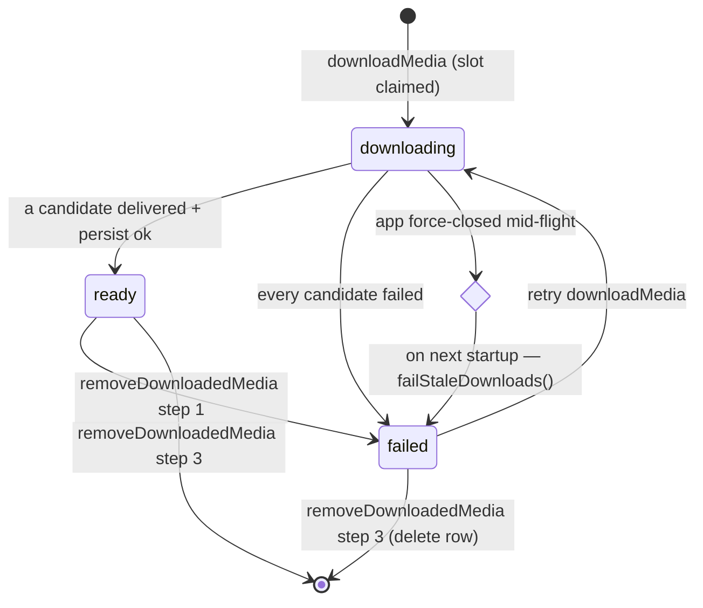

# Flow: Download media for offline

User taps the download button on a track. The app records a `MediaItem` row, streams the audio bytes to durable app storage (Android `filesDir` / iOS `NSDocumentDirectory`, or the Cache API on web), and updates the row through `pending → downloading → ready`. `downloadMedia()` takes the storage `path` plus an ordered list of CDN `candidates` (and an optional audio `kind`), building a fresh URL per attempt and iterating servers until one delivers bytes — so a CDN that degrades mid-session is survived at download time. Each row is keyed by `(trackId, kind)`, so a track can cache its `original` and denoised `clean` audio independently. A force-close mid-download leaves a `downloading` row that's swept to `failed` on the next launch by `failStaleDownloads()` so the row doesn't lock further retries.

## Happy-path sequence



## State transitions



## Inputs and result

`downloadMedia` is defined in `modules/apps/mobile/usecases/downloads/downloadMedia.ts` (imported as `@usecases/downloads/downloadMedia.js`):

```ts
function downloadMedia(
  input: DownloadMediaInput,
  deps: DownloadMediaDeps,
  onProgress?: (pct: number) => void
): Promise<Result<DownloadMediaSuccess, DownloadMediaError>>
```

- `DownloadMediaInput` — `{ trackId, path, candidates, kind? }`. `path` is the full bucket storage key (including the `public/` prefix); `candidates` is an ordered list of `CdnServer` (the caller puts the active server first); `kind` is the `MediaAudioKind` (`"original"` | `"clean"`, defaulting to `"original"`) that selects which audio version's row is read/written. The use case never receives a pre-resolved URL — it calls `buildServerUrl(server, path)` itself, freshly, on each attempt, so a CDN swap mid-flight can't target a stale template.
- `DownloadMediaDeps` — `{ mediaItems, transfer, unitOfWork }`. `unitOfWork` exists only to make the "claim the download slot" check-and-set atomic; the long transfer runs outside any transaction.
- `DownloadMediaSuccess` — `{ mediaItem, server }`. `server` is the `CdnServer` that actually delivered the bytes, which the caller compares against the active server to decide whether to promote a different CDN.

## Atomic slot claim

The first thing the use case does is run a check-and-claim inside `unitOfWork.run`, returning one of three outcomes:

| Claim | Condition | Use-case result |
|---|---|---|
| `busy` | existing row in `downloading` | `err("already-in-progress")` |
| `cached` | existing `(trackId, kind)` row `ready` with `localPath` | `ok({ mediaItem, server: candidates[0] })` — idempotent, no transfer |
| `claimed` | otherwise — upserts `downloading` | proceed to the candidate loop |

Two simultaneous taps on the same track race here; the unit of work serialises them, so the loser sees `state === "downloading"` and bows out with `already-in-progress` instead of starting a parallel transfer. The `cached` branch attributes `candidates[0]` (the active server) as the delivering server since no transfer happened — callers treat that as a no-op promotion.

## Runtime CDN fallback — the candidate loop

After claiming the slot the use case iterates `input.candidates` once each, in order, and stops at the first server whose `transfer` resolves. There is no within-server retry: the CDN prober already weeded out servers that 404 the config, so this loop exists to survive an in-flight failure of an otherwise-healthy CDN. Between attempts it calls `onProgress(0)` so the radial gauge doesn't keep showing the previous server's last chunk while bytes re-establish from zero elsewhere.

If every candidate throws, the use case best-effort upserts `failed` and returns `err("transfer-failed")` (logging the last error via `console.warn` without leaking it past the use-case boundary). On the first success it records `workingServer` and proceeds to persist.

## The four error tags

`downloadMedia` returns a `DownloadMediaError`. The split matters because **retry semantics differ**:

| Error | Cause | Retry |
|---|---|---|
| `"no-candidates"` | `input.candidates` is empty | nothing to try — caller bug; never fire |
| `"already-in-progress"` | Existing row in `downloading` state | UI says "downloading…" — wait, don't fire again |
| `"transfer-failed"` | Every candidate server failed during byte transfer | Retry will redownload from byte 0 |
| `"persist-failed"` | DB write rejected after bytes already on disk | Retry **must not** redownload — file is cached, just write the row |

Conflating transfer and persist failures would either re-fetch megabytes unnecessarily or leave the user thinking the download didn't happen.

## Recovery on app start — `failStaleDownloads`

Force-close, OS kill, or app crash mid-download leaves a row in `downloading` with `localPath: null` and no in-flight transfer. The download store's `hydrate()` (`modules/apps/mobile/shruti/stores/useDownloadStore.ts`) calls it once before reading `listReady()`:

```ts
await repo.failStaleDownloads()
// UPDATE media_items SET state = 'failed', local_path = NULL WHERE state = 'downloading'
```

…which flips every such row to `failed`. From then on the user sees a "retry" indicator instead of a permanent "downloading" lock and the next `downloadMedia` call goes through without the `"already-in-progress"` short-circuit. See [`mediaItemRepository.ts`](https://github.com/akdasa-studios/shruti/blob/main/modules/libs/domain/ports/mediaItemRepository.ts) for the port contract.

## Why the `transfer` is passed in as a closure

`downloadMedia` lives in `@usecases` (`downloads/`) and may not import platform ports. The byte mover is therefore handed in as a `MediaTransferFn` — `(url, onProgress?) => Promise<localUrl>`. `useDownloadStore`, which **can** import both the use case and the adapter, builds the closure on every call:

```ts
const result = await downloadMedia(
  { trackId, path, candidates: fallback.candidates() },
  {
    mediaItems: app.repositories().mediaItems,
    unitOfWork: app.repositories().unitOfWork,
    transfer: (url, onProgress) =>
      app.mediaDownloader.download(url, (received, total) => {
        onProgress?.(received, total)
      }),
  },
  (pct) => setProgress(trackId, pct)
)
```

This keeps the use-case layer pure while the adapter retains all its native (Android WorkManager + OkHttp / iOS background `URLSession`) or web (`fetch` streaming + Cache API) details.

## The media-downloader plugin

The `transfer` closure delegates through the `IMediaDownloader` port (`modules/apps/mobile/ports/app/mediaDownloader.ts`), whose only adapter is `useMediaDownloaderAdapter` (`modules/apps/mobile/infra/mediaDownloader/plugin/useMediaDownloaderAdapter.ts`). The adapter maps the port's URL-keyed methods onto the `MediaDownloaderPlugin` (`modules/plugins/media-downloader/src/definitions.ts`): it derives the addressing `id` and the `DownloadDestination` from `URL.pathname`, writes finished audio to durable storage (`directory: "data"` → Android `filesDir` / iOS `NSDocumentDirectory`, never the OS-evictable `cache` dir), and translates the plugin's `progress`/`completed`/`failed` events back into a single awaited `Promise<localUrl>` plus a `(received, total)` progress callback.

`MediaDownloaderPlugin` is a single cross-platform Capacitor plugin: the native side (Android WorkManager + OkHttp, iOS `URLSession.background`) runs background-capable downloads keyed by the app-chosen `id`, while `MediaDownloaderWeb` (`src/web.ts`) provides the web fallback using `fetch()` streaming plus the Cache API (cache name `"shruti"`, cache key = `URL.pathname`). The plugin owns per-file cache management — `resolveLocalUrl({ url })` resolves a previously-downloaded URL to a local URI (surfaced as the port's `resolveLocalUrl(url)`, used by the store's cache probe before invoking the use case) and `deleteFile({ url })` evicts one file by source URL (surfaced as the port's `delete(url)`). It also exposes `cancel({ id, deletePartial? })` (port `cancel(url)`) to abort an in-flight transfer and drop its partial file, plus `getTask` / `listTasks` snapshots and iOS-only `pause` / `resume`.
