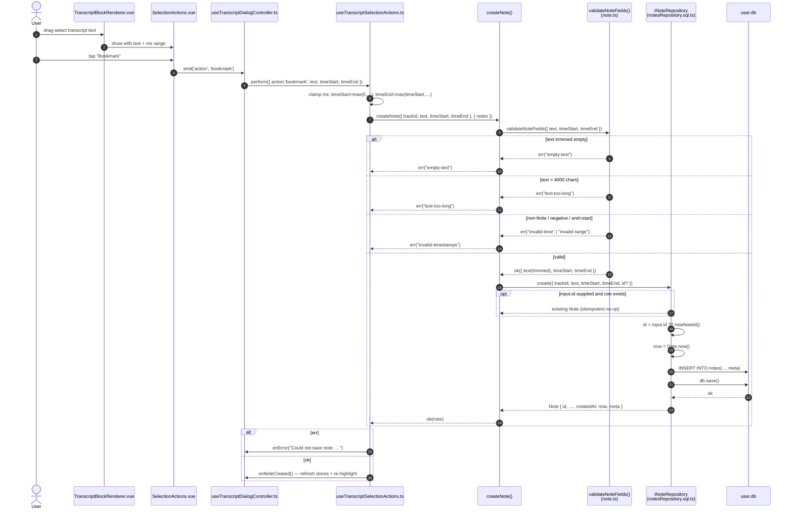
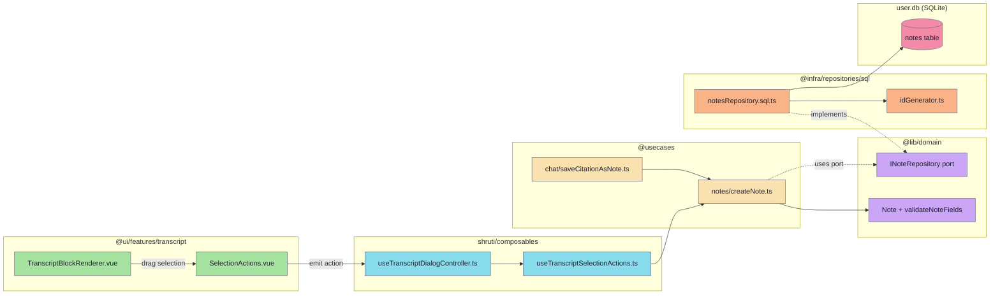

# Flow: Create note

While reading a track's transcript the user drag-selects a span of text and taps **Bookmark** in the selection popover. The selected sentence range — already in milliseconds, read from the `data-time-start` / `data-time-end` attributes on the dragged blocks — plus its text flow through `createNote()`, which validates via the domain entity and hands a fresh `note_<nanoid12>` row to the user DB, anchored to the current `trackId`.

There is no separate note-editor dialog or seconds-based range picker: a note IS the selected transcript span. A second entry point — saving a chat citation chip — reuses the same `createNote()` use case through [`saveCitationAsNote`](https://github.com/akdasa-studios/shruti/blob/main/modules/apps/mobile/usecases/chat/saveCitationAsNote.ts).

## Sequence



## What lives where



## Where validation lives

`createNote` (`modules/apps/mobile/usecases/notes/createNote.ts`) does not validate inline — it delegates to `validateNoteFields` on the domain entity (`modules/libs/domain/note.ts`). The validator trims `text`, rejects empty text and text over `MAX_NOTE_LENGTH` (4000), rejects non-finite times, a negative `timeStart`, or `timeEnd < timeStart`. It returns the *fine-grained* `NoteValidationError` tags (`empty-text`, `text-too-long`, `invalid-time`, `invalid-range`); `createNote` folds the two time-shape tags into a single `invalid-timestamps` so existing UI callers keep their three-case error union. The invariants live on the entity because every path that produces a `Note` (create, update, a future import) must honour them.

## Where ID generation lives

The use case never sees an id unless a caller supplies one. The repository accepts `CreateNoteInput` with an optional `id`; when absent it mints one via the shared factory in `idGenerator.ts`:

```ts
export const createIdGenerator = (prefix: string) => (): string => `${prefix}_${nanoid(12)}`
```

`notesRepository.sql.ts` instantiates `const newNoteId = createIdGenerator("note")`, keeping `nanoid` out of the application/domain layers and giving every entity type (`note_*`, `playlist_*`, `media_*`) one consistent `prefix_<12char>` shape. See [ID generation](../../db/ids.md).

## Idempotent create

When a caller passes `input.id`, the repository becomes idempotent: if a row with that id already exists it is returned unchanged and no duplicate is inserted. This is a deliberate hook for a deterministic-id caller (e.g. deriving a stable id from a chat action id so a flaky-network re-tap on "save as note" can't double-save). No production caller exercises it today — both the transcript bookmark path and `saveCitationAsNote` call `createNote` without an `id`, so every call mints a fresh one; only the repository/use-case tests pass an explicit id.

## Time unit: milliseconds

`Note.timeStart` / `Note.timeEnd` are stored in **milliseconds** — the same unit as the transcript blocks' `start` / `end`. The drag-selection reads `data-time-start` / `data-time-end` straight off the rendered blocks, so the value stays in ms end to end; the DB columns `time_start` / `time_end` are plain `INTEGER`. `useTranscriptSelectionActions` clamps the bookmark range with `Math.round` and `Math.max(0, …)` before calling `createNote`.

## The `meta` sidecar

A note row carries an optional `meta` column — JSON-serialised `Record<string, unknown> | null` (migration `006_notes_meta`). `null` (not `undefined`) means "row exists, no meta yet". `CreateNoteInput.meta` defaults to `null`; the SQL repo serialises it with `JSON.stringify`. On update a non-null object **replaces** the column wholesale (no shallow merge) — callers that want to patch one slot read-merge-write themselves.

## Editing and deleting

`updateNote` re-runs `validateNoteFields` on the *merged* existing+patch values inside a unit-of-work wrapper so the read-then-write is atomic. Deletes go through `deleteNote` (also unit-of-work wrapped) and, from the transcript, are triggered by tap-on-highlight (the `delete` branch of `useTranscriptSelectionActions`). See [`updateNote.ts`](https://github.com/akdasa-studios/shruti/blob/main/modules/apps/mobile/usecases/notes/updateNote.ts) and [Use cases reference](../../api/use-cases.md#updatenote).
