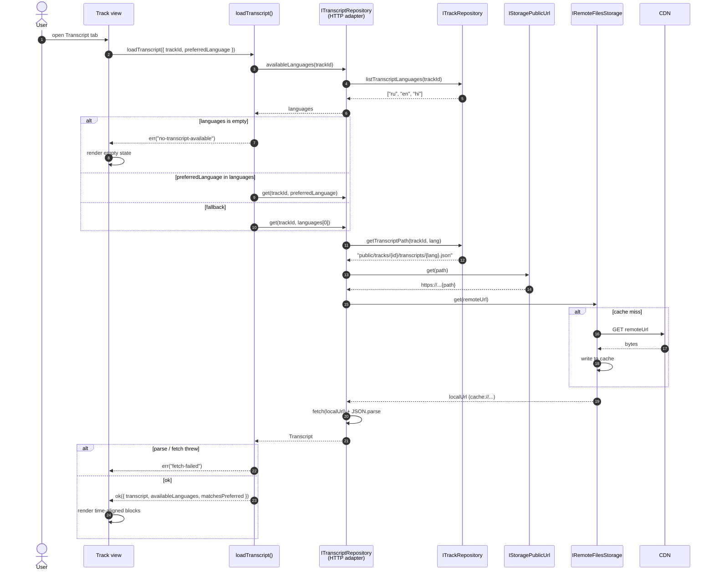
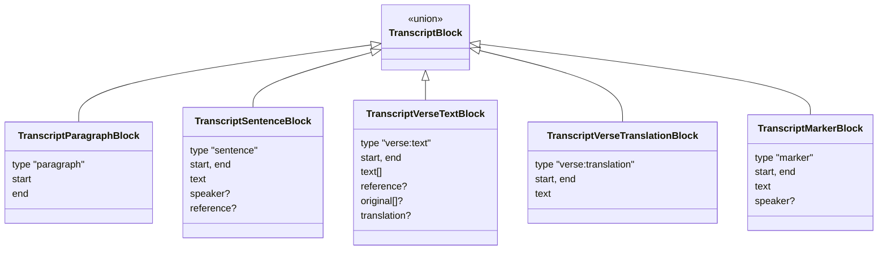

# Flow: Load transcript with cache

When the user opens the transcript pane on a Track view, the app fetches the transcript JSON from the CDN, caches it locally, and renders the time-aligned blocks. Subsequent opens of the same (track, language) come from the cache — the network cost is paid **once per device** per transcript.

## End-to-end sequence



## Why a separate `IRemoteFilesStorage` layer

`IRemoteFilesStorage` is a **content-addressed cache** over either the browser Cache API (web) or `Filesystem` (native). It takes a remote URL, returns a local URL that the platform can read. The wins:

- **Idempotent caching.** Second call for the same URL hits the cache without any extra logic in the use case.
- **Platform parity.** Web and native both expose `get(url) → localUrl` even though their underlying mechanisms differ.
- **Invalidation knobs.** `delete(url)` busts a single entry — used by Welcome (`invalidateConfigCache` in [`WelcomeView.controller.ts`](https://github.com/jiva-studio/shruti/blob/main/modules/apps/mobile/shruti/views/Welcome/WelcomeView.controller.ts)) to drop the cached remote `config.json` when it advertises no compatible DB — and `clearAll()` wipes the whole cache.

## Block rendering

The use case returns a `Transcript` value object whose `blocks` field is a discriminated union of five kinds. The transcript view component (in `ui/features/transcript/`) renders each kind differently:



- **`marker`** — a stage direction (`[break]`, `[laughter]`, `devotees repeat`). Text is stored bracket-free; the renderer wraps it. Rendered muted/italic; excluded from shared plain-text.
- **`verse:text`** — `text[]` is the transliteration (IAST). When the verse resolves in the library, `original[]` (Devanagari / Bengali) and `translation` are baked in, and the component renders all three (original → transliteration → translation), mirroring the chat `VerseCard`.
- **Inline markdown** — `sentence` / `verse` text may contain `*italic*` / `**bold**`; the client renders it inline via `marked.parseInline` (shared `libs/ui/transcript/renderInlineMarkdown.ts`). Producers must emit balanced markdown.

Definitions live in [`transcript.ts`](https://github.com/jiva-studio/shruti/blob/main/modules/libs/domain/transcript.ts).

## Transcript JSON wire format

The on-disk JSON mirrors the TS [`Transcript`](https://github.com/jiva-studio/shruti/blob/main/modules/libs/domain/transcript.ts) value object exactly — no transform layer. The MCP server's Go wire struct (`internal/domain/transcript/block.go`) carries the same field names and types. Producers that emit inline `reference` blocks: the PDF aligner (`scripts/pdf_align/align_fast.py`) and the vedabase converter (`resources/vedabase-convert/`, which converts human-verified vedabase lectures to v2 blocks and aligns timings against `raw.json`).

A typical sentence block with an attached scripture reference:

```json
{
  "type": "sentence",
  "start": 38640,
  "end": 44000,
  "text": "...the Supreme Personality of Godhead personally descended...",
  "speaker": "Prabhupāda",
  "reference": {
    "sourceId": "source_NoY8sAlXF1IT",
    "tokens": ["1", "1", "1"]
  }
}
```

- A reference carries exactly one of `sourceId` **or** `sourceName`:
  - `sourceId` is the catalog `sources.id` PK (see [`Reference`](../../domain/entities.md#reference--referencets)) for an in-library scripture; the UI looks up the localised full/short name via the `sources` dictionary. It is **not** an abbreviated scripture code.
  - `sourceName` is the verbatim name of an external work **not** in the catalog (e.g. an Upaniṣad); rendered as-is.
- `tokens` is a **string array** of dot-separated segments. The SQL [`track_references`](../../db/content-db.md#track_references) row keeps the same data **dot-joined as TEXT** to keep rows narrow — that's the only place the two diverge.
- A `sentence` carries **at most one** reference (a single object, not an array). The vedabase converter splits a sentence that quotes several verses into one fragment per citation, so the wire shape stays a single object.

## Why transcripts aren't in the SQL DB

Transcripts are kept as flat JSON files on S3 — not rows in the content DB — because:

- **DB size stays bounded.** A typical lecture has 1–5 transcripts (one per language) of 50–200 KB each. Rolling them into the prebuilt `shruti.{ver}.db` would balloon the file the app downloads at first launch.
- **Republishing is independent.** Re-running OCR / translation on a single track only touches that track's `{lang}.json` files — no DB rebuild, no version bump.
- **On-demand fetching.** Most users only ever open transcripts for a small subset of tracks. Pulling them lazily means most users never pay the bytes.
