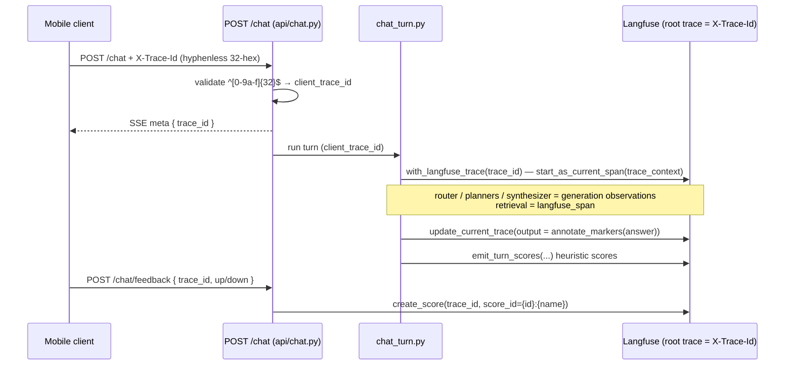
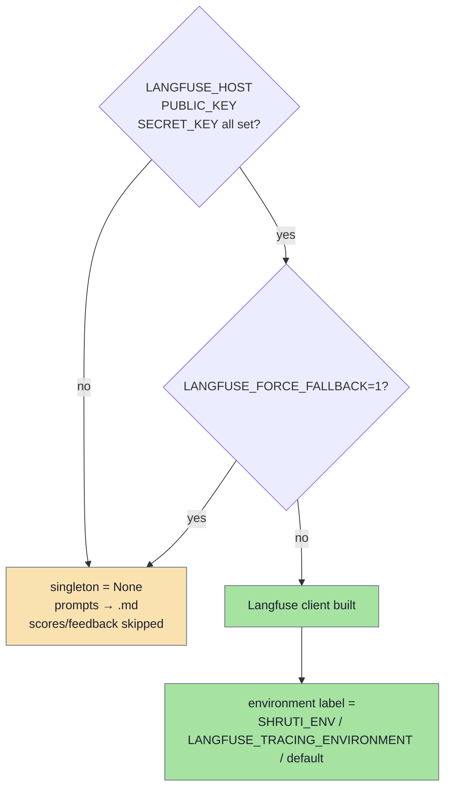

# Observability (Langfuse)

Every chat turn is observed in a self-hosted Langfuse v3 instance as a single root trace, keyed by the **client-minted `X-Trace-Id`** so the same id ties together the SSE stream the user saw, the trace tree (router → planners → generations → retrieval spans), the heuristic auto-scores, the trace-only marker annotations, and any user thumbs feedback that arrives later. Langfuse is treated as observability infrastructure that is never on the critical path: if the host is unreachable or the env is unset, every helper degrades to a local-file fallback (and prompts fall back to the bundled `.md`) and the service keeps serving traffic. The chat service also stores its prompt sections **in Langfuse**, where they override the bundled `.md` files at runtime so an editor can iterate from the UI without a deploy.

> Code: `modules/services/chat/app/src/shruti_chat/observability/` — `langfuse_client.py` (singleton, trace, prompt fetch), `marker_annotations.py` (`annotate_markers`), `auto_scores.py` (`emit_turn_scores`), `score_configs.py`, `bootstrap.py`; `modules/services/chat/app/src/shruti_chat/api/feedback.py` (feedback → scores); `modules/services/chat/scripts/bootstrap_langfuse_prompts.py` (prompt push/pull).

Related: [chat-pipeline.md](chat-pipeline.md) · [attribution.md](attribution.md) · the SSE `meta` event and `X-Trace-Id` contract live in [chat-protocol.md](chat-protocol.md).

## Per-turn tracing keyed by X-Trace-Id

The mobile client mints the assistant message id up front and sends its **hyphenless 32-hex form** in the `X-Trace-Id` header. The chat endpoint validates it against `^[0-9a-f]{32}$` (and rejects the all-zero OTel id); a valid value becomes `client_trace_id`, otherwise the service generates its own `uuid4().hex`. That value IS the Langfuse `trace_id`.

In `with_langfuse_trace` the id is forced onto the OpenTelemetry trace via `start_as_current_span(..., trace_context={"trace_id": trace_id})`, so Langfuse uses our id instead of generating its own. Trace-level `input`/`output`, `user_id`, `session_id`, and `metadata` are then set **explicitly** with `update_current_trace` — Langfuse v3's "trace I/O mirrors the root observation" behaviour is unreliable once nested observations exist, and child generations would otherwise overwrite the trace's input/output. The caller holds the root span open for the whole turn and writes the final answer with `update_current_trace(output=...)` at end-of-turn.

Nested LLM calls attach to this trace automatically through OTel context propagation — there is no manual trace-id threading. Each LLM call in `infra/llm_provider/openrouter.py` is wrapped as a typed `generation` observation (`start_as_current_observation(as_type="generation", ...)`) so it carries the model, token usage, and cost; non-LLM stages (retrieval embed / pgvector fanout / rerank, per-thesis augmentation) are wrapped in `langfuse_span(name)` so the un-instrumented seconds show up in the timeline. The old LangChain `CallbackHandler` path (`langfuse_node_callback`) is a deprecated no-op stub — it emitted `type=span` instead of `type=generation` and cluttered the tree with unnamed children.



## Decision: the RU-region PII gate was removed (#728, 2026-08-12)

Traces carry the **raw authenticated `user_id`**, and `/chat/feedback` ships free-text comments to Langfuse for every user including Russian ones. There is no region-based PII gate, and there never effectively was one.

The gate (`api/_region.py`, `LANGFUSE_PII_SALT`, the region-gated access-log redaction) keyed off an `X-Shruti-Region: ru` header injected by the RU edge. It **never fired in production**: the header was honoured only when `request.client.host` fell inside `REGION_HEADER_TRUSTED_SOURCES`, and that setting was never populated on the origin host — every logged turn showed `region: null`, including a probe deliberately sent through the RU edge.

It could not be fixed by configuration either. The same CIDR also feeds `TRUSTED_PROXY_CIDRS`, so trusting the RU edge as a proxy makes `ProxyHeadersMiddleware` rewrite `request.client.host` one hop further left, to the real client — which is by construction not the edge. Trusting the edge and seeing the edge as the peer are mutually exclusive; the gate could only have fired in the configuration where the XFF rewrite was broken.

So removing it changed no observable behaviour: every request already took the non-RU path. **What no longer exists** is the intent — if a regional PII boundary is wanted later it needs a design that does not depend on recognising the edge by peer IP.

The CIDR setting itself was kept and renamed to `SHRUTI_TRUSTED_EDGE_CIDRS`: it still drives the chat service's XFF rewrite and Caddy's `trusted_proxies`, which is what keeps rate limits keyed on the real user rather than bucketing all RU traffic together.

## Hosted prompts override the bundled .md

The agent's system prompt is assembled from individual `.md` sections under `agent/prompts/`, but each section is fetched from Langfuse at turn time via `prompt_with_fallback(name, fallback=<disk read>)`. A live Langfuse hit wins; the bundled `.md` is only the fallback. This means **a prompt edited in the Langfuse UI overrides the file in the repo at runtime** — the file is the fallback, not the source of truth, for a running pod.

- Section name → Langfuse name mapping: `header` → `chat-section-header` (see `agent/prompts/__init__.py::_section_to_langfuse_name`). The canonical set lives in `LANGFUSE_PROMPT_NAMES` in `langfuse_client.py` (router, the `chat-section-*` system sections, and the research-pipeline prompts `query-planner` / `synthesis-planner` / `intro-writer` / `conclusion-writer` / `topic-extractor` / `caption-generator`).
- A 60-second client cache TTL (`cache_ttl_seconds=60`) means a UI edit propagates to running pods within a minute; `warm_prompt_cache` pre-fetches the whole set at startup so the first turn after boot doesn't pay the round-trip on the hot path.
- Each handle exposes `.text` (compiled prompt) and `.config` (the JSON `{"model": ..., "temperature": ...}` attached in the UI) plus `from_langfuse` (logged so operators can spot stale/fallback serving). In fallback mode `.config` is an empty dict — callers that want per-prompt model overrides must handle that.

**Pushing / pulling** is done with `scripts/bootstrap_langfuse_prompts.py` (also exposed as the `langfuse-prompts-sync` workflow), which reads every `.md` and keeps it aligned with Langfuse:

| Subcommand | Direction | Effect |
|---|---|---|
| `list` | read | per-prompt "in repo / in Langfuse / match" drift report |
| `push [NAMES…]` | `.md` → Langfuse | idempotent; skips entries whose text+config+tags already match prod |
| `pull [NAMES…]` | Langfuse → `.md` | overwrite local file with prod text (pick up a UI edit) |
| `diff [NAMES…]` | read | unified diff of local `.md` vs prod text |

It runs against the public Langfuse host with `LANGFUSE_HOST` / `LANGFUSE_PUBLIC_KEY` / `LANGFUSE_SECRET_KEY`. `push --dry-run` still needs creds — it fetches the current Langfuse state so it can honestly label each prompt `unchanged` / `would update` / `would create`, then stops before writing.

**Disabling Langfuse for local tests / eval:** set `LANGFUSE_FORCE_FALLBACK=1` (or simply leave the host/key env unset). `prompt_with_fallback` then short-circuits to the bundled `.md`, no network call is made, and the eval suite runs against repo prompts deterministically.

## Marker annotation in the trace

The answer that ships to the client carries opaque expanded markers that render as rich chips in the app — e.g. `[cite:track_X@552480-607280]`, `[commentary:6]`, `[verse:BG/2.13|БГ 2.13]`, `[chapter:src/region|label]`. In a Langfuse trace those are dead ends: a reviewer can't tell which lecture was cited, what was said in that window, or which purport hides behind `[commentary:6]`.

`annotate_markers(text, aliases)` rewrites the answer **for the trace output only — never the client stream** — replacing each marker with a fenced code block holding the marker plus what it resolves to:

```
[cite:track_eV6bWmyLYcPD@552480-607280]
↳ track_eV6bWmyLYcPD · 9:12–10:07

"…the living entity, being marginal, can come under the influence…"
```

It is pure, synchronous, and dependency-free: it reads **only the per-turn `TurnAliasMap`** (the same alias map the marker expander used) — **no catalog or DB calls** — so it adds no latency to turn completion. What it shows mirrors exactly what the user saw: commentary uses the picked sentences the card actually rendered (`commentary_shown`), so a **translated purport shows its translation**; audio cite fragments show the transcript snippet in its original language. Snippets are truncated (~600 chars) and hard-wrapped so the fenced box stays readable. Markers that can't be resolved are left untouched. It is applied to the final output just before the trace's `output` is set via `update_current_trace`.

## Feedback scores attached to traces

`POST /chat/feedback` (`api/feedback.py`) turns the mobile thumbs up/down into Langfuse scores on the trace whose `trace_id` the client received on the SSE `meta` event. The body is `{ trace_id, value: up|down, category?, comment? }`. Scores use deterministic `score_id` of the form `{trace_id}:{name}`, so a user flipping their vote upserts in place rather than piling up duplicates.

- `user_feedback` — `BOOLEAN`, `1` for up / `0` for down (always written).
- `user_feedback_category` — `CATEGORICAL`, only on thumbs-down with a category (`off_topic`, `no_results`, `bad_citations`, `wrong_language`, `factually_wrong`, `other`; mirrors the `FeedbackCategory` enum).
- `user_feedback_text` — free-text comment (≤500 chars), thumbs-down only. Written for every user; the RU-region carve-out that used to suppress it is gone (see the decision above).

A Langfuse outage during feedback is swallowed (logged, `200` returned) so the UI never shows a misleading error; if the singleton isn't initialised the request is accepted silently.

Alongside user feedback, **every turn** also gets a shot of heuristic auto-scores from `emit_turn_scores` (`auto_scores.py`), fire-and-forget at end-of-turn with the same `{trace_id}:{name}` id scheme, extracted with **no extra LLM calls**:

- Latency: `latency_total_ms`, `first_token_ms`.
- Marker / ref quality (post-expansion audit over what the client actually received): `cite_count`, `malformed_markers_count`, `broken_refs_count` (track exists in catalog / verse exists in `library.db`), `bypass_markers_count`, `sentence_marker_leak_count`, and the rollup `marker_validity` (BOOLEAN: zero malformed + broken + leaks).
- `language_match` (BOOLEAN) — `langdetect` of the answer vs the request locale, folding the sr/hr/bs continuum and abstaining under 40 chars.
- `tool_calls_count`, `response_length_chars`, `had_error`.
- `router_intent` (CATEGORICAL: `direct_chat`, `research`, `find_track`, `create_action`, `help`, `unknown`) for dashboard segmentation.
- Outline-shape scores when the synthesis planner built an outline: `outline.n_theses`, `outline.has_intro`, `outline.has_conclusion`, `outline.skipped_notes_ratio`.

Every score's shape is declared in `score_configs.py` (`SCORE_CONFIGS`) and registered idempotently on each boot by `bootstrap_score_configs` (in-process, self-heals after a Langfuse-DB wipe). The config only adds UI validation/dropdowns; scores still ingest without it.

## Environment variables



| Variable | Effect |
|---|---|
| `LANGFUSE_HOST` | Self-hosted Langfuse base URL. Required to enable. |
| `LANGFUSE_PUBLIC_KEY` | Public API key. Required to enable. |
| `LANGFUSE_SECRET_KEY` | Secret API key. Required to enable. |
| `LANGFUSE_FORCE_FALLBACK=1` | Short-circuit every Langfuse call — no client built, prompts → `.md`, scores no-op. The eval/CI and local-dev fast-path. |
| `SHRUTI_ENV` | App-wide env name (`prod`/`staging`/`dev`); used as the Langfuse environment label, falls back to `LANGFUSE_TRACING_ENVIRONMENT` then `default`. |
| `LANGFUSE_TRACING_ENVIRONMENT` | Fallback environment label when `SHRUTI_ENV` is unset. |

If any of the three core keys (`LANGFUSE_HOST` / `LANGFUSE_PUBLIC_KEY` / `LANGFUSE_SECRET_KEY`) is missing, `init_langfuse` logs `langfuse_disabled_missing_env` and the service runs in fallback mode — exactly the same outcome as `LANGFUSE_FORCE_FALLBACK=1`. `shutdown_langfuse` is paired with init in the FastAPI lifespan to flush the last batch of traces on SIGTERM.
