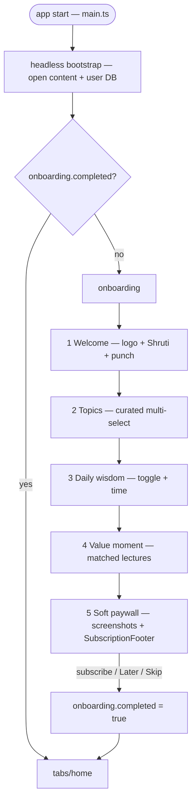

# Onboarding

First launch shows a value-building onboarding carousel instead of a loading
screen. The content database ships bundled with the app, so the bootstrap runs
**headlessly** at startup (behind the OS-native splash) — the old "connecting /
checking / downloading" Welcome screen is gone. A first-time user lands on the
onboarding carousel; every later launch opens straight on Home. The flow
captures the user's topic interests, offers a daily-wisdom toggle, shows a value
moment, and ends on a skippable soft paywall.

## Flow

- **Component**: a purpose-built carousel `ui/features/onboarding/OnboardingCarousel.vue`
  (swipe + progress dots + one primary CTA + a top-right Skip — no Back/Next
  pair). The low-level swipe hook is the shared `@ui/components/useHorizontalCarousel`.
- **Screens** live in `shruti/views/Onboarding/screens/`. Orchestration +
  state in `OnboardingView.vue`.
- **Persisted flag**: `onboarding.completed` (Capacitor Preferences) via
  `useOnboardingStore`. Set only at the end, so an interrupted run replays.
- **Routing**: `main.ts` runs `runStartupBootstrap()` before mount, reads the
  flag, and routes first launch → `/onboarding`, returning users → `/tabs/home`.
  The `/welcome` route and `WelcomeView` were deleted.

## Curated topics (config registry)

The topic picker shows an **editorial** subset of topics, not all ~140 (which
contain near-duplicates and organizational topics). The curated, ordered list is
stored as data in the catalog DB:

- **Storage**: a general-purpose `key_value` table in `current.db`, key
  `onboarding.topics` = JSON array of topic ids. Chosen over `config.json`
  because the DB is bundled/offline, so the list is always available.
- **Authoring (MCP)**: an extensible **config registry**
  (`internal/application/config/registry`) where each key registers a
  `{schema, validator, description}`. `config.describe` exposes the schemas;
  `config.set` validates (the `onboarding.topics` validator rejects unknown
  topic ids) before writing; ships via `catalog.publish`.
- **Mobile read**: `loadOnboardingTopics` reads the key via the `keyValue` repo
  and resolves topics with `topics.getByIds` (order-preserving). Falls back to
  popularity (`topicIdsWithTracksIn`) when the key is unset, so the screen is
  never empty.

Topic picks are saved to the search-filter store (`setTopics`) for immediate
personalization, and to `onboarding.interestTopicIds` for the daily-wisdom rule.

## Daily wisdom

A new proactive rule `daily_wisdom` (see [Proactive messages](proactive-messages.md))
delivers one short, playable lecture excerpt per day into chat:

- **Corpus**: a `daily_wisdom` table in `current.db` (`track_id`, `start_ms`,
  `end_ms`, `text`, `topic_id`, `language`), authored via the MCP `wisdom.*`
  tools.
- **Rule**: gated on the daily-engagement toggle (`settings.notificationsEnabled`)
  + a non-empty interest set. `detect` samples a random interest topic that has a
  fragment, then a random fragment; `buildContent` emits a
  `[cite:track@start-end|text]` marker that the existing `CitationCard` renders
  as a playable excerpt. Silent (no extra OS push — the daily reminder handles
  the nudge); dedup by fragment id, 24 h cooldown.

## Paywall (hybrid)

The final screen reuses the purchase machinery and replaces the visuals:

- **Reused**: `SubscriptionFooter` + `useSubscriptionBinding` (plan selection,
  CTA, trial/intro price, restore, legal links — identical to the Settings
  paywall).
- **New**: a value hero (title, subtitle, bullets, an app-screenshot strip that
  hides missing assets). The generated badge carousel from the subscription
  feature is **not** used here.
- Finishing: a successful purchase or the Skip ("Later") both complete onboarding.

## Bundled database

The first launch is instant + offline because a seed `current.db` ships as an
app asset and is copied into place when no cached DB exists; `scheduleBackgroundRefresh`
then fetches a newer catalog for the next launch. The seed DB must be at the
scheme version the binary expects, and carries the `key_value` + `daily_wisdom`
tables so onboarding works offline out of the box.
