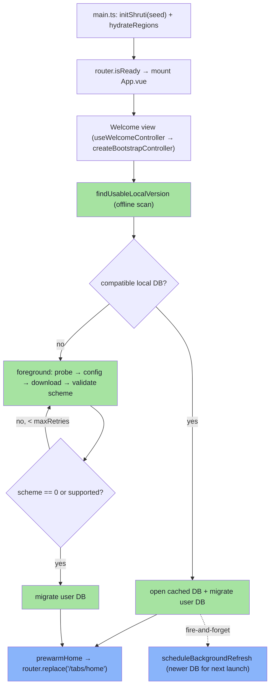

# Shruti app startup flow

This document describes what happens from `main.ts` to the first time the
content database answers a query: how the runtime region list is hydrated, how
CDN servers are probed, the remote config is fetched, which content database is
downloaded and opened (or served instantly from a previous launch via
Stale-While-Revalidate), how the user database is migrated, and where each
resource lives. The resolve / probe / scheme-retry / background-refresh logic is
a generic, app-agnostic orchestrator that lives in **`@kit/bootstrap`**
(`modules/kit/src/bootstrap/`); the app-specific controller only injects its
ports.

Formal specs referenced from here:
- **DB scheme** — see [`../db/`](../db/) (the latest `scheme.*.md` file)
- **Storage layout** — [`../runbooks/storage.md`](../runbooks/storage.md)

## 1. Overview

```
modules/apps/mobile/shruti/main.ts
  └─ installConsoleCapture()                          [services/logger]
  └─ initShruti(seed)                              [shruti/shruti.ts]
      └─ wire platform-specific adapters (persistence / fetcher / filesStorage /
         audio / mediaDownloader / auth / purchases / chat / share / …)
  └─ initMonitoring(app)                              [services/monitoring]
  └─ hydrateRegions(preferences)                      [services/regionsRegistry.ts]
       load the last-fetched region list from prefs (bundled SERVERS as seed)
  └─ router.isReady() → mount Vue app
      └─ fire-and-forget: usePurchasesStore().init(), useAuthStore().restore(),
         useLibraryLandingStore().ensureLoaded()
  └─ Welcome view                                     [views/Welcome/WelcomeView.controller.ts]
      useWelcomeController → createBootstrapController  [@kit/bootstrap]
        Stale-While-Revalidate:
          • find a usable cached content DB (offline-first)
          • IF found & scheme-compatible → open, migrate user DB, ENTER now,
            then BACKGROUND-refresh a newer DB for the next launch
          • ELSE → foreground download + scheme-validate (retry-capped),
            migrate user DB, then enter
      Phase resolve  — resolveContentDatabase           [contentDatabaseResolver.ts]
      Phase validate — openAndValidateContentDatabase    [schemeValidation.ts]
      Phase migrate  — bootstrapUserDatabaseFromApp       [shruti/services/bootstrap.ts]
      prewarmHome() (playlist + dictionaries + appLanguage), then
            ionRouter.replace('/tabs/home')
```



## 2. Entry point & bootstrap

- `modules/apps/mobile/shruti/main.ts` — first installs `installConsoleCapture()`
  (Settings → Debug → "View logs"), then creates Vue + Pinia + Ionic + i18n +
  router. Crucially it calls `initShruti(seed)` **before** `router` is
  installed, because the first navigation runs `beforeEach` synchronously and
  that guard calls `useShruti()` / `isShrutiInitialized()`. It wires Sentry
  via `initMonitoring(app)` before mount, then awaits `hydrateRegions(preferences)`
  and `router.isReady()` before `app.mount("#app")`.
- `modules/apps/mobile/shruti/shruti.ts` — `initShruti(seed)` builds the
  composition-root singleton (`Shruti`) holding every concrete adapter.
  `main.ts` selects implementations by platform (`Capacitor.isNativePlatform()` /
  `Capacitor.getPlatform()`):
  - Persistence: `useCapacitorSqlPersistence()` (native, `@capacitor-community/sqlite`)
    or `useSqlJsPersistence()` (web, `sql.js`).
  - DB fetcher: `useDatabaseToFsFetcher()` (native, `@capacitor/file-transfer`)
    or `useDatabaseToIndexedDbFetcher()` (web). Both implement
    `IDatabaseFetcher.list(directory)` — native returns cached file names, web
    returns `[]` (IDB has no filesystem semantics).
  - FilesStorage: `useCapacitorRemoteFilesStorage({ cacheDir: "shruti" })`
    or `useWebRemoteFilesStorage({ cacheName: "shruti" })`.
  - Plus audio, mediaDownloader, notifications, share (audio/video/transcript),
    haptics, purchases (RevenueCat), auth, proactive chat, the chat
    stream/title/questions/feedback/resume services, excerpt cache, and database
    transfer — all listed in the `InitShrutiSeed` interface or constructed
    locally inside `initShruti`.
  - `storagePublicUrl` is built **inside** `initShruti` via
    `useStoragePublicUrl(() => activeServer.value)` — a getter closure so the
    resolver always sees the latest CDN template after the server probe swaps it.
    The same lazy-getter pattern wires `shareAudioService`, `shareVideoService`
    and `shareTranscriptService`.
- The two failover-aware HTTP clients (auth + chat) are built in `main.ts` via
  `createFailoverClient` (`@kit/servers`). They read the runtime region list from
  `getRegions()` (the registry) per request, preferred-first, and promote a
  fallback that succeeds — which flips `activeServer` and persists the new
  `preferredServerId`.
- On native, `main.ts` overrides `config.database.userLocalPath` to `"user.db"`
  (the sqlite plugin's conventional `getFilesDir()/<dbName>` location); web keeps
  the `DEFAULT_APP_CONFIG` value `"shruti/databases/user.db"`.

After mount, `main.ts` kicks off three fire-and-forget tasks that must not block
startup: `usePurchasesStore().init()`, `useAuthStore().restore()` (anonymous-by-
device session bootstrap), and `useLibraryLandingStore().ensureLoaded()` (warm
the Search landing data so it renders fully formed). All three swallow errors.

## 3. Remote storage & the region registry

The list of CDN/region endpoints is **not** compiled in. It lives in the
published `public/config.json` (managed via shruti-mcp
`catalog.config.regions.*`) and is hydrated at runtime by
`shruti/services/regionsRegistry.ts`:

1. The bundled `SERVERS` (`@lib/domain/servers`, `modules/libs/domain/servers.ts`)
   seed the registry — used ONLY on the very first launch, before any
   `config.json` has been fetched.
2. `hydrateRegions(preferences)` (called from `main.ts` before mount) loads the
   last-fetched regions cached under `REGIONS_KEY` (`"remoteRegions"`); a valid
   persisted list replaces the bundled seed.
3. A `regions` block in a freshly-fetched `config.json` fully **replaces** the
   runtime list and is re-persisted (`setRegions`, applied by the controller's
   `applyRemoteRegions` via the resolver's `onConfigResolved`). A malformed /
   empty list is rejected so a bad publish can't brick the client.

Every consumer that used to import `SERVERS` directly (the prober, the failover
clients, `setActiveServerById`, the Settings picker, asset-URL resolution) now
reads through the registry (`getRegions()` / `findRegion()` / `activeRegion()`),
so a region flip or a new region takes effect without an app release.

- **Server descriptor** — `CdnServer` (`@lib/domain/servers`) extends kit's
  generic `{ id, name, urlTemplate }` with `shareAudioUrl`, `shareVideoUrl`,
  `shareTranscriptUrl` (optional — derived from `chatBaseUrl` when absent),
  `authBaseUrl`, and `chatBaseUrl`. `SERVERS` ships two regions: `global`
  (S3 `us-east-1` for content; share/auth/chat on the Cloud Provider box behind Caddy)
  and `russia` (Yandex Object Storage for content; share/auth/chat on the RU
  Dedicated Host box).
- **Dev region** — `regionsRegistry` prepends a `dev` region (auth/chat at
  `localhost:11081`/`11080`, content on prod S3) only when
  `VITE_DEV_REGION=true`; production builds tree-shake it away.
- **Artefacts** — same bucket layout in every region:
  - `/public/config.json`
  - `/public/db/shruti.{version}.db`
  - `/public/tracks/{trackId}/audio/original.mp3`
  - `/public/tracks/{trackId}/transcripts/{language}.json`
- **Active server** — `shruti.activeServer` (a `Ref<CdnServer>`). A `watch`
  inside `initShruti` mirrors the id into the registry (`setActiveRegionId`,
  so asset URLs follow the live region) and persists it under
  `PREFERRED_SERVER_KEY` (`"preferredServerId"`, see
  `shruti/services/preferredServer.ts`) whenever it changes, so the same
  region is probed first on the next launch. `setActiveServerById(id)` resolves
  the id against the registry (`findRegion`) and flips the ref.
- **Resolver** — `storagePublicUrl.get(path)` substitutes `{path}` (via
  `buildServerUrl`) in the active server's template. SQLite rows store **full
  paths from the bucket root** (including the `public/` prefix) — no
  concatenation in use cases.

See [`../runbooks/storage.md`](../runbooks/storage.md) for the canonical server list.

## 4. The kit bootstrap controller (Stale-While-Revalidate)

`useWelcomeController` (`views/Welcome/WelcomeView.controller.ts`) is a thin
adapter: it builds the resolver options and the open/validate/migrate ports, then
delegates the whole startup to `createBootstrapController(...)`
(`@kit/bootstrap`, `modules/kit/src/bootstrap/bootstrapController.ts`). The
controller exposes a single coarse `BootstrapPhase` that the status-message
composable binds to:

| Phase                  | Meaning                                              |
|------------------------|------------------------------------------------------|
| `idle`                 | not started                                          |
| `welcome:checking`     | first-launch probe before download begins            |
| `welcome:downloading`  | first-launch foreground download (progress is valid) |
| `welcome:migrations`   | first-launch user-DB migrations                      |
| `ready`                | DB open + migrations done; the app may enter         |
| `error`                | fatal; `onRetry` re-runs `start()`                   |

`start()`'s decision is the whole point of the module:

- **Fast path (cache hit).** `findUsableLocalVersion()` scans the local DB
  directory; if a compatible cached version exists, it opens it, confirms the
  scheme via `readContentSchemeVersion()`, runs the user-DB migrations, sets
  `ready`, and **enters immediately**. It then fires
  `scheduleBackgroundRefresh()` to pull a newer compatible DB for the *next*
  launch (best-effort; never touches the entered UI). If the cached file's scheme
  is incompatible it is closed, deleted, marked rejected, and the flow falls
  through to the slow path.
- **Slow path (no usable cache / first launch).** Surfaces `welcome:checking`,
  then runs `openAndValidateContentDatabase(...)` (foreground download + scheme
  retry), migrates the user DB, and enters.

The Welcome splash stays visible (`showWelcomeScreen`) until the controller has
opened the DB, run `prewarmHome()` (playlist + dictionaries + persisted
app-language), and actually navigated — so the user never sees a blank page,
including on the cache-hit fast path.

> The legacy in-app composables (`regionDetect.ts`, `resolveContentDatabase.ts`,
> `useDbSchemeRetry.ts`, `databaseLocator.ts`, `checkForUpdatesInBackground.ts`)
> no longer exist — all of that logic lives in `@kit/bootstrap`. There is also no
> longer a first-launch home-region detection heuristic (timezone / device
> language / IP `whoami`); the region is simply the persisted/bundled bootstrap
> list, and the prober picks the reachable one.

## 5. Resolve — pick a usable content DB

`resolveContentDatabase(opts)` (`contentDatabaseResolver.ts`) is offline-first.

### 5a. Local FS scan

State `database:check`:

1. `deriveParentDir(localPathTemplate)` → e.g. `shruti/databases`.
2. `store.list(parentDir)` — native is `Filesystem.readdir`; web returns `[]`.
3. `findLocalDatabaseVersion(...)` keeps only files matching the
   `shruti.{version}.db` template, excluding the session's
   `incompatibleDbPaths` reject set, and picks the lexicographically-largest
   version.
4. For each candidate (newest-first) `store.exists(localPath)` is the adapter's
   integrity-checking read — an OS-killed mid-write download leaves a
   truncated file that matches the name regex but fails `exists()`; such a file
   is deleted and the next-older cache (or the CDN) is tried instead.

When a valid cached path is found the flow returns it with no network access. The
prebuilt DB is pre-copied into the app's writable directory at first launch by
`BundledDatabaseHelper` (native code, `MainActivity` on Android): it copies every
`.db` under `assets/databases/` into `getFilesDir()/shruti/databases/`, so even
the very first offline launch finds a DB. On web `store.list` always yields `[]`,
so web falls through to 5b.

### 5b. CDN fetch (cold launch / no local copy)

`downloadFromCdn(opts)` (also reused by the background refresh):

1. Probe servers — `probe(configPath, preferredServerId)` (the app adapts
   `serverProber.probe` from `useHttpServerProber`,
   `infra/servers/useHttpServerProber.ts`; state `server:probing`). It tries each
   region in order (preferred first) and returns `{ server, config }` for the
   first that returns valid JSON; the parsed body **is** the remote config, so
   the probe doubles as the config download. `onServerResolved` →
   `setActiveServerById`; `onConfigResolved` → `applyRemoteRegions`.
2. Resolve the latest compatible version from the probed config (state:
   `config:downloading`) via `findLatestCompatibleVersion`, which filters
   `config.databases` by `(db.scheme ?? 1) === supportedScheme` and picks the max
   `version`. If nothing is compatible it throws `NoCompatibleDatabaseError`
   (the validator drops the cached config once and re-probes before giving up).
3. If `store.exists(localPath)` is `false`, download with progress (state:
   `database:downloading`). Otherwise reuse the cached file.

## 6. Validate — open & confirm the scheme

`openAndValidateContentDatabase(opts)` (`schemeValidation.ts`) owns the
resolve → open → validate loop:

1. `resolveContentDatabase` (§5) for a path, then `openDatabase(path)`
   (`shruti.openContentDatabase`).
2. Read the scheme via `readContentSchemeVersion()` →
   `createSqlSchemeVersionRepository`
   (`infra/repositories/sql/schemeVersionRepository.sql.ts`), which runs
   `SELECT scheme FROM migrations WHERE scheme IS NOT NULL ORDER BY name DESC LIMIT 1`
   and returns `0` when there is no scheme row — but only after a
   `SELECT count(*) FROM tracks` sanity check, so a corrupt DB (which also fails
   the scheme query) does **not** masquerade as a valid legacy DB.
3. `isSchemeCompatible(scheme, supportedScheme)` accepts the DB if `scheme === 0`
   (legacy/unknown) **or** `scheme === SUPPORTED_DB_SCHEME` (`__DB_SCHEME__`,
   injected at build time from `modules/db-scheme.json` via Vite `define`).
   Otherwise:
   - Closes the DB.
   - Adds the path to the `incompatibleDbPaths` set so the next re-scan skips it.
   - Deletes the local file and invalidates the cached `config.json`
     (`invalidateConfigCache`) so the next pass re-probes.
   - Loops back to resolve.
   - An open/read that throws (structurally corrupt file that passed the cheap
     header gate) is treated exactly like a scheme mismatch — drop, reject,
     re-resolve — so a bad file can never abort bootstrap permanently.

The loop is **counter-based**, capped at `maxRetries` (default `3`). After that
many mismatched schemes it throws a single diagnostic error listing the observed
schemes (and noting the CDN likely hasn't published a compatible DB yet), which
surfaces on the Welcome error screen.

## 7. Migrate — bootstrap the user DB

After the content DB is confirmed compatible, the controller sets
`welcome:migrations` and calls `runUserDatabaseMigrations`, which wraps
`bootstrapUserDatabaseFromApp(shruti)` (`shruti/services/bootstrap.ts`):

1. `openUserDatabase(userLocalPath)` opens the user DB at the configured path
   (`user.db` on native, `shruti/databases/user.db` on web).
2. `runUserMigrations(db)` (`@infra/persistence/migrations/user/runMigrations.ts`)
   applies pending code migrations sequentially (tracked in the `migrations`
   table).
3. Transition to `ready`; the controller then runs `prewarmHome()` and
   `ionRouter.replace('/tabs/home')` (crossfade animation).

A user-DB failure is **non-fatal**: the controller catches it, logs, and
continues in a degraded state. The content catalog is fully browsable without the
user DB, and a deterministically-throwing migration would otherwise strand every
launch on the error screen (retry just re-runs the same failing migration). The
playlist / notes / chat-history stores already degrade on their own.

Migration files live in
`modules/apps/mobile/infra/persistence/migrations/user/` (individual `.ts` files
per migration: `000_migrations_table.ts`, `001_config_table.ts`, `002_notes.ts`,
… through `012_playlist_items_collection_id.ts`, plus a barrel). The user DB's
shape is fully described by the migration history — there is no external schema
doc.

## 8. Post-bootstrap — background refresh

On the cache-hit fast path the controller fires `scheduleBackgroundRefresh()`
after entering (fire-and-forget, in `@kit/bootstrap`):

1. Re-run `downloadFromCdn` from the probe (same flow as §5b) with no
   phase/progress wiring — it must not touch the already-entered UI.
2. `store.exists` skips the download when the latest version is already cached.
3. A genuinely newer version is downloaded alongside the currently-open one; it
   is picked up on the next launch by the offline scan.
4. `onBackgroundRefreshComplete` persists the winning `preferredServerId`;
   `onBackgroundRefreshError` logs (default `console.warn`).

All errors are swallowed — the app works fine with yesterday's DB.

## 9. Transcript fetching

Transcripts are **not** stored in the SQLite content DB — they are public JSON
files on the CDN. `ITranscriptRepository` is implemented by
`createHttpTranscriptRepository` (`infra/repositories/http/transcriptRepository.http.ts`):

- `availableLanguages(trackId)` / `has(trackId, language)` delegate to the
  domain `ITrackRepository` (`listTranscriptLanguages` / `getTranscriptPath`) —
  the HTTP repo stays ignorant of the content DB's row shapes.
- `get(trackId, language)` resolves the advertised path via
  `getTranscriptPath`, builds the full URL with `storagePublicUrl.get(path)`,
  pipes it through `filesStorage.get(url)` (which caches the file locally),
  `fetch`es the local URL, and parses `{ version, blocks }` (defaulting to
  `version: 1` / `blocks: []`).

Subsequent opens of the same transcript come from the cache — the first-load
network cost is paid once per transcript per device.

## 10. Resource map

| Resource      | CDN path                                           | Local path                                                |
|---------------|----------------------------------------------------|-----------------------------------------------------------|
| Remote config | `/public/config.json`                              | — (cached by `filesStorage`)                              |
| Content DB    | `/public/db/shruti.{version}.db`                | `shruti/databases/shruti.{version}.db`              |
| User DB       | —                                                  | `user.db` (native) / `shruti/databases/user.db` (web) |
| Track audio   | `/public/tracks/{trackId}/audio/original.mp3`      | cached by `filesStorage` / `IMediaDownloader`            |
| Transcript    | `/public/tracks/{trackId}/transcripts/{lang}.json` | cached by `filesStorage`                                 |

Full URL is formed by the active CDN server's template; see §3.

## 11. Publishing a new DB scheme

1. Author / publish the new content DB and `config.json` entry through
   **shruti-mcp** (`catalog.publish`). The new DB is uploaded as
   `/public/db/shruti.{version}.db` and `/public/config.json` gains a
   `{ version, scheme }` entry. Keep old entries for clients still on the
   previous scheme.
2. Bump the `scheme` value in `modules/db-scheme.json` — the single source of
   truth, consumed both by the mobile Vite config (`__DB_SCHEME__`) and by
   `modules/db-sync.sh`.
3. Run `bash modules/db-sync.sh [android|ios|e2e|all]` (a thin wrapper over
   `modules/kit/scripts/db-sync.sh`) to download the latest compatible
   production DB from the CDN and distribute it to the bundled-DB consumers:
   `apps/mobile/android/app/src/main/assets/databases/`,
   `apps/mobile/ios/App/App/databases/`, and the e2e fixtures
   (`tests/e2e/mobile/fixtures/public/`).
4. Add `docs/db/scheme.{new_scheme}.md` alongside the old one.
