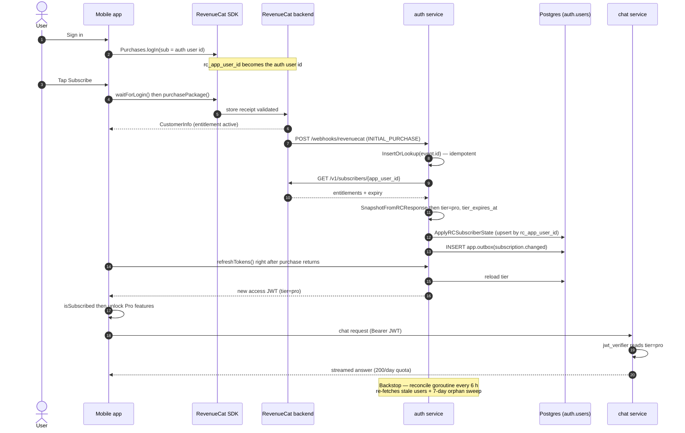

# Subscriptions & RevenueCat

How a purchase becomes a `pro` tier the whole stack agrees on. There are two tiers — `free` and `pro` — and **RevenueCat (RC) is the source of truth** for entitlements. The durable mirror lives in Postgres `auth.users` (`tier`, `tier_expires_at`, `tier_updated_at`, and `rc_app_user_id`, the join key back to RC). The app never persists entitlement state of its own; the mobile purchases store is a live reactive view over the RC SDK. After every webhook the auth service re-derives `tier` by **re-fetching the full RC subscriber** rather than trusting the event payload.

This page covers the subscription *model* end-to-end. Webhook-handler internals (idempotency, TRANSFER resolution, Bearer-secret dual-slotting) live in the [authentication](auth.md) page and the [RevenueCat webhook secret rotation](../../../runbooks/rc-webhook-secret-rotation.md) runbook.

## End-to-end flow

## Server: webhook → reconcile → token

The auth service derives tier from RC, never from the client:

1. **Link.** On sign-in the client calls `Purchases.logIn(sub)` where `sub` is the JWT subject (= `auth.users.id`), making RC's `app_user_id` equal our user id (`usePurchasesStore.ts`, `useCapacitorPurchases.ts`).
2. **Webhook.** RC posts to `/webhooks/revenuecat`. The handler resolves the `app_user_id` (with a TRANSFER fallback), idempotency-guards on `event.id`, then re-fetches the subscriber — it does **not** switch on `event_type` (`internal/handler/rc_webhook.go`).
3. **Re-fetch.** `rcclient.GetSubscriber` → `GET /v1/subscribers/{app_user_id}` (`internal/rcclient/client.go`): `404` → treat as free, `401/403` → permanent (key broken), `429` → rate-limited, `5xx` → retryable.
4. **Snapshot.** `SnapshotFromRCResponse` (`internal/service/subscription.go`) → `{tier, tier_expires_at}`: `pro` iff any entitlement is active (`expires_date` in the future, or nil/zero for a lifetime), with a 60 s grace for clock skew. Malformed bodies yield a clean `free` snapshot and bump `rc_response_malformed_total`.
5. **Apply.** `ApplyRCSubscriberState` writes `auth.users` (matched by `rc_app_user_id`), emits `app.outbox('subscription.changed')`, and marks the webhook row processed — all in one tx under a per-`rc_app_user_id` advisory lock. If no user owns the `rc_app_user_id` yet (the webhook beat the client's `logIn`), the row is left unprocessed for RC to retry; the reconcile orphan sweep buries it after 7 days.
6. **Reconcile backstop.** A goroutine inside the auth binary (not an HTTP endpoint), ticking every 6 h: re-fetch users whose `tier_updated_at` is stale (> 24 h) and re-apply, then orphan-sweep unprocessed webhook rows older than 7 days. This is what covers dropped webhooks beyond RC's ~80-minute retry budget.
7. **To the client.** The access JWT carries `tier`, `tier_expires_at`, `quota_id`, `rc_app_user_id`. The tier is **frozen at issue time**, so the client must refresh to see a flip; `Service.Refresh` reloads the current tier from `auth.users` and re-coerces a stale `pro` to `free` on the way out.

## Client: paywall and gating

- **Purchases store** (`shruti/stores/usePurchasesStore.ts`) exposes `isSubscribed`. After `purchase()`/`restore()` it calls `useAuthStore().refreshTokens()` so the new `pro` claim lands immediately instead of waiting for natural rotation, and `onCustomerInfoChanged` force-refreshes when RC's view diverges from the JWT tier.
- **SDK adapter** (`infra/purchases/capacitor/useCapacitorPurchases.ts`) reads `info.entitlements.active` (not `activeSubscriptions`) and deterministically picks one entitlement when both a paid sub and a promo grant are present.
- **Paywall** — `usePaywallStore.requestOpen(feature?)` deep-links route `subscription?feature=…` to a specific carousel slide; the view is `views/Subscription/` + `ui/features/subscription/`. The slide set and feature→slide mapping live in `ui/features/subscription/featureKeys.ts` (`SubscriptionFeatureKey`: `newLectures | bookmarks | smartLibrary | chat | autoScroll | continuousPlayback | trackInfo | notesStudio | shareTranscript`).
- **Free-trial badge** — `toPurchasePackage()` maps `product.introPrice` to a free-trial badge, but only when eligible: iOS gates on `checkTrialOrIntroductoryPriceEligibility` (only `ELIGIBLE` counts); Android defers to Google's new-customer enforcement at purchase time.
- **Gating** — Pro features read `isSubscribed` (after `ready && !reconciling` to avoid flicker): `TrackSheet.vue`, `useChatStore`, smart library, notes studio, the continuous-playback toggle, proactive hints, etc.

## Tier → chat quota

The chat service reads the tier straight from the JWT and rate-limits per day (UTC buckets, Redis):

| Scope | Anon | Free | Pro |
|---|---|---|---|
| `chat` | 3/day | 10/day | 200/day |

`jwt_verifier.py` parses `tier`/`quota_id`/`tier_expires_at`; `rate_limiter.py` `_user_limit_for` picks the limit and **coerces a `pro` whose `tier_expires_at` is in the past back to free** without waiting for reconcile. Counters key on `chat:user:{quota_id}` (plus `chat:ip:{ip}` for anon defence). On a Redis outage Pro keeps serving from a process-local brownout cache while free/anon fail closed. The 429/503 envelope echoes `tier` so the app shows the right CTA (anon → sign in, free → buy Pro, pro → wait).

## Gotchas

- **Dev/preview builds fake Pro in the UI.** `devPro` is on for `__BUILD_ID__ === "dev"` and `*.pages.dev` hosts, so the UI shows Pro — but the real chat tier still comes from the JWT, so chat can rate-limit as free. Override with `CapacitorStorage.e2e.forceFreeTier=1`.
- **A manual `auth.users.tier` UPDATE is reverted by the next reconcile** (6 h), because tier is re-derived from RC. The correct manual grant is a **RevenueCat promotional entitlement** keyed by the RC App User ID, which then flows in via webhook/reconcile. (The RU "Can't pay?" button in Settings emails support that id for exactly this.)
- **Purchase-before-sign-in strands under an anonymous `app_user_id`.** Mitigated by `waitForLogin()` before purchase/restore and `recoverPurchases()` on a no-merge `logIn`; server-side the orphan sweep resolves a webhook that arrived before binding.
- **TRANSFER events carry no top-level `app_user_id`** — the handler falls back to `transferred_to`, downgrades the losing id, and defers if every target is still anonymous.
- **Stale Pro is self-healing on the read side** — even if an EXPIRATION webhook is dropped, the chat limiter downgrades once `tier_expires_at` passes.

See the `rc-subscription-debug` operator skill for the full "app shows Pro but chat says limit exceeded" triage path.
