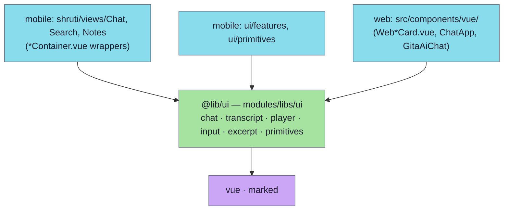

# Shared UI library — `@lib/ui`

`@lib/ui` (`modules/libs/ui/`, package name `@shruti/ui`) is the **cross-app** presentation library: Vue single-file components that both the mobile app and the Astro web site render. It is a second, separate UI body from the mobile app's own `ui/**` layer — that one is app-local and may use Ionic, this one may not, because the web host does not ship Ionic. Everything in it is a pure leaf: props in, events out, no store, no repository, no domain object. Hosts wrap each component in a thin container that fetches data and supplies the props.

## Where it sits

The arrows only ever point down. `@lib/ui` sits **below** the mobile `ui/**` layer (`ui/primitives/index.ts` re-exports `HighlightText` from it, `ui/features/transcript/*` uses its `renderInlineMarkdown`), so it must not import `@ui/*` back.

## How the alias resolves

| Host | Mechanism |
|---|---|
| Mobile — TypeScript | `modules/apps/mobile/tsconfig.json` → `"@lib/ui/*": ["./submodules/ui/*"]` |
| Mobile — bundler | `vite.config.ts` alias `@lib/ui` → `./submodules/ui` |
| Mobile — tests | `vitest.config.ts` alias `@lib/ui` → `./submodules/ui` |
| Web | `apps/web/astro.config.mjs` resolves `@lib/*` generically to `modules/libs/*` |

`modules/apps/mobile/submodules/ui` is a **symlink** to `modules/libs/ui` — the same trick used for `domain`, `contracts` and `persistence-*`. Despite the directory name these are not git submodules; the only real git submodule in the tree is `modules/kit`.

## Contents

| Directory | Components |
|---|---|
| `chat/` | The chat answer cards and their pieces: `VerseCard`, `CitationCard`, `CommentaryCard`, `ChapterCard`, `MediaCard`, `OutlineCard`, `TrackCard`, `ExcerptPlayer`, `ScriptureBlock`, `ScriptureChip`, `AccentFrame`, `AutoHeight`, `StatusPill`, `ChatSendButton`, `TranslationNotice` (+ `types.ts`) |
| `transcript/` | `TranscriptView`, `TranscriptBlockText`, `VerseRefChip`, `renderInlineMarkdown.ts` |
| `player/` | `AudioPlayerBar`, `Waveform` |
| `input/` | `FloatingInput`, `FloatingInputButton` |
| `excerpt/` | `ExcerptCard` (+ barrel `index.ts`) |
| `primitives/` | `HighlightText` |

Not every component has two consumers: the chat cards and the inputs are shared, while `TranscriptView`, `AudioPlayerBar` and `Waveform` are currently rendered only by the web lecture page, and `OutlineCard` only by mobile. The library is the place a component lands **once a second host needs it or is expected to** — the alternative is a copy that drifts.

## Boundary

`eslint.config.js` in the mobile app carries a `no-restricted-imports` block keyed on `submodules/ui/**` and `../../libs/ui/**` (both paths, so the rule matches whichever route the linter reaches the file by — the same pattern the `contracts` and `persistence` blocks use). Forbidden:

| Forbidden | Why |
|---|---|
| `@lib/domain` | Presentation must not know the domain — declare a mirror type instead |
| `@lib/persistence/*` | Row shapes are an infra concern |
| `@usecases`, `@ports/*`, `@infra/*`, `@shruti/*` | Same inward rule the app-local `ui/**` layer obeys |
| `@capacitor/*` | Platform SDKs belong behind a `@ports/app` port |
| `@ui/*` | The app-local UI layer sits *above* `@lib/ui`, not beside it |
| `@ionic/*` | The web host renders these components and ships no Ionic |

Allowed: `vue`, `marked`, `@lib/contracts` / `@kit/*` (the shared kernel), and its own files.

> **The rule only runs when the path is named.** `eslint .` walks the directory tree itself and does **not** descend through a symlinked directory, so a block keyed on `submodules/**` never fires during a plain `eslint .`. The mobile `lint` script therefore passes `submodules/ui` as an explicit second target. The sibling blocks for `contracts`, `domain` and `persistence-*` have the same shape and are, for the same reason, still unenforced — the `grep` checks in [`../architecture/layers.md`](../architecture/layers.md#how-to-verify) remain the real boundary check for those.

## Mirror types

Because `@lib/domain` is off limits, the chat cards declare their prop shapes in `chat/types.ts` — `UiChatVerseBody`, `UiChatCiteSnippet`, `UiChatChapterBody`, `UiChatCommentaryBody`, `UiMediaPayload`. Each carries **only the fields the card renders**, so mobile can pass its `@lib/domain/chatMessage` objects and web can pass objects built straight from the SSE wire; structural typing accepts both.

This matters beyond tidiness: `@lib/domain/chatMessage.ts` is not a types-only module (it also exports `ProtocolVersionMismatchError`, `attributeValues`, `CHAT_ATTR_*`), so a non-`type` import from a card would pull domain runtime into the web bundle. The mirror removes the possibility.

The sync rule from [`../architecture/layers.md`](../architecture/layers.md#ui-mirror-types) applies unchanged: a mirror is a snapshot, not a live link. When a card starts rendering a new field, add it to `chat/types.ts` in the same change.

## Adding a component

1. Put the `.vue` file under the directory matching its surface (`chat/`, `player/`, …).
2. Keep it host-agnostic: no Ionic, no Capacitor, no domain import, no data fetching. Anything the component cannot compute from its props is a prop or a slot.
3. Give each host a thin container (`shruti/views/Chat/components/*Container.vue` on mobile, `src/components/vue/Web*.vue` on web) that resolves the data.
4. If it needs a payload shape that exists in the domain, add a mirror to `chat/types.ts` rather than importing it.
