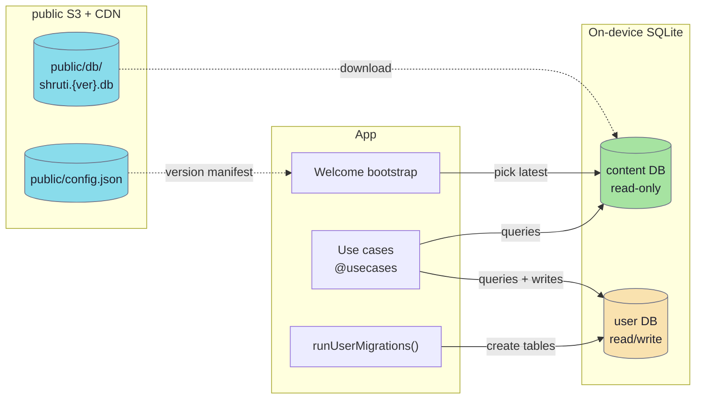

# Databases

Shruti runs **two separate SQLite databases on the device**: a read-only **content DB** that ships with the app (and is refreshed from the CDN), and a writable **user DB** that holds notes, playlist state and the offline cache. They never touch each other — different files, different connections, different lifecycle.

## Two-database architecture

| | Content DB | User DB |
|---|---|---|
| File name | `shruti.{YYYYMMDDHHMMSS}.db` | `user.db` (native) / `shruti/databases/user.db` (web) |
| Origin | Published by the shruti-mcp catalog (`catalog.publish` → `current.db`), uploaded to S3 | Created on first launch by [`runUserMigrations`](https://github.com/jiva-studio/shruti/blob/main/modules/apps/mobile/infra/persistence/migrations/user/runMigrations.ts) |
| Mutability | **Read-only** at runtime — client never writes | Read-write |
| Schema evolution | Schema is owned by the publisher; the client only validates the recorded scheme. Current `SupportedDBScheme` = `20260614` ([`scheme.go`](https://github.com/jiva-studio/shruti/blob/main/modules/tools/shruti-mcp/internal/domain/catalog/scheme.go), mirrored in [`db-scheme.json`](https://github.com/jiva-studio/shruti/blob/main/modules/db-scheme.json)) | Stacked TS migrations, tracked by `migrations` table (`name`, `applied_at`) |
| Tables | Dictionaries + normalised track tables + topics + collections + FTS (`authors`, `locations`, `sources`, `languages`, `tags`, `topics`, `tracks`, `track_variants`, `track_audio`, `track_references`, `track_tags`, `track_topics`, `collections`, `collection_tracks`, `collection_tags`, `collection_groups`, `collection_group_items`, `migrations`, `tracks_search`) | `migrations`, `config`, `notes`, `playlist_items`, `media_items`, `listening_sessions`, `chat_sessions`, `chat_messages`, `chat_messages_proactive_state` |
| Detail page | [Content DB](./content-db.md) · [ER diagram](./er-diagram.md) | [User DB](./user-db.md) |

## Engines per platform

| Platform | Persistence adapter | Notes |
|---|---|---|
| Native (iOS / Android) | `modules/apps/mobile/infra/persistence/capacitor/` (`useCapacitorSqlPersistence`) over `@capacitor-community/sqlite` | Native SQLite. Reconciles stale native connections left by a webview reload via `checkConnectionsConsistency()` before each first `open()` |
| Web (PWA / browser) | `modules/apps/mobile/infra/persistence/sqljs/` (`useSqlJsPersistence`) over `sql.js` (WASM) + IndexedDB | The npm `sql.js` build has **no FTS5**, so the project uses FTS4 to keep the same SQL on every platform. WASM bundled locally via Vite; `db.export()` bytes persisted to IndexedDB, serialised through a transaction queue |

The choice is made at composition time in [`main.ts`](https://github.com/jiva-studio/shruti/blob/main/modules/apps/mobile/shruti/main.ts) — `persistence: isNative ? useCapacitorSqlPersistence() : useSqlJsPersistence()`. Use cases never see the difference — they call the domain `IDatabase`/`IPersistence` port and let the adapter translate.

## Where to read next

- **[ER diagram](./er-diagram.md)** — full content DB diagram (dictionary, track, topic and collection tables + FTS).
- **[Content DB](./content-db.md)** — table-by-table walkthrough with field semantics.
- **[User DB](./user-db.md)** — migrations and tables for user-owned data.
- **[ID generation](./ids.md)** — how every entity id (track, author, note, …) is minted, prefixed and stabilised across rebuilds.
- **[Content DB scheme](./scheme.20260420.md)** — versioned snapshot of the content-DB SQL (current `SupportedDBScheme` = `20260614`).
- **Bootstrap flow** — [`../architecture/startup-flow.md`](../architecture/startup-flow.md) covers how the right `shruti.{version}.db` is picked, validated and loaded.

## Server-side `library.db`

Separate from the on-device content DB, the **`library.db`** SQLite file lives on the curator's shruti-mcp host and on S3 (`public/library/library.{ver}.db`). It carries the canonical book corpus (verses, commentaries, titles) plus the curated **attribution tables** (`library_attributions`, `library_attribution_texts`, `library_attribution_refs`) that the chat-service consumes. The publish cadence is independent of the catalog. See [`../architecture/attribution.md`](../architecture/attribution.md) for the full schema and end-to-end flow.

## Path convention (recap)

Every path stored in either database (`track_audio.path`, `track_variants.transcript_path`, `media_items.local_path`) is a **complete value, not a relative fragment**. The client substitutes the path into a CDN template via [`useStoragePublicUrl.ts`](https://github.com/jiva-studio/shruti/blob/main/modules/kit/src/infra/storagePublicUrl/useStoragePublicUrl.ts) without concatenating prefixes. See [Storage layout](../infra/s3-layout.md#path-convention) for the full reasoning.
