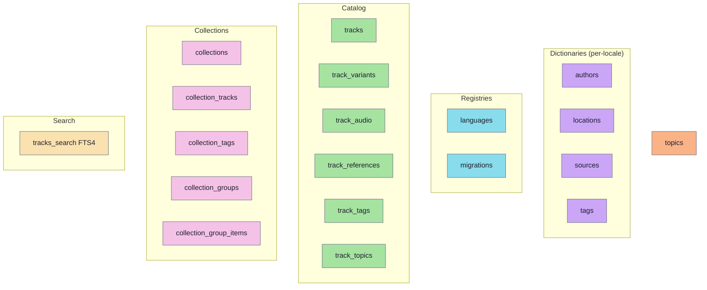

# Content DB — tables

Human-readable walkthrough of the prebuilt SQLite content database. For the visual ER diagram see [`er-diagram.md`](./er-diagram.md); for a dated raw-SQL snapshot of the prior shape see [`scheme.20260420.md`](./scheme.20260420.md). The **current** scheme is `20260614`. All tables described here are **read-only at runtime** — the mobile app only writes to the [user DB](./user-db.md). The publisher owns the schema: the catalog writer in the Go MCP (`modules/tools/shruti-mcp/internal/infra/catalog/sqlite/`) ships the prebuilt DB; the client only opens and validates it.

## Table inventory



| Table | Rows | Role |
|---|---|---|
| `tracks` | many | Lecture metadata (language-independent) |
| `track_variants` | per (track, language) | Localised title + transcript pointers + per-locale sort key + outline/description |
| `track_audio` | per (track, language, kind) | N audio versions per variant (`original`, `clean`, …) |
| `track_references` | per ref | Scripture citations, e.g. BG 10.5 |
| `track_tags` | M:N | Track ↔ Tag join (includes kind-tags) |
| `track_topics` | per (track, topic) | Weighted topic membership (recommender) |
| `topics` | per (id, language) | Localised topic-vocabulary dictionary |
| `collections` | per (id, language) | Curated, localised collections of tracks |
| `collection_tracks` | M:N | Collection ↔ Track join, ordered by `position` |
| `collection_tags` | M:N | Collection ↔ Tag join (curation, e.g. `tag_featured`) |
| `collection_groups` | per (id, language) | Named, ordered shelves of collections |
| `collection_group_items` | M:N | Group ↔ Collection join, ordered by `position` |
| `authors`, `locations`, `sources`, `tags` | per (id, language) | Localised dictionaries |
| `languages` | per language | Registry of available locales |
| `migrations` | per applied migration | Holds the `scheme` value (read on startup) |
| `tracks_search` | virtual (FTS4) | Unified full-text index; one `title` row per variant plus one `combined` row per track |

---

<!-- BEGIN AUTOGEN -->

## Catalog

### `tracks`

A row per lecture recording. Language-agnostic — anything per-language goes to `track_variants`.

| Column | Type | Constraints | Meaning |
|---|---|---|---|
| `id` | TEXT | **PK** | Stable ID, format `track_<12-char nanoid>` (see [IDs](./ids.md)) |
| `author_id` | TEXT | nullable | Legacy recordings may have unknown author — UI renders a fallback |
| `location_id` | TEXT | nullable | Legacy recordings may have unknown location |
| `date` | TEXT | nullable | ISO `YYYY-MM-DD`, e.g. `1974-10-20` |
| `hidden` | INTEGER | NOT NULL DEFAULT 0 | Boolean flag (0/1); excluded from default lists |

That is the whole table — there are no `sort_reference` / `sort_date` columns. The "by date" sort orders directly on `tracks.date` (the `YYYY-MM-DD` string compares chronologically under SQLite's BINARY collation, so no precomputed cache is needed); the "by reference" sort reads the per-locale key from `track_variants.sort_reference`. See `sortOrderClause()` in `modules/apps/mobile/infra/repositories/sql/tracksRepository.sql.ts`.

> **Why is the by-reference sort key per-language?** The chip prefix the user sees ("БГ" / "BG") is locale-dependent, so the sort bucket has to be locale-dependent too — otherwise Russian and English alphabetic ordering disagree. The key lives on `track_variants` (which is already per-language); see that table below for the format.

### `track_variants`

Per-language content for each track. Composite PK `(track_id, language)` — exactly one row per pair. Audio lives in its own [`track_audio`](#track_audio) table; the legacy `audio_path` / `audio_filesize` / `audio_duration` / `audio_kind` columns are still present on the published schema but the catalog writer no longer populates them and the mobile app does not read them — they were backfilled into `track_audio` on the scheme bump.

| Column | Type | Constraints | Meaning |
|---|---|---|---|
| `track_id` | TEXT | **PK part** | Owning track |
| `language` | TEXT | **PK part** | ISO-639 code |
| `title` | TEXT | NOT NULL, **COLLATE NOCASE** | Lecture title; case-insensitive sort/compare |
| `transcript_path` | TEXT | nullable | Full bucket key for the transcript JSON |
| `transcript_kind` | TEXT | CHECK ∈ `original\|generated\|edited` | Provenance flag for UI badges |
| `sort_reference` | TEXT | nullable | Per-locale by-reference sort key. Format: `<localized-source-short>_<numeric-tail>`, e.g. `БГ_000001_000015` for ru, `BG_000001_000015` for en. Numeric segments zero-padded to 6 chars. The mobile `ORDER BY` reads this column from the `(track_id, language)` row matching the active UI language; tracks with no reference (NULL) sort to the tail via `NULLS LAST`. |
| `outline` | TEXT | nullable | JSON array of `{title, start, end}` section headings (ms), generated from the reviewed transcript |
| `description` | TEXT | nullable | Short per-locale overview of the lecture |

Index: `idx_track_variants_sort_reference (language, sort_reference)` backs the by-reference ordering. The `byReference` ordering reads `sort_reference` through a correlated subquery keyed on the active UI language (see `sortOrderClause()` in `tracksRepository.sql.ts`).

> **Why is the path stored fully-qualified?** Single source of truth. The client substitutes `{path}` in a CDN template (see [`useStoragePublicUrl.ts`](https://github.com/jiva-studio/shruti/blob/main/modules/apps/mobile/infra/storagePublicUrl/useStoragePublicUrl.ts)) and never concatenates prefixes. Eliminates a class of bugs around mis-joined paths.

> The `outline` / `description` columns are additive ALTERs under the same scheme (`ensureTrackVariantOutlineColumns` in `migrate.go`); older binaries ignore them, newer ones read them.

### `track_audio`

N audio versions per `(track, language)` — `kind` ∈ `{original, clean, …}` — instead of one fixed audio file on `track_variants`. The pre-existing published file becomes the `original` row; the denoiser adds a `clean` row. Created and backfilled by `ensureTrackAudioTable` in `migrate.go`.

| Column | Type | Constraints | Meaning |
|---|---|---|---|
| `track_id` | TEXT | NOT NULL, **PK part** | Owning track |
| `language` | TEXT | NOT NULL, **PK part** | ISO-639 code |
| `kind` | TEXT | NOT NULL, **PK part** | `original`, `clean`, … |
| `path` | TEXT | NOT NULL | Full bucket key, e.g. `public/tracks/abc/audio/original.mp3` |
| `filesize` | INTEGER | nullable | Bytes |
| `duration` | INTEGER | nullable | **Milliseconds** |

Composite PK `(track_id, language, kind)`; FK `(track_id, language)` → `track_variants(track_id, language)` `ON DELETE CASCADE`. Index: `idx_track_audio_track (track_id, language)`. Mobile reads all audio versions for a variant in one query (`SELECT * FROM track_audio …`) and the duration range filters select on `MAX(duration)` here (see `tracksRepository.sql.ts`).

### `track_references`

One row per scripture reference attached to a track. Composite PK `(track_id, ref_idx)`.

| Column | Type | Meaning |
|---|---|---|
| `track_id` | TEXT | Owning track |
| `ref_idx` | INTEGER | Position within the track's reference list (0-based) |
| `source_id` | TEXT | FK to `sources.id` (the scripture code) |
| `tokens` | TEXT | Numeric tail joined by `.` — e.g. `"10.5"`, `"10.5.12"` |

Index: `idx_track_references_source` — accelerates the "all tracks citing source X" query.

> **Why dot-joined tokens, not separate columns?** `tokens` is split on `.` only when the UI renders a reference or when range detection is needed. Storing as text avoids per-track schema variation (some refs have 2 tokens, some 3) and keeps the row narrow.
>
> The on-disk **transcript JSON** wire format keeps `tokens` as a **string array** (matches the TS domain — see [`Reference`](../domain/entities.md#reference--referencets)). Only the SQL row joins them.

### `track_tags`

Plain many-to-many junction. PK `(track_id, tag_id)`.

| Column | Type | Meaning |
|---|---|---|
| `track_id` | TEXT | Owning track |
| `tag_id` | TEXT | FK to `tags.id` (includes the canonical kind-tags — `tag_morning_walk`, `tag_conversation`, …) |

> Kind-tags (recording type) live in this same join table, not on `track_variants`. The canonical set is seeded by `seedKindTags` in `modules/tools/shruti-mcp/internal/infra/catalog/sqlite/migrate.go` (`tag_morning_walk`, `tag_conversation`, `tag_interview`, `tag_press_conf`, `tag_address`, `tag_vyasa_puja`, `tag_initiation`, `tag_wedding`, `tag_festival`, `tag_bhajan`, `tag_other`), each inserted into `tags` for `ru` + `en`.

### `track_topics`

Language-agnostic membership of a track in a topic, with a salience weight — a track covers several topics, each weighted. Powers the recommender / "tracks by topic" shelf. Created by `ensureTopicsTables` in `migrate.go`.

| Column | Type | Constraints | Meaning |
|---|---|---|---|
| `track_id` | TEXT | NOT NULL, **PK part** | Owning track |
| `topic_id` | TEXT | NOT NULL, **PK part** | FK to `topics.id` |
| `weight` | REAL | NOT NULL | Topic salience for this track |

Index: `idx_track_topics_topic (topic_id, weight DESC)` — reverse lookup for the "tracks by topic" shelf, highest-weight first.

---

## Topics

### `topics`

Localised topic-vocabulary dictionary, shaped like `tags` so the generic dict-CRUD path drives it. Composite PK `(id, language)`.

| Column | Type | Constraints | Meaning |
|---|---|---|---|
| `id` | TEXT | NOT NULL, **PK part** | Topic ID |
| `language` | TEXT | NOT NULL, **PK part** | ISO-639 code |
| `full_name` | TEXT | NOT NULL | Localised topic name |
| `short_name` | TEXT | nullable | Short display name for tight surfaces (chips, shelf headers) |
| `cover` | TEXT | nullable | Generated cover asset key |

---

## Collections

Curated, localised collections of tracks (e.g. a thematic playlist), formerly called "packs". The collection tables are created/renamed and recorded by `ensureCollectionTables` in `modules/tools/shruti-mcp/internal/infra/catalog/sqlite/migrate.go`.

### `collections`

Composite PK `(id, language)` — one row per locale, same per-locale pattern as the dictionaries.

| Column | Type | Constraints | Meaning |
|---|---|---|---|
| `id` | TEXT | NOT NULL, **PK part** | Collection ID |
| `language` | TEXT | NOT NULL, **PK part** | ISO-639 code |
| `name` | TEXT | NOT NULL | Localised collection title |
| `cover` | TEXT | nullable | Cover asset key |
| `description` | TEXT | nullable | Localised description |
| `meta` | TEXT | nullable | JSON metadata blob |
| `sort_order` | INTEGER | NOT NULL DEFAULT 0 | Display ordering among collections |

> There is no `featured` column. "Featured" curation is now a membership row in `collection_tags` pointing at the seeded `tag_featured` tag (`Рекомендуем` / `Featured`); the legacy `featured` column is migrated to that membership and dropped on open by `finalizeCollectionSchema`.

### `collection_tracks`

Ordered join from a collection to its tracks. PK `(collection_id, collection_language, track_id)`; FK `(collection_id, collection_language)` → `collections(id, language)` with `ON DELETE CASCADE`.

| Column | Type | Constraints | Meaning |
|---|---|---|---|
| `collection_id` | TEXT | NOT NULL, **PK part** | Owning collection |
| `collection_language` | TEXT | NOT NULL, **PK part** | Owning collection's locale |
| `track_id` | TEXT | NOT NULL, **PK part** | Member track |
| `position` | INTEGER | NOT NULL DEFAULT 0 | Track order within the collection |

Index: `idx_collection_tracks (collection_id, collection_language, position)` — backs ordered member lookups.

### `collection_tags`

Curation join from a collection to tags (e.g. `tag_featured`). PK `(collection_id, collection_language, tag_id)`; FK `(collection_id, collection_language)` → `collections(id, language)` `ON DELETE CASCADE`.

| Column | Type | Constraints | Meaning |
|---|---|---|---|
| `collection_id` | TEXT | NOT NULL, **PK part** | Owning collection |
| `collection_language` | TEXT | NOT NULL, **PK part** | Owning collection's locale |
| `tag_id` | TEXT | NOT NULL, **PK part** | FK to `tags.id` |

### `collection_groups`

Named, ordered shelves of collections. Composite PK `(id, language)`.

| Column | Type | Constraints | Meaning |
|---|---|---|---|
| `id` | TEXT | NOT NULL, **PK part** | Group ID |
| `language` | TEXT | NOT NULL, **PK part** | ISO-639 code |
| `name` | TEXT | NOT NULL | Localised group title |
| `description` | TEXT | nullable | Localised description |
| `meta` | TEXT | nullable | JSON metadata blob |
| `sort_order` | INTEGER | NOT NULL DEFAULT 0 | Display ordering among groups |

### `collection_group_items`

Ordered join from a group to its collections. PK `(group_id, group_language, collection_id)`; FK `(group_id, group_language)` → `collection_groups(id, language)` `ON DELETE CASCADE`.

| Column | Type | Constraints | Meaning |
|---|---|---|---|
| `group_id` | TEXT | NOT NULL, **PK part** | Owning group |
| `group_language` | TEXT | NOT NULL, **PK part** | Owning group's locale |
| `collection_id` | TEXT | NOT NULL, **PK part** | Member collection |
| `position` | INTEGER | NOT NULL DEFAULT 0 | Collection order within the group |

Index: `idx_collection_group_items (group_id, group_language, position)` — backs ordered member lookups.

---

## Dictionaries

All four dictionaries (`authors`, `locations`, `sources`, `tags`) follow the same pattern: composite PK `(id, language)`, one row per locale. Existence of any row for an id = existence of the dictionary entry — no separate parent table.

### `locations` / `tags`

| Column | Type | Constraints |
|---|---|---|
| `id` | TEXT | NOT NULL, **PK part** |
| `language` | TEXT | NOT NULL, **PK part** |
| `full_name` | TEXT | NOT NULL |

### `authors`

Same base shape, plus avatar/bio columns added by `ensureAuthorProfileColumns` (`image` is language-neutral — the same value on every locale row; `description` is per-locale):

| Column | Type | Constraints |
|---|---|---|
| `id` | TEXT | NOT NULL, **PK part** |
| `language` | TEXT | NOT NULL, **PK part** |
| `full_name` | TEXT | NOT NULL |
| `image` | TEXT | nullable — S3 avatar asset key |
| `description` | TEXT | nullable — short per-locale bio |

### `sources`

Same shape, plus a `short_name` for compact display ("BG" vs "Bhagavad-gītā"):

| Column | Type | Constraints |
|---|---|---|
| `id` | TEXT | NOT NULL, **PK part** |
| `language` | TEXT | NOT NULL, **PK part** |
| `full_name` | TEXT | NOT NULL |
| `short_name` | TEXT | NOT NULL |

> **Why per-locale rows instead of a JSON map?** Keeps `WHERE language = ?` index-friendly and avoids reading the full row to render a single locale.

---

## Registries

### `languages`

The catalog of available locales itself — keyed by `code`, not per-locale.

| Column | Type | Constraints |
|---|---|---|
| `code` | TEXT | **PK** |
| `full_name` | TEXT | NOT NULL |
| `icon` | TEXT | nullable, e.g. `"🇷🇺"` |

### `migrations`

Created lazily by the builder. Holds two columns the runtime cares about:

| Column | Type | Notes |
|---|---|---|
| `name` | TEXT | **PK**, e.g. `"001_init_schema"`, `"005_add_track_audio"` |
| `scheme` | INTEGER | `YYYYMMDD` — only set when the migration changes scheme |
| `applied_at` | INTEGER | Unix ms at apply time |

The catalog `current.db` is a binary snapshot mutated in place — there is no rebuild-from-DDL path — so migrations are applied on open in `migrate.go`. The current rows are:

| name | scheme |
|---|---|
| `001_init_schema` | 20260420 |
| `002_drop_sort_cache` | 20260512 |
| `003_add_packs` | 20260520 |
| `004_rename_packs_to_collections` | 20260613 |
| `005_add_track_audio` | 20260614 |

The `004…` (`ensureCollectionTables`) and `005…` (`ensureTrackAudioTable`) rows are inserted idempotently (`INSERT OR IGNORE`) so the scheme-discovery query below returns the bumped scheme. The additive table sets (`topics` / `track_topics`, `collection_tags`, `collection_groups` / `collection_group_items`) and additive columns (`track_variants.outline/description`, `authors.image/description`, `topics.short_name/cover`, `collections.cover/description/meta`) live under the **same** `20260614` scheme and do **not** add their own `migrations` row.

The startup flow runs:

```sql
SELECT scheme FROM migrations WHERE scheme IS NOT NULL ORDER BY name DESC LIMIT 1;
```

and rejects the DB if the value differs from the build-time scheme constant (current: `20260614`, `SupportedDBScheme` in `modules/tools/shruti-mcp/internal/domain/catalog/scheme.go`, mirrored in `modules/db-scheme.json`) — see [`startup-flow.md`](../architecture/startup-flow.md#5-phase-2--open--validate-the-content-database).

---

## Search — `tracks_search` (FTS4)

```sql
CREATE VIRTUAL TABLE tracks_search USING fts4(
  content,
  track_id,
  kind,
  notindexed="track_id",
  notindexed="kind",
  tokenize=unicode61 "remove_diacritics=2"
);
```

A single unified full-text index. The catalog writer (`rebuildTrackSearchRows` in `modules/tools/shruti-mcp/internal/infra/catalog/sqlite/write.go`) emits, per track, two flavours of row distinguished by the `kind` column:

- **`title`** — one row per stored variant title (kept for consumers that filter by `kind = 'title'`).
- **`combined`** — exactly one row per track whose `content` is the space-joined concatenation of: every variant title; each reference rendered as `source_id tokens`, `short_name tokens` and `full_name tokens` (so a reference is findable in any locale); every per-language location name; every per-language tag name (so kind-tags like "morning walk" / "интервью" are searchable as free text); and the date split into year, `YYYY-MM`, and full `YYYY-MM-DD`.

Mobile search matches against `kind = 'combined'` so an implicit-AND multi-token query like `"BG 1974 2.13"` can match a source short-name, a year, and a reference token on the same track. The `backfillCombinedFtsRows` function in `migrate.go` rebuilds the combined rows on open if a shipped catalog lacks them.

**Why FTS4 (not FTS5).** The `sql.js` WASM on npm is compiled without FTS5. FTS4 covers everything (same `MATCH` syntax, same tokenizer with `remove_diacritics=2`, `notindexed=` for metadata columns). Native `@capacitor-community/sqlite` supports both, so sticking to FTS4 keeps the same SQL on every platform.

Reference search like `"sb 1.8.40"` is parsed on the client into tokens and matched via the FTS index plus exact `track_references.tokens` prefix matching.

<!-- END AUTOGEN -->

## Mappers

The single place that turns content-DB rows into domain entities is `infra/repositories/sql/contentRowMappers.ts` (per-locale row collapse into `Map<LanguageCode, …>`) and `rowMappers.ts` (track/variant assembly). The `@lib/persistence/main` package holds the row TypeScript types — no other code is allowed to import them.
