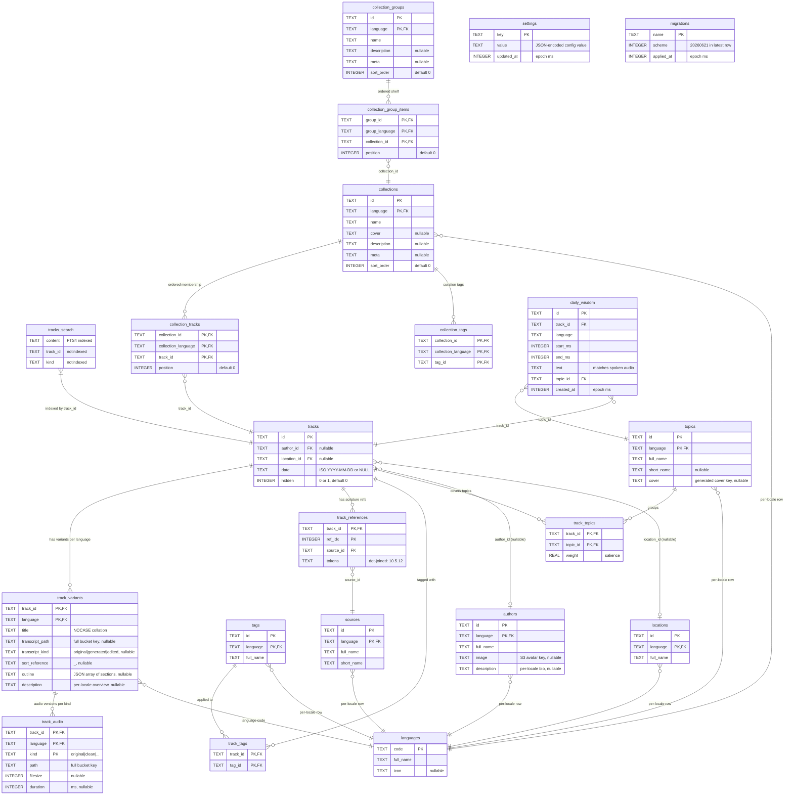
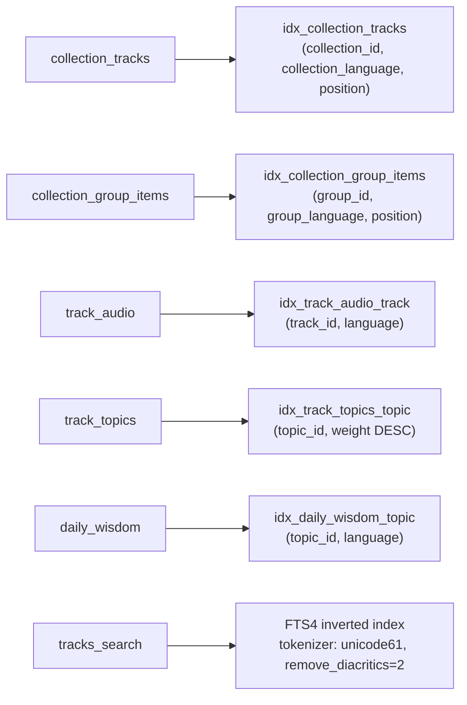

# Content DB — ER diagram

Visual entity-relationship diagram for the prebuilt content database. The publisher (`shruti-mcp`, package `internal/infra/catalog/sqlite`) owns the schema and writes `current.db`; the mobile client only opens it. Row shapes are declared in [`modules/libs/persistence/main/index.ts`](https://github.com/jiva-studio/shruti/blob/main/modules/libs/persistence/main/index.ts), the active scheme number in [`modules/db-scheme.json`](https://github.com/jiva-studio/shruti/blob/main/modules/db-scheme.json). See [Content DB tables](./content-db.md) for table-by-table descriptions and [User DB](./user-db.md) for the writable side.

## Full diagram (scheme `20260621`)

<!-- BEGIN AUTOGEN -->

<!-- END AUTOGEN -->

## How to read this diagram

- **Crow's foot** at `track_variants` end of `tracks ||--o{ track_variants` means "one track has zero-or-more variants, exactly one per language".
- **Audio lives in its own table** — `track_audio` holds N audio versions per `(track, language)` keyed by `kind` (`original`, `clean`, …) with the composite PK `(track_id, language, kind)`. The pre-existing published file is the `original` row; the denoiser adds a `clean` row. It carries a real `FOREIGN KEY (track_id, language) REFERENCES track_variants(track_id, language) ON DELETE CASCADE`. `track_variants` itself no longer stores audio — only `title`, transcript columns, the per-locale `sort_reference`, and the additive `outline` (JSON `[{title,start,end}]` in ms) / `description` overview columns.
- **Composite primary keys** — `track_variants`, `track_audio`, `track_references`, `track_tags`, `track_topics`, `collections`, `collection_tracks`, `collection_tags`, `collection_groups`, `collection_group_items` and every dictionary table use `(id, language)` or `(track_id, …)` / `(collection_id, collection_language, …)` tuples as PK. SQLite enforces uniqueness on the tuple.
- **Curated collections** — `collections` is a per-locale dictionary (`(id, language)` PK, `cover` / `description` / `meta` / `sort_order` for shelf presentation). `collection_tracks` carries ordered membership with a `position` column and a real `FOREIGN KEY (collection_id, collection_language) REFERENCES collections(id, language) ON DELETE CASCADE`. A collection surfaces as "featured" by carrying the seeded `tag_featured` curation tag in `collection_tags` (see [`FeaturedTagID`](https://github.com/jiva-studio/shruti/blob/main/modules/tools/shruti-mcp/internal/domain/catalog/collection.go)). `collection_groups` / `collection_group_items` model named, ordered shelves OF collections. The whole collection schema is guaranteed lazily on first open by [`ensureCollectionTables`](https://github.com/jiva-studio/shruti/blob/main/modules/tools/shruti-mcp/internal/infra/catalog/sqlite/migrate.go).
- **Topics** — `topics` is a `tags`-shaped per-locale dictionary (`(id, language)` PK, plus additive `short_name` / `cover`). `track_topics` is language-agnostic membership of a track in a topic with a `weight` salience; a track covers several weighted topics. These power the recommender / topic shelves.
- **App config / content** — `settings` is a general-purpose key→JSON config registry shipped in the catalog (offline-available; first key `onboarding.topics`), authored via the MCP config-registry tools. `daily_wisdom` is the authored corpus for the `daily_wisdom` proactive rule: one row is a short, playable lecture excerpt tagged by `topic_id` (the interest the rule samples) and `track_id` (the source lecture), authored via the MCP `wisdom.*` tools. Both are single-column PK and guaranteed lazily on first open (`ensureSettingsTable` / `ensureDailyWisdomTable`); their `topics` / `tracks` references are undeclared like the other dictionary fan-outs.
- **`migrations` table** — the mobile scheme-validator reads the active scheme from `migrations` (`ORDER BY name DESC LIMIT 1`); the latest row carries `scheme = 20260621`, which must match [`modules/db-scheme.json`](https://github.com/jiva-studio/shruti/blob/main/modules/db-scheme.json) and [`SupportedDBScheme`](https://github.com/jiva-studio/shruti/blob/main/modules/tools/shruti-mcp/internal/domain/catalog/scheme.go). The `006_add_settings_and_daily_wisdom` row (scheme `20260621`) sorts after `005_add_track_audio` (`20260614`) and wins.
- **Dictionary fan-out into `languages`** — every per-locale row of `authors` / `locations` / `sources` / `tags` / `topics` / `collections` references the language registry by `language → languages.code`. These dictionary foreign keys are not declared (SQLite needs explicit `PRAGMA foreign_keys = ON`); the relation is enforced at publish time by `shruti-mcp`. The declared FKs in the schema are `track_audio → track_variants`, `collection_tracks → collections`, `collection_tags → collections` and `collection_group_items → collection_groups`.
- **`tracks_search` is an FTS4 virtual table** — `track_id` and `kind` are stored but `notindexed`, so they don't enter the full-text index. `content` is the only searchable column. Each track gets one `kind='combined'` row that concatenates titles, reference segments, location names, tag names and date parts.
- **Author profiles** — `authors` carries additive `image` (language-neutral S3 avatar key, same on every locale row) and per-locale `description` (bio) columns.
- **Nullable FKs**: `tracks.author_id` and `tracks.location_id` are nullable for legacy recordings without metadata. The UI renders a fallback when missing.

## Indexes

The secondary indexes the publisher maintains on the content DB are `idx_collection_tracks` (ordered collection-membership reads), `idx_collection_group_items` (ordered shelf reads), `idx_track_audio_track` (audio versions for a variant), `idx_track_topics_topic` (highest-weight tracks for a topic shelf, `weight DESC`) and `idx_daily_wisdom_topic` (a wisdom fragment for a sampled topic + language). Everything else relies on the implicit primary-key indexes (composite PKs on `tracks`, `track_variants`, the dictionary tables, etc.) plus the FTS4 inverted index on `tracks_search`.

Sorting is driven by the queries themselves, not by dedicated indexes: `byDate` modes sort on `tracks.date` and `byReference` looks up the per-locale `track_variants.sort_reference`, both with `NULLS LAST` (see [`buildOrderClause`](https://github.com/jiva-studio/shruti/blob/main/modules/apps/mobile/infra/repositories/sql/tracksRepository.sql.ts) and [`SortMethod`](./../domain/value-objects.md#ui-side-enums--durationfilters--sortmethods)). Filter-chip queries select on `t.author_id IN (...)` / `t.location_id IN (...)`. Duration filters aggregate `track_audio.duration` (`MAX(duration)`) per track.

## Why FTS4, not FTS5

The `sql.js` WASM build on npm is compiled without FTS5. FTS4 covers everything Shruti needs (same `MATCH` syntax, same `unicode61` tokenizer, `remove_diacritics=2`, `notindexed=` for metadata columns). Native `@capacitor-community/sqlite` supports both — keeping FTS4 means the same SQL runs on every platform.

For ER diagram of the **user DB** (notes, playlist, media cache) see [User DB](./user-db.md#er-diagram).
