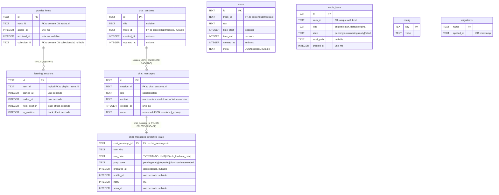
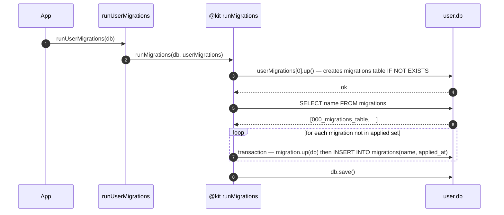

# User DB

The user DB is a writable SQLite file that lives on the device only. It holds **notes, playlist state, the listening journal, the offline media cache, the Sadhu chat history (with its proactive-scheduler sidecar) and a key-value config store** — anything the user has created or done on this device. Nothing here syncs anywhere; reinstalling the app erases it.

## ER diagram

<!-- BEGIN AUTOGEN -->



<!-- END AUTOGEN -->

There are no foreign-key constraints between user-side rows and the content DB — `track_id` columns reference rows in the **content DB** (a separate file), so SQLite cannot enforce them. Use cases that need to hydrate a user-side row with track data (e.g. [`listActivePlaylistTracks`](https://github.com/jiva-studio/shruti/blob/main/modules/apps/mobile/usecases/playlist/listPlaylistTracks.ts)) gracefully drop entries whose `track_id` no longer exists upstream — those are stale pointers, not bugs. The only enforced FKs are the **intra-DB chat relations** (`chat_messages.session_id` → `chat_sessions.id`, `chat_messages_proactive_state.chat_message_id` → `chat_messages.id`), both `ON DELETE CASCADE`.

Row types for every table are declared in [`modules/libs/persistence/user/index.ts`](https://github.com/jiva-studio/shruti/blob/main/modules/libs/persistence/user/index.ts) (`NoteRow`, `PlaylistItemRow`, `ListeningSessionRow`, `MediaItemRow`, `UserConfigRow`, `UserMigrationRow`).

## Migrations

Migrations are applied on every startup by [`runUserMigrations`](https://github.com/jiva-studio/shruti/blob/main/modules/apps/mobile/infra/persistence/migrations/user/runMigrations.ts), which is a thin wrapper that hands the app-owned ordered `userMigrations` list to the generic [`runMigrations`](https://github.com/jiva-studio/shruti/blob/main/modules/kit/src/persistence/migrations.ts) engine in `@kit/persistence`. The `migrations` table records what's been applied so already-run migrations are skipped by name.



> Note: `migration_000_migrations_table` (the first element of `userMigrations`) is run **unconditionally** before the lookup so the bootstrap is idempotent — re-running on an already-initialised DB is safe. Each pending migration's `up` and its `migrations` INSERT run inside a single `db.transaction(...)`: on the native Capacitor adapter every `execute` autocommits, so without the transaction a process kill between a durable DDL commit and the INSERT would leave the change applied but unrecorded, replaying a non-idempotent migration on the next launch.

### Migration files

```
modules/apps/mobile/infra/persistence/migrations/user/
├── 000_migrations_table.ts                ← creates `migrations` itself
├── 001_config_table.ts                    ← key/value config
├── 002_notes.ts                           ← notes table + 2 indexes
├── 003_playlist_items.ts                  ← playlist + 2 indexes (one partial)
├── 004_media_items.ts                     ← media cache + unique track_id index
├── 005_listening_sessions.ts             ← listening journal + 2 indexes
├── 006_notes_meta.ts                      ← ALTER notes ADD COLUMN meta
├── 007_chat_messages.ts                   ← chat_sessions + chat_messages + 2 indexes
├── 008_chat_messages_proactive_state.ts   ← proactive sidecar + 3 indexes
├── 009_chat_sessions_track_id.ts          ← ALTER chat_sessions ADD COLUMN track_id + partial index
├── 010_listening_sessions_fix_negative_delta.ts ← data repair: clamp to_position < from_position rows
├── 011_media_items_kind.ts                ← ALTER media_items ADD COLUMN kind + re-key unique idx to (track_id, kind)
├── 012_playlist_items_collection_id.ts    ← ALTER playlist_items ADD COLUMN collection_id
├── columns.ts                             ← `addColumnIfMissing` (idempotent ALTER … ADD COLUMN)
├── runMigrations.ts                       ← wrapper that calls `@kit/persistence` runMigrations with `userMigrations`
├── index.ts                               ← `userMigrations: readonly Migration[]` barrel
└── types.ts                               ← re-exports `Migration` from `@kit/persistence`
```

The `ALTER … ADD COLUMN` migrations (`006`, `009`, `011`, `012`) go through [`addColumnIfMissing`](https://github.com/jiva-studio/shruti/blob/main/modules/apps/mobile/infra/persistence/migrations/user/columns.ts), which probes `PRAGMA table_info` first and skips the ALTER if the column already exists — so a replay after a process kill between the DDL autocommit and the `migrations` INSERT is a harmless no-op instead of a "duplicate column name" failure.

## Tables in detail

### `migrations` — `000_migrations_table.ts`

```sql
CREATE TABLE IF NOT EXISTS migrations (
  name       TEXT PRIMARY KEY,
  applied_at TEXT NOT NULL
)
```

`name` is the migration's `name` field (e.g. `"002_notes"`). `applied_at` is an ISO timestamp string (`new Date().toISOString()`) set when the migration ran. This is **different from the content DB's `migrations` table** — the user DB's version has no `scheme` column.

### `config` — `001_config_table.ts`

```sql
CREATE TABLE IF NOT EXISTS config (
  key   TEXT PRIMARY KEY,
  value TEXT NOT NULL
)
```

A simple key-value store for runtime-tunable settings (selected language, theme, filter preferences, tutorial state…). Adding a new setting needs no migration — pick a key, write a value.

### `notes` — `002_notes.ts` (+ `meta` from `006_notes_meta.ts`)

```sql
CREATE TABLE IF NOT EXISTS notes (
  id         TEXT PRIMARY KEY,           -- "note_<nanoid12>"
  track_id   TEXT NOT NULL,
  text       TEXT NOT NULL,
  time_start INTEGER NOT NULL,           -- seconds
  time_end   INTEGER NOT NULL,           -- seconds
  created_at INTEGER NOT NULL,           -- unix ms
  meta       TEXT                        -- JSON sidecar, nullable (006)
);
CREATE INDEX IF NOT EXISTS idx_notes_track      ON notes(track_id, time_start);
CREATE INDEX IF NOT EXISTS idx_notes_created_at ON notes(created_at DESC);
```

`idx_notes_track` is a **composite** so list-by-track queries (the most frequent read) come back already ordered along the track timeline. `idx_notes_created_at DESC` backs `listRecent(limit)` for the global Notes view.

`meta` is a free-form JSON sidecar that repositories round-trip as `Record<string, unknown> | null`; the domain layer doesn't enforce a shape. Its first consumer is the Studio editor, which stores a quote tweaked for video rendering under `meta.studio.text`.

### `playlist_items` — `003_playlist_items.ts` (+ `collection_id` from `012_playlist_items_collection_id.ts`)

```sql
CREATE TABLE IF NOT EXISTS playlist_items (
  id            TEXT PRIMARY KEY,       -- "playlist_<nanoid12>"
  track_id      TEXT NOT NULL,
  added_at      INTEGER NOT NULL,        -- unix ms
  archived_at   INTEGER,                 -- unix ms, nullable
  collection_id TEXT                     -- nullable, content DB collections.id (012)
);
CREATE INDEX IF NOT EXISTS idx_playlist_added_at ON playlist_items(added_at DESC);
CREATE INDEX IF NOT EXISTS idx_playlist_active
  ON playlist_items(added_at DESC) WHERE archived_at IS NULL;
```

The **partial index** `idx_playlist_active` (`WHERE archived_at IS NULL`) is what makes `listActive()` cheap — it stays small as items get archived and only needs to walk the live subset.

`collection_id` records the collection a track was added **from**, set only when the user added a whole collection ("add all"); it is NULL for tracks added individually (search, chat, or a single lecture inside a collection). This is an explicit, intent-based provenance record that replaces the older derive-by-membership grouping on Home (which inferred collections from `collection_tracks` + row adjacency). Pre-`012` rows migrate to NULL and render as standalone tracks.

The row carries queue state only. Per-item progress and completion are derived from `listening_sessions` (migration 005) — there is one source of truth for "what the user listened to and when".

> Lifecycle: see [PlaylistItem state machine](../domain/entities.md#state-machine).

### `media_items` — `004_media_items.ts` (+ `kind` from `011_media_items_kind.ts`)

```sql
CREATE TABLE IF NOT EXISTS media_items (
  id         TEXT PRIMARY KEY,           -- "media_<nanoid12>"
  track_id   TEXT NOT NULL,
  kind       TEXT NOT NULL DEFAULT 'original',  -- original|clean (011)
  state      TEXT NOT NULL,              -- pending|downloading|ready|failed
  local_path TEXT,                       -- nullable
  created_at INTEGER NOT NULL            -- unix ms
);
-- 004 created a UNIQUE index on track_id; 011 drops it and re-keys to (track_id, kind):
CREATE UNIQUE INDEX IF NOT EXISTS idx_media_items_track_kind ON media_items(track_id, kind);
CREATE INDEX        IF NOT EXISTS idx_media_items_state ON media_items(state);
```

A track can cache more than one audio file: the noisy `original` and the denoised `clean`. The `kind` column distinguishes them — existing rows default to `'original'`. Migration `011` drops the old per-`track_id` unique index and replaces it with a **unique index on `(track_id, kind)`**, so both variants can coexist for one track while still enforcing one cache row per (track, kind). The `IMediaItemRepository.upsert(...)` invariant relies on that uniqueness (it does a `SELECT … LIMIT 1` first, then either UPDATE or INSERT). The state index is used by `listReady()` and `failStaleDownloads()`.

> Lifecycle: see [MediaItem download state machine](../domain/entities.md#download-state-machine).

### `listening_sessions` — `005_listening_sessions.ts`

```sql
CREATE TABLE IF NOT EXISTS listening_sessions (
  id            TEXT PRIMARY KEY,         -- "session_<nanoid12>"
  item_id       TEXT NOT NULL,            -- → playlist_items.id (logical FK)
  started_at    INTEGER NOT NULL,         -- unix seconds
  ended_at      INTEGER NOT NULL,         -- unix seconds (moves on tick/finish)
  from_position INTEGER NOT NULL,         -- track offset, seconds
  to_position   INTEGER NOT NULL          -- track offset, seconds
);
CREATE INDEX IF NOT EXISTS idx_listening_sessions_item  ON listening_sessions(item_id, ended_at DESC);
CREATE INDEX IF NOT EXISTS idx_listening_sessions_ended ON listening_sessions(ended_at);
```

One row per play→pause/seek/track-change interval. Two indexes:

- **`idx_listening_sessions_item (item_id, ended_at DESC)`** is the workhorse for "most recent session for this item" — used by both single-item resume (`getLastSessionForItem`) and the batched playlist progress query (`getProgressForItems`).
- **`idx_listening_sessions_ended (ended_at)`** powers the heatmap range scan (`getDailyTotals(fromMs, toMs)`).

Times are **seconds**, not milliseconds — the journal compresses well (compact integers, frequent inserts) and the player converts at the composable boundary.

Migration `010_listening_sessions_fix_negative_delta` is a one-shot **data repair**, not a schema change: it flattens legacy rows where `to_position < from_position` to a zero-length interval (`from_position = to_position`). Those rows came from an old `start()` that anchored `from_position` to the previous session's `to_position`; replaying a finished lecture or pressing play after seeking back produced a negative `to − from` that silently cancelled the day's heatmap total. A clamp in `start()` prevents new bad rows; this migration neutralises the existing ones.

> Lifecycle: see [`ListeningSession` lifecycle](../domain/entities.md#lifecycle) and [`IListeningSessionRepository`](../domain/ports.md#ilisteningsessionrepository) for the full read/write API.

### `chat_sessions` — `007_chat_messages.ts` (+ `track_id` from `009_chat_sessions_track_id.ts`)

```sql
CREATE TABLE IF NOT EXISTS chat_sessions (
  id         TEXT PRIMARY KEY,
  title      TEXT,                        -- nullable
  created_at INTEGER NOT NULL,            -- unix ms
  updated_at INTEGER NOT NULL,            -- unix ms
  track_id   TEXT                         -- nullable, content DB tracks.id (009)
);
CREATE INDEX IF NOT EXISTS idx_chat_sessions_updated ON chat_sessions(updated_at DESC);
CREATE INDEX IF NOT EXISTS idx_chat_sessions_track_id_updated
  ON chat_sessions(track_id, updated_at DESC) WHERE track_id IS NOT NULL;
```

A session groups chat messages into a conversation and carries display metadata. `track_id` anchors the session to a specific lecture: the "Ask Sadhu" flow on a transcript selection reuses the most recent session with the matching `track_id` (looked up via `findLatestByTrack(trackId)`) rather than spawning a new one per fragment. `track_id` is NULL for free-form sessions opened from the chat tab. The **partial index** keeps that lookup cheap without bloating on NULL rows.

### `chat_messages` — `007_chat_messages.ts`

```sql
CREATE TABLE IF NOT EXISTS chat_messages (
  id         TEXT PRIMARY KEY,
  session_id TEXT NOT NULL,               -- → chat_sessions.id
  role       TEXT NOT NULL CHECK(role IN ('user','assistant')),
  content    TEXT NOT NULL,               -- raw assistant markdown w/ inline markers
  created_at INTEGER NOT NULL,            -- unix ms
  meta       TEXT NOT NULL DEFAULT '{"_v":1,"data":{}}',
  FOREIGN KEY (session_id) REFERENCES chat_sessions(id) ON DELETE CASCADE
);
CREATE INDEX IF NOT EXISTS idx_chat_messages_session ON chat_messages(session_id, created_at);
```

`content` keeps the raw assistant markdown including inline `[cite:...]`, `[card:...]`, `[action:...]`, `[outline:...]` and `[followup:...]` markers so the bubble renderer can rebuild the same UI tokens after a reload. `meta` is a single versioned JSON envelope `{ _v, data }`; inside `data`:

- `actions`: id → `ChatActionPayload` (playlist / save_note / share_pdf / …)
- `outlines`: trackId → `ChatOutlinePayload` (chapter list)
- `actionStates`: id → `'pending' | 'executing' | 'done' | 'error'`
- `followups`: `string[]` (tappable chip texts at end of message)
- `error?`: `ChatMessageError` (`{ kind: "truncated", reason: "stream" | "turns" }`)

The `CHECK(role IN ('user','assistant'))` constraint enforces the role enum at the DB boundary, and the `session_id` FK cascades — deleting a session removes its messages (the marker-rendering layer treats orphan messages as a bug, never a recoverable state).

### `chat_messages_proactive_state` — `008_chat_messages_proactive_state.ts`

```sql
CREATE TABLE IF NOT EXISTS chat_messages_proactive_state (
  chat_message_id  TEXT    PRIMARY KEY,    -- → chat_messages.id
  rule_kind        TEXT    NOT NULL,
  rule_date        TEXT    NOT NULL,       -- 'YYYY-MM-DD'
  prep_state       TEXT    NOT NULL,
  prepared_at      INTEGER,                -- unix seconds, nullable
  visible_at       INTEGER,                -- unix seconds, nullable
  notify           INTEGER NOT NULL DEFAULT 0,  -- 0/1
  seen_at          INTEGER,                -- unix seconds, nullable
  UNIQUE(rule_kind, rule_date),
  FOREIGN KEY (chat_message_id) REFERENCES chat_messages(id) ON DELETE CASCADE
);
CREATE INDEX IF NOT EXISTS idx_proactive_state_prep_state ON chat_messages_proactive_state(prep_state);
CREATE INDEX IF NOT EXISTS idx_proactive_state_seen_at    ON chat_messages_proactive_state(seen_at);
CREATE INDEX IF NOT EXISTS idx_proactive_state_visible_at ON chat_messages_proactive_state(visible_at);
```

A 1:1 sidecar for `chat_messages` rows the agent emitted autonomously (holiday digests, daily reminders, smart-library hints…). Regular user/assistant rows have no entry here, so the render query joins with LEFT. Columns:

- `rule_kind` — which proactive rule produced the row (`'holiday'`, `'smart_library_hint'`, `'next_shloka'`, …).
- `rule_date` — `'YYYY-MM-DD'` idempotency key. `UNIQUE(rule_kind, rule_date)` enforces "one Sunday digest", "one Janmashtami digest per holiday date"; the detector INSERTs blindly and relies on the constraint for dedup.
- `prep_state` — `'pending' | 'ready' | 'degraded' | 'dismissed' | 'superseded'`. Drives render visibility and the scheduler's re-prep loop.
- `prepared_at` — unix seconds; when content was prepped. `useProactiveScheduler` uses it to decide if content has gone stale and needs re-prep.
- `visible_at` — unix seconds; the moment the row becomes visible in chat and (if `notify=1`) the moment an OS push fires.
- `notify` — 0/1; whether to register an OS `LocalNotification` at `visible_at`. The scheduler calls `LocalNotifications.schedule({ id: stableHash(chat_message_id), at })`; Capacitor's idempotency on `id` removes the need for a "did we fire yet" flag.
- `seen_at` — unix seconds; first time the user opened the session containing this row. Drives the per-session dot in history and the tab-level Sadhu badge. NULL = unseen.

The cascading FK on `chat_message_id` means deleting a chat row also removes its proactive sidecar.

## Adding a new migration

1. Create `013_<feature>.ts` next to the existing files. Export a `Migration` with `{ name: "013_<feature>", up: async (db) => { ... } }`.
2. Append it to the array in `index.ts`. Order matters — `runMigrations` walks `userMigrations` linearly.
3. **Use `IF NOT EXISTS`** for `CREATE TABLE` / `CREATE INDEX` so a partially-applied state can be re-run cleanly.
4. Test: delete `user.db` from the device and relaunch — the migration should apply from a clean state. Then test re-launching with the migration already applied (it must be a no-op).

There is no rollback story — this is a per-device DB; on a wedged migration the user reinstalls. To change an existing row shape, prefer `ALTER TABLE … ADD COLUMN` (cheap and additive, as `006_notes_meta`, `009_chat_sessions_track_id`, `011_media_items_kind` and `012_playlist_items_collection_id` do) over destructive renames. Go through the [`addColumnIfMissing`](https://github.com/jiva-studio/shruti/blob/main/modules/apps/mobile/infra/persistence/migrations/user/columns.ts) helper for those ALTERs so a replay after an interrupted launch is a no-op rather than a "duplicate column name" crash.
