# Domain ports

Ports are TypeScript interfaces that the domain depends on but does not implement. Use cases consume them; concrete adapters under `modules/apps/mobile/infra/repositories/` provide them; the composition root in [`shruti.ts`](https://github.com/jiva-studio/shruti/blob/main/modules/apps/mobile/shruti/shruti.ts) wires the two together. There are **24 domain ports** under [`modules/libs/domain/ports/`](https://github.com/jiva-studio/shruti/tree/main/modules/libs/domain/ports) — 23 repositories plus `IUnitOfWork`. The barrel [`ports/index.ts`](https://github.com/jiva-studio/shruti/blob/main/modules/libs/domain/ports/index.ts) re-exports most of them; `ITopicRepository`, `ISettingsRepository` and `IDailyWisdomRepository` are imported directly from their modules (by the discovery use cases and the onboarding loader). A separate set of **technical ports** (see the layer doc) covers non-domain concerns like the audio player or the file system.

> Note: Shruti has **no REST/GraphQL/tRPC API** — it is a client-only app. These repository ports *are* the API surface from the perspective of use cases.

## Map: who implements what, where

```mermaid
graph LR
    subgraph DOM["@lib/domain/ports"]
        ITR[ITrackRepository]
        IAR[IAuthorRepository]
        ILR[ILocationRepository]
        ISR[ISourceRepository]
        ILA[ILanguageRepository]
        ITG[ITagRepository]
        ITP[ITopicRepository]
        ISE[ISettingsRepository]
        IDW[IDailyWisdomRepository]
        ITRX[ITranscriptRepository]
        INO[INoteRepository]
        IPI[IPlaylistItemRepository]
        IMI[IMediaItemRepository]
        ILS[IListeningSessionRepository]
        ILI[ILibraryItemRepository]
        ILM[ILibraryMembershipRepository]
        ICS[IChatSessionRepository]
        ICM[IChatMessageRepository]
        IPS[IProactiveStateRepository]
        IOB[IOutboxRepository]
        ISS[ISyncStateRepository]
        ISA[ISyncApplyRepository]
        ISB[ISyncBackfillRepository]
        IUOW[IUnitOfWork]
    end

    subgraph SQL["infra/repositories/sql<br/>(SQLite content + user DB)"]
        SQLT["tracksRepository.sql.ts<br/>(via compositeTrackRepository.ts)"]
        SQLA[authorsRepository.sql.ts]
        SQLL[locationsRepository.sql.ts]
        SQLS[sourcesRepository.sql.ts]
        SQLLA[languagesRepository.sql.ts]
        SQLTG[tagsRepository.sql.ts]
        SQLTP[topicsRepository.sql.ts]
        SQLSE[settingsRepository.sql.ts]
        SQLDW[dailyWisdomRepository.sql.ts]
        SQLN[notesRepository.sql.ts]
        SQLP[playlistItemsRepository.sql.ts]
        SQLM[mediaItemsRepository.sql.ts]
        SQLLS[listeningSessionsRepository.sql.ts]
        SQLLI[libraryItemsRepository.sql.ts]
        SQLLM[libraryMembershipsRepository.sql.ts]
        SQLCS[chatSessionsRepository.sql.ts]
        SQLCM[chatMessagesRepository.sql.ts]
        SQLPS[proactiveStateRepository.sql.ts]
        SQLOB[outboxRepository.sql.ts]
        SQLSS[syncStateRepository.sql.ts]
        SQLSA[syncApplyRepository.sql.ts]
        SQLSB[syncBackfillRepository.sql.ts]
        SQLUW[reentrantUnitOfWork.sql.ts]
    end

    subgraph HTTP["infra/repositories/http<br/>(S3 / CDN)"]
        TRH[transcriptRepository.http.ts]
    end

    SQLT -.implements.-> ITR
    SQLA -.implements.-> IAR
    SQLL -.implements.-> ILR
    SQLS -.implements.-> ISR
    SQLLA -.implements.-> ILA
    SQLTG -.implements.-> ITG
    SQLTP -.implements.-> ITP
    SQLSE -.implements.-> ISE
    SQLDW -.implements.-> IDW
    SQLN -.implements.-> INO
    SQLP -.implements.-> IPI
    SQLM -.implements.-> IMI
    SQLLS -.implements.-> ILS
    SQLLI -.implements.-> ILI
    SQLLM -.implements.-> ILM
    SQLCS -.implements.-> ICS
    SQLCM -.implements.-> ICM
    SQLPS -.implements.-> IPS
    SQLOB -.implements.-> IOB
    SQLSS -.implements.-> ISS
    SQLSA -.implements.-> ISA
    SQLSB -.implements.-> ISB
    SQLUW -.implements.-> IUOW
    TRH -.implements.-> ITRX

    classDef port fill:#cba6f7,stroke:#6c7086,color:#1e1e2e;
    classDef sqlimpl fill:#a6e3a1,stroke:#6c7086,color:#1e1e2e;
    classDef httpimpl fill:#89dceb,stroke:#6c7086,color:#1e1e2e;
    class ITR,IAR,ILR,ISR,ILA,ITG,ITP,ISE,IDW,ITRX,INO,IPI,IMI,ILS,ILI,ILM,ICS,ICM,IPS,IOB,ISS,ISA,ISB,IUOW port;
    class SQLT,SQLA,SQLL,SQLS,SQLLA,SQLTG,SQLTP,SQLSE,SQLDW,SQLN,SQLP,SQLM,SQLLS,SQLLI,SQLLM,SQLCS,SQLCM,SQLPS,SQLOB,SQLSS,SQLSA,SQLSB,SQLUW sqlimpl;
    class TRH httpimpl;
```



`ITranscriptRepository` is the one port backed by HTTP (transcripts are JSON files on the CDN), not SQL. Every other port targets the on-device SQLite layer.

Two wirings in [`repositories/sql/index.ts`](https://github.com/jiva-studio/shruti/blob/main/modules/apps/mobile/infra/repositories/sql/index.ts) are not one-to-one and worth knowing before reading the catalog below. `ITrackRepository` is served by [`compositeTrackRepository.ts`](https://github.com/jiva-studio/shruti/blob/main/modules/apps/mobile/infra/repositories/sql/compositeTrackRepository.ts), which resolves a track by id from the corpus **or** the personal library, so callers never learn which source answered. And the synced user repositories (`notes`, `playlistItems`, `listeningSessions`, `chatSessions`, `chatMessages`, `libraryMemberships`) are wrapped by `withSyncJournaling` when a device id is available, so every mutation lands in the `outbox` inside the caller's transaction — which is why the sync lane writes rows through `ISyncApplyRepository` instead of the domain repositories.

---

<!-- BEGIN AUTOGEN -->

## Catalog ports (read content DB)

### `ITrackRepository`

Source: [`ports/trackRepository.ts`](https://github.com/jiva-studio/shruti/blob/main/modules/libs/domain/ports/trackRepository.ts) · Implementation: `modules/apps/mobile/infra/repositories/sql/tracksRepository.sql.ts`

```ts
interface ITrackRepository {
  getById(id: TrackId): Promise<Track | null>
  getByIds(ids: readonly TrackId[]): Promise<ReadonlyMap<TrackId, Track>>
  list(query: TrackListQuery): Promise<readonly Track[]>
  search(query: TrackSearchQuery): Promise<readonly Track[]>
  count(filters?: TrackListFilters): Promise<number>
  listYears(): Promise<readonly number[]>
  findByReference(sourceId: SourceId, tokens: readonly string[]): Promise<Track | null>
  getTranscriptPath(trackId: TrackId, language: LanguageCode): Promise<string | null>
  listTranscriptLanguages(trackId: TrackId): Promise<readonly LanguageCode[]>
  getDurationsMs(trackIds: readonly TrackId[]): Promise<ReadonlyMap<TrackId, number>>
}
```

Both `TrackListQuery` and `TrackSearchQuery` carry an optional `filters: TrackListFilters` (author / location / language / source / tag / **topic** ids, plus `durationMinMs` / `durationMaxMs` and the `dateGte` / `dateLt` `"YYYY-MM-DD"` range), a `sortBy: SortMethod`, and `limit` / `offset`. `TrackSearchQuery` adds a free-text `text` field — the SQL repo tokenises it through the unified `tracks_search` FTS index, so the same query handles titles ("Джентельмен") and references ("bg 10.5"); its `filters` are applied **before** scoring so `limit` / `offset` count narrowed rows, not raw FTS matches. `count(filters)` returns the size of the filter-only result set (after the `hidden = 0` cut) and powers the "search among N lectures" subtitle; `listYears()` returns the distinct calendar years present in the catalog (descending) for the date-range year picker. `getByIds` and `getDurationsMs` are batch reads that avoid N+1 when hydrating a playlist or building the chat `UserContext`. `findByReference` does an exact scripture-reference lookup (`sourceId` + dot-joined tokens) for the [`nextShloka`](https://github.com/jiva-studio/shruti/blob/main/modules/apps/mobile/shruti/proactive/rules/nextShloka.ts) proactive rule. `getTranscriptPath` returns the **full bucket key** (e.g. `"public/tracks/abc123/transcripts/ru.json"`) — see [Storage layout](../infra/s3-layout.md).

### `IAuthorRepository` / `ILocationRepository` / `ISourceRepository` / `ITagRepository`

```ts
// All four follow the same shape:
interface IDictionaryRepository<TEntity, TId> {
  getById(id: TId): Promise<TEntity | null>
  listAll(): Promise<readonly TEntity[]>
}
```

Sources: [`authorRepository.ts`](https://github.com/jiva-studio/shruti/blob/main/modules/libs/domain/ports/authorRepository.ts), [`locationRepository.ts`](https://github.com/jiva-studio/shruti/blob/main/modules/libs/domain/ports/locationRepository.ts), [`sourceRepository.ts`](https://github.com/jiva-studio/shruti/blob/main/modules/libs/domain/ports/sourceRepository.ts), [`tagRepository.ts`](https://github.com/jiva-studio/shruti/blob/main/modules/libs/domain/ports/tagRepository.ts).

The repository hydrates per-locale rows into the `Map<LanguageCode, …>` shape used by domain entities. The mapping lives in `infra/repositories/sql/contentRowMappers.ts`.

### `ILanguageRepository`

Source: [`languageRepository.ts`](https://github.com/jiva-studio/shruti/blob/main/modules/libs/domain/ports/languageRepository.ts)

```ts
interface ILanguageRepository {
  getByCode(code: LanguageCode): Promise<Language | null>
  listAll(): Promise<readonly Language[]>
  listWithTracks(): Promise<readonly Language[]>
}
```

Backed by the `languages` registry table (PK = `code`). Used by the language selector UI. `listWithTracks()` returns only languages that have at least one non-hidden track, so the search language filter never offers an empty language.

### `ITopicRepository`

Source: [`topicRepository.ts`](https://github.com/jiva-studio/shruti/blob/main/modules/libs/domain/ports/topicRepository.ts) · Implementation: [`topicsRepository.sql.ts`](https://github.com/jiva-studio/shruti/blob/main/modules/apps/mobile/infra/repositories/sql/topicsRepository.sql.ts)

```ts
interface TrackTopicWeight {
  readonly trackId: TrackId
  readonly topicId: TopicId
  readonly weight: number
}

interface ITopicRepository {
  getById(id: TopicId): Promise<Topic | null>
  listAll(): Promise<readonly Topic[]>
  weightsForTracks(trackIds: readonly TrackId[]): Promise<readonly TrackTopicWeight[]>
  topTrackIds(topicId: TopicId, languages: readonly LanguageCode[], limit: number): Promise<readonly TrackId[]>
  topicIdsWithTracksIn(languages: readonly LanguageCode[]): Promise<readonly TopicId[]>
  similarTrackIds(
    topicIds: readonly TopicId[],
    excludeTrackId: TrackId,
    languages: readonly LanguageCode[],
    limit: number
  ): Promise<readonly TrackId[]>
}
```

Backs the recommender / discovery surfaces. `weightsForTracks` feeds the on-device taste profile (each row is one `(track, topic)` membership weight). `topTrackIds` returns the highest-weighted tracks carrying a topic (the topic shelf / topic page), `topicIdsWithTracksIn` drops topics with no lectures in the user's library languages from discovery, and `similarTrackIds` scores neighbours by summed weight over shared topics for "more like this". Every method takes a `languages` filter (empty = no language filter). Imported directly from its module by the discovery use cases (`buildRecommendations`, `listSimilarTracksByTopic`), not via the `ports/index.ts` barrel.

### `ISettingsRepository`

Source: [`settingsRepository.ts`](https://github.com/jiva-studio/shruti/blob/main/modules/libs/domain/ports/settingsRepository.ts) · Implementation: [`settingsRepository.sql.ts`](https://github.com/jiva-studio/shruti/blob/main/modules/apps/mobile/infra/repositories/sql/settingsRepository.sql.ts)

```ts
interface ISettingsRepository {
  get(key: string): Promise<string | null>
}
```

A general-purpose key/value read over the content DB's `settings` table. Values are opaque strings (usually JSON) authored on the MCP side via the config registry and shipped inside `current.db` — the caller owns the meaning of each key. The adapter swallows a missing-table error and returns `null`, so a device still running an older bundled DB degrades to "unset" instead of crashing. The onboarding topic loader reads its curated topic list through this port. Imported directly from its module, not via the barrel.

### `IDailyWisdomRepository`

Source: [`dailyWisdomRepository.ts`](https://github.com/jiva-studio/shruti/blob/main/modules/libs/domain/ports/dailyWisdomRepository.ts) · Implementation: [`dailyWisdomRepository.sql.ts`](https://github.com/jiva-studio/shruti/blob/main/modules/apps/mobile/infra/repositories/sql/dailyWisdomRepository.sql.ts)

```ts
interface IDailyWisdomRepository {
  byId(id: string): Promise<DailyWisdom | null>
  /** Omit `language` for any language. */
  list(language?: LanguageCode): Promise<readonly DailyWisdom[]>
}
```

Read-only access to the catalog's `daily_wisdom` corpus — short lecture excerpts tied to a topic, authored on the MCP side and shipped in `current.db`. A `DailyWisdom` carries its `trackId`, `topicId`, `language`, the `startMs` / `endMs` fragment bounds and the excerpt `text`, which is exactly what the daily-wisdom proactive rule needs to post a playable cite into chat. Like `ISettingsRepository`, `list` returns an empty array (rather than throwing) when the table predates this feature on an older bundled DB. Imported directly from its module, not via the barrel.

### `ITranscriptRepository`

Source: [`transcriptRepository.ts`](https://github.com/jiva-studio/shruti/blob/main/modules/libs/domain/ports/transcriptRepository.ts) · Implementation: HTTP, not SQL.

```ts
interface ITranscriptRepository {
  get(trackId: TrackId, language: LanguageCode): Promise<Transcript>
  has(trackId: TrackId, language: LanguageCode): Promise<boolean>
  availableLanguages(trackId: TrackId): Promise<readonly LanguageCode[]>
}
```

The HTTP repo delegates path/availability lookups to `ITrackRepository` (`getTranscriptPath` / `listTranscriptLanguages`) so it stays ignorant of content-DB row shapes. `get` resolves the bucket key, hydrates it through `IStoragePublicUrl` to a CDN URL, caches via `IRemoteFilesStorage` (same disk-cache pipeline as audio/images), and parses JSON. **Throws** on a missing path, network failure, or malformed JSON — the transcript-loading use case catches it and maps to a `Result` error.

---

## User ports (read-write user DB)

### `INoteRepository`

Source: [`noteRepository.ts`](https://github.com/jiva-studio/shruti/blob/main/modules/libs/domain/ports/noteRepository.ts) · Implementation: [`notesRepository.sql.ts`](https://github.com/jiva-studio/shruti/blob/main/modules/apps/mobile/infra/repositories/sql/notesRepository.sql.ts)

```ts
interface INoteRepository {
  getById(id: NoteId): Promise<Note | null>
  listByTrack(trackId: TrackId): Promise<readonly Note[]>
  listRecent(limit: number): Promise<readonly Note[]>
  create(input: CreateNoteInput): Promise<Note>
  update(input: UpdateNoteInput): Promise<Note>
  delete(id: NoteId): Promise<void>
  clearAll(): Promise<void>
}
```

`create` mints `note_<nanoid(12)>` repository-side via the shared `createIdGenerator("note")` helper (the app is its own "server"). See [ID generation](../db/ids.md).

### `IPlaylistItemRepository`

Source: [`playlistItemRepository.ts`](https://github.com/jiva-studio/shruti/blob/main/modules/libs/domain/ports/playlistItemRepository.ts) · Implementation: [`playlistItemsRepository.sql.ts`](https://github.com/jiva-studio/shruti/blob/main/modules/apps/mobile/infra/repositories/sql/playlistItemsRepository.sql.ts)

```ts
interface IPlaylistItemRepository {
  getById(id: PlaylistItemId): Promise<PlaylistItem | null>
  listActive(): Promise<readonly PlaylistItem[]>     // archived_at IS NULL
  listArchived(): Promise<readonly PlaylistItem[]>
  add(trackId: TrackId, collectionId?: string | null): Promise<PlaylistItem>
  archive(id: PlaylistItemId): Promise<void>
  remove(id: PlaylistItemId): Promise<void>
  clearAll(): Promise<void>
}
```

The playlist row itself only holds queue state (`addedAt`, `archivedAt`). Per-item progress and completion are derived from the `IListeningSessionRepository` journal — see below. State transitions are described in [PlaylistItem state machine](./entities.md#state-machine).

### `IListeningSessionRepository`

Source: [`listeningSessionRepository.ts`](https://github.com/jiva-studio/shruti/blob/main/modules/libs/domain/ports/listeningSessionRepository.ts) · Implementation: [`listeningSessionsRepository.sql.ts`](https://github.com/jiva-studio/shruti/blob/main/modules/apps/mobile/infra/repositories/sql/listeningSessionsRepository.sql.ts)

```ts
interface IListeningSessionRepository {
  /** Open a session that continues the previous one (`from_position = previous to_position`). */
  start(args: { itemId: PlaylistItemId; position: TrackPositionSec }): Promise<ListeningSessionId>
  /** Open a session at exactly `position`, ignoring history (used after seek). */
  forceStart(args: { itemId: PlaylistItemId; position: TrackPositionSec }): Promise<ListeningSessionId>
  /** Throttled "still playing" update — sets `ended_at = now`, `to_position = position`. */
  tick(id: ListeningSessionId, args: { position: TrackPositionSec }): Promise<void>
  /** Same shape as tick — the last update before closing the session. */
  finish(id: ListeningSessionId, args: { position: TrackPositionSec }): Promise<void>
  /** Close a session at an explicit `ended_at` (unix sec) — used to split a
   *  session that spans local midnight so each day gets credited correctly. */
  finishAt(id: ListeningSessionId, args: { position: TrackPositionSec; endedAtSec: number }): Promise<void>

  /** Most recent session for an item, by `(ended_at, id)`. */
  getLastSessionForItem(itemId: PlaylistItemId): Promise<ListeningSession | null>
  /** Resume position for one item — the high-water mark (furthest `to_position`
   *  ever reached across all sessions), or null if it has none. */
  getResumePositionForItem(itemId: PlaylistItemId): Promise<TrackPositionSec | null>
  /** Batch high-water-mark resume positions for the playlist (avoids N+1). */
  getProgressForItems(itemIds: readonly PlaylistItemId[]): Promise<Map<PlaylistItemId, ProgressEntry>>
  /** Completion from the *latest* session only: its `ended_at` when
   *  `to_position >= duration - 2`, else null (so replay→rewind re-opens it). */
  getCompletedAtForItems(
    itemIds: readonly PlaylistItemId[],
    durations: ReadonlyMap<PlaylistItemId, number>
  ): Promise<Map<PlaylistItemId, number | null>>

  /** Daily heatmap aggregation by `date(ended_at, 'localtime')` (sum of
   *  `to_position - from_position` per local day). */
  getDailyTotals(fromMs: number, toMs: number): Promise<readonly DailyListeningTotal[]>
  /** Same sum bucketed by integer day offset from `fromMs` (pure epoch math,
   *  timezone-stable) — powers the weekly-digest chart. */
  getDailyTotalsByDayOffset(fromMs: number, toMs: number): Promise<readonly DayOffsetListeningTotal[]>
  /** All-time total seconds listened. */
  getTotalListenedSeconds(): Promise<number>
  /** Seconds listened per track within `[fromMs, toMs)`, listened-time DESC —
   *  the weekly-digest "lectures you listened to" list. */
  getTracksListenedInRange(fromMs: number, toMs: number): Promise<readonly TrackListeningTotal[]>

  /** Most-recent distinct tracks with their last position, `ended_at` DESC.
   *  Feeds the `recent_tracks` field of the chat request's `UserContext`. */
  listRecentTracksWithProgress(limit: number): Promise<readonly RecentTrackProgress[]>
  /** Wipe every session row — used by the "delete account" / "clear user data" flow. */
  clearAll(): Promise<void>
}
```

The journal holds one row per play→pause/seek/track-change interval. Resume position, completion flag, daily totals and the streak are all *derived* from this table — there is no separate "progress" or "completed" state on `PlaylistItem`. Resume/progress use the **high-water mark** (furthest `to_position` ever reached), while completion is judged from the latest session only, so replaying and rewinding a finished track re-opens it as in-progress. `ProgressEntry`, `RecentTrackProgress`, `TrackListeningTotal` and `DayOffsetListeningTotal` are the row shapes returned by these reads.

### `IMediaItemRepository`

Source: [`mediaItemRepository.ts`](https://github.com/jiva-studio/shruti/blob/main/modules/libs/domain/ports/mediaItemRepository.ts) · Implementation: [`mediaItemsRepository.sql.ts`](https://github.com/jiva-studio/shruti/blob/main/modules/apps/mobile/infra/repositories/sql/mediaItemsRepository.sql.ts)

```ts
interface IMediaItemRepository {
  /** `kind` defaults to "original". */
  getByTrack(trackId: TrackId, kind?: MediaAudioKind): Promise<MediaItem | null>
  listReady(): Promise<readonly MediaItem[]>
  /** Upsert one version's row. `kind` defaults to "original". */
  upsert(
    trackId: TrackId,
    state: MediaItemState,
    localPath: string | null,
    kind?: MediaAudioKind
  ): Promise<MediaItem>
  /** Remove ALL versions (original + clean) of a track. */
  deleteByTrack(trackId: TrackId): Promise<void>
  deleteById(id: MediaItemId): Promise<void>
  clearAll(): Promise<void>
  /** Recover crashed downloads on startup: downloading → failed. */
  failStaleDownloads(): Promise<void>
}
```

A media row is keyed by `(track, kind)`, where `kind: MediaAudioKind` is `"original"` or `"clean"` (the denoised version) — a track can cache both versions independently. `failStaleDownloads()` runs on app startup so a force-close mid-download doesn't leave a row stuck in `"downloading"` and lock further retries.

### `ILibraryItemRepository`

Source: [`libraryItemRepository.ts`](https://github.com/jiva-studio/shruti/blob/main/modules/libs/domain/ports/libraryItemRepository.ts) · Implementation: [`libraryItemsRepository.sql.ts`](https://github.com/jiva-studio/shruti/blob/main/modules/apps/mobile/infra/repositories/sql/libraryItemsRepository.sql.ts)

```ts
interface ILibraryItemRepository {
  getById(id: string): Promise<LibraryItem | null>
  /** Resolve the membership row for a content hash, or null. */
  getByTrackId(trackId: TrackId): Promise<LibraryItem | null>
  /** All items, newest-first — the "My library" shelf/list source. */
  listAll(): Promise<readonly LibraryItem[]>
  /** Synthetic Track for a user-added lecture, or null when it has no
   *  content hash yet. */
  getTrackByTrackId(trackId: TrackId): Promise<Track | null>
}
```

The personal library — lectures the user added that are not in the shared corpus (see [Personal library](../architecture/personal-library.md)). The `library_items` collection is **server-owned and pull-only**: the `profile` service authors it, the sync engine applies its version, and the client never writes it, which is why this port has no `add` / `remove`. `getTrackByTrackId` is the seam that makes the rest of the app source-agnostic: it adapts a `LibraryItem` into a synthetic `Track` (via `libraryItemToTrack`) whose variant paths are full bucket keys, so the storage-URL resolver, the download store and the HTTP transcript repository consume a user-added lecture unchanged. It returns `null` until the ingest computes a content hash — nothing is playable before then. `compositeTrackRepository` wires this port behind `ITrackRepository`.

### `ILibraryMembershipRepository`

Source: [`libraryMembershipRepository.ts`](https://github.com/jiva-studio/shruti/blob/main/modules/libs/domain/ports/libraryMembershipRepository.ts) · Implementation: [`libraryMembershipsRepository.sql.ts`](https://github.com/jiva-studio/shruti/blob/main/modules/apps/mobile/infra/repositories/sql/libraryMembershipsRepository.sql.ts)

```ts
interface LibraryMembership {
  readonly id: string                  // = library_items.id (the sync doc_id)
  readonly archivedAt: number | null   // unix ms when removed; null = active
}

interface ILibraryMembershipRepository {
  /** Ids the user has REMOVED — drives the "hide removed" join. */
  listArchivedIds(): Promise<ReadonlySet<string>>
  getById(id: string): Promise<LibraryMembership | null>
  setArchived(id: string): Promise<void>   // remove: archived_at = now
  setActive(id: string): Promise<void>     // re-add: archived_at = NULL
  clearAll(): Promise<void>
}
```

The client-owned companion to the server-owned `library_items`: the user's remove/re-add intent, synced last-write-wins. A row exists only once the user has acted on an item, so **absence means active** — the store joins `listArchivedIds()` against `listAll()` to hide removed items rather than deleting anything. The client only ever upserts (`setArchived` / `setActive`), never deletes, which keeps the LWW merge total. Being client-owned, it is one of the repositories wrapped by `withSyncJournaling`.

---

## Chat ports (read-write user DB)

These three back the Sadhu chat tab. All live in the user DB.

### `IChatSessionRepository`

Source: [`chatSessionRepository.ts`](https://github.com/jiva-studio/shruti/blob/main/modules/libs/domain/ports/chatSessionRepository.ts) · Implementation: [`chatSessionsRepository.sql.ts`](https://github.com/jiva-studio/shruti/blob/main/modules/apps/mobile/infra/repositories/sql/chatSessionsRepository.sql.ts)

```ts
interface IChatSessionRepository {
  list(limit?: number): Promise<readonly ChatSession[]>          // most-recent-first
  getById(id: ChatSessionId): Promise<ChatSession | null>
  create(input: CreateChatSessionInput): Promise<ChatSession>    // createdAt = updatedAt = now
  updateTitle(id: ChatSessionId, title: string): Promise<void>   // apply LLM rephrase
  touch(id: ChatSessionId, updatedAtMs: number): Promise<void>   // bump to top of list
  delete(id: ChatSessionId): Promise<void>
  clearAll(): Promise<void>
  findLatestByTrack(trackId: TrackId): Promise<ChatSession | null>
}
```

Methods stay verb-shaped (`create` / `updateTitle` / `touch` / `delete`) rather than CRUD-on-fields. `CreateChatSessionInput` carries the caller-minted `id`, an initial `title` (usually derived from the first user message, later replaced by the `/title` rephrase), and an optional anchor `trackId`. `findLatestByTrack` drives Sadhu-tap session reuse — a second "Ask Sadhu" from the same track lands in the prior session instead of spawning a new one.

### `IChatMessageRepository`

Source: [`chatMessageRepository.ts`](https://github.com/jiva-studio/shruti/blob/main/modules/libs/domain/ports/chatMessageRepository.ts) · Implementation: [`chatMessagesRepository.sql.ts`](https://github.com/jiva-studio/shruti/blob/main/modules/apps/mobile/infra/repositories/sql/chatMessagesRepository.sql.ts)

```ts
interface IChatMessageRepository {
  listBySession(sessionId: ChatSessionId): Promise<readonly ChatMessage[]>   // oldest-first
  create(input: CreateChatMessageInput): Promise<ChatMessage>
  updateActionStates(id: ChatMessageId, actionStates: Record<string, ChatActionState>): Promise<void>
  updateFollowups(id: ChatMessageId, followups: readonly string[]): Promise<void>
  updateFeedback(id: ChatMessageId, feedback: ChatFeedbackState): Promise<void>
  delete(id: ChatMessageId): Promise<void>
  deleteBySession(sessionId: ChatSessionId): Promise<void>
  clearAll(): Promise<void>
}
```

A single `meta` column on `chat_messages` holds a versioned JSON envelope (`{ _v, data }`) that packs everything beyond `role`/`content`/`createdAt`; the `update*` methods read-modify-write that envelope so the unpacked domain shape survives a session reload. `CreateChatMessageInput` carries the caller-minted `id`, `sessionId`, `role`, `content`, `createdAt`, optional `actions` / `outlines` / `media` payload maps, the persisted card bodies `verses` / `cites` / `chapters` / `commentaries` (so cards don't degrade to chips after a cache churn), `actionStates`, `error`, `followups`, the `aliases` integer→chunk map for chip markers, and an optional `focus` payload (set by the Ask-Sadhu transcript-selection flow). `delete` is used by chat retry — it removes both the failed assistant row and the user prompt that produced it.

### `IProactiveStateRepository`

Source: [`proactiveStateRepository.ts`](https://github.com/jiva-studio/shruti/blob/main/modules/libs/domain/ports/proactiveStateRepository.ts) · Implementation: [`proactiveStateRepository.sql.ts`](https://github.com/jiva-studio/shruti/blob/main/modules/apps/mobile/infra/repositories/sql/proactiveStateRepository.sql.ts)

```ts
type ProactivePrepState =
  | "pending" | "ready" | "degraded" | "dismissed" | "superseded"

interface IProactiveStateRepository {
  /** Atomically insert the chat_messages row + its sidecar.
   *  Returns null if (ruleKind, ruleDate) already exists (dedup). */
  create(input: CreateProactiveMessageInput): Promise<ProactiveStateEntry | null>
  /** Attach a sidecar to a message created by the normal chat flow
   *  (inline-hint channel). No-op if the dedup key or the message
   *  already has a sidecar. */
  attach(chatMessageId: ChatMessageId, ruleKind: ProactiveRuleId, ruleDate: string,
         prepState: ProactivePrepState, preparedAt?: number): Promise<void>
  listByPrepStates(states: readonly ProactivePrepState[]): Promise<readonly ProactiveStateEntry[]>
  listUnseenSessionIds(): Promise<readonly ChatSessionId[]>
  markSeen(sessionId: ChatSessionId, atSec: number): Promise<void>
  findByRuleAndDate(ruleKind: ProactiveRuleId, ruleDate: string): Promise<ProactiveStateEntry | null>
  listRecentByRule(ruleKind: ProactiveRuleId, limit: number): Promise<readonly ProactiveStateEntry[]>
  updatePrepState(chatMessageId: ChatMessageId, state: ProactivePrepState, preparedAt?: number): Promise<void>
  updateContent(chatMessageId: ChatMessageId, content: string,
                actions?: Record<string, ChatActionPayload>): Promise<void>
  /** Re-anchor a reused row to a new `visibleAt` and clear seen_at so it
   *  goes dormant again — used by the inactivity ladder. */
  rearm(chatMessageId: ChatMessageId, visibleAtSec: number): Promise<void>
  /** GC terminal-state rows older than the cutoff; chat_messages cascade. */
  sweepTerminal(olderThanUnixSec: number): Promise<number>
}
```

This is the scheduler's bookkeeping port for agent-initiated (proactive) chat messages. Each proactive message is a pair of rows — one `chat_messages` row and one `chat_messages_proactive_state` sidecar — inserted in the same transaction. A row advances through the `ProactivePrepState` lifecycle (`pending` → `ready`/`degraded`, terminal `dismissed`/`superseded`) as the tick loop detects, prepares, and reveals it; `(ruleKind, ruleDate)` is the dedup/idempotency key. `CreateProactiveMessageInput` and the joined `ProactiveStateEntry` snapshot carry a unified `visibleAt` (unix-sec) — the single moment the message becomes visible in chat *and*, when `notify=true`, the moment a `LocalNotification` fires; `null` `visibleAt` is allowed only for `notify=false` (real-time). `rearm` keeps ONE stable row for the inactivity ladder, re-anchoring its `visibleAt` and clearing `seen_at` each time the user leaves, instead of minting a fresh row per absence. `listUnseenSessionIds` + `markSeen` drive the per-session dot and the Sadhu tab badge (opening a session stamps `seen_at` on every `ready`/`degraded` row in it).

---

## Sync ports (profile sync, read-write user DB)

These four back the device↔server profile-sync engine — see [Profile sync](../architecture/profile-sync.md) for the wire contract and the server side. They are built only when a stable device id is available — the same gate that enables outbox journaling — so they are optional on the repository bundle (`syncOutbox?`, `syncState?`, `syncApply?`, `syncBackfill?`) and absent on web. All of them join the caller's reentrant unit-of-work and never open a transaction of their own, so a pull-merge batch or an outbox drain is one atomic write.

### `IOutboxRepository`

Source: [`outboxRepository.ts`](https://github.com/jiva-studio/shruti/blob/main/modules/libs/domain/ports/outboxRepository.ts) · Implementation: [`outboxRepository.sql.ts`](https://github.com/jiva-studio/shruti/blob/main/modules/apps/mobile/infra/repositories/sql/outboxRepository.sql.ts)

```ts
interface IOutboxRepository {
  /** Pending (sent = 0) changes in insertion order, oldest first. */
  listPending(limit?: number): Promise<readonly OutboxEntry[]>
  markSent(ids: readonly number[]): Promise<void>          // idempotent
  append(entry: NewOutboxEntry): Promise<void>             // re-journal a re-merge
  /** Highest HLC ever journaled, or null when the outbox is empty. */
  latestHlc(): Promise<string | null>
}
```

The push side of the engine, over the local `outbox` journal (migration 013). An `OutboxEntry` carries the autoincrement `id` (which doubles as the local push cursor), the `collection` (= the source `user.db` table name), the natural `docId`, the `op` (`"upsert"` / `"delete"`), the deserialized wire-row `data` (`null` on a tombstone), the `hlc` stamped on the change, and the `baseHlc` it derived from. `append` exists for one case: when a conflict is re-merged, the engine re-journals the merged document with a fresh HLC based on the server's `master.hlc`, and `latestHlc()` seeds that stamp so it stays monotonic.

### `ISyncStateRepository`

Source: [`syncStateRepository.ts`](https://github.com/jiva-studio/shruti/blob/main/modules/libs/domain/ports/syncStateRepository.ts) · Implementation: [`syncStateRepository.sql.ts`](https://github.com/jiva-studio/shruti/blob/main/modules/apps/mobile/infra/repositories/sql/syncStateRepository.sql.ts)

```ts
interface ISyncStateRepository {
  getDeviceId(): Promise<string>
  getPullCursor(): Promise<number>          // highest applied global_seq
  setPullCursor(cursor: number): Promise<void>
  getAckedSeq(): Promise<number>            // acknowledged → drives compaction
  setAckedSeq(seq: number): Promise<void>
  getPushedOutboxId(): Promise<number>      // highest confirmed-pushed outbox id
  setPushedOutboxId(id: number): Promise<void>
}
```

The per-device `sync_state` row (migration 013) — three cursors and the device id. `getDeviceId()` returns the stable id that is both the HLC tiebreak and the pull `X-Device-Id` echo-suppression key, resolved from the same source that stamps HLCs.

### `ISyncApplyRepository`

Source: [`syncApplyRepository.ts`](https://github.com/jiva-studio/shruti/blob/main/modules/libs/domain/ports/syncApplyRepository.ts) · Implementation: [`syncApplyRepository.sql.ts`](https://github.com/jiva-studio/shruti/blob/main/modules/apps/mobile/infra/repositories/sql/syncApplyRepository.sql.ts)

```ts
interface ISyncApplyRepository {
  /** Local doc for a merge, or null when neither the row nor any
   *  bookkeeping for it exists. */
  getLocalDoc(collection: string, docId: string): Promise<SyncDoc<unknown> | null>
  /** Upsert/delete the collection row WITHOUT journaling, and record
   *  `serverHlc` as this doc's last server-known HLC. */
  applyRemote(collection: string, doc: SyncDoc<unknown>, serverHlc: string): Promise<void>
  lastServerHlc(collection: string, docId: string): Promise<string | null>
  recordServerHlc(collection: string, docId: string, hlc: string): Promise<void>
}
```

The pull side. It exists *because* the domain repositories are wrapped by the journal decorator: writing a pulled change through `INoteRepository` would re-journal it into the outbox and echo it straight back to the server. This port writes the raw collection rows without journaling, and maintains the `sync_doc_hlc` side-table (migration 014) that records the last server-known HLC per document — the `base_hlc` source on push and the local doc's known HLC on a pull-merge. `serverHlc` is passed separately from `doc.hlc` because on a merge the winning local document's HLC can differ from the server master pointer the device must remember. The `data` on these `SyncDoc`s is the client-native snake_case `user.db` row snapshot, so the adapter maps it straight onto columns.

### `ISyncBackfillRepository`

Source: [`syncBackfillRepository.ts`](https://github.com/jiva-studio/shruti/blob/main/modules/libs/domain/ports/syncBackfillRepository.ts) · Implementation: [`syncBackfillRepository.sql.ts`](https://github.com/jiva-studio/shruti/blob/main/modules/apps/mobile/infra/repositories/sql/syncBackfillRepository.sql.ts)

```ts
interface BackfillCandidate {
  readonly collection: string
  readonly docId: string
  /** Client-native wire snapshot. Never null — backfill only enqueues
   *  upserts of live rows. */
  readonly data: unknown
}

interface ISyncBackfillRepository {
  listUnsynced(): Promise<readonly BackfillCandidate[]>
}
```

A read-only enumeration of local rows that predate journaling — created while the device was anonymous, or before the engine was wired — so the first-sync backfill can enqueue them the first time a real account signs in. A row qualifies when it has **neither** an `outbox` entry **nor** a `sync_doc_hlc` record; that anti-join *is* the idempotency guard, because once a candidate is enqueued it owns an outbox row and can never be returned twice. The chat collections are gated and filtered exactly like the journal decorator (toggle-respecting, proactive-excluding, parent-before-child), so a re-signed device uploads the same history it would have journaled live.

---

## Transactional port

### `IUnitOfWork`

Source: [`unitOfWork.ts`](https://github.com/jiva-studio/shruti/blob/main/modules/libs/domain/ports/unitOfWork.ts) · Implementation: `modules/apps/mobile/infra/repositories/sql/reentrantUnitOfWork.sql.ts`

```ts
interface IUnitOfWork {
  run<T>(fn: () => Promise<T>): Promise<T>
}
```

Wraps a SQLite transaction. Use cases that do a read-then-write pair (`addTrackToPlaylist`, `archivePlaylistItem`, `updateNote`, `deleteNote`) run their callback inside `unitOfWork.run` so a concurrent caller can't slip a write between the check and the act. The wired implementation is **reentrant**: a nested `run` joins the open transaction instead of starting a second one (SQLite has no nested transactions), which is what lets a journal entry or a sync apply ride inside the caller's transaction. It behaves identically to the plain implementation when un-nested.

<!-- END AUTOGEN -->

---

## Notes for implementers

- **Throw on infra failure, return `Result` for domain conflicts.** Repos throw on SQL errors / DB-locked / row-shape violations. Application use cases either let those propagate (the composition root catches them and renders an error screen) or catch and remap to `Result.err("…")` when the UI has a meaningful per-tag branch.
- **ID generation lives in the repo for queue-style entities.** Repos for notes / playlist items / media items mint the id on `create` via the shared `createIdGenerator(prefix)` helper (`prefix_<nanoid(12)>`). `CreateNoteInput` allows an *optional* caller-supplied `id` so the chat store can make "save as note" idempotent under a flaky-network re-tap; when omitted, the repo mints one. Chat/proactive entities are the exception — the caller mints the id (it's part of the `Create…Input`) because the same id is shared across the message row and its sidecar. See [ID generation](../db/ids.md).
- **Paths are full bucket keys.** When a port takes a path, it's the complete key including `public/`. The client never concatenates prefixes.
