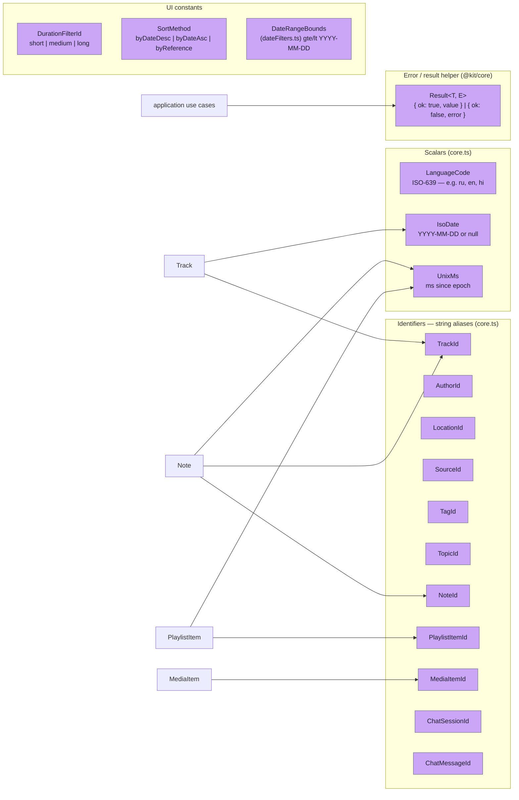
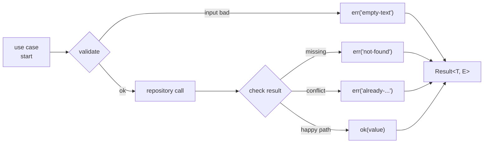

# Value objects

The domain treats most identifiers and primitive shapes as **plain TypeScript aliases** rather than nominally branded types. This keeps construction and test data ergonomic, at the cost of relying on parameter naming to carry intent across function signatures. This page lists every alias used at layer boundaries; the one real algebraic helper, `Result<T, E>`, lives in the shared `@kit/core` package rather than in the domain module itself.

## Map of value objects



## Identifiers — `core.ts`

```ts
export type TrackId = string
export type AuthorId = string
export type LocationId = string
export type SourceId = string
export type TagId = string
export type TopicId = string
export type NoteId = string
export type PlaylistItemId = string
export type MediaItemId = string
export type ChatSessionId = string
export type ChatMessageId = string
```

All ids are plain strings. The discipline is "every string passing across a layer boundary as an id carries its type in the variable / parameter name, not the value." That is enforced by signatures (`getById(id: TrackId)`) but not by the type system — if you mix up two ids, TypeScript will not catch it.

**Why no branded types?** Branding (`type TrackId = string & { __brand: "track" }`) would force every literal to go through a constructor, complicating fixtures, JSON deserialisation, and query parameter binding. The team accepted the trade-off; if the project ever grows id-bug incidents, branding is a localised refactor. See the comment at the top of [`modules/libs/domain/core.ts`](https://github.com/jiva-studio/shruti/blob/main/modules/libs/domain/core.ts).

For how each id is generated, see [Identifiers and ID generation](../db/ids.md).

## Scalars — `core.ts`

| Type | Definition | Notes |
|---|---|---|
| `LanguageCode` | `string` | ISO-639 code: `"ru"`, `"en"`, `"hi"`. Used as composite-PK column on every dictionary table |
| `IsoDate` | `string \| null` | `"YYYY-MM-DD"`, e.g. `"1974-10-20"`. Null when date is unknown |
| `UnixMs` | `number` | Milliseconds since the Unix epoch — `Date.now()` shape |

Time offsets inside entities are plain `number`s carrying **milliseconds**: `Note.timeStart` / `Note.timeEnd` (same unit as the transcript blocks' `start`/`end`, kept in ms end-to-end) and `TrackAudio.duration`. The unit lives in the JSDoc on each field — there is no dedicated `Milliseconds` type. `PlaylistItem` carries no progress scalar; it stores only `addedAt` and `archivedAt` as `UnixMs`.

## `Result<T, E>` — `@kit/core`

The result helper is not part of the domain module; it lives in the shared kit package at [`modules/kit/src/core/result.ts`](https://github.com/jiva-studio/shruti/blob/main/modules/kit/src/core/result.ts) and is imported across the codebase as `import { ok, err, type Result } from "@kit/core"`.

```ts
export type Result<T, E> = { ok: true; value: T } | { ok: false; error: E }

export const ok  = <T>(value: T): Result<T, never> => ({ ok: true, value })
export const err = <E>(error: E): Result<never, E> => ({ ok: false, error })

/** Unwrap a Result, throwing on error. Useful in tests. */
export function unwrap<T, E>(result: Result<T, E>): T {
  if (!result.ok) throw new Error(`unwrap() called on error Result: ...`)
  return result.value
}
```

`E` has no default — every call site specifies its own error tag, typically a string-literal union.



The discriminated `ok` flag lets callers narrow without `try/catch`. The convention across the project:

- **Mutation / load** use cases (`createNote`, `updateNote`, `deleteNote`, `addTrackToPlaylist`, `archivePlaylistItem`, `playTrack`, `loadTrackDetail`, `loadTranscript`, `downloadMedia`, `removeDownloadedMedia`, `downloadTranscripts`, `removeDownloadedTranscripts`) return `Result<T, E>` with an `E` that is a **string-literal union** of recoverable error tags — `"not-found" \| "invalid-range" \| "empty-text"` etc. The view controller branches on the tag.
- **Query** use cases (`searchAndFilterTracks`, `searchNotes`, `listPlaylistTracks`, `getProgressForItem`) return the value directly. Infrastructure errors propagate as exceptions and are caught at the composition root.

The full policy lives in [`../architecture/layers.md` § Error-Handling Policy](../architecture/layers.md#error-handling-policy). Every recoverable error tag in the codebase is documented in [Use cases reference](../api/use-cases.md).

## UI-side enums — `durationFilters.ts`, `sortMethods.ts`, `dateFilters.ts`

Two small string-literal unions and a date-range helper are exposed by the domain because they cross the use-case boundary. They're **not** persisted — they're Search-view filter and sort identifiers.

```ts
// durationFilters.ts — bounds in milliseconds; the union is derived from the table.
export const DURATION_FILTERS = [
  { id: "short",  minMs: 0,                  maxMs: 30 * 60 * 1000 },
  { id: "medium", minMs: 30 * 60 * 1000,     maxMs: 60 * 60 * 1000 },
  { id: "long",   minMs: 60 * 60 * 1000,     maxMs: Number.MAX_SAFE_INTEGER },
] as const
export type DurationFilterId = (typeof DURATION_FILTERS)[number]["id"]

// sortMethods.ts
export const SORT_METHODS = ["byDateDesc", "byDateAsc", "byReference"] as const
export type SortMethod = (typeof SORT_METHODS)[number]
```

Both unions are derived from their `as const` tables, so the type can never drift from the runtime list. `SortMethod` has three orders — descending date, ascending date, and by scripture reference; tracks with no date (no `tracks.date`) or no shloka in the active locale (no `track_variants.sort_reference`) always sort last (SQL `NULLS LAST`), regardless of direction.

`durationFilterBounds(id)` (in [`durationFilters.ts`](https://github.com/jiva-studio/shruti/blob/main/modules/libs/domain/durationFilters.ts)) converts the chip id into the `{ minMs, maxMs }` pair the track repository's filter expects, so the repository never has to know about UI buckets. The conversion is consumed by the discovery use case at [`modules/apps/mobile/usecases/discovery/searchAndFilterTracks.ts`](https://github.com/jiva-studio/shruti/blob/main/modules/apps/mobile/usecases/discovery/searchAndFilterTracks.ts) — there is no separate `application` library; the use cases live under the mobile app.

`dateFilters.ts` exposes `DateBound` (a `"YYYY"` / `"YYYY-MM"` string, or `undefined` for an open end) and `dateRangeBounds(from, to)`, which converts the two coarse UI bounds into an inclusive-lower / exclusive-upper `{ gte, lt }` pair of `"YYYY-MM-DD"` strings (`date >= gte AND date < lt`). Day granularity is intentionally not offered.
