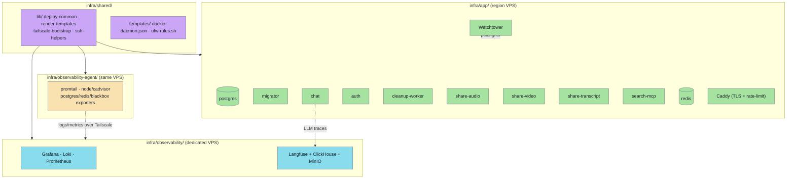
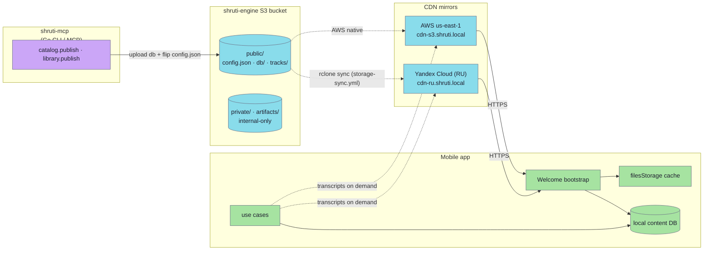

# Infrastructure

The `infra/` tree holds everything needed to stand up Shruti's backend and operations: four self-contained deployment units (`app/`, `observability/`, `observability-agent/`, `shared/`), each a Docker Compose stack with its own idempotent `deploy.sh`. Alongside these hosted services, all *public content* (the prebuilt SQLite content DB, audio files, per-language transcripts) lives in a single S3 bucket served through two CDN mirrors; the mobile app talks directly to those mirrors and to the regional app host.

## Deployment units

- **`infra/app/`** — the single-host region stack: `postgres` + `redis` + `migrator` + `auth` + `chat` + `cleanup-worker` + `share-audio` + `share-video` + `share-transcript` + `search-mcp`, fronted by a custom `caddy` (TLS + `caddy-ratelimit` + `handle_path` routing). App images are built by `.github/workflows/services-ghcr.yml`, pushed to `ghcr.io/akdasa-studios/shruti-*`, and pulled by Watchtower (prod overlay, via a `docker-socket-proxy`). `migrator` applies the SQL files in `infra/app/db/migrations/`. Services are split across two compose profiles selected by host role: `origin` runs the full backend (the global VPS); `proxy` is the thin RU box that runs only `share-audio` / `share-video` / `share-transcript` (plus a slim postgres + redis) and reverse-proxies `/auth/*` and the chat surface to the global host. `search-mcp` is a read-only MCP over the corpus pgvector, bound to the host's Tailscale IP only. See `infra/app/README.md`.
- **`infra/observability/`** — the central observability VPS (Grafana 11.4, Loki 3.3, Prometheus 2.55, Langfuse 3.55 with ClickHouse / Postgres / Redis / MinIO), reachable only inside the Tailnet, fronted by `caddy-cloudflare` with DNS-01 wildcard TLS. See `infra/observability/README.md`.
- **`infra/observability-agent/`** — lightweight collectors that run *on each region host* next to the app stack (`promtail`, `node-exporter`, `cadvisor`, `postgres-exporter`, `redis-exporter`, `blackbox-exporter`). They push logs to Loki and expose metrics for the obs Prometheus to scrape, all bound to the Tailscale IP. See `infra/observability-agent/README.md`.
- **`infra/shared/`** — pure-bash deploy helpers sourced by every unit's `deploy.sh` (`deploy-common.sh`, `render-templates.sh`, `tailscale-bootstrap.sh`, `ssh-helpers.sh`) plus host templates (`docker-daemon.json` log rotation, `ufw-rules.sh` default-deny). See `infra/shared/README.md`.

### Conventions across units

- Each `deploy.sh` is idempotent: render templates → rsync the unit to `/opt/shruti*/` → `docker compose pull && up -d` → health-check.
- Secrets stay on the host (`/opt/shruti/.env`, `/opt/shruti/jwt/`, per-unit `secrets/`) and are **never** copied by the scripts; `ensure_secrets` generates-once-and-reuses.
- Hosts are on a Tailnet; ufw is default-deny on the public NIC and allow-all on `tailscale0`. Inter-host traffic (agent → obs, chat → Langfuse) rides Tailscale IPs.
- The exporter Postgres role is `shruti_exporter` (granted `pg_monitor` plus explicit `SELECT` on `public.tasks` and `app.outbox`); seeded by `infra/app/compose/postgres/init.sql` on a fresh volume, applied manually on existing volumes.

## Content delivery (bucket + CDN)

Separately from the hosted units above, public content is static and served from S3 over two CDN mirrors. The mobile app probes the mirrors at startup, picks the first reachable one, downloads `config.json` to learn the latest DB version, and downloads / caches files from there.

- **[S3 layout](./s3-layout.md)** — bucket structure (`public/` vs `private/`), file naming conventions for `config.json`, the prebuilt DB, audio and transcripts, content types, and which keys the app actually reads.
- **[CDN](./cdn.md)** — mirror list, probe algorithm with timeouts and fallback, version-selection logic from `config.json`, caching strategy, background refresh, and what's deliberately *not* checked (no integrity hashes, no signed URLs).

The prebuilt content DB and `public/config.json` are published from a developer machine via the shruti-mcp pipeline: `catalog.publish` uploads `public/db/shruti.{ver}.db` and flips `public/config.json` (and `library.publish` merges the library entry into the same manifest). The Yandex mirror is kept in sync from AWS by the `storage-sync.yml` workflow (rclone). The hosted region services also read and write the bucket: `share-audio` cuts `public/shares/audio/*.mp3` on demand, `share-video` renders into `public/share/video/` (scratch + backgrounds under `private/share/video/`), and `share-transcript` renders printable PDFs to `public/tracks/{id}/exports/{lang}.pdf` (the caller supplies the lecture outline in the request body — share-transcript does not generate or cache outlines; they are produced offline by shruti-mcp and stored in the catalog DB, where `chat` reads them and forwards them to the client / share-transcript). Backup cron (`infra/app/scripts/backup.sh`) writes `pg_dump` archives to `private/backups/postgres/`.

## Read-paths and write-paths

| Path | Reader | Writer |
|---|---|---|
| `public/config.json` | App on every cold start + background refresh | shruti-mcp `catalog.publish` / `library.publish` |
| `public/db/shruti.{ver}.db` | App when no compatible DB is cached locally | shruti-mcp `catalog.publish` |
| `public/tracks/{id}/audio/original.mp3` | Audio player + offline downloader | track pipeline (shruti-mcp), pushed to S3 |
| `public/tracks/{id}/transcripts/{lang}.json` | `ITranscriptRepository` (HTTP) on demand | track pipeline (shruti-mcp), pushed to S3 |
| `public/shares/audio/{id}.mp3` | Anyone with the URL (sharable link) | [share-audio](../modules/share-audio.md) service |
| `public/share/video/...` | Anyone with the URL | `share-video` service |
| `public/tracks/{id}/exports/{lang}.pdf` | Anyone with the URL (PDF download) | `share-transcript` service |
| `private/...` (backups, share-video scratch) | **Never read by the app** | Internal tooling + region services only |

The publish pipeline (`catalog.publish` / `library.publish`) lives in the shruti-mcp tool (`modules/tools/shruti-mcp/`).

## Credentials

- **Read** (mobile app at runtime): no credentials; CDN URLs are public, served with anonymous `GET *`. CORS is enabled on the bucket so browser builds work too.
- **Write** (shruti-mcp publish): uploads to every configured S3 target — AWS always, Yandex when the `S3_YANDEX_*` env vars are set (leave unset to skip the mirror). The Yandex mirror is also kept in sync externally via rclone (`.github/workflows/storage-sync.yml`), so AWS-only uploads are mirrored asynchronously.
- **Region services**: each workload uses a scoped AWS IAM key — `shruti-share-audio`, `shruti-share-video`, `shruti-chat`, `shruti-backup` (least-privilege policies enumerated in `infra/app/README.md`). The shared `/opt/shruti/.env` key is the union of these policies.
- **ghcr pull**: the region VPS holds a `read:packages` PAT under `/opt/shruti/config/config.json`; `deploy.sh` reads it via `DOCKER_CONFIG` and the prod overlay bind-mounts it for Watchtower.

## Why two mirrors?

Russian users frequently can't reach AWS us-east-1 reliably. Yandex Cloud is the in-region fallback. The probe puts the user's previously-successful server first, but anyone fresh with no preference tries `global` (AWS) first and falls through to `russia` (Yandex) within ~8 seconds if AWS is unreachable. Details in [`cdn.md`](./cdn.md).
</content>
</invoke>
