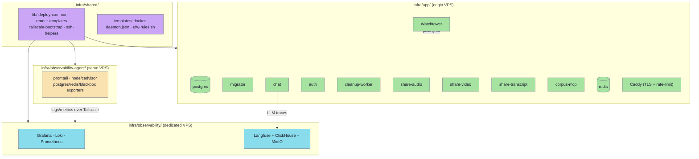
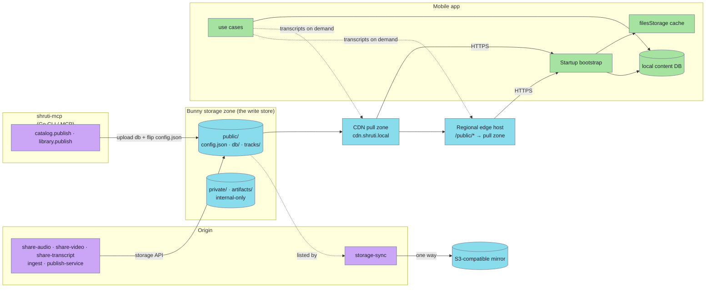

# Infrastructure

The `infra/` tree holds everything needed to stand up Shruti's backend and operations: four self-contained deployment units (`app/`, `observability/`, `observability-agent/`, `shared/`), each a Docker Compose stack with its own idempotent `deploy.sh`. Alongside these hosted services, all *public content* (the prebuilt SQLite content DB, audio files, per-language transcripts) is written to one store, the Bunny storage zone, and served through its CDN pull zone (directly, or through a regional edge host); an S3-compatible mirror is filled one way by `storage-sync`. The mobile app talks to the CDN and to the origin app host, directly or through the edge.

## Deployment units

```mermaid
graph TD
    subgraph shared["infra/shared/"]
        LIB["lib/ deploy-common · render-templates<br/>tailscale-bootstrap · ssh-helpers"]
        TPL["templates/ docker-daemon.json · ufw-rules.sh"]
    end

    subgraph app["infra/app/ (origin VPS)"]
        PG[("postgres")]
        MIG["migrator"]
        CHAT["chat"]
        AUTH["auth"]
        CW["cleanup-worker"]
        SA["share-audio"]
        SV["share-video"]
        ST["share-transcript"]
        SM["corpus-mcp"]
        RD[("redis")]
        CADDY["Caddy (TLS + rate-limit)"]
        WT["Watchtower"]
    end

    subgraph agent["infra/observability-agent/ (same VPS)"]
        EXP["promtail · node/cadvisor<br/>postgres/redis/blackbox exporters"]
    end

    subgraph obs["infra/observability/ (dedicated VPS)"]
        GRAF["Grafana · Loki · Prometheus"]
        LF["Langfuse + ClickHouse + MinIO"]
    end

    LIB --> app
    LIB --> agent
    LIB --> obs
    EXP -. logs/metrics over Tailscale .-> obs
    CHAT -. LLM traces .-> LF
    WT -- polls ghcr --> app

    classDef sharedc fill:#cba6f7,stroke:#6c7086,color:#1e1e2e;
    classDef appc fill:#a6e3a1,stroke:#6c7086,color:#1e1e2e;
    classDef agentc fill:#f9e2af,stroke:#6c7086,color:#1e1e2e;
    classDef obsc fill:#89dceb,stroke:#6c7086,color:#1e1e2e;
    class LIB,TPL sharedc;
    class PG,MIG,CHAT,AUTH,CW,SA,SV,ST,SM,RD,CADDY,WT appc;
    class EXP agentc;
    class GRAF,LF obsc;
```

- **`infra/app/`** — the single-host backend stack: `postgres` + `redis` + `migrator` + `auth` + `chat` + `cleanup-worker` + `share-audio` + `share-video` + `share-transcript` + `corpus-mcp`, fronted by a custom `caddy` (TLS + `caddy-ratelimit` + `handle_path` routing). App images are built by `.github/workflows/services-ghcr.yml`, pushed to `ghcr.io/jiva-studio/shruti-*`, and pulled by Watchtower (prod overlay, via a `docker-socket-proxy`). `migrator` applies the SQL files in `infra/app/db/migrations/`. Two host roles share the compose files: `origin` runs every service; `edge` is a stateless regional entry point that runs Caddy alone, forwarding `/public/*` to the CDN pull zone and every other path to origin. `corpus-mcp` is a read-only MCP over the corpus pgvector, bound to the host's Tailscale IP only. See `infra/app/README.md`.
- **`infra/observability/`** — the central observability VPS (Grafana 11.4, Loki 3.3, Prometheus 2.55, Langfuse 3.55 with ClickHouse / Postgres / Redis / MinIO), reachable only inside the Tailnet, fronted by `caddy-cloudflare` with DNS-01 wildcard TLS. See `infra/observability/README.md`.
- **`infra/observability-agent/`** — lightweight collectors that run *on each region host* next to the app stack (`promtail`, `node-exporter`, `cadvisor`, `postgres-exporter`, `redis-exporter`, `blackbox-exporter`). They push logs to Loki and expose metrics for the obs Prometheus to scrape, all bound to the Tailscale IP. See `infra/observability-agent/README.md`.
- **`infra/shared/`** — pure-bash deploy helpers sourced by every unit's `deploy.sh` (`deploy-common.sh`, `render-templates.sh`, `tailscale-bootstrap.sh`, `ssh-helpers.sh`) plus host templates (`docker-daemon.json` log rotation, `ufw-rules.sh` default-deny). See `infra/shared/README.md`.

### Conventions across units

- Each `deploy.sh` is idempotent: render templates → rsync the unit to `/opt/shruti*/` → `docker compose pull && up -d` → health-check.
- Secrets stay on the host (`/opt/shruti/.env`, `/opt/shruti/jwt/`, per-unit `secrets/`) and are **never** copied by the scripts; `ensure_secrets` generates-once-and-reuses.
- Hosts are on a Tailnet; ufw is default-deny on the public NIC and allow-all on `tailscale0`. Inter-host traffic (agent → obs, chat → Langfuse) rides Tailscale IPs.
- The exporter Postgres role is `shruti_exporter` (granted `pg_monitor` plus explicit `SELECT` on `public.tasks` and `app.outbox`); seeded by `infra/app/compose/postgres/init.sql` on a fresh volume, applied manually on existing volumes.

## Content delivery (store + CDN)

Separately from the hosted units above, public content is static. It is written to one store, the Bunny storage zone, and served through its CDN pull zone. An S3-compatible mirror holds a copy, filled one way by `storage-sync` on origin; nothing else writes to it. The mobile app probes its regions at startup, picks the first reachable one, downloads `config.json` to learn the latest DB version, and downloads / caches files from there.

```mermaid
graph LR
    subgraph builder["shruti-mcp<br/>(Go CLI / MCP)"]
        BUILD["catalog.publish · library.publish"]
    end

    subgraph origin["Origin"]
        SHARE["share-audio · share-video · share-transcript<br/>ingest · publish-service"]
        SYNC["storage-sync"]
    end

    subgraph store["Bunny storage zone (the write store)"]
        PUB[("public/<br/>config.json · db/ · tracks/")]
        ART[("private/ · artifacts/<br/>internal-only")]
    end

    ZONE["CDN pull zone<br/>cdn.shruti.local"]
    EDGE["Regional edge host<br/>/public/* → pull zone"]
    MIRROR[("S3-compatible mirror")]

    subgraph appc["Mobile app"]
        WL["Startup bootstrap"]
        FS["filesStorage cache"]
        DB[("local content DB")]
        UC["use cases"]
    end

    BUILD -- "upload db + flip config.json" --> PUB
    SHARE -- "storage API" --> PUB
    PUB --> ZONE
    ZONE --> EDGE
    SYNC -- "one way" --> MIRROR
    PUB -. listed by .-> SYNC
    ZONE -- HTTPS --> WL
    EDGE -- HTTPS --> WL
    WL --> FS
    WL --> DB
    UC --> DB
    UC -. transcripts on demand .-> ZONE
    UC -. transcripts on demand .-> EDGE

    classDef remote fill:#89dceb,stroke:#6c7086,color:#1e1e2e;
    classDef local fill:#a6e3a1,stroke:#6c7086,color:#1e1e2e;
    classDef builder fill:#cba6f7,stroke:#6c7086,color:#1e1e2e;
    class PUB,ART,ZONE,EDGE,MIRROR remote;
    class WL,FS,DB,UC local;
    class BUILD,SHARE,SYNC builder;
```

- **[S3 layout](./s3-layout.md)** — store structure (`public/` vs `private/`), file naming conventions for `config.json`, the prebuilt DB, audio and transcripts, content types, and which keys the app actually reads.
- **[CDN](./cdn.md)** — region list, probe algorithm with timeouts and fallback, version-selection logic from `config.json`, caching strategy, background refresh, and what's deliberately *not* checked (no integrity hashes, no signed URLs).

The prebuilt content DB and `public/config.json` are published from a developer machine via the shruti-mcp pipeline: `catalog.publish` uploads `public/db/shruti.{ver}.db` and flips `public/config.json` (and `library.publish` merges the library entry into the same manifest), both against the Bunny storage zone. `storage-sync` copies every change to the mirror: a regular listing-based pass, a periodic deep pass, and an immediate copy of a track's audio and transcript on `track.ready`. The services on origin also read and write the store: `share-audio` cuts `public/shares/audio/*.mp3` on demand, `share-video` renders into `public/share/video/` (background packs under `private/share/video/backgrounds/`), and `share-transcript` renders printable PDFs to `public/tracks/{id}/exports/{lang}.pdf` (the caller supplies the lecture outline in the request body — share-transcript does not generate or cache outlines; they are produced offline by shruti-mcp and stored in the catalog DB, where `chat` reads them and forwards them to the client / share-transcript). Backup cron (`infra/app/scripts/backup.sh`) writes `pg_dump` archives to `private/backups/postgres/`.

## Read-paths and write-paths

| Path | Reader | Writer |
|---|---|---|
| `public/config.json` | App on every cold start + background refresh | shruti-mcp `catalog.publish` / `library.publish` |
| `public/db/shruti.{ver}.db` | App when no compatible DB is cached locally | shruti-mcp `catalog.publish` |
| `public/tracks/{id}/audio/original.mp3` | Audio player + offline downloader | track pipeline (shruti-mcp), uploaded to the storage zone |
| `public/tracks/{id}/transcripts/{lang}.json` | `ITranscriptRepository` (HTTP) on demand | track pipeline (shruti-mcp), uploaded to the storage zone |
| `public/shares/audio/{id}.mp3` | Anyone with the URL (sharable link) | [share-audio](../modules/share-audio.md) service |
| `public/share/video/...` | Anyone with the URL | `share-video` service |
| `public/tracks/{id}/exports/{lang}.pdf` | Anyone with the URL (PDF download) | `share-transcript` service |
| `private/...` (backups, share-video backgrounds) | **Never read by the app** | Internal tooling + origin services only |

Every writer in this table writes the Bunny storage zone; the mirror is written only by `storage-sync`. The publish pipeline (`catalog.publish` / `library.publish`) lives in the shruti-mcp tool (`modules/tools/shruti-mcp/`).

## Credentials

- **Read** (mobile app at runtime): no credentials; CDN URLs are public, served with anonymous `GET *`.
- **Write** (shruti-mcp publish): the Bunny storage-zone password, configured under `s3.bunny` in `shruti-mcp.yaml`. It is the only publish target.
- **Origin services**: the share services, `ingest` and `publish-service` use the storage-zone password (`SHRUTI_STORAGE_KEY`); `storage-sync` alone holds the mirror's write credentials. See `infra/app/README.md`.
- **ghcr pull**: the origin VPS holds a `read:packages` PAT under `/opt/shruti/config/config.json`; `deploy.sh` reads it via `DOCKER_CONFIG` and the prod overlay bind-mounts it for Watchtower.

## Why a regional edge?

A regional host gives clients whose route to origin or to the pull zone is poor a nearer entry point. It runs the stateless `edge` role — Caddy alone, `/public/*` to the pull zone and everything else to origin — so it needs no database, keys or share services. The probe puts the user's previously-successful region first; anyone fresh with no preference tries `global` first and falls through to the regional region within ~8 seconds if `global` is unreachable. Details in [`cdn.md`](./cdn.md).
