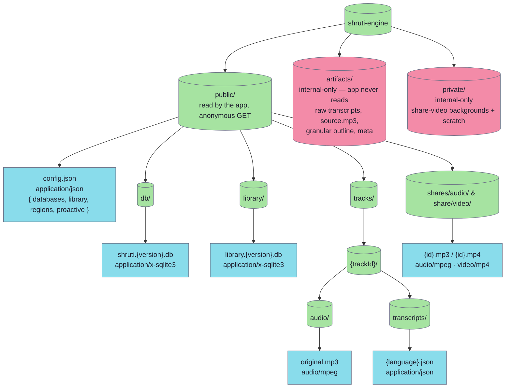
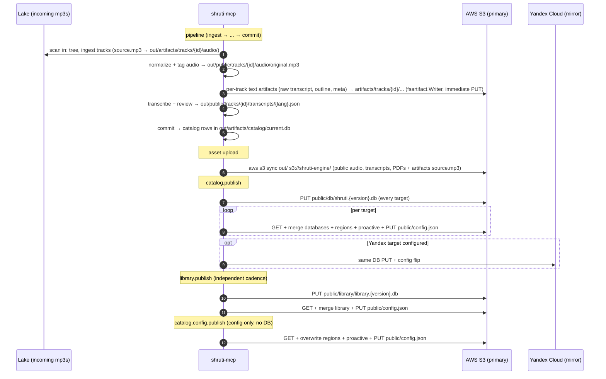

# S3 storage layout

Shruti content is distributed via a single S3 bucket (`shruti-engine`) replicated across AWS and Yandex Cloud. The mobile app reads from one of those CDNs at runtime; [`shruti-mcp`](../runbooks/shruti-mcp.md) (the content pipeline + producer) builds an `out/` tree on a developer machine that mirrors the bucket — `out/public/` is what the app reads, `out/artifacts/` carries the internal-only per-track artifacts (raw transcripts, source mp3, granular outline, extracted metadata) that ride the same bucket under the `artifacts/` prefix — and ships it to S3. This page documents what's in the bucket, where, and how it gets there.

## Bucket structure



## Key reference

| Asset | Key pattern | Content-Type | Producer |
|---|---|---|---|
| Remote config | `public/config.json` | `application/json` | `catalog.publish` / `library.publish` / `catalog.config.publish` |
| Content database | `public/db/shruti.{version}.db` | `application/x-sqlite3` | `catalog.publish` |
| Library database | `public/library/library.{version}.db` | `application/x-sqlite3` | `library.publish` |
| Track audio | `public/tracks/{trackId}/audio/original.mp3` | `audio/mpeg` | pipeline (`aws s3 sync`) |
| Transcript | `public/tracks/{trackId}/transcripts/{language}.json` | `application/json` | pipeline (`aws s3 sync`) |
| Shared audio excerpt | `public/shares/audio/{excerptId}.mp3` | `audio/mpeg` | [share-audio](../modules/share-audio.md) service |
| Shared video reel | `public/share/video/{videoId}.mp4` | `video/mp4` | share-video service |
| Transcript PDF export | `public/tracks/{trackId}/exports/{language}.pdf` | `application/pdf` | [share-transcript](../modules/share-transcript.md) service (rendered on demand; `renderer-version` in object metadata) |
| Per-track internal artifacts (text) | `artifacts/tracks/{trackId}/...` (e.g. `transcripts/{language}/raw.json`, `outline/{language}/granular.json`, `meta.json`) | per-file (JSON) | pipeline (`fsartifact.Writer` — local write + immediate S3 PUT; app never reads) |
| Per-track source audio | `artifacts/tracks/{trackId}/audio/source.mp3` | `audio/mpeg` | pipeline (`aws s3 sync out/`; written locally by `audiostore`, not by `fsartifact.Writer`) |

`{version}` is a 14-digit timestamp `YYYYMMDDHHMMSS` (e.g. `20260419120000`) generated at publish time from `time.Now().UTC()` — lexicographic sort = chronological order. If a fresh timestamp collides with an entry already in `config.json`, the publisher bumps it to `max(existing)+1`, so versions are strictly monotone per ladder. `{trackId}` is the prefixed nanoid (e.g. `track_aBC1234567890`) — see [ID generation](../db/ids.md). `{language}` is an ISO-639 code (`ru`, `en`, `hi`).

Content types are passed explicitly to each `Uploader.Put(ctx, key, contentType, body, size)` call — there is no extension→MIME lookup table. The `.db` and `config.json` content types are hard-coded in the publish use cases; the audio/transcript/share content types are set by whatever produces those files.

## Path convention

**SQLite rows store full paths from the bucket root**, including the `public/` prefix. The client never concatenates prefixes. The commit use case writes them this way (`modules/tools/shruti-mcp/internal/application/commit/setmetadata.go`):

```
tracks.audio_path        = "public/tracks/track_aBC1234567890/audio/original.mp3"
tracks.transcript_path   = "public/tracks/track_aBC1234567890/transcripts/ru.json"
```

`IStoragePublicUrl.get(path)` simply substitutes the path into the active CDN server's `urlTemplate` (a `{path}` placeholder):

```ts
// modules/kit/src/infra/storagePublicUrl/useStoragePublicUrl.ts
export function useStoragePublicUrl(
  getActiveServer: () => Pick<CdnServer, "urlTemplate">
): IStoragePublicUrl {
  return { get: (path: string) => buildServerUrl(getActiveServer(), path) }
}

// modules/kit/src/servers/cdnServer.ts
export function buildServerUrl(server: Pick<CdnServer, "urlTemplate">, path: string): string {
  return server.urlTemplate.replace("{path}", path)
}
```

The active server is read lazily on each call, so the resolver always reflects the current region selection without being re-created. This single-step substitution is the whole reason paths are stored fully-qualified — it eliminates a class of bugs around mis-joined prefixes.

## `public/config.json`

Bootstrap manifest fetched on every cold start and on every background refresh. It carries four independent top-level keys, each owned by a different publisher / use case:

```json
{
  "databases": [
    { "version": 20260419120000, "scheme": 20260419 },
    { "version": 20260411211018, "scheme": 20260411 }
  ],
  "library": {
    "versions": [
      { "version": 20260415090000 }
    ]
  },
  "regions": [
    {
      "id": "global",
      "name": "Global",
      "urlTemplate": "https://cdn-s3.shruti.local/{path}",
      "shareAudioUrl": "…", "shareVideoUrl": "…",
      "authBaseUrl": "…", "chatBaseUrl": "…"
    }
  ],
  "proactive": { }
}
```

- `databases` — written by `catalog.publish`. Each entry is `{version, scheme}`. The list is deduped on `version`, the new version is prepended, and the whole list is sorted newest-first. **Every** previously-published version is kept (no top-N truncation): a client pinned to an older scheme must keep finding its compatible DB; stale blobs are only ever pruned by a separate scheme-aware retention pass. The app filters by `db.scheme === SUPPORTED_DB_SCHEME` (the build-time `__DB_SCHEME__` constant from `modules/db-scheme.json`) and picks the max surviving `version`.
- `library` — written by `library.publish`. A `{versions: [{version}]}` block, same dedup / prepend / newest-first / keep-every-version policy. Tracks the canonical-corpus DB ladder, which moves on a slower cadence than the track catalog.
- `regions` — written by `catalog.publish` and `catalog.config.publish` from the local config's `regions` section. The list of CDN/region endpoints the app downloads on startup; each entry mirrors the mobile `CdnServer` shape one-to-one (`{id, name, urlTemplate, shareAudioUrl, shareVideoUrl, authBaseUrl, chatBaseUrl}`). Edited via the `catalog.config.regions.*` tools (`modules/tools/shruti-mcp/internal/application/catalog/regions/usecase.go`); absent locally → left untouched on the bucket (never cleared, which would strand clients).
- `proactive` — written by `catalog.publish` and `catalog.config.publish` from the local config's `proactive` section. Absence reverts clients to bundled proactive defaults.

The source-of-truth for the human-edited sections (`regions`, `proactive`) is the local `<out>/artifacts/catalog/config.json` (package `configdoc`, `modules/tools/shruti-mcp/internal/application/catalog/configdoc/store.go`). Each publisher reads the published `config.json` into a `map[string]json.RawMessage`, edits only its own keys, and writes the rest back untouched — so catalog, library, and config-only publishes never clobber each other's sections. `catalog.config.publish` is the "config only" path: it re-ships just `regions` + `proactive` without touching the DB ladder or bumping a version.

## `public/db/shruti.{version}.db`

The prebuilt SQLite content database. Schema is in [`../db/`](../db/). `catalog.publish` uploads `out/artifacts/catalog/current.db` to this versioned key on every target, then flips `config.json` to advertise it; the DB is uploaded before the config flip so a partial failure leaves the previous version still live. Cached on-device under `shruti/databases/shruti.{version}.db`.

The current scheme is read on-device by:

```sql
SELECT scheme FROM migrations WHERE scheme IS NOT NULL ORDER BY name DESC LIMIT 1;
```

Mismatch with the build-time `__DB_SCHEME__` constant rejects the file and triggers a re-download (see [startup-flow § Phase 2](../architecture/startup-flow.md#5-phase-2--open--validate-the-content-database)).

## `public/library/library.{version}.db`

The canonical-corpus DB (verses, documents, translations, attributions). `library.publish` ships `out/artifacts/library/library.db` here and merges a `library` entry into `config.json`. Published independently of the track catalog because the underlying corpus changes rarely (new translation source, re-import).

## `public/tracks/{trackId}/audio/original.mp3`

Original audio recording, normalized and ID3-tagged by the pipeline (`track.audio.normalize`, `track.audio.tag`) into `out/public/tracks/{id}/audio/original.mp3`. Streamed by the player via `IAudioPlayer`; optionally cached locally for offline playback by `IMediaDownloader` (see [`MediaItem`](../domain/entities.md#mediaitem--mediaitemts)).

## `public/tracks/{trackId}/transcripts/{language}.json`

Time-aligned transcript blocks for one (track, language), produced by the transcript pipeline (`track.transcript.create` / `track.transcript.review`) into `out/public/tracks/{id}/transcripts/{lang}.json`. Fetched on demand by `ITranscriptRepository` (HTTP-backed adapter), cached locally via `IRemoteFilesStorage`. The fetch flow is in [`flows/transcript-load.md`](../architecture/flows/transcript-load.md).

> Transcripts are **not stored in SQLite** — only the path to them is. Keeping the JSON out of the DB keeps the prebuilt file small and lets transcripts be republished without a new DB version.

## `public/shares/audio/` and `public/share/video/`

Runtime-generated share assets, written directly to the bucket by the share services (not part of the `out/` build tree):

- [share-audio](../modules/share-audio.md) cuts an MP3 fragment from a `source_key` (e.g. `public/tracks/{id}/audio/original.mp3`) and uploads `public/shares/audio/{excerptId}.mp3` (`audio/mpeg`). Idempotent on `excerptId`. Default prefix `EXCERPTS_PREFIX=public/shares/audio`.
- share-video renders a captioned reel and uploads `public/share/video/{videoId}.mp4` (`video/mp4`). Default prefix `SHRUTI_S3_VIDEO_PREFIX=public/share/video`.

## Producer pipeline

The producer is `shruti-mcp`. It builds an `out/` tree that mirrors the bucket — `out/public/` is what the app reads; `out/artifacts/` holds internal-only content. The per-track **text** artifacts (raw/review transcripts, granular outline, `meta.json`) are written through `fsartifact.Writer` (one local-write + immediate S3-Put call, `modules/tools/shruti-mcp/internal/infra/artifact/fs/writer.go`) under the bucket's `artifacts/` prefix as they're produced. The per-track binary `source.mp3` is written locally by `audiostore` and `out/artifacts/catalog/current.db` / `out/artifacts/library/library.db` are producer-local until a publish step versions them; none of these ride `fsartifact.Writer`. The large assets ride a bulk `aws s3 sync out/ s3://shruti-engine/` — that one sweep covers both `public/` (audio `original.mp3`, `{lang}.json` transcripts, PDFs) and the `artifacts/` binaries (`source.mp3`). The three `*.publish` use cases handle only the versioned `.db` files and the `config.json` pointer flip.



The publish use cases are part of the MCP tool surface — see the project conventions for the `catalog.publish` / `library.publish` / `catalog.config.publish` envelopes. The two DB publishers upload the DB to every configured target first, then flip `config.json` per target, so no client ever sees a config pointing at a missing `.db`.

> The AWS bucket is the source of truth (also the default global region's CDN read base, via `urlTemplate` `https://cdn-s3.shruti.local/{path}`). The Yandex replica (`urlTemplate` `https://cdn-ru.shruti.local/{path}`, region `ru-central1`) is a configured second `Uploader` target that receives the same PUTs when present, and a selectable region for clients. Both region templates ship in `modules/libs/domain/servers.ts` and can be overridden/extended via the `regions` section of `config.json`.

## Credentials

| Direction | Caller | Auth |
|---|---|---|
| Read | Mobile app at runtime | None — anonymous `GET public/*` with CORS allowed; `artifacts/` and `private/` are not publicly readable |
| Write — AWS | `shruti-mcp` | Explicit access/secret keys when configured, else the AWS SDK default credential chain (SSO / shared config / IMDS). Bucket `shruti-engine`, region `us-east-1` |
| Write — Yandex | `shruti-mcp` (when a Yandex target is configured) | Static access/secret keys against custom endpoint `https://storage.yandexcloud.net` (region `ru-central1`) |
| Write — shares | share-audio / share-video services | Their own S3 credentials. share-audio reads `public/tracks/` (gated to `SOURCE_KEY_PREFIX=public/tracks/`) and writes `public/shares/audio/`; share-video reads `private/share/video/backgrounds`, uses `private/share/video/transcribe-scratch`, and writes `public/share/video/` |
